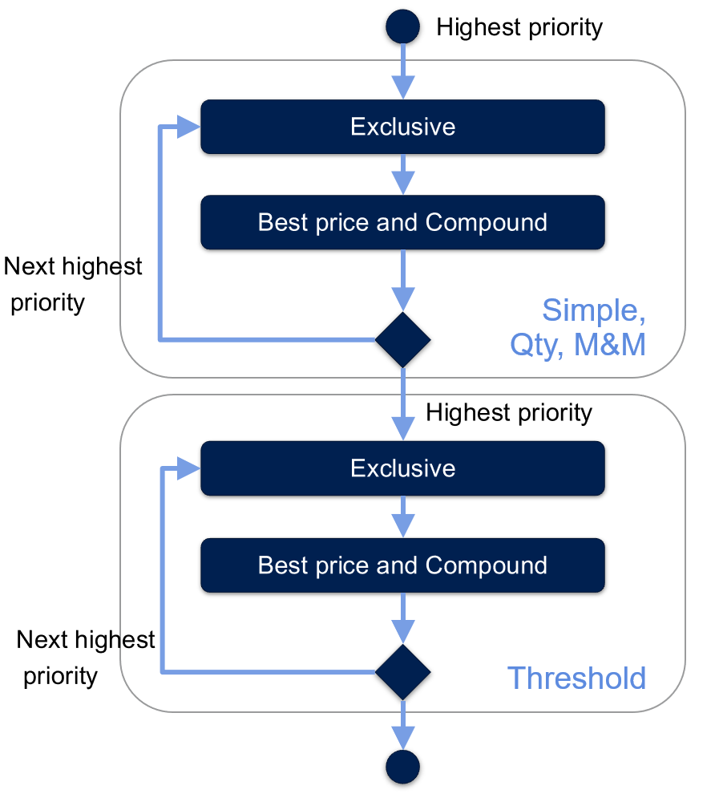
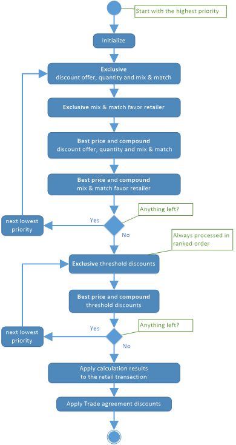

# Apply multiple Retail discounts to a product

[!include [banner](includes/banner.md)]

## Overview

This article reviews all the factors considered when multiple discounts can be applied to a product. In this scenario, the commerce pricing engine applies as many discounts as it can, to maximize the total discount amount on a product. Multiple options affect the order in which the discounts are applied. Throughout this article it's noted when a setting affects the order of discount application and exclusivity of a discount. The following settings affect how multiple discounts, applicable on a product, are processed.

- **Discount concurrency control model**
- **Pricing Priority**
- **Discount type** (**Simple**, **Mix and Match**, **Quantity**, and **Threshold**)
- **Discount concurrency mode** (**Exclusive**, **Best price**, and **Compound**)
- **Multiple occurrences mode**, when it's set to **Favor retailer** (for mix-and-match least-expensive discounts only)

The **Discount concurrency control model** is described below in detail; however, the rest of the properties are covered in [Retail discounts](retail-discounts-overview.md).

## Discount concurrency control model

The discount concurrency control model changes when and how multiple discounts are applied to products in a transaction. The **Best price and compound concurrency control model** option on the **Discounts** tab on the **Commerce parameters** page is different from the **Discount concurrency mode** property on each discount.

In earlier versions of the app, there was only one way to apply multiple discounts based on the **discount type**, **discount concurrency mode**, and **pricing priority** (if used) properties of discounts. Now, the discount concurrency control model setting affects how all discounts compete and compound together.

### Background on why this change was made

In previous versions of the app, you could directly customize the price engine by overlaying their custom business logic in the price engine. With the transition to an online service and to improve overall application lifecycle management, the Dynamics 365 application has been sealed and overlaying customizations are no longer allowed. New extensibility points have been added to enable the same types of customizations that were the most common. Most discount customizations are in one of the following categories.

- **Minor changes to existing discounts:** For example, moving the start date and end date from the discount header to the discount lines.
- **New discount types:** In some cases, companies need to introduce a new type of discount. For example, capping the total discount amount for a simple discount.
- **Changing the when and how (the flow) of multiple discounts being applied:** For example, having all mix and match discounts applied on top of quantity or simple discounts while still having quantity and simple discounts compete for best price or having store-specific and customer-specific discounts compete for best price and then compound the winning discount with loyalty program discounts.

The first two types of customizations are handled by providing a new extensibility model within the price engine that enables these scenarios. However, to address the third type of customization we expanded the functional capabilities of the system by introducing this setting. A discount's concurrency mode and pricing priority already gave the user significant flexibility over the order of discount application. By introducing a new configuration setting that affects how a discount's concurrency mode and pricing priority interact, all discount ordering customization is covered, which results in the concurrency model option.

### Best price and compound within priority, never compound across priorities

This is the default and is the legacy way in which multiple discounts are processed. When this option is selected, all compound discounts within the same pricing priority are combined, and the combined result competes with any best price discounts in the same pricing priority. After a discount is applied to a product, all discounts at lower pricing priorities are ignored.

### Best price only within priority, always compound across priority

This is the new way multiple discounts can be processed. When this option is selected, discounts with **Discount concurrency mode** set to **Best price** and **Compound** are all treated as "best price" within a single pricing priority. When applied, the best price discount within a priority, is compounded with the best price and compound discounts at lower pricing priorities. In this concurrency control model, only a single discount can be applied to a product per pricing priority, and if that single discount is a best price or compound discount, then it will compound with all additional best price or compound discounts at lower pricing priorities.

### Examples

The following examples show how the pricing engine processes a pool of discounts for different concurrency control models.

#### Example 1

In the first scenario, **Best price and compound within priority, never compound across priorities** is selected as the discount concurrency control model. There are two pricing priorities, and for each pricing priority, there is one discount of each discount type, for example **Simple**, **Mix and Match**, **Quantity**, and **Threshold**. Let's assume there are discounts at two priorities 5 and 10 and all products have multiple discounts at both these priorities. The pool of possible pricing priorities is determined by the price groups and discounts that can be applied to the product.

1. Given that a discount concurrency control model is selected, for each product, the pricing engine next considers the highest pricing priority of the discounts that are applicable on the product. Thus, the pricing engine evaluates and applies the simple, quantity, and mix-and-match discounts with priority 10.

    > [!NOTE]
    > Threshold discounts are not evaluated yet because, as indicated by their name, they will be evaluated against the transaction amount, after all the other discounts have been applied.

    The following image shows a concise view of how the pricing algorithm loops through the discounts across various priorities. Note that this diagram applies for both the discount concurrency control models, but the difference is in the way in which the pricing algorithm treats discounts at different priorities. This difference is elaborated using the following example.

    

2. Within priority 10, the pricing engine first considers the discounts that have the concurrency mode set to **Exclusive**. If there is more than one exclusive discount applicable to the product, then the best exclusive discount is applied. When a product gets an exclusive discount, no other discounts can be applied to this product at any priority.

    > [!NOTE]
    > Mix-and-match, least-expensive discounts that have the **Multiple occurrences mode** property set to **Favor retailer** are skipped in this step. After all the **Exclusive** discounts (**Simple**, **Quantity**, **Mix and Match**) at pricing priority 10 have been applied, then the exclusive mix-and-match **Favor retailer** discounts, at pricing priority 10, are applied to any undiscounted products.

3. Within priority 10, the pricing engine then considers the discounts that have the discount concurrency mode set to **Best price** and **Compound**. If multiple **Compound** discounts apply to a product, then they are compounded, and the resulting total discount amount competes against the other **Best price** discounts. Either one of the **Best price** discounts or the combination of **Compound** discounts gets applied to the product, depending on which discount gives the most benefit to the customer. Like the previous step, mix-and-match least-expensive discounts that have the **Multiple occurrences mode** property set to **Favor retailer** are skipped in this step. Once all the **Best price** and **Compound** discounts at pricing priority 10 have been applied, then **Best price** and **Compound** mix-and-match **Favor retailer** discounts are evaluated against each other and gets applied. A **Best price** discount applies only to undiscounted products, but a **Compound** discount applies to undiscounted products and products that are discounted with another **Compound** discounts at the same pricing priority.
4. Because the discount concurrency control mode is set to **Best price and compound within priority, never compound across priorities** so the simple, quantity, and mix-and-match discounts applicable to the product, at pricing priority 5 do not compete with the applied discounts. At this point, for a product, all the simple, quantity, and mix-and-match discounts at the highest priority have been evaluated.
5. Next, within priority 10, the pricing engine evaluates threshold discounts that have the concurrency mode set to **Exclusive**. An **Exclusive** threshold discount can't be applied to a product that already has a discount applied, so a threshold amount is applied and evaluated only on the undiscounted products. If more than one of these discounts apply to the transaction, the discounts compete, and the largest discount is applied.
6. Next, within priority 10, the pricing engine evaluates threshold discounts that have the concurrency mode set to **Best price** and **Compound**. The pricing engine evaluates and applies threshold discounts at pricing priority 10. **Compound** threshold discounts are compounded with other **Compound** threshold discounts and compete against the other **Best price** discounts within the same pricing priority. A **Best price** threshold discount applies only to undiscounted products, but a **Compound** threshold discount applies to undiscounted products and products that are discounted with another **Compound** (**Simple**, **Quantity**, and **Mix and Match**) discount.

    > [!NOTE]
    > If there were threshold discounts set at a higher priority, for example if it's set to 11, and all the other discount types were at priority 10 and 5, then the threshold discounts would have evaluated at priority 11 and then compounded with the simple, quantity, and mix and match discounts at priority 10. This is important because simple, quantity, and mix and match discounts are evaluated within their highest priority and the threshold discounts are evaluated within their highest priority and then compounded. Any threshold discounts at the lower priority are ignored.

At this point, all the discounts at the highest priorities have been evaluated.

The above logic is showcased in the following image, which shows the detailed view of how the pricing algorithm loops through the discounts across various priorities. Note that this diagram applies for both the discount concurrency control models, but the difference is in the way in which the pricing algorithm treats discounts at different priorities.

In this example, let's assume the following setup.

**Product information**

| Product \# | Product price |
|---|---|
| Prod1 | $10 |
| Prod2 | $20 |
| Prod3 | $10 |

**Discount setup**

| Discount \# | Discount concurrency | Priority | Discount amount | Discount type | Applicable on products |
|---|---|---|---|---|---|
| BP1 | Best price | 10 | 15% | Simple, Quantity, or Mix and Match | Prod1, Prod2 |
| BP2 | Best price | 5 | 20% | Simple, Quantity, or Mix and Match | All products |
| C1 | Compound | 10 | $1 | Simple, Quantity, or Mix and Match | Prod1, Prod2 |
| C2 | Compound | 10 | 10% | Simple, Quantity, or Mix and Match | Prod1, Prod2 |
| C3 | Compound | 5 | 25% | Simple, Quantity, or Mix and Match | All products |
| C4 | Compound | 5 | 10% | Threshold only | All products |

**Step 1:** For each product, determine the highest priority where a Simple, Quantity or Mix and Match discount exists. In this case, for prod1 it is priority 10, for prod2 it is priority 10 and for prod3 it is priority 5.

**Step 2:** For each product, find **Simple**, **Quantity**, or **Mix and Match** discounts, with discount concurrency as **Exclusive**, at the highest priority applicable to individual products. In this case, there are none for prod1 and prod2 at priority 10 and similarly, there are none for prod3 at priority 5.

**Step 3:** For each product, evaluate **Simple**, **Quantity**, or **Mix and Match** discounts, with discount concurrency as **Best price** and **Compound**, at the highest priority applicable to individual products. The following table illustrates this.

> [!NOTE]
> Two asterisks (\*\*) indicate the discount that gets applied to a product.

| Transaction quantity | Product | Price | Priority 10 (C1 + C2) | Priority 10 (BP1) | Priority 5 (C3) | Priority 5 (BP2) | Total | Explanation |
|---|---|---|---|---|---|---|---|---|
| 1 | Prod1 | $10 | $1.90\*\* | $1.50 | (NA) | (NA) | $10 – 1.90 = $8.1 | Because the combination of compound discounts is more than the best price discount, C1 and C2 are applied on the product. The discounts at lower priority, such as 5, are ignored. |
| 1 | Prod2 | $20 | $2.90 | $3\*\* | (NA) | (NA) | $20 – 3 = $17.00 | Because the best price discount is more than the combination of compound discounts, BP1 is applied on the product. The discounts at lower priority, such as 5, are ignored. |
| 1 | Prod3 | $10 | | | $2.50\*\* | $2.0 | $10 – 2.50 = $7.5 | Priority 5 is highest applicable priority for this product. The compound discount is more than the best price discount, so C3 is applied on the product. |

**Step 4:** Evaluate **Threshold** discounts applicable to the individual products at the highest priority. For this example, it is priority 5 for all the products.

| Transaction quantity | Product | Discount applied | Discounted price | Priority 5 (C4) | Amount due | Explanation |
|---|---|---|---|---|---|---|
| 1 | Prod1 | C1, C2 | $8.1 | $0.81\*\* | 8.1 – 0.81 = $7.29 | For Threshold discounts, Priority 5 is the highest applicable priority for this product, so any applicable threshold discounts at priority 5 will be compounded with the applied discounts, if the applied discounts are of discount concurrency mode **Compound**. Because Prod1 has compound discounts only, the compound threshold discounts can be compounded. |
| 1 | Prod2 | BP1 | $17 | (NA) | $17 | For Threshold discounts, Priority 5 is the highest applicable priority for this product, so any applicable threshold discounts at priority 5 will be compounded with the applied discounts if the applied discounts are of discount concurrency mode **Compound**. Because Prod2 has a "Best price" discount, other discounts CANNOT be applied to this product.|
| 1 | Prod3 | C3 | $7.5 | $0.75\*\* | 7.5 – 0.75 = $6.75 | For Threshold discounts, Priority 5 is highest applicable priority for this product, so any applicable threshold discounts at priority 5 will be compounded with the applied discounts, if the applied discounts are of discount concurrency mode **Compound**. Because Prod3 has compound discounts only, the compound threshold discounts can be compounded. |

The final amount due for Prod1 is 7.29, Prod 2 is 17, and Prod 3 is 6.75.

#### Example 2

In the second scenario, **Best price only within priority, always compound across priorities** is selected as the discount concurrency control model while rest of the discounts remain as is.

1. Given that **Discount concurrency control model** is selected, for each product the pricing engine next considers the highest pricing priority of the discounts that are applicable on a product. If, for a product, discounts from more than one priority are applicable, then each is evaluated independently, and in descending order. Thus, the pricing engine first evaluates and applies the simple, quantity, and mix-and-match discounts with priority 10 followed by the discounts at priority 5.

    > [!NOTE]
    > Like the previous discount concurrency control model, the **Threshold** discounts are not evaluated yet.

2. Within priority 10, the pricing engine first considers the discounts that have the concurrency mode set to **Exclusive**. If there is more than one exclusive discount applicable to the product, then the best exclusive discount is applied. When a product gets an exclusive discount, no other discounts can be applied to this product at any priority.

    > [!NOTE]
    > Mix-and-match, least-expensive discounts that have the **Multiple occurrences mode** property set to **Favor retailer** are skipped in this step. After all the **Exclusive** discounts (**Simple**, **Quantity** and **Mix and Match**) at pricing priority 10 have been applied, then the **Exclusive** mix-and-match **Favor retailer** discounts, at pricing priority 10, are applied to any undiscounted products.

3. Within priority 10, the pricing engine then considers the discounts that have the discount concurrency mode set to **Best price** and **Compound**. As stated before, for this discount concurrency control model, discounts with **Discount concurrency mode** set to **Best price** and **Compound** are all treated as "best price"; within a single pricing priority. So, if multiple **Compound** and **Best price** discounts apply to a product, then all these discounts compete for best price and only the best discount wins within a priority. Like the previous step, mix-and-match least-expensive discounts that have the **Multiple occurrences mode** property set to **Favor retailer** are skipped in this step. When all the **Best price** and **Compound** discounts at pricing priority 10 have been applied, then **Best price** and **Compound** mix-and-match **Favor retailer** discounts are evaluated against each other and applied. Because both **Best price** and **Compound** are treated as best price, only one discount can be applied per product at a given priority.
4. The pricing engine repeats the steps 1 through 3 for any simple, quantity, and mix-and-match discounts at pricing priority 5.

    > [!NOTE]
    > The pricing engine completes steps 1 through 3, one time, for every pricing priority that applies to the transaction. Therefore, we recommend that you keep the number of pricing priorities to a minimum, based on your business requirements.

    At this point, all the simple, quantity, and mix-and-match discounts at all priorities have been evaluated and applied.

5. Next, within priority 10, the pricing engine evaluates threshold discounts that have the concurrency mode set to **Exclusive**. An **Exclusive** threshold discount can't be applied to a product that already has a discount applied, so a threshold amount is applied and evaluated only on undiscounted products. If more than one of these discounts apply to the transaction, the discounts compete, and the largest discount is applied.
6. Next, within priority 10, the pricing engine evaluates threshold discounts that have the concurrency mode set to **Best price** and **Compound**. Because **Best price** and **Compound** are all treated as "best price", these discounts compete for the best discount. The selected threshold discount gets applied to those products which do not have any other types of discounts already applied at priority 10. If there are other discounts, then the threshold discount is not applied because both Best price and Compound discounts are treated as Best price, and only one discount per priority is allowed with this discount concurrency control.

    > [!NOTE]
    > If there were threshold discounts set at a higher priority, for example, it's set to 11 and all the other discount types were at priority 10 and 5, then the threshold discounts would have evaluated at priority 11 and the best threshold discount would have been applied at priority 11 (assuming there is no **Exclusive** discount (**Simple**, **Quantity**, or **Mix and Match**) applied at a lower priority).

7. The pricing engine repeats the steps 5 and 6 for threshold discounts at pricing priority 5.

Let's use the same example as before.

**Product information**

| Product \# | Product price |
|---|---|
| Prod1 | $10 |
| Prod2 | $20 |
| Prod3 | $10 |

**Discount setup**

| Discount \# | Discount concurrency | Priority | Discount amount | Discount type | Applicable on products |
|---|---|---|---|---|---|
| BP1 | Best price | 10 | 15% | Simple, Quantity, or Mix and Match | Prod1, Prod2 |
| BP2 | Best price | 5 | 20% | Simple, Quantity, or Mix and Match | All products |
| C1 | Compound | 10 | $1 | Simple, Quantity, or Mix and Match | Prod1, Prod2 |
| C2 | Compound | 10 | 10% | Simple, Quantity, or Mix and Match | Prod1, Prod2 |
| C3 | Compound | 5 | 25% | Simple, Quantity, or Mix and Match | All products |
| C4 | Compound | 5 | 10% | Threshold only | All products |

**Step 1:** For each product, determine the highest priority where a **Simple**, **Quantity**, or **Mix and Match** discount exists. In this case, for prod1 it is priority 10, for prod2 it is priority 10, and for prod3 it is priority 5.

**Step 2:** For each product, find **Simple**, **Quantity**, or **Mix and Match** discounts, with discount concurrency as **Exclusive**, at the highest priority applicable to individual products. In this case, there are none for prod1 and prod2 at priority 10 and there are none for prod3 at priority 5.

**Step 3:** For each product, evaluate **Simple**, **Quantity**, or **Mix and Match** discounts, with discount concurrency as **Best price** and **Compound**, at the highest priority applicable to individual products. See the table below.

> [!NOTE]
> Two asterisks (\*\*) indicate the discount that gets applied to a product.

| Transaction quantity | Product | Price | Priority 10 (C1) | Priority 10 (C2) | Priority 10 (BP1) | Total | Explanation |
|---|---|---|---|---|---|---|---|
| 1 | Prod1 | $10 | $1 | $1 | $1.50\*\* | $10 – 1.50 = $8.50 | Because the compound discounts are treated as the "Best price" for discounts for this discount concurrency control model, the compound discounts will not combine. Rather they all compete for the best discount. Because BP1 gives the highest discount, BP1 gets applied at priority 10. |
| 1 | Prod2 | $20 | $1 | $2 | $3\*\* | $20 – 3 = $17.00 | Same as above. Because BP1 gives the highest discount, BP1 gets applied at priority 10. |
| 1 | Prod3 | $10 | | | | $10 | No discounts applicable at priority 10. |

**Step 4:** For each product, determine the next highest priority where a **Simple**, **Quantity**, or **Mix and Match** discount exists. In this case, it is priority 5 for all three products.

**Step 5:** At priority 5, find **Simple**, **Quantity**, or **Mix and Match** discounts with discount concurrency mode as **Exclusive**. In this case, none.

> [!NOTE]
> If an exclusive discount existed at priority 5, then it would have been ignored as exclusive discounts cannot co-exist with other discounts which have been applied at a higher priority

**Step 6:** At priority 5, evaluate **Simple**, **Quantity**, or **Mix and Match** discounts. The following table illustrates this.

| Transaction quantity | Product | Discounted Price | Priority 5 (C3) | Priority 5 (BP2) | Total | Explanation |
|---|---|---|---|---|---|---|
| 1 | Prod1 | $8.50 | $2.13\*\* | $1.7 | $8.50 – 2.13 = $6.37 | Because the discounts across priorities are compounded, the discounts at priority 5 are compounded on the discounts applied at priority 10. C3 gives the highest discount so C3 gets applied at priority 5. |
| 1 | Prod2 | $17 | $4.25\*\* | $3.40 | $17.00 – 4.25 = $12.75 | Same as above. Because C3 gives the highest discount, C3 gets applied at priority 5. |
| 1 | Prod3 | $10 | $2.5\*\* | $2.0 | $10 – 2.5 = $7.5 | Same as above. Because C3 gives the highest discount, C3 gets applied at priority 5. |

**Step 7:** Evaluate **Threshold** discounts.

| Transaction quantity | Product | Discount applied at priority 10 | Discount applied at priority 5 | Discounted price | Priority 5 (C4) | Amount due | Explanation |
|---|---|---|---|---|---|---|---|
| 1 | Prod1 | BP1 | C3 | $6.37 | (NA) | $6.37 | For Threshold discounts, Priority 5 is highest applicable priority for this product. But the threshold discount at priority 5 will only get applied if there is no other discount applied at the priority 5. This is because both best price and compound discounts are treated as "Best price" and only one discount per priority is allowed with this discount concurrency control. So, the threshold discount is ignored. |
| 1 | Prod2 | BP1 | C3 | $12.75 | (NA) | $12.75 | Same as above |
| 1 | Prod3 | | C3 | $7.5 | (NA) | $7.5 | Same as above |

The final amount due for prod1 is 6.37, Prod 2 is 12.75, and Prod 3 is 7.5.

> [!NOTE]
> For the same discount setting, the results vastly differ depending on which discount concurrency control model is selected.

[!INCLUDE[footer-include](../includes/footer-banner.md)]
