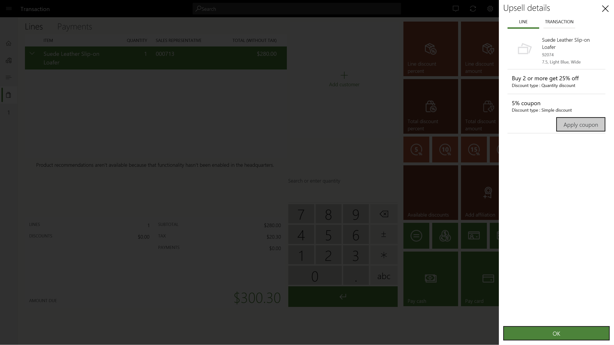

---
# required metadata

title: Display discounts in POS 
description: This document explains how Dynamics 365 Commerce enables the sales associates to learn about the promotions and make it easy for them to use these promotions for cross-sell and upsell motions.
author: ShalabhjainMSFT
manager: AnnBe
ms.date: 02/03/2020
ms.topic: article
ms.prod: 
ms.service: dynamics-365-Commerce
ms.technology: 

# optional metadata

ms.search.form: 
# ROBOTS: 
audience: Application User
# ms.devlang: 
ms.reviewer: josaw
ms.search.scope: Core, Operations, Retail, Commerce
# ms.tgt_pltfrm: 
ms.custom: 
ms.assetid: 
ms.search.region: global
ms.search.industry: Retail, Commerce
ms.author: asharchw
ms.search.validFrom: 2020-02-28
ms.dyn365.ops.version: Application update 10.0.10

---

# Discounts in Point of Sale

[!include [banner](includes/banner.md)]
[!include [banner](includes/preview-banner.md)]

Promotions aka. discounts play an important role in motivating the customers in making purchasing decisions. Unsurprisingly, holidays such as Thanksgiving, Christmas, Black Friday etc. result in the highest amount of sales as the entire retail market is flooded with enticing promotions. Thus, if the store associates know and understand the promotions, they can easily leverage these promotions to upsell and cross sell items. This document explains how Dynamics 365 Commerce enables the sales associates to learn about the promotions and make it easy for them to use these promotions for cross sell and up-sell motions.
## **Learn about the discounts in the store**

Traditionally, every day before the store opens, the sales associates huddle up where the store manager provides the details about the new discounts applicable to the store. However, this method is clearly inefficient as the similar information needs to be repeated for the associates joining in different shifts. To solve this problem, we have introduced a new operation named "View all discounts" which displays all the discounts that are running in the store. Just like other operations, the "View all discounts" can be mapped to a button and can be placed on the Welcome screen or the Transaction screen. Refer the image below showcasing the "View all discounts" page. 
 

To display the discounts, the system looks for all the discounts which match one or more of the following conditions:
	- The price group of the discount matches the price group of the store
	- The price group of the discount is mapped to an affiliation or loyalty program
	- The price group of the discount is mapped to a catalog which is associated to the store

Only some of the coupon based discounts, are shown in this view because, generally retailers create thousands to coupons and corresponding discounts which might be for unique customers, so we don't want this view to show any customer specific discount. Only those coupon based discounts are shown for which a new configuration "Apply without a coupon code" is marked as Yes. This configuration is available on each coupon header and if this is turned On, then the cashiers will be able to apply this coupon without typing or scanning any coupon code/barcode. This enables the scenarios where retailers want to enable the cashiers to give additional discounts to the customers for scenarios such as customer appeasement, product defect discount etc. Traditionally, this was achieved by distributing printed coupon codes or barcodes to the cashiers, but with this feature, the cashiers can press a "Apply coupon" button which will automatically apply the coupon to the transaction. In case multiple coupons exist for a coupon header, then the system will automatically choose the first active coupon on the transaction.
Using the "View all discounts" view, the sales associates can also search the discounts by keywords. This keyword search looks in the discount name and discount description fields. Lastly, they can also filter the discounts by whether a discount requires a coupon code or not. 

## Upsell and cross-sell using discounts
Multiline discounts such as quantity discounts, Mix and Match, and threshold discounts are a great way to motivate the customer to buy additional products and get greater discounts. This in turn helps increase the basket size and hence the revenue for the retailers. These discounts are generally publicized on the ecommerce websites, social media, and as banners in the store. Even with all these measures, often the customers miss to take benefit of these promotions because they did not know about the promotion and the sales associate did not inform them at the time of checkout. To make it easy for the sales associates to find out what promotions are applicable on a selected line or on the entire cart, we have introduced a new operation named "View available discounts". The button corresponding to this operation can be placed on any button grid, however, we recommend this to be placed on the button grid of the transaction screen. The sales associate can select a transaction line and click the "View available discounts" to view all the available discounts on the selected line or click on another tab to view discounts applicable on the entire transaction. Refer the image "Available_disconts.png" below showcasing the "View available discounts" dialog. 
 

This view displays only those discounts which do not compete with any of the applied discounts. This is to ensure that if the associate informs the customers about a discount and the customer takes the required action e.g. buy one more item to get 10% off, then, if the customer buys one more item, then the discount definitely gets applied on the transaction. Additionally, only those coupon based discounts are shown for which the configuration "Apply without a coupon code" is marked as Yes. Considering the most simple scenario, where all the discounts are of the same priority, the discount concurrency mode is "Compounded" and the Discount concurrency control is set to “Best price and compound within priority, never compound across priorities”, then the available discount view will show all the available discounts for a product since all the discounts compound and thus do not compete with each other. 

For **advanced scenarios**, where the discount concurrency mode is Best price or Exclusive, with two or more priorities the below visio diagrams show the logic of what discounts will be displayed in the "View available discount" view based on whether the discount concurrency control is set to "Best price and compound within priority, never compound across priorities" or "Best price only within priority, always compound across priority"

For discount concurrency control as **"Best price and compound within priority, never compound across priorities"**, refer the below image. 

.

For discount concurrency control as **"Best price only within priority, always compound across priority"**, refer the below image.

.
