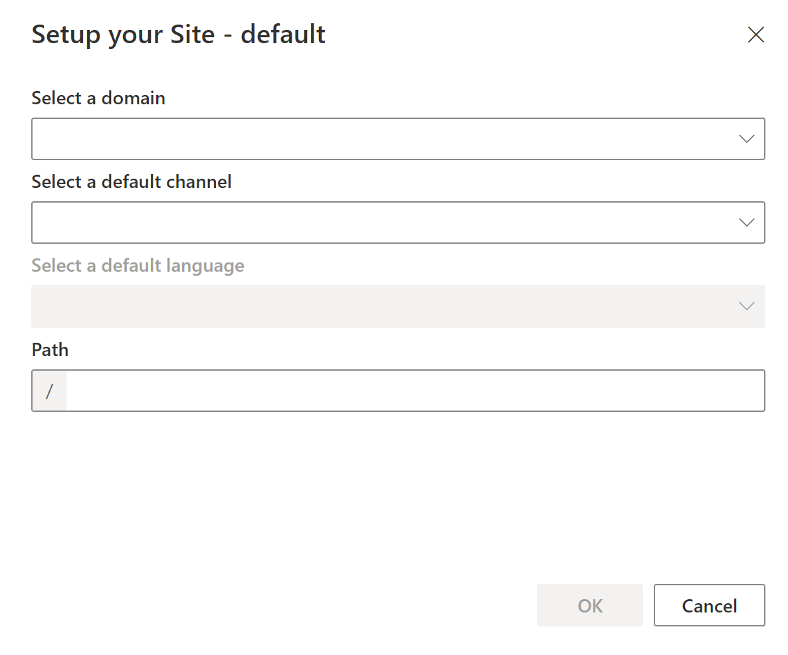

---
# required metadata

title: Manage domains in Commerce
description: This topic describes how domains are managed in Microsoft Dynamics 365 Commerce.
author: BrShoo
manager: AnnBe
ms.date: 07/15/2020
ms.topic: article
ms.prod: 
ms.service: dynamics-365-commerce
ms.technology: 

# optional metadata

ms.search.form:  
audience: Application User
# ms.devlang: 
ms.reviewer: v-chgri
ms.search.scope: 
# ms.tgt_pltfrm: 
# ms.custom: 
ms.search.region: Global
ms.search.industry: retail
ms.author: BrShoo
ms.search.validFrom: 
ms.dyn365.ops.version: 
---

# Manage domains in Commerce

[!include [banner](includes/banner.md)]

This topic describes how domains are managed in Microsoft Dynamics 365 Commerce.

## Overview

Domains are the web addresses an end user will utilize in a browser to navigate to your Dynamics 365 Commerce site. You control management of your domain with a chosen Domain Name Server (DNS) provider. Domains are referenced throughout Commerce site builder to coordinate how a site will be reflected when published. This article will review how domains are referenced throughout the lifecycle of the Commerce site development and launch.

## Provisioning and supported host names

When provisioning an e-Commerce environment in Dynamics 365 Commerce, the "supported host names" entry is used to input the domain(s) within the deployed Commerce environment. Entering domains here does not actually start diverting traffic for those domains to Dynamics 365 Commerce <<,<that happens when...?>>>.

- This domain is the customer-facing DNS names where the e-Commerce website will be hosted.
- You can use production site host names in a sandbox environment as well. This option is ideal when you will be copying a site from sandbox to production. The domain information will be copied into production, ready to work.
- Separate multiple supported host names by a semi-colon
- Create a service request to add additional domains to the environment if provisioning has already occurred.

When provisioning an e-Commerce environment, Commerce will generate a URL that will be the working address for the environment. This URL is referenced in the "e-Commerce site" link shown in Microsoft Lifecycle Services (LCS) after the environment is provisioned.

- An example **Commerce Generated URL** is *https://`<e-Commerce tenant>`.commerce.dynamics.com*; where the e-Commerce tenant name you input for the environment is utilized

- Non-production environments will show a suffix reflecting the environment type within the Commerce Generated URL (example format of a sandbox environment: https://`<e-Commerce tenant name`>-**sandbox**.commerce.dynamics.com). Note that in the future, the "-sandbox" suffix will be removed.

## Site setup and generated URLs

Once your e-Commerce environment is provisioned, perform an initiate site setup in site builder to associate a site to the working URL.

When first selecting a site in site builder to work, the ‘Setup your Site’ dialogue will be presented.

Below is an example of the initial setup dialogue of a site named ‘default’ in site builder:

**Select a domain** allows you to associate one of the **Supported Host Names** provided to this site in site builder.

**Path** can be left blank, or an additional path string can be added which will be reflected in your working URL.

- **Paths** must be unique for each site + domain combination. Within the site and domain selected, only one site in the environment can use the blank path or be associated to a unique path string.

- Leaving the **Path** ‘blank’ associates the base **Commerce Generated URL** to the site being setup.

- Any **Path** string added during site setup will be reflected as a sub-path following the base Commerce Generated URL to access the site content in a web browser.

- **Path** is also referenced as “**Match Path**” when in the Site Settings > Channel configuration sections.

For example, if you have a site in site builder called ‘fabrikam’ in an environment named ‘xyz’, and if you set up the site with a blank **Path**-  then you can access the published site content in a web browser by going directly to the base Commerce Generated URL for this environment:

- `https://xyz.commerce.dynamics.com`

If you had added a Path of ‘fabrikam’ during this same site’s setup instead, you can access the published site content in a web browser by going to:

- `https://xyz.commerce.dynamics.com/fabrikam`

## Pages and URLs

Once your site is set up with a path, all URLs associated to pages in site builder will reference off the initial working URL for the site.

Creating a new URL will allow a URL path to be designated for the Page associated. This value appends to the site’s working URL to access the page (labeled as `./<URL path>` in the URL list menu.

## Domains

The **Supported host names** values are available to be associated as a **domain** when setting up a site. When selecting a supported host name value as the domain, you will see the chosen domain referenced throughout site builder when working in site builder. This domain is a reference only within the Commerce environment, live traffic for that domain is not yet forwarded to dynamics commerce.

When working with sites in site builder, if you have two sites set up with different domains associated, you can use the ‘?domain=’ attribute appended to your working URL to access the published site content in a browser.

For example: 

Environment "xyz" has been provisioned, and two sites created- one with domain `www.fabrikam.com` and the other with domain `www.constoso.com` associated in site builder. Each using the blank **Path**. These two sites could be referenced in a web browser using the following ‘?domain’ attribute:
- `https://xyz.commerce.dynamics.com?domain=www.fabrikam.com`
- `https://xyz.commerce.dynamics.com?domain=www.contoso.com`

When a domain query string is not given in an environment with multiple domains provided, Commerce uses the first domain you have provided. In the above example `https://xyz.commerce.dynamics.com` would serve the site for `www.fabrikam.com`.

## DNS and Go-Live

You can simulate multi-domains using domain query string parameters on the commerce.dynamics.com endpoint itself. But when you need to go live in production, you need to forward the traffic for your custom domain to the `<e-Commerce tenant name>`.commerce.dynamics.com endpoint.

As noted in the Dynamics 365 Commerce [CDN documentation](add-cdn-support.md), the `<e-Commerce tenant name>`.commerce.dynamics.com endpoint does not support custom domain SSLs. This means you must set up custom domains in a front door service or CDN. For this you have two options:

- **Set up a front door service** like Azure Front Door to handle front-end traffic and connect to your Commerce environment
  - Provides greater control over domain management/certificate management and more granular security policies
- Utilize the **Commerce supplied Azure Front Door** instance
  - Requires coordinating action with the Dynamics 365 Commerce Team for domain verification and SSL Certificates for your production domain

To set up a CDN service directly, refer to the [Add CDN Support](add-cdn-support.md) article in Microsoft Docs.

To utilize the Commerce supplied Azure Front Door instance:

- Create a Service Request from your Prod environment to request CDN Setup from the Commerce Onboarding Team. 
  - You will need to provide your Company Name, the production domain, Environment ID, and production eCommerce Tenant Name. 
  - Also confirm if this is an **existing domain** (used for a currently active site ) or a **brand new domain**. 
  - For brand new domain, the domain verification and SSL certificate can be achieved in a single step. 
  - For a domain serving an existing website, there is a multi-step process required to establish the domain verification and SSL certificate. This process has a 7-working-day SLA for a domain to go live as it includes multiple sequential steps for the domain verification and SSL certificate (detailed below in **SSL Certificate Process with Commerce**).

>[!NOTE]
>Custom domains with SSL are only supported on production environments. For lower environments (Sandbox, UAT), use the Commerce Generated URL to access published content in a web browser.

## SSL certificate process

Once a service request is filed, the Commerce team will coordinate the following steps with you:

- For new domains:
  - Commerce will setup the Azure Front Door instance (Commerce-hosted).
  - Commerce will then provide the CNAME record to point your custom domain.
  - After the CNAME record is updated, the Commerce-hosted Azure Front Door instance will be able to verify the domain ownership and get the SSL certificate.
  
- For existing/active domains:
  - Commerce will instruct to add an afdverify.`<custom-domain>` CNAME record to add on your domain DNS provider.
  - Once completed, Commerce will add the domain to the Azure Front Door instance and provide additional DNS TXT Records to be added to the DNS for the domain.
  - After the TXT records are completed, Commerce will complete the AFD updates for the domain which will setup the SSL certificate.

## Apex domains

The Commerce-supplied Azure Front Door instance does not support apex domains (also known as naked domains). Apex domains require an IP address to resolve, and the Commerce Azure Front Door instance exists with virtual endpoints only. To use an apex domain, you have two options:

- **Option 1:** Use your DNS provider to redirect the apex domain to a "www" domain (e.g. fabrikam.com redirects to `www.fabrikam.com` where `www.fabrikam.com` is CNAME to the Commerce-hosted Azure front door instance.)

- **Option 2:** Set up a CDN/front door instance on your own to host the apex domain.

>[!NOTE]
>If you are using Azure front door, you must also set up an Azure DNS in the same subscription. The apex domain hosted on Azure DNS can point to your Azure front door as an alias record. This is the only work around as apex domains must always point to an IP Address.

## Additional resources

[Deploy a new e-Commerce site](deploy-ecommerce-site.md)

[Set up an online store channel](online-stores.md)

[Create an e-Commerce site](create-ecommerce-site.md)

[Associate an online site with a channel](associate-site-online-store.md)

[Manage robots.txt files](manage-robots-txt-files.md)

[Upload URL redirects in bulk](upload-bulk-redirects.md)

[Set up a B2C tenant in Commerce](set-up-B2C-tenant.md)

[Set up custom pages for user logins](custom-pages-user-logins.md)

[Configure multiple B2C tenants in a Commerce environment](configure-multi-B2C-tenants.md)

[Add support for a content delivery network (CDN)](add-cdn-support.md)

[Enable location-based store detection](enable-store-detection.md)
