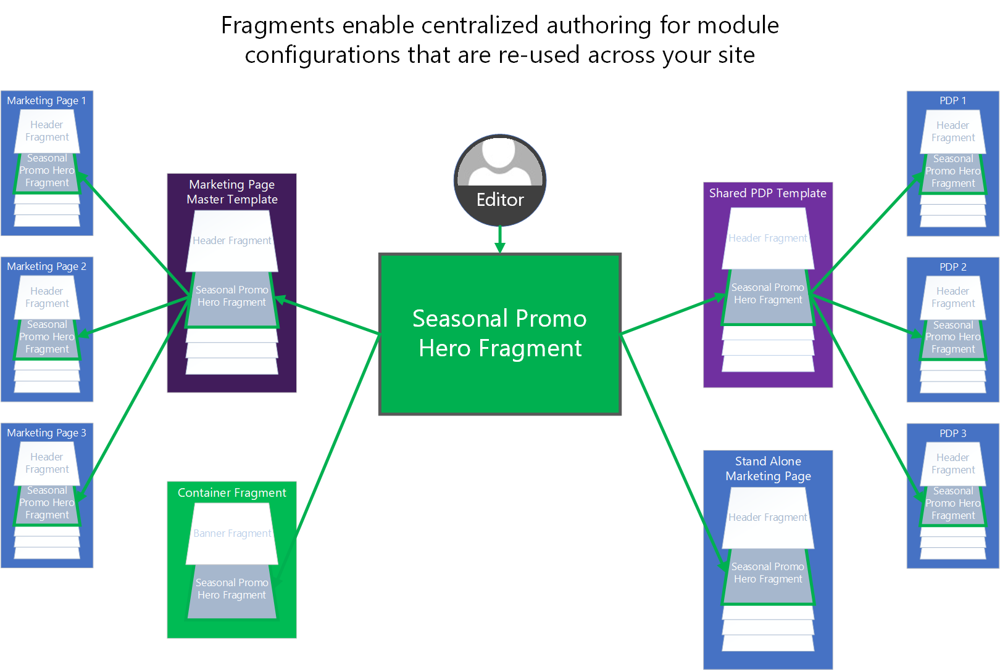

---
# required metadata

title: Work with fragments
description: This topic describes why, when, and how to use fragments in Dynamics 365 Commerce.
author: niholman
manager: annbe
ms.date: 10/01/2019
ms.topic: article
ms.prod: 
ms.service: dynamics-ax-retail
ms.technology: 

# optional metadata

ms.search.form:  
audience: Application User
# ms.devlang: 
ms.reviewer: v-chgri
ms.search.scope: Retail, Core, Operations
# ms.tgt_pltfrm: 
# ms.custom: 
ms.search.region: Global
ms.search.industry: retail
ms.author: phinneyridge
ms.search.validFrom: 2019-10-31
ms.dyn365.ops.version: Release 10.0.5

---

# Work with fragments 

[!include [banner](../includes/preview-banner.md)]
[!include [banner](../includes/banner.md)]

This topic describes why, when, and how to use fragments in Dynamics 365 Commerce.

## Overview

Fragments make possible a centralized authoring experience for reusable module configurations needed throughout your site. For example, headers, footers, and banners are often configured as fragments because they are shared across many pages. A great way to think of fragments is that they act like mini-webpages that can be inserted into other pages within your site. Fragments have their own lifecycle, which means they are created, referenced, updated, and deleted as independent entities within the authoring tools. Once fragments are configured, they are available to use everywhere that a module can be used within your site structure. Fragments can be referenced within pages, layouts, templates, and within other fragments.

> [!NOTE]
>
> Fragments can nest within other fragments up to seven levels deep.

As an example, let's imagine a seasonal event that we want to promote across many pages within our site. We could use a fragment to do this. Creating the new fragment will begin by choosing a module type to start from. For this example, we could choose for our fragment to be built from a Hero module.

> [!NOTE]
> Fragments can be configured from any module type. 

We can then configure this Hero fragment with our specific promotional content, and localize it if necessary. This new standalone Hero fragment is now consumable as a preconfigured module throughout our site. We can easily add it to templates, specific pages, or within other fragments that can contain Hero modules. All the places where the fragment is added are references to the central Hero fragment that we created. If we decide to publish changes to our fragment, these will immediately be reflected everywhere the fragment is referenced across the site. Fragments are a powerful and efficient way to reuse and centrally manage module configurations within a site, and effective use of them can add up to significant agility and cost savings when managing site content.

## Create a fragment

To create a fragment, you can either create a new one or save an existing module configuration as a fragment.

### Create a new fragment

To create a new fragment, do the following.

1. In the left navigation pane, click **Fragments**.

1. Click **New Page Fragment**. A dialog box appears showing all module type options.

1. Choose a module type for your fragment, and click **OK**.

   > [!NOTE]
   > As mentioned above, fragments can be created from any module type.  

   > [!TIP]
   > A generic container module type will allow the most flexibility for future updates and configurations of your fragment. 

### Save an existing module configuration as a fragment

To convert an already-configured module into a reusable fragment, do the following.

1. Open a page or template that contains a module that you want to convert into a fragment. 
1. In the left-side outline pane, click the ellipsis button ("…") next to the name of the module.
1. In the drop-down menu, select **Save as Fragment**. A fragment dialog box appears..
1. Enter a name and metadata for the fragment.
1. Click **OK** to save the module configuration as a fragment that can now be added to other pages.

## Add, remove, or edit fragments within a page

The following procedures describe how to add, remove, and edit fragments.

### Add a fragment

To add a fragment to a page, do the following.

1. In the left-side outline pane, select a container or slot that allows children to be added to it. (See note below.)
1. Click the ellipsis button ("…") next to the container or slot name.
1. From the drop-down menu, select **Add Fragment**. A dialog box appears.
>[!NOTE] 
> If the container or slot does not allow new child modules, the **Add Fragment** option will be disabled. 
1. In the dialog box, search for and select a fragment add. (If there are no options, you may first need to create a fragment from a supported module type for your container/slot).
1. Click **OK** to add the new fragment to your page within the originally selected container or slot.

> [!NOTE]
> Modules allowed within a container or slot are defined by the page's template or the module's own definition. 

### Remove a fragment

To remove a fragment from a slot or container within a page, do the following.

1. In the left-side outline pane, click the ellipsis button ("…") next to the name of the fragment you want to remove.
1. In the drop-down menu, select the trashcan button. This will launch a confirmation dialog box asking if you are sure you want to remove the fragment.
1. Click **OK** to remove the

> [!NOTE]
> Removing a fragment from a page will *not* delete the fragment from your site, and will only remove the reference to it from within the current page.  Fragments can only be deleted from your site within the fragment inspector UI and can only be performed if the fragment is not currently referenced by other pages, templates, or other fragments.

### Edit a fragment

Fragment edits can only be performed from within the fragment editor UX.  This is by design and ensures that authors do not confuse editing modules for a specific page with editing a fragment that may be shared across many pages.  

To edit a fragment, do the following.

1. In the left-side navigation pane, click **Fragments**. 
1. Under **Fragments**, select the fragment you want to edit. The fragment's module properties and structure can then be edited like modules are edited within the page editor view.

> [!NOTE]
> You can also edit a fragment by selecting one in a page, template, or parent fragment, and then clicking **Edit Fragment** in the right-side properties pane.
