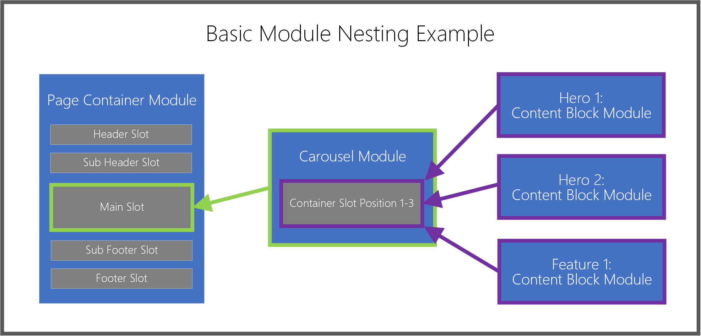

---
# required metadata

title: Modules
description: This topic describes how and when to use modules within the e-commerce authoring toolset.
author: Nick Holman
manager: Brendan Sullivan
ms.date: 07/08/2019
ms.topic: article
ms.prod: 
ms.service: dynamics-365-commerce
ms.technology: 

# optional metadata

ms.search.form:  
audience: Application User
# ms.devlang: 
ms.reviewer: josaw
ms.search.scope: 
# ms.tgt_pltfrm: 
# ms.custom: 
ms.search.region: Global
ms.search.industry: retail
ms.author: phinneyridge
ms.search.validFrom: 
ms.dyn365.ops.version: 

---
# Add or remove modules
# Configuring modules
# Configure an image, video, or link in a module

---
# Original article:

## Modules

Modules are logical building blocks that make up your page structure, and they come in a variety of purposes and scopes. Some modules are high-level containers whose sole purpose is to organize other child modules. Other modules can have a very granular purpose, like a simple image placement module. And others, like a Carousel module, fall somewhere in between. By default, your D365 for Commerce site comes with a starter kit module library that will enable you to achieve most fundamental e-Commerce scenarios. You should be able to construct an end-to-end e-Commerce site with just these modules, but a day will likely come when you want to customize or build brand-new modules for specific needs. For this, there is a module design SDK available for your SI or in-house front-end JavaScript/React developer to create a custom module library to suite those needs. A whole set of documentation is available to drill into the module SDK, but for the moment we’ll stick to foundational module concepts focused around page authoring workflows.

### Container Modules and “Slots”

As mentioned above, some modules are designed to contain other modules. This family of modules are aptly named “Containers” and they allow a hierarchy of nested modules within one another. Container modules utilize an authoring concept called “Slots”, which communicate the layout and purpose for child modules within the container. A good example of this is a basic page container module (which is the top level module for any given page) and defines several important slots: 1) a header slot, 2) a body slot, and 3) a footer slot. The module itself dictates these slots and determines which, and how many, child modules can be directly contained within it. For the page container module example above, the header slot might allow only one module of type Header Module, and the body slot might allow unlimited modules of any type (with the exception of another page container module). Within the toolset, page authors don’t need explicit knowledge of which modules are allowed or not allowed in each slot. When an author initially selects a slot and goes to pick a module to add, they will see a filtered view of module types that are supported for that slot. \[Module authoring options can optionally be constrained further by a Master Template, but that workflow is covered elsewhere.\]

Below is a simple diagram to illustrate how modules nest into parent container module slots:

### Content Modules

Content modules, as their name suggests, contain actual content and media primitives, such as text (headlines, paragraphs, links) or asset references (images, video, PDFs, etc.). Examples of common content modules are Hero, Feature, Banner, etc., each of which can contain text /media and don’t require any further child modules to actually render something visible on a page. Content modules represent the heart of typical day-to-day page and content authoring activities, primarily because they represent the actual information rendered within their parent container modules. There are many different content modules to choose from, and a main takeaway here is that content modules are generally the final pieces in your page’s module nesting hierarchy.
