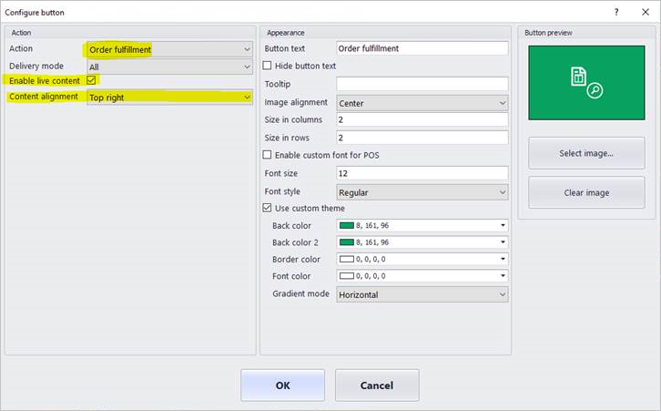
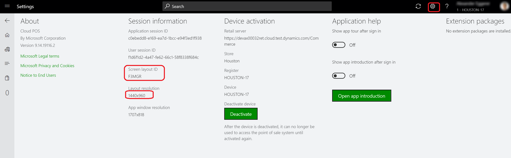
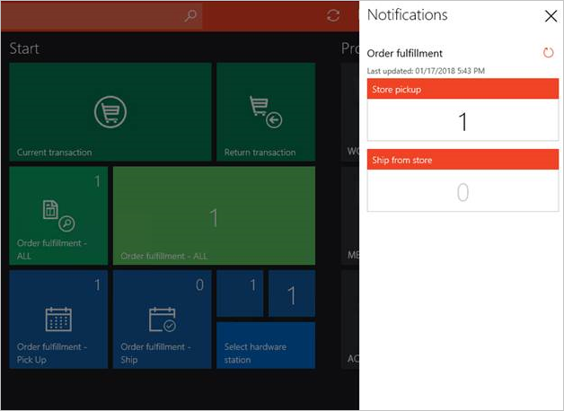

---
# required metadata

title: Show order notifications in the point of sale (POS)
description: This topic describes how to enable order notifications in the point of sale and the notification framework.
author: ShalabhjainMSFT
manager: AnnBe
ms.date: 04/30/2019
ms.topic: article
ms.prod: 
ms.service: dynamics-365-retail
ms.technology: 

# optional metadata

ms.search.form:  RetailOperations, RetailFunctionalityProfile
audience: Application User
# ms.devlang: 
ms.reviewer: josaw
ms.search.scope: Core, Operations, Retail
# ms.tgt_pltfrm: 
# ms.custom: 
ms.search.region: Global
ms.search.industry: retail
ms.author: ShalabhjainMSFT
ms.search.validFrom: 2017-10-30
ms.dyn365.ops.version: 

---

# Show order notifications in the point of sale (POS)

[!include [banner](includes/banner.md)]

In the modern retail environment, store associates are assigned various tasks, such as helping customers, entering transactions, doing stock counts, and receiving orders in the store. The point of sale (POS) client provides a single application where associates can perform all these tasks and many others. Because various tasks must be performed during the day, associates might have to be notified when something requires their attention. The notification framework in the POS helps by letting retailers configure role-based notifications. As of Dynamics 365 for Retail with application update 5, these notifications can be configured only for POS operations.

Currently, the system can show notifications only for order fulfillment operations. However, because the framework is designed to be extensible, developers will eventually be able to write a notification handler for any operation and show the notifications for that operation in the POS.

## Enable notifications for order fulfillment operations

To enable notifications for order fulfillment operations, follow these steps.

1. Go to **Retail and Commerce** &gt; **Channel setup** &gt; **POS setup** &gt; **POS** &gt; **Operations**.
2. Search for the **Order fulfillment** operation, and select the **Enable notifications** check box for it to specify that the notification framework should listen to the handler for this operation. If the handler is implemented, notifications for this operation will then be shown in the POS.
3. Go to **Retail and Commerce** &gt; **Employees** &gt; **Workers** &gt;, under Commerce tab, open the POS permissions associated with the worker. Expand the **Notifications** FastTab, add the **Order fulfillment** operation, and set the **Display order** field to **1**. If more than one notification is configured, this field is used to arrange the notifications. Notifications that have a lower **Display order** value appear above notifications that have a higher value. Notifications that have a **Display order** value of **1** are at the top.

    Notifications are shown only for operations that are added on the **Notifications** FastTab, and you can add operations there only if the **Enable notifications** check box for those operations has been selected on the **POS operations** page. Additionally, notifications for an operation are shown to workers only if the operation is added to the POS permissions for those workers.

    > [!NOTE]
    > Notifications can be overridden at the user level. Open the worker's record, select **POS permissions**, and then edit the user's notification subscription.

4. Go to **Retail and Commerce** &gt; **Channel setup** &gt; **POS setup** &gt; **POS profiles** &gt; **Functionality profiles**. In the **Notification interval** field, specify how often notifications should be pulled. For some notifications, the POS must make real-time calls to the back-office application. These calls consume the compute capacity of your back-office application. Therefore, when you set the notification interval, you should consider both your business requirements and the impact of real-time calls to the back-office application. A value of **0** (zero) turns off notifications.
5. Go to **Retail and Commerce** &gt; **Retail and Commerce IT** &gt; **Distribution schedule**. Select the **1060** (**Staff**) schedule to synchronize notification subscription settings, and then select **Run now**. Next, select the **1070** (**Channel configuration**) schedule to synchronize the permission interval, and then select **Run now**.

## View notifications in the POS

After you complete the preceding steps, the workers will be able to view the notifications in the POS. To view notifications, press the notification icon in the top right corner of the POS. A notification center appears and shows notifications for the order fulfillment operation. The notification center should show the following groups in the order fulfillment operation:

- **Store pickup** – This group shows the count of orders that have a delivery mode of **Pickup**, and that are scheduled for pickup from the current store. You can press the number on the group to open the **Order fulfillment** page. In this case, the page will be filtered so that it shows only the active orders that are set up for pickup from the current store.
- **Ship from store** – This group shows the count of orders that have the delivery mode of **Shipping**, and that are scheduled for shipment from the current store. You can press the number on the group to open the **Order fulfillment** page. In this case, the page will be filtered so that it shows only the active orders that are set up for shipment from the current store.

When new orders are assigned to the store for fulfillment, the notification icon changes to indicate that there are new notifications, and the count for the appropriate groups is updated. Even though the groups are refreshed at regular intervals however, POS users can manually refresh the groups at any time by selecting the **Refresh** button next to the group. Lastly, if a group has a new item, that the current worker hasn't viewed, then the group shows a burst symbol to indicate new content.

## Enable live content on POS buttons

POS buttons can now show a count to help workers easily determine which tasks require their immediate attention. To show this number on a POS button, you must complete the notification setup that is described earlier in this topic (that is, you must enable notifications for an operation, set up a notification interval, and update the POS permission group for the worker). Additionally, you must open the button grid designer, view the button's properties, and select the **Enable live content** check box. In the **Content alignment** field, you can select whether the count appears in the upper-right corner of the button (**Top right**) or in the center (**Center**).

> [!NOTE]
> The live content can be enabled for operations only if the **Enable notifications** check box has been selected for them on the **POS operations** page, as described earlier in this topic.

The following illustration shows the live content settings in the button grid designer.

To show the notification count on a button, you need to ensure that the correct screen layout is being updated. To determine the screen layout that is being used by the POS, select the **Settings** icon in upper-right corner and note the **Screen layout ID** and **Layout resolution**. Now using Edge browser, go to the **Screen layout** page, find the **Screen layout ID** and **Layout resolution** identified above and select the **Enable live content** check box. Go to **Retail and Commerce \> Retail and Commerce IT \> Distribution schedule** and run the 1090 (Registers) job to synchronize layout changes.

The following illustration shows the effect of selecting **Top right** versus **Center** in the **Content alignment** field for buttons of various sizes.

