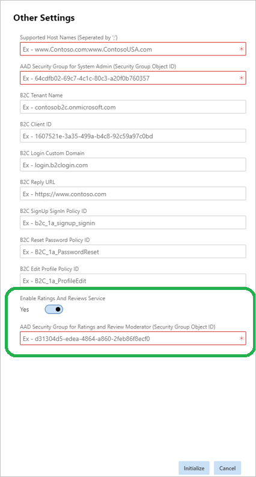

---
# required metadata

 

title: Ratings and Reviews Onboarding process. 
description: This topic explains how to onboard with Dynamics 365 for Commerce's Ratings and Reviews 
author:  gvrmohanreddy 
manager: JeffBl
ms.date: 08/30/2019
ms.topic: article
ms.prod: 
ms.service: dynamics-365-commerce
ms.technology: 

 

# optional metadata

 

# ms.search.form: 
# ROBOTS: 
audience: Application User
# ms.devlang: 
ms.reviewer: josaw
ms.search.scope: 
# ms.tgt_pltfrm: 
ms.custom: 
ms.assetid: 
ms.search.region: 
ms.search.industry: 
ms.author: gmohanv
ms.search.validFrom: 2019-10-01
ms.dyn365.ops.version: 
---

# Onboarding with Ratings and Reviews  

Lifecycle Services (LCS) is an administration portal that C1 uses to manage their environments from provisioning to decommissioning. Ratings and Reviews is made available part of Dynamics 365 for Commerce as an omni-channel solution.  If you wants to use Ratings and Reviews solution on your eCommerce website that is hosted on Dynamics 365 for Commerce platform, use the following instructions part of the 
[LCS - eCommerce ](https://docs.microsoft.com/en-us/dynamics365/)

  
## Steps to opt in for Ratings and Reviews 
  
	1. Go through [Deploy a new e-Commerce site](https://docs.microsoft.com/en-us/dynamics365/) process. 
	2. In other settings, select Yes for "Enable Ratings and Reviews service" 
	3. Provide Azure Active Directory Security Group which includes moderators in "AAD Security Group for Ratings and Reviews Moderation (Security Group Object ID)" field. 
 4. Complete eCommerce initialization process. 

 

