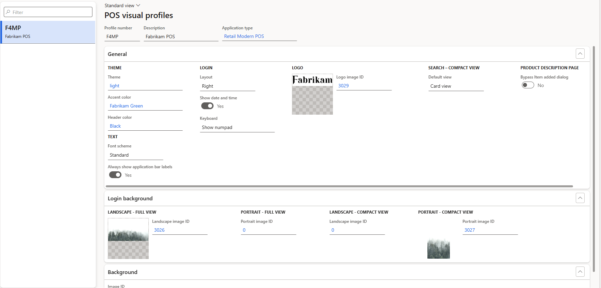
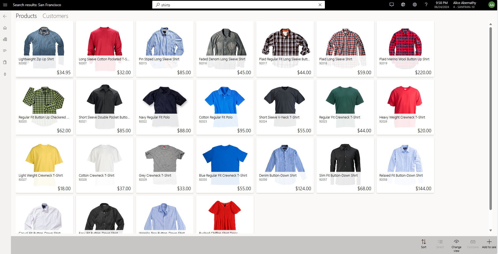
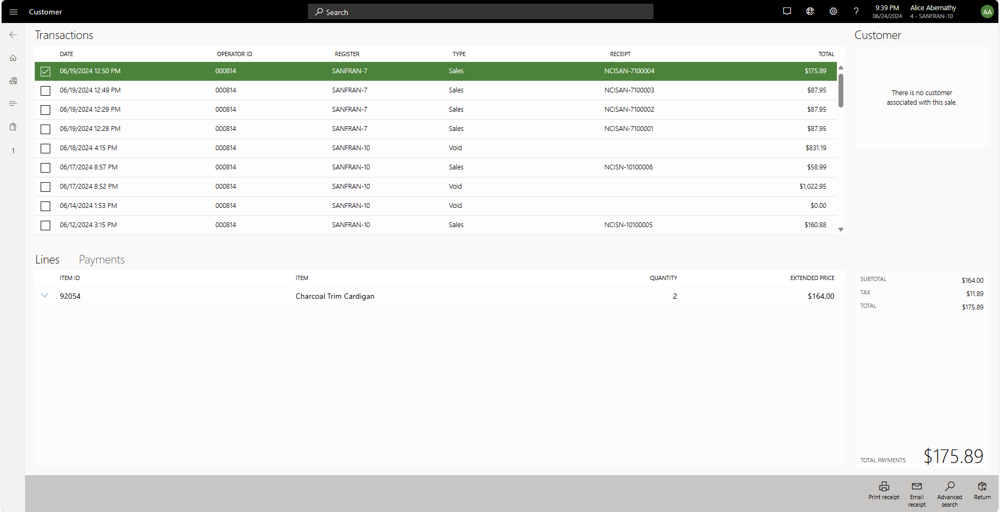
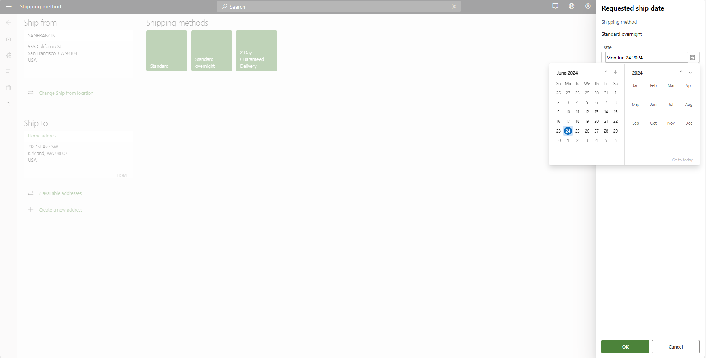

# POS UX modernization

The article describes the store commerce UX modernization features and how to enable them.

## Streamlined workflow for adding items to a transaction from the product page:

When you add an item to the cart from the product description page or search results, two new workflows are introduced in 10.0.40 release. The first workflow shows a confirmation dialog after an item is added to cart from product description page or search results to clearly indicate to the user that their action was successful. This workflow allows uers to continue browsing for more products and is suited for assited selling scenarios where store associates are browsing and adding many items to cart.

The second workflow allows the user to immediately navigate to the transaction page once the item is added to cart. This allows the user to immediately switch back to the transaction page and continue with the sale process. 

These workflows can be selected using  a new configuration option in the Visual profile in Headquarters beginning 10.0.40 release. 

To bypass the confirmation dialog and always navigate to transaction page after adding an item, go to Headquarters **POS visual profiles**, under  **General** section, **Product details page** sub-sectiom, set **Bypass Item added dialog**  to **yes**.

To see the confirmation dialog, set  **Bypass Item added** to **no**. The image below shows the setting in Headquarters.

The image below shows the confirmation dialog.

## Configure display of search results:

The default view for displaying search results can now be configured in the Visual profile in Headquarters. Previously, the default view for search results for products, customer and categories was list view. With 10.0.40 release, the search results can default to a card view and allows easy browsing of products

To enable your search view preference, go to Headquarters, **POS visual profiles**, under  **General** section,  **Search view** sub-section, set **Default view** to **List view** or **Card view**.

## Reset button grids at the end of a transaction:

With this feature, the default button grid assigned to the first tab is restored when a transaction is completed, suspended, or voided. This helps to reduce confusion and number of clicks when multiple transactions are being handled by a store associate. This feature is enabled by default for all users. This is available beginning 10.0.40 release. 

## Reprint receipts from journal:

To reduce number of clicks in reprinting receipts, **print receipt** button is available on the bottom of  **show journal** screen. To reprint receipts, select journal and **print receipt** in a single click. This is available beginning 10.0.40 release. 

## Enhanced date picker:

To enable intuitive interactions, the date picker in store commerce app has been updated to a React control.This is available beginning 10.0.39 release. 

## Persist Zoom level:

Store associates can persist the zoom settings to fix their display and not have to adjust it every time the app is re-opened. This is especially useful for those that run the devices in kiosk mode without keyboard and mouse. This is available beginning 10.0.39 release. 

## Payment capture improvements 

With 
