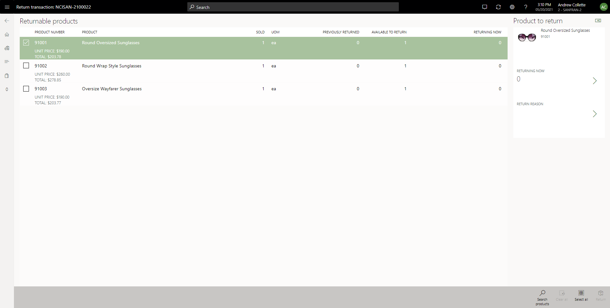

---
# required metadata

title: Create returns in POS
description: This article describes how to initiate returns for cash-and-carry transactions or customer orders in the Microsoft Dynamics 365 Commerce Point of Sale (POS) application.
author: hhainesms
ms.date: 08/04/2022
ms.topic: article
audience: Application User, Developer, IT Pro 
ms.reviewer: v-chgriffin
ms.search.region: Global
ms.author: josaw
ms.search.validFrom: 2020-02-20
ms.dyn365.ops.version: Release 10.0.20

---

# Create returns in POS

[!include [banner](includes/banner.md)]

This article describes how to initiate returns for cash-and-carry transactions or customer orders in the Microsoft Dynamics 365 Commerce point of sale (POS) app.

> [!NOTE]
> In the Commerce version 10.0.20 release and later, a new feature that is named **Unified return processing experience in POS** is available. This feature provides a more consistent and unified return process in POS, regardless of the transaction type (cash-and-carry transaction or customer order) or the original channel that the order was created in. We recommend that all organizations turn on this new feature to help improve the overall reliability of return processing through POS.
>
> After the feature is turned on, it can't be turned off.

## Process returns by using the return transaction operation

We recommend that you add the return transaction operation to your POS [screen layout](pos-screen-layouts.md). In releases before the Commerce version 10.0.20 release, the return transaction operation correctly supports the processing of returns for cash-and-carry transactions only. After you turn on the **Unified return processing experience for POS** feature in the Commerce version 10.0.20 release or later, the return transaction operation also supports the processing of returns that originate from customer orders, such as "pick up" or "ship to home" orders that are already invoiced.

From the return transaction operation, users can search for a cash-and-carry transaction or a customer order to return against by entering any of the following four search criteria. Users can enter these criteria by using a device keyboard, on-screen keypad, or bar code scanner.

- Receipt ID
- Order number
- Channel reference ID (also known as the order confirmation ID)
- Invoice ID

If a transaction or order is found that matches the search criteria, the **Returnable products** page appears. There, users can specify the items that are being returned. They can also enter return quantities and reason codes.

For each order line in the list of returnable products, POS shows information about the original purchase quantity and the quantities from any returns that were previously processed. The return quantity that a user enters for an order line must be less than or equal to the value of the **Available to return** field.

During return processing, if a user has the physical product, and that product has a bar code, the user can scan the bar code to register the return. Each scan of the bar code increases the return quantity by one item. However, if the bar code label has an embedded quantity, that quantity will be entered in the **Returning now** field.

Users can also manually select items to return on the **Returnable products** page and then update the **Returning now** field by using the details pane on the right.

If the maximum available **Returning now** quantity is being specified for a transaction, the user can select the **Select all** operation on the POS app bar to set the maximum returnable quantity on all lines.

For each line that has a **Returning now** quantity, the user must select a return reason code by using the details panel. For returns of cash-and-carry transactions, the return reason codes are configured as info codes in the store's functionality profile. For returns of customer orders, the return reason codes are configured on the **Return reason codes** page in Dynamics 365 Commerce headquarters.

After the return quantity and reason code have been set for each item that must be returned, the user can select the **Return** operation on the POS app bar to proceed with the processing. The POS transaction page appears, where the returnable items that were selected on the previous page have been added to the cart. The **Returning now** quantities for the items appear as negative-quantity lines on the transaction, and the total refund is calculated.

When there is more than one item to return in a transaction, unified return processing can cause some user experience issues. To mitigate these issues, starting with Commerce version 10.0.36 you can enable the **Improved user experience for POS returns** feature. This feature makes the return products grid a multiselect grid where users can select and deselect returnable products, and automatically brings up the return reason dialog box to reduce the number of user steps taken to open and close the return reason dialog box. This feature also introduces the **Skip sales invoice selection during returns** configuration in the POS functionality profile, which when enabled combines all returnable products from an order, regardless of the invoice from which they were fulfilled. This feature saves cashiers from having to make multiple clicks, because they don't have to select the correct invoice to return an item. 

The **Improved user experience for POS returns** feature improvements have been backported to Commerce versions 10.0.33 through 10.0.35, but you must enable them via config files in your sandbox/development/test environments and then contact Microsoft to enable them in production. For internal environments, modify the bin\CommerceRuntime.config file under the retail server physical path to add `"FeatureState.Dynamics.AX.Application.RetailUnifiedReturnUXImprovementFeature" value="true"` and `"FeatureState.Dynamics.AX.Application.RetailSkipInvoiceSelectionDuringReturnFlight" value="true"`. If you don't want to skip the invoice selection view, don't add the second setting to the config file. 

## Other return options in POS

Users can add lines to a return transaction if they are creating an exchange order. Users can add additional return items to a return transaction by using the **Return product** operation for a selected positive-quantity sales line that has already been added.

> [!NOTE]
> The **Return product** operation in POS doesn't provide validation against original transactions, and allows any product to be returned. Microsoft recommends that you only allow authorized users to perform this operation, or enforce that a manager override is required to do so.

When the **Unified return processing experience in POS** feature is turned on, users can also use the **Show journal** operation in POS to initiate a return for a cash-and-carry transaction or a customer order. They can then select a transaction in the journal and then select the **Return** operation on the POS app bar. This operation is available only if there are returnable lines on the order. It initiates the same user experience as the **Return transaction** operation.

Users can also use the **Recall order** operation in POS to search for and recall customer orders. (This operation can't be used for cash-and-carry transactions). In this case, after a customer order is selected, the **Return** operation on the POS app bar can be used to initiate a return for the customer order. This operation is available only if there are returnable lines on the order. It initiates the same user experience as the **Return transaction** or **Show journal** operation.

If a refund is due at checkout, you can configure [refund payment policies](refund_policy_returns.md) that limit the payment methods used to refund customers. If an original transaction was paid by using a credit card, depending on the payment processor and the system configuration, users might have the option to [issue a refund to the original card](dev-itpro/linked-refunds.md). In this case, the refund can be processed without requiring that the customer swipe their credit card again because the original payment token is used to issue the refund.

## Return orders are posted to Commerce headquarters as sales orders 

When the **Unified return processing experience in POS** feature is turned on, all returns that are created in POS are written to Commerce headquarters as sales orders that have negative lines. In releases before the Commerce version 10.0.20 release, users can select whether return orders should be posted as sales orders that have negative lines, or whether they should be return orders that are created through the return merchandise authorization (RMA) process. 

In the **Unified return processing experience in POS** feature, the option to use the RMA process to create returns in POS has been deprecated. After this feature is turned on, all returns will be created as sales orders that have negative lines.

## Offline return processing improvements

In most cases, when a return is processed in POS, the system tries to make a real-time service (RTS) call to Commerce headquarters to validate the current quantities that are available for return. This validation helps prevent fraudulent scenarios where a customer tries to return the same item in multiple locations.

To handle situations where the RTS call can't be made because of network or connectivity issues, a process has been put in place to periodically synchronize return quantity data from Commerce headquarters to a store's channel database. This channel-side return tracking helps ensure that the **Available to return** quantities that are shown in POS are reasonably accurate, even when POS is offline. It also ensures that POS can continue to validate the channel-side information to help prevent fraudulent returns.

To use the offline return process in the appropriate manner, organizations should schedule the **Update return quantities** batch job in Commerce headquarters so that it runs frequently. We recommend that this job run at the same frequency as the P job that pulls new transactions from Commerce channels into Commerce headquarters.

The **Update return quantities** job calculates the quantity that is available for return for all sales orders that are found in Commerce headquarters. The data that the job calculates must then be sent to channel databases, so that the store channels can be updated. The **Return quantities** (1200) distribution job is used for this purpose. Because data about the returnable quantity is synchronized from Commerce headquarters, if a return is processed in POS, but the RTS call can't be made, POS can use the channel-side return information to validate the **Available to return** quantities for a given sales line.

When RTS calls can't be made, and POS is using channel-side data for return validation, a warning message informs users that they are creating an "offline" return. Therefore, they are aware that the **Available to return** quantity that is shown in POS might be out of date and no longer accurate, depending on when the **Update return quantities** job was last processed and synchronized to the channel.

For example, a customer recently processed a return for an order line in another channel, but that data hasn't yet been synchronized to the channel databases through the **Update return quantities** job. The customer then goes to a different store and tries to return the same item again. In this case, if the store can't make the RTS call to Commerce headquarters to get real-time return data, POS will allow the item to be returned again. However, the user is warned that the information that is being used to validate the return might be out of date. The message that the user receives is only a warning message. It doesn't prevent the user from continuing to process the return.

If the channel-side information isn't up to date for some reason, and an offline return is processed for a quantity that exceeds the actual **Available to return** quantity, an error might be generated when statement posting is run to create the transaction in Commerce headquarters.

> [!NOTE]
> When the **Unified returns processing experience in POS** feature is turned on, new optional features that support the validation of serialized product returns become available. For more information, see [Return serial number–controlled products in Point of Sale (POS)](POS-serial-returns.md).

## Version details

The following list provides the minimum version requirements for the various components.
- Commerce headquarters: Version 10.0.20
- Commerce Scale Unit (CSU): Version 9.30
- Point of sale (POS): Version 9.30

## Enable proper tax calculation for returns with partial quantity

This feature ensures that when an order is returned using multiple invoices, the taxes will ultimately be equal to the tax amount originally charged.

1. In the **Feature management** workspace, search for **Enable proper tax calculation for returns with partial quantity**.
1. Select the **Enable proper tax calculation for returns with partial quantity** feature, and then select **Enable**.

## Set up return locations for retail stores

Commerce lets you set up return locations that are based on retail info codes and sales and marketing reason codes. When customers return purchases, cashiers often indicate the reason for the return. You can specify that returned products should be assigned to different return locations in inventory, based on info codes and reason codes that cashiers select at the POS register.

For example, a customer returns a defective product, and the cashier processes the return transaction. When Retail POS shows the info code for returns, the cashier selects the subcode for defective returns. The returned product is then automatically assigned to a specific return location.

A return location can be a warehouse, a location in a warehouse, or even a specific pallet, depending on the inventory locations that your organization has set up. You can map each return location to one or more retail info codes and sales and marketing reason codes.

### Prerequisites

Before you can set up return locations, you must set up the following elements:

- **Retail info codes** – Prompts at the POS register that are set up in the **Retail** module. For more information, see [Setting up info codes](/dynamicsax-2012/appuser-itpro/setting-up-info-codes).
- **Sales and marketing reason codes** – Prompts at the POS register that are set up in the **Sales and marketing** module. For more information, see [Setting up reason codes](/dynamicsax-2012/appuser-itpro/set-up-return-reason-codes).
- **Inventory locations** – The places where inventory is kept. For more information, see [Setting up inventory locations](/dynamicsax-2012/appuser-itpro/about-locations).
	
### Set up return locations

To set up return locations, follow these steps.

1. Go to **Retail and Commerce \> Channel setup \> Warehouses**, and select a warehouse.
1. On the **Retail** FastTab, in the **Default return location** field, select the inventory location to use for returns where the info codes or reason codes aren't mapped to return locations.
1. In the **Default return pallet** field, select the pallet to use for returns where the info codes or reason codes aren't mapped to return locations.
1. Go to **Retail and Commerce \> Inventory management \> Return locations**.
1. Select **New** to create a return location policy.
1. Enter a unique name and a description for the return location.

    > [!NOTE]
    > If a number sequence has been set up for return locations, the name is automatically entered.

1. On the **General** FastTab, set the **Print labels** option to **Yes** to print labels for all the products that are assigned to return locations.
1. Set the **Block inventory** option to **Yes** to take returned products in the default return location out of inventory and prevent them from being sold.
1. To map specific retail info codes and subcodes to return locations, follow these steps:

    1. On the **Retail info codes** FastTab, select **Add**.
    1. In the **Info code** field, select an info code for returns.
    1. In the **Subcode** field, select a subcode for the reason for the return. The **Description** field shows the description of the selected subcode.
    1. In the **Store** field, select the store where the info code is used.
    1. Use the **Warehouse**, **Location**, and **Pallet ID** fields to specify a return location. For example, to specify a location in a store, select a store in the **Store** field and a location in the **Location** field.
    1. Select the **Block inventory** checkbox to take returned products out of inventory and prevent them from being sold.

1. To map specific sales and marketing reason codes to return locations, follow these steps:

    1. On the **Sales and marketing reason codes** FastTab, select **Add**.
    1. In the **Reason code** field, select a reason code for returns. The **Description** field shows the description of the selected reason code.
    1. In the **Store** field, select the store where the reason code is used.
    1. Use the **Warehouse**, **Location**, and **Pallet ID** fields to specify a return location. For example, to specify a pallet in a location in a warehouse, select a warehouse in the **Warehouse** field, a location in the **Location** field, and a pallet in the **Pallet ID** field.
    1. Select the **Block inventory** checkbox to take returned products out of inventory and prevent them from being sold.

    > [!NOTE]
    > If a return location policy is used for an item, but the return reason that a cashier selects doesn't match any code that is specified on the **Retail info codes** or **Sales and marketing reason codes** FastTab, the item is sent to the default return location that is defined on the **Warehouse** page. Additionally, the setting of the **Block inventory** checkbox on the **General** FastTab of the **Return locations** page determines whether the returned item should be inventory blocked.

1. Go to the **Retail and Commerce \> Commerce product hierarchy**.
1. On the **Manage inventory category properties** FastTab, in the **Return location** field, select a return location. Because multiple return location policies can be defined for the same store, the value that you select here determines the return location policy that is used.

## Additional resources

[Return serial number–controlled products in Point of Sale (POS)](POS-serial-returns.md)

[Linked refunds of previously approved and confirmed transactions](dev-itpro/linked-refunds.md)

[Create and update a returns and refunds policy for a channel](refund_policy_returns.md)

[POS user interface visual configurations](pos-screen-layouts.md)
