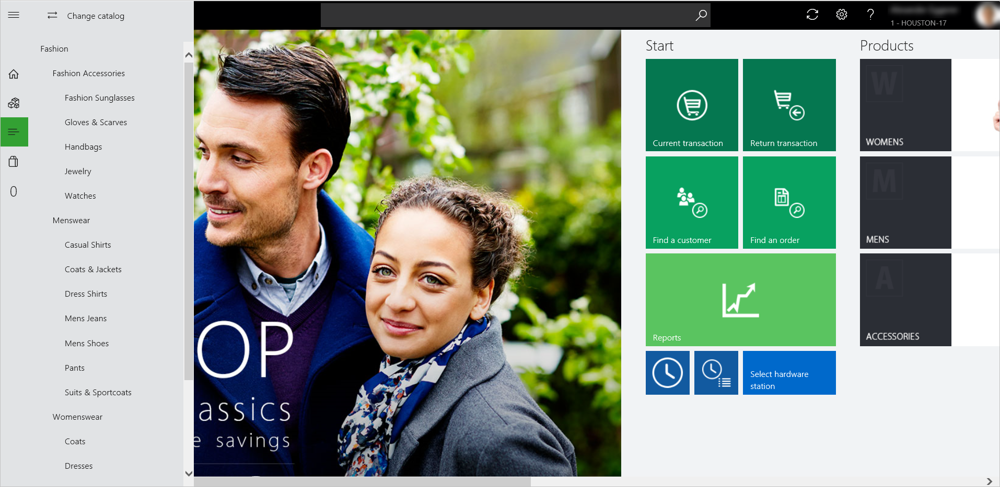
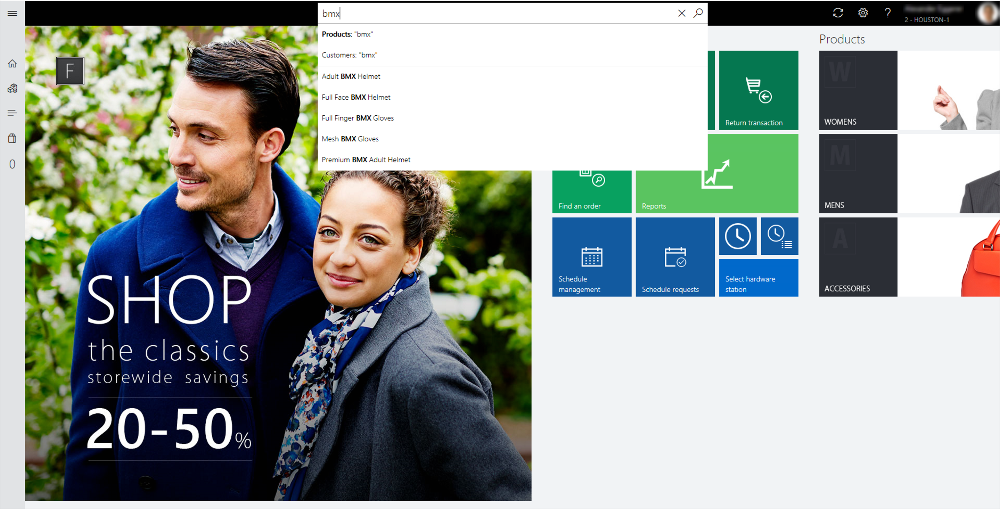

---
# required metadata

title: Product search and customer search in the point of sale (POS)
description: This article provides an overview of improvements that have been made to product and customer search functionality in Microsoft Dynamics 365 Commerce. 
author: ShalabhjainMSFT
ms.date: 08/03/2023
ms.topic: article
audience: Application User, Developer, IT Pro
ms.reviewer: josaw
ms.custom: 141393
ms.search.region: Global
ms.author: shajain
ms.search.validFrom: 2017-06-30

---

# Product search and customer search in the point of sale (POS)

[!include [banner](includes/banner.md)]

This article provides an overview of improvements that have been made to product and customer search functionality in Microsoft Dynamics 365 Commerce.

The Store Commerce app and Store Commerce for web provide easy-to-use search functionality for products and customers. Because the search bar is always present at the top of the Store Commerce app and Store Commerce for web windows, employees can quickly search for products and customers.

Employees can search for products in the assortments and catalogs that are associated with the current store. They can also search in the assortments and catalogs that are associated with any other store in the company. Therefore, cashiers can sell and return products outside the store assortment. Similarly, employees can search for customers who are associated with the current store or any other store in the company. Additionally, employees can search for customers who are associated with a different company in the parent organization.

## Product search

By default, product searches are done on the store assortment. This type of search is known as a *local product search*. However, employees can easily switch to any catalog that is associated with the current store, or they can search in a different store. This type of search is known as a *remote product search*. To change the catalog, select the **Categories** button on the left side of the page. At the top of the pane that appears, select the **Change catalog** button, and then select one of the available catalogs to browse it. The system will search the selected catalog for products.

On the **Change catalog** page, employees can easily select any store, or they can search for products across all stores.

A local product search searches in the following product properties:

- Product number
- Product name
- Description
- Dimensions
- Barcode
- Search name

### Additional local product search capabilities (conventional SQL full-text search) 

- For multiple-keyword searches (that is, for searches that use search terms), retailers can configure whether the search results include results that match *any* search term or only results that match *all* search terms. The setting for this functionality is available in the POS functionality profile, in a new group that is named **Product search**. The default setting is **Match any search term**. This setting is also the recommended setting. When the **Match any search term** setting is used, all products that fully or partially match one or more search terms are returned as results. Those results are automatically sorted in ascending order of products that have the most keyword matches (full or partial).

    The **Match all search terms** setting returns only products that match all the search terms (full or partial). This setting is helpful when the product names are lengthy, and employees want to see only limited products in the search results. However, this type of search has two limitations:

    - The search is done on individual product properties. For example, only products that have all the searched keywords in at least one product property are returned.
    - Dimensions aren't searched.
> [!NOTE]
> The following configurations of **Match any search term**/**Match all search terms** in POS functionality profiles are only applicable for **local** product searches (conventional SQL full-text search) experiences. This configuration has no effect on cloud-powered search experiences. The new search engine has it's own advanced algorithm that powers search relevance for product search results. 

- Retailers can configure product search to show search suggestions as users type product names. A new setting for this functionality is available in the POS functionality profile, in a group that is named **Product search**. The setting is named **Show search suggestions while typing**. This functionality can help employees quickly find the product that they are searching for, because they don't have to type the whole name manually.
- The product search algorithm now also searches for the searched terms in the **Search name** property of the product.

## Additional resources

[Customer search](customer-search.md)

[!INCLUDE[footer-include](../includes/footer-banner.md)]
