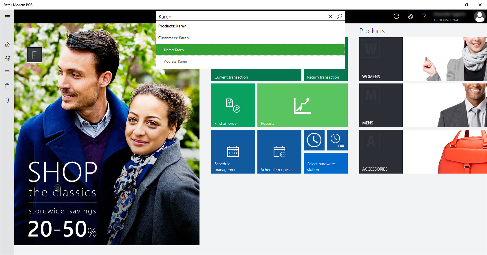

---
# required metadata

title: Product search and customer search in the point of sale (POS)
description: This article provides an overview of improvements that have been made to product and customer search functionality in Microsoft Dynamics 365 Commerce. 
author: ShalabhjainMSFT
ms.date: 01/30/2023
ms.topic: article
ms.prod: 
ms.technology: 

# optional metadata

# ms.search.form: 
# ROBOTS: 
audience: Application user
# ms.devlang: 
ms.reviewer: josaw
# ms.tgt_pltfrm: 
ms.custom: 141393
ms.assetid: 
ms.search.region: Global
ms.search.industry: Retail
ms.author: shajain
ms.search.validFrom: 2017-06-30
ms.dyn365.ops.version: Retail April 2017 update

---

# Product search and customer search in the point of sale (POS)

[!include [banner](includes/banner.md)]

This article provides an overview of improvements that have been made to product and customer search functionality in Microsoft Dynamics 365 Commerce.

The Store Commerce app and Store Commerce for web provide easy-to-use search functionality for products and customers. Because the search bar is always present at the top of the Store Commerce app and Store Commerce for web windows, employees can quickly search for products and customers.

Employees can search for products in the assortments and catalogs that are associated with the current store. They can also search in the assortments and catalogs that are associated with any other store in the company. Therefore, cashiers can sell and return products outside the store assortment. Similarly, employees can search for customers who are associated with the current store or any other store in the company. Additionally, employees can search for customers who are associated with a different company in the parent organization.

## Product search

By default, product searches are done on the store assortment. This type of search is known as a *local product search*. However, employees can easily switch to any catalog that is associated with the current store, or they can search in a different store. This type of search is known as a *remote product search*. To change the catalog, select the **Categories** button on the left side of the page. At the top of the pane that appears, select the **Change catalog** button, and then select one of the available catalogs to browse it. The system will search the selected catalog for products.

On the **Change catalog** page, employees can easily select any store, or they can search for products across all stores.

A local product search searches in the following product properties:

- Product number
- Product name
- Description
- Dimensions
- Barcode
- Search name

### Additional local product search capabilities (conventional SQL full-text search) 

- For multiple-keyword searches (that is, for searches that use search terms), retailers can configure whether the search results include results that match *any* search term or only results that match *all* search terms. The setting for this functionality is available in the POS functionality profile, in a new group that is named **Product search**. The default setting is **Match any search term**. This setting is also the recommended setting. When the **Match any search term** setting is used, all products that fully or partially match one or more search terms are returned as results. Those results are automatically sorted in ascending order of products that have the most keyword matches (full or partial).

    The **Match all search terms** setting returns only products that match all the search terms (full or partial). This setting is helpful when the product names are lengthy, and employees want to see only limited products in the search results. However, this type of search has two limitations:

    - The search is done on individual product properties. For example, only products that have all the searched keywords in at least one product property are returned.
    - Dimensions aren't searched.
> [!NOTE]
> The following configurations of **Match any search term**/**Match all search terms** in POS functionality profiles are only applicable for **local** product searches (conventional SQL full-text search) experiences. This configuration has no effect on cloud-powered search experiences. The new search engine has it's own advanced algorithm that powers search relevance for product search results. 

- Retailers can configure product search to show search suggestions as users type product names. A new setting for this functionality is available in the POS functionality profile, in a group that is named **Product search**. The setting is named **Show search suggestions while typing**. This functionality can help employees quickly find the product that they are searching for, because they don't have to type the whole name manually.
- The product search algorithm now also searches for the searched terms in the **Search name** property of the product.

## Customer search

Customer search is used to find customers for various purposes. For example, cashiers might want to view a customer's wish list or purchase history, or add the customer to a transaction. The search algorithm matches the search terms against the values that are present in the following customer properties:

- Name
- Email address
- Phone number
- Loyalty card number
- Address
- Account number

Among these properties, the name provides the most flexibility for multiple-keyword searches, because the algorithm returns all customers that match any of the searched keywords. The customers that match the most keywords appear at the top of the results. This behavior helps cashiers in situations where they search by typing the full name, but last name and first name were swapped during the initial data entry. However, for performance reasons, all the other properties preserve the order of the search keywords. Therefore, if the order of the search keywords doesn't match the order that the data is stored in, no results will be returned.

By default, a customer search is done on the customer address books that are associated with the store. This type of search is known as a *local customer search*. However, employees can also search for customers globally. In other words, they can search across the stores of the company and across all other legal entities. This type of search is known as a *remote customer search*.

To search globally, employees can select the **Filter results** button at the bottom of the page and then select the **Search all stores** option, as shown in the illustration that follows. In this case, not only customers are returned. All types of parties that are part of any address book in the headquarters are also returned. These parties include workers, vendors, contacts, and competitors.

> [!NOTE]
> A minimum of four characters must be entered for a remote customer search to return results.

The customer ID isn't shown for customers queried from other legal entities, because no customer ID has been created for those parties in the current company. However, if an employee opens the customer details page, the system automatically generates a customer ID for the party and also associates the store's customer address books with the customer. Therefore, the customer will be visible in local store searches that are done later.

### Additional local customer search capabilities

When the user searches for a phone number, the system ignores special characters (such as spaces, hyphens, and brackets) that might have been added when the customer was created. Therefore, cashiers don't have to worry about the phone number format when they search. For example, if a customer's phone number was entered as **123-456-7890**, a cashier can search for the customer by typing **1234567890**, or by entering the first few numbers of the phone number.

> [!NOTE]
> A customer can have multiple phone numbers and multiple emails. The customer search algorithm also searches through these secondary emails and phone numbers, but the customer search results page only displays the primary email and phone number. This may cause some confusion as the returned customer results would not show the searched email or phone number. In a future release we plan to improve the customer search results screen to show this information.

The traditional customer search can be time-consuming, because it searches across multiple fields. Instead, cashiers can search in a single customer property, such as name, email address, or phone number. The properties that the customer search algorithm uses are collectively known as the *customer search criteria*. The system admin can easily configure one or more criteria as shortcuts that will appear in POS. Because the search is limited to a single criterion, only the relevant search results are shown, and the performance is much better than the performance of a standard customer search. The following illustration shows the customer search shortcuts in POS.

To set search criteria as shortcuts, the admin must open the **Commerce parameters** page in Commerce, and then, on the **POS search criteria** tab, select all the criteria that should be shown as shortcuts.

> [!NOTE]
> If you add too many shortcuts, the drop-down menu on the search bar in POS will become cluttered, and the employee's search experience can be affected. We recommend that you add only as many shortcuts as you require.

The **Display order** field determines the order in which shortcuts are shown in POS. The criteria that are shown are the out-of-box properties that the customer search algorithm uses to search customers. However, partners can add custom properties as search shortcuts. To add custom properties as search shortcuts, the system admin must extend the extensible enumeration (enum) that is used for the customer search criteria and then mark the partner's custom properties as shortcuts. Partners are responsible for writing the code to find results when their custom shortcuts are used for searches.

Translations for shortcuts are required if you want shortcuts to be rendered on the POS. If your channel language is different than the system default language, you must define the translation for each shortcut in the expected language. You can define translations by selecting **Translate** for each shortcut. 

> [!NOTE]
> A custom property that is added to the enum doesn't affect the standard customer search algorithm. In other words, the customer search algorithm won't search in the custom property. Users can use a custom property for searches only if that custom property is added as a shortcut, or if the default search algorithm is overridden.

Retailers can also set the default customer search mode in POS to **Search all stores**. This configuration can be helpful in scenarios where customers that were created outside POS must be searched immediately (for example, even before the distribution job is run). To do so, the retailer must turn on the **Default customer search mode** option in the POS functionality profile. Once it is set to **Yes**, every customer search attempt will then make a real-time call to headquarters.

To help prevent unexpected performances issues, this configuration is hidden behind a flighting flag that is named **CUSTOMERSEARCH_ENABLE_DEFAULTSEARCH_FLIGHTING**. Therefore, to show the **Default customer search mode** setting the user interface (UI), the retailer should create a support ticket for its user acceptance testing (UAT) and production environments. After the ticket is received, the engineering team will work with the retailer to make sure that the retailer does testing in its non-production environments to assess the performance and implement any optimizations that are required.

## Cloud-powered customer search

Public preview of the customer search capability using the Azure Cognitive Search service has been released as part of the Commerce 10.0.18 release. In addition to performance improvements, users of the service also benefit from rich refinement and improved relevance capabilities. The performance improvements are especially evident when the global search feature ("Search all stores") of the POS is used. This is because search results are fetched from the Azure search index instead of queried from the data in Commerce headquarters. 

### Enable the cloud-powered search feature

> [!NOTE]
> It is required that both Commerce headquarters and Commerce Scale Unit are updated to version 10.0.18. Updating the POS is not required.

To enable the cloud-powered search feature in Commerce headquarters, follow these steps.

1. Go to **System administration \> Workspaces \> Feature management**.
1. Find and select the **(Preview) Cloud powered customer search** feature, and then select **Enable now**.
1. Go to **Retail and Commerce > Headquarters setup > Commerce scheduler > Initialize commerce scheduler** and select **OK** to display the new **1010_CustomerSearch** job on the **Distribution schedule** form.
1. Go to **Retail and Commerce > Retail and Commerce IT > Distribution schedule**.
1. Run the **1010_CustomerSearch** job. This job publishes the date to the Azure search index. When publishing of the index is completed, the status of the job will be set to **Applied**.
1. After the **1010_CustomerSearch** job status is set to **Applied**, run the **1110 - Global configuration** job to update the POS channels of the newly enabled feature in **Feature management**.
1. Subsequently, run the **1010_CustomerSearch** job at regular intervals to send customer updates to the search index.

> [!NOTE]
> For the initial index publish, the **1010_CustomerSearch** job may take a few hours to complete as it will send all the customer records to the Azure search index. Subsequent updates should take a few minutes. In the time period when the cloud-powered search feature is enabled but the index publishing is not yet completed, the customer search from POS will default to the existing SQL-based search. This ensures that there are no interruptions to store operations.

### Functional differences from the existing search

The following list shows the how the cloud-powered customer search functionality differs from the existing search functionality. 

- Customers created and edited in Commerce headquarters are sent to the Azure search index when the **1010_CustomerSearch** job is run. These updates take a minimum of 15 to 20 minutes to update the index. POS users will be able to search for new customers (or search based on updated information) about 15 to 20 minutes after the updates occur in Commerce headquarters. If your business process requires that customers created in Commerce headquarters are immediately searchable in POS, this might not be the right service for you.
- New customers created in POS are sent to the Azure search index from the Commerce Scale Unit and are immediately searchable across any store. However, if the Async customer creation feature is turned on, new customer records will not be published to the Azure search index from the Commerce Scale Unit and will not be searchable from POS until the customer information is synced with Commerce headquarters and customer IDs are generated for Async customers. The **1010_CustomerSearch** job will then be able to send the Async customer records to the Azure search index. On average, it will be around 30 minutes before newly created Async customers can be searched on POS. This estimate assumes that the **1010_CustomerSearch**, **P-job**, and **Synchronize customers and business partners from async mode** jobs are scheduled to run every 15 minutes.
- Cloud-powered search also searches for the secondary emails and phone numbers of customers, but currently customer search results only display the primary phone number and primary email address of customers. At first glance it may seem that irrelevant search results have been returned, but checking the secondary email and phone number of a customer in search results can help verify if the searched-for keyword resulted in a customer match. To avoid such confusion, there are plans to improve the search results page to make it easy for users to understand why a search result was returned.
- The requirement of searching using at least 4 characters in a global search ("Search all stores") is not applicable to this service.

> [!NOTE]
> The customer search capability using the Azure Cognitive Search service is available in limited regions for preview. The customer search capability is *not* available in the following regions:
> - Brazil
> - India

[!INCLUDE[footer-include](../includes/footer-banner.md)]
