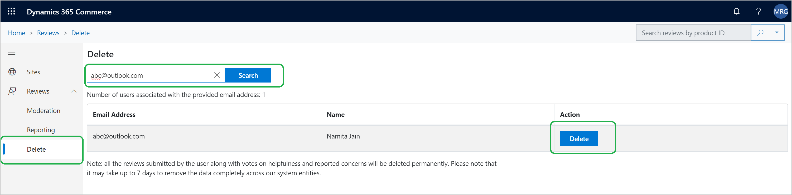

---
# required metadata

 

title: Ratings and Reviews Moderation tool. 
description: This topic explains how to use Ratings and Reviews Moderation tool 
author:  gvrmohanreddy 
manager: JeffBl
ms.date: 08/30/2019
ms.topic: article
ms.prod: 
ms.service: dynamics-365-commerce
ms.technology: 

 

# optional metadata

 

# ms.search.form: 
# ROBOTS: 
audience: Application User
# ms.devlang: 
ms.reviewer: josaw
ms.search.scope: 
# ms.tgt_pltfrm: 
ms.custom: 
ms.assetid: 
ms.search.region: 
ms.search.industry: 
ms.author: gmohanv
ms.search.validFrom: 2019-10-01
ms.dyn365.ops.version: 
---

# Ratings and Reviews  Moderation Overview

Dynamics 365 for Commerce uses Azure Cognitive Service to auto moderate review text on filtering profane words.  Additionally there is review moderation tool, under eCommerce Authoring tool, available for the following actions:

1. Moderate reviews by responding to the review's or take down. 
2. Bulk import reviews data across products, and use Power BI template to analyze ratings and reviews trends.
3. Delete end user's reviews up on a request by C2. 

  
## Reading Reviews 
  
1. Go to [eCommerce Authoring Tools](https://eCommerceAuthoringTool/) . 
2. Click on Reviews in the left nav and click on moderation link. 
3. Search feature at the top of page allows you to filter the reviews by a product or a review text.
4. Additionally there are many filters to see review by duration, rating, takedown, or responded etc. status. 

 

## Respond to a review 
Sometimes end users who purchased product express their satisfaction or dissatisfaction, or may have misunderstanding about a product usage. As a C1's moderator, you can respond to the review that will be visible on the eCommerce website.  Use the following steps to respond to a review. 

1. Go to [eCommerce Authoring Tools](https://eCommerceAuthoringTool/) . 
2. Click on Reviews in the left nav and click on moderation link. 
3. Identify the review that needs a response.
4. In the right panel, provide your response and click Post response button. 

 

## Takedown a review 
When you have a right business justification to takedown a review, use the following steps: 

1. Go to [eCommerce Authoring Tools](https://eCommerceAuthoringTool/) . 
2. Click on Reviews in the left nav and click on moderation link. 
3. Identify the review that needs to be taken down.
4. In the right panel, Select a takedown reason and click on Take down button. 
	
	
## Delete user reviews 
Sometimes end users (c2) wants their ratings and reviews data to be deleted permanently on a given eCommerce website. When C1 receives such a request from C2, Delete reviews feature in Ratings and Reviews moderation tool allows C1's to fulfill C2's request.  C1 will need C2's email address that was used by C2 to sign-in and provided reviews on the given eCommerce website. 

1. Go to [eCommerce Authoring Tools](https://eCommerceAuthoringTool/) . 
2. Click on Reviews in the left nav and then click on Delete link. 
3. Input C2's email address in "Search for users by email address" text box.
4. Click Search button.
5. If specified user has any reviews activity (e.g. Review submission, or voted on helpfulness of other's reviews, or expressed concern on others review) results will show up and gives "Delete" action for C1 to act on.
	
Refer to the following screenshot for more details.  
	
Notes:
1. It may take up to 7 days to remove the data completely across our system entities. C1 should instruct their C2's, those requested data deletion, appropriately.
2. If a user has changed their name, in the account settings, during their tenure on their website, multiple records will show up in the search results.  C1 should click on "Delete" action per each record to delete C2's data completely. 

 

##  Downloading Ratings and Review data
Dynamics 365 Commerce - Ratings and Reviews allows C1's to import bulk data of ratings and reviews for analyzing trends.  There is a PowerBI template, with basic metrics, available for customer to connect the imported bulk data and see a dashboard, without needing to create your own dashboard.  C1 can also enhance the PowerBI template to meet their custom needs. 

1. Go to [eCommerce Authoring Tools](https://eCommerceAuthoringTool/) . 
2. Click on Reviews in the left nav and then click on Reporting link. 
3. Click on "Download reviews data" link to download ratings and reviews bulk data in .csv format and then save to your file location, e.g. c:\reviews\ReviewsData.csv file.

##  Steps to use PowerBI template to view ratings and review trends

1. C1 can also download "Power BI template" to view trends in a dashboard
2. Now Open downloaded Template, It will open in Power BI app. After opening this template it will show "Access to web content." then close this popup, and then close the "Refresh" error message as well.
3. Now go to Home menu, and click on "Edit queries", and then click on "Data source settings".
4. Now on "Data source settings" popup window, click on Change Source there is a url edit box.
5. In the URL text box, give the path of the previously downloaded reviews data, e.g. c:\reviews\ReviewsData.csv file.
6. Now click ok and then click Apply changes 
7.It will take 1-2 minutes to apply the data source, then click on Trends sheet to view ratings and reviews trends.

 
