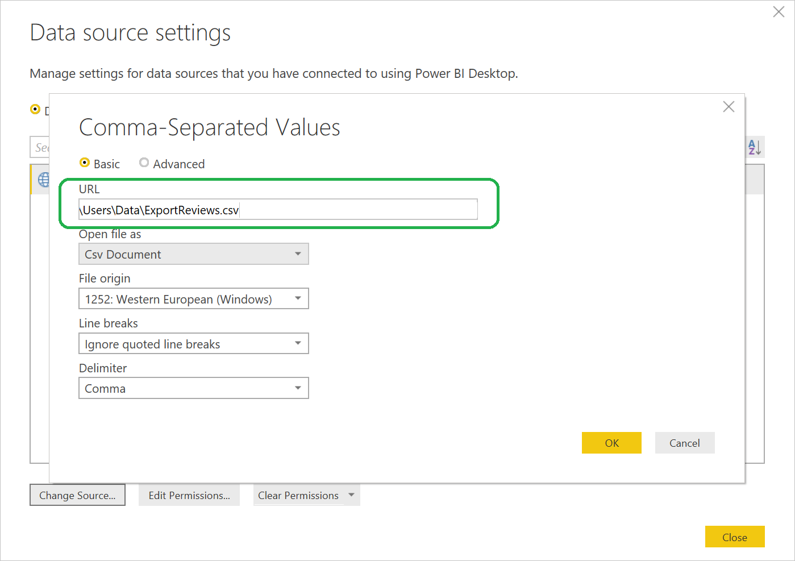
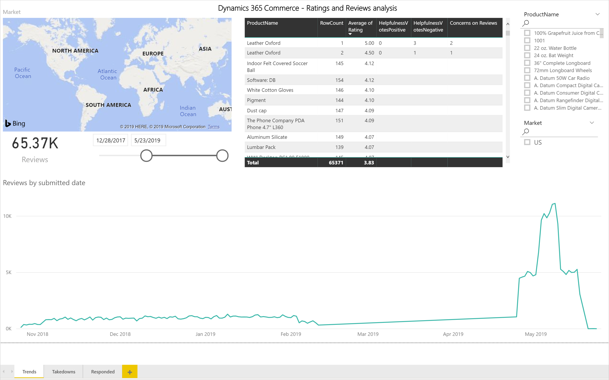

---
# required metadata

title: Manage ratings and reviews 
description: This topic explains how to manage ratings and reviews using the Ratings and Reviews Moderation tool.
author:  gvrmohanreddy 
manager: annbe
ms.date: 10/01/2019
ms.topic: article
ms.prod: 
ms.service: dynamics-ax-retail
ms.technology: 

# optional metadata

# ms.search.form: 
# ROBOTS: 
audience: Application User
# ms.devlang: 
ms.reviewer: v-chgri
ms.search.scope: Operations, Retail, Core
# ms.tgt_pltfrm: 
ms.custom: 
ms.assetid: 
ms.search.region: Global
ms.search.industry: 
ms.author: gmohanv
ms.search.validFrom: 2019-10-01
ms.dyn365.ops.version: Release 10.0.5
---

# Manage ratings and reviews

[!include [banner](../includes/preview-banner.md)]
[!include [banner](../includes/banner.md)]

This topic explains how to manage ratings and reviews using the Dynamics 365 Commerce Ratings and Reviews Moderation tool.

## Overview

Dynamics 365 Commerce uses Azure Cognitive Service to automatically moderate review text by redacting profane words. In addition, the Ratings and Reviews Moderation tool can be used to do the following.

- Moderate reviews by responding to them or taking them down
- Bulk import review data across products into a provided Power BI template and analyze ratings and reviews trends
- Delete a user's reviews after a request by the user

## Reading Reviews 
  
1. Go to **Site Management > Global Settings**.
1. Under **RnR Moderator**, click **Manage**.
1. Search feature at the top of page allows you to filter the reviews by product id, product name, or review text.
1. Additionally, there are filters to limit displayed reviews by time period, rating, channel, or takedown / responded / reported concern status.

 

## Respond to a review 

Sometimes customers who have purchased a product express their satisfaction or dissatisfaction or may have misunderstandings about a product's usage. As a moderator, you can post a response to a review that will display inline with the review on the site. 

To respond to a review, do the following.

1. Go to **Site Management > Global Settings**.
1. Under **RnR Moderator**, click **Manage**.
1. Click to expand the Reviews section in the left navigation menu, then choose the moderation link.
1. Identify the review that needs a response by selecting it in the left panel.
1. In the right panel, provide your response by first clicking “Add a response” button.
1. Type the response text and choose what responder name to show. By default, the response is posted as “Moderator”.
1. Finally, click the “Post response” button.

 

## Take down a review 

Sometimes there is a business justification for a moderator to take down a customer review. 

To take down a review, do the following.

1. Go to **Site Management > Global Settings**.
1. Under **RnR Moderator**, click **Manage**.
1. Click to expand the Reviews section in the left navigation menu, then choose the moderation link.
1. Identify the review that needs a response by selecting it in the left panel.
1. In the right panel, select a takedown reason and click on Take down button.
	
## Delete a customer's reviews on request 

Sometimes customers want their ratings and reviews data to be permanently deleted from an e-Commerce website. When a moderator receives a removal request from a customer, they can remove the customer's data by using the Delete reviews feature. To locate users, the email address the customer used to sign-in and provide reviews is required. 

To locate and delete user data, do the following.

1. Go to [eCommerce Authoring Tools](https://eCommerceAuthoringTool/) . 
2. Click on Reviews in the left nav and then click on Delete link. 
3. Input C2's email address in "Search for users by email address" text box.
4. Click Search button.
5. If specified user has any reviews activity (e.g. Review submission, or voted on helpfulness of other's reviews, or expressed concern on others review) results will show up and gives "Delete" action for C1 to act on.
6. C1 will be prompted for confirmation, "Are you sure you want to delete?" with Yes and No options. 
	
Refer to the following screenshot for more details.  
	
Notes:
1. It may take up to 7 days to remove the data completely across our system entities. C1 should instruct their C2's, those requested data deletion, appropriately.
2. If a user has changed their name, in the account settings, during their tenure on their website, multiple records will show up in the search results.  C1 should click on "Delete" action per each record to delete C2's data completely. 

 

##  Downloading Ratings and Review data
Dynamics 365 Commerce - Ratings and Reviews allows C1's to import bulk data of ratings and reviews for analyzing trends.  There is a PowerBI template, with basic metrics, available for customer to connect the imported bulk data and see a dashboard, without needing to create your own dashboard.  C1 can also enhance the PowerBI template to meet their custom needs. 

1. Go to [eCommerce Authoring Tools](https://eCommerceAuthoringTool/) . 
2. Click on Reviews in the left nav and then click on Reporting link. 
3. Click on "Download reviews data" link to download ratings and reviews bulk data in .csv format and then save to your file location, e.g. c:\reviews\ReviewsData.csv file.

##  Steps to use PowerBI template to view ratings and review trends

1. C1 can also download "Power BI template" to view trends in a dashboard
2. Now open the downloaded Template, it will open in Power BI app. After opening this template it will show "Access to web content." then close this popup, and then close the "Refresh" error message as well.
3. Now go to Home menu, and click on "Edit queries", and then click on "Data source settings".
4. Now on "Data source settings" popup window, click on Change Source there is a url edit box.
5. In the URL text box, give the path of the previously downloaded reviews data, e.g. c:\reviews\ReviewsData.csv file.
6. Now click ok and then click Apply changes 
7.It will take 1-2 minutes to apply the data source, then click on Trends sheet to view ratings and reviews trends.

Refer to the following screenshots for more details:

 
 
 
