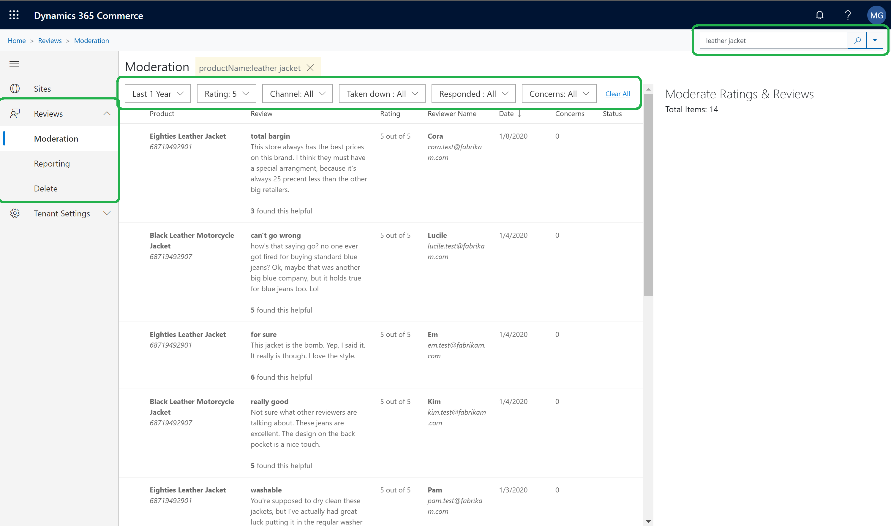

---
# required metadata

 

title: Ratings and Reviews Moderation tool. 
description: This topic explains how to use Ratings and Reviews Moderation tool 
author:  gvrmohanreddy 
manager: JeffBl
ms.date: 08/30/2019
ms.topic: article
ms.prod: 
ms.service: dynamics-365-commerce
ms.technology: 

 

# optional metadata

 

# ms.search.form: 
# ROBOTS: 
audience: Application User
# ms.devlang: 
ms.reviewer: josaw
ms.search.scope: 
# ms.tgt_pltfrm: 
ms.custom: 
ms.assetid: 
ms.search.region: 
ms.search.industry: 
ms.author: gmohanv
ms.search.validFrom: 2019-10-01
ms.dyn365.ops.version: 
---

# Ratings and Reviews  Moderation Overview

Dynamics 365 for Commerce uses Azure Cognitive Service to auto moderate review text on filtering profane words.  Additionally there is review moderation tool, under eCommerce Authoring tool, available for the following actions:

  
	1. Moderate reviews by responding to the review's or take down. 
	2. Bulk import reviews data across products, and use Power BI template to analyze ratings and reviews trends.
	3. Delete end user's reviews up on a request by C2. 

  
## Reading Reviews 
  
	1. Go to [eCommerce Authoring Tools](https://eCommerceAuthoringTool/) . 
	2. Click on Reviews in the left nav and click on moderation link. 
	3. Search feature at the top of page allows you to filter the reviews by a product or a review text.
	4. Additionally there are many filters to see review by duration, rating, takedown, or responded etc. status. 

 

## Respond to Reviews 
Sometimes end users who purchased product express their satisfaction or dissatisfaction, or may have misunderstanding about a product usage. As a C1's moderator, you can respond to the review that will be visible on the eCommerce website.  Use the following steps to respond to a review. 

	1. Go to [eCommerce Authoring Tools](https://eCommerceAuthoringTool/) . 
	2. Click on Reviews in the left nav and click on moderation link. 
	3. Identify the review that needs a response.
	4. Additionally there are many filters to see review by duration, rating, takedown, or responded etc. status. 

 

