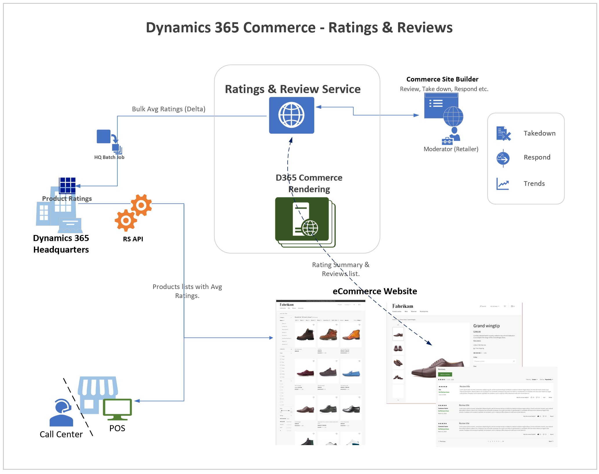

---
# required metadata
title: Ratings and Reviews Overview 
description: This topic explains ratings and reviews in Dynamics 365 Commerce. 
author:  gvrmohanreddy 
manager: annbe
ms.date: 08/30/2019
ms.topic: article
ms.prod: 
ms.service: dynamics-365-commerce
ms.technology: 

 

# optional metadata

 

# ms.search.form: 
# ROBOTS: 
audience: Application User
# ms.devlang: 
ms.reviewer: josaw
ms.search.scope: 
# ms.tgt_pltfrm: 
ms.custom: 
ms.assetid: 
ms.search.region: 
ms.search.industry: 
ms.author: gmohanv
ms.search.validFrom: 2019-10-01
ms.dyn365.ops.version: 
---

# Ratings and reviews

Ratings and reviews are crucial for consumers to understand how a product is perceived by fellow consumers and they help consumers make a purchase decision. Ratings and reviews in Dynamics 365 Commerce allow retailers to capture reviews along with a rating for a product from consumers and show the average ratings and reviews information across an e-Commerce website. 

Average ratings information is displayed in point of sale (POS) and call center channels so that sales associates can help end users make decisions. Retailers also can use ratings and reviews as a feedback mechanism to improve the quality of a product and thus improve sales.

## Architecture

In Commerce, the ratings and reviews solution is an omni-channel solution, and is available natively as part of the e-Commerce platform. The ratings and reviews solution is built on top of Azure, which provides high scalability and reliability. 

Consumers who purchase products online can directly consume ratings and reviews to evaluate a product and provide a review after purchasing a product. Sales associates in physical stores or in a call center can use the ratings and reviews to help customers, as the information is also available in those channels. 

## Value Proposition

1.	Ratings and Review is an integrated solution and offered natively within D365 for Commerce platform. This helps associating ratings information with product information, searching indexing, and eliminates lazy loading ratings information on eCommerce webpages. 
2.	Ratings and Reviews is an Omni-channel solution to help consumers (C2) in making purchase decisions, directly on online channels, and indirectly, via sales associates, in retail stores and call center channels.  
3.	Ratings and Reviews, part of Dynamics 365 Commerce, offers Competitive pricing advantage (needs work)
4.	Ratings and Reviews offers auto moderation on profane words (in 40 languages) by using Azure Cognitive Services, prevents waiting for human approval and also reduces moderation cost. 
5.	Ratings and Reviews offers moderator tools to respond to end users concerns, feedback, or take down, and address any data requests from end users.  
6.	Ratings and Reviews provides UX widgets to show ratings summary in product lists, search results, product details page etc. places, and to show complete reviews list along with sort and filters options, on an E-Commerce website that is hosted on Dynamics 365 Commerce.  
7.	Ratings and Reviews offers a Power BI template with set of metrics to give insights around Ratings and Reviews. Customers can export  ratings and reviews full data for further analysis.  

##  

## Feature documentation 

This section explains how to opting  in for Ratings and Reviews feature, configure rendering modules on a website and ingest the data into Dynamics 365 headquarters and surface ratings into omni-channel like POS and Call-center.

1. [Opting in for Ratings and Reviews features.](https://docs.microsoft.com/en-us/dynamics365/)

2. [Configuring eCommerce site and pages with Ratings and Reviews.](https://docs.microsoft.com/en-us/dynamics365/)

3. [Configuring Headquarters to ingest Product Ratings.](https://docs.microsoft.com/en-us/dynamics365/)

4. [Enabling Ratings and POS and Call-center channels.](https://docs.microsoft.com/en-us/dynamics365/)
