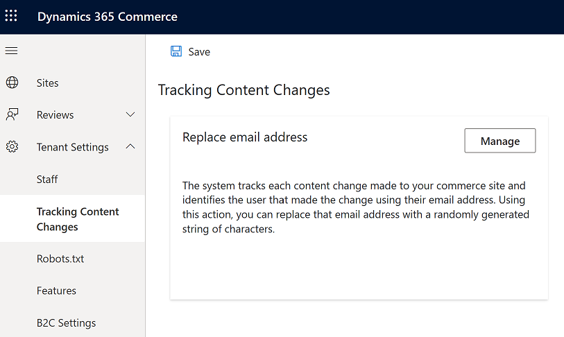

---
# required metadata

title: Replace user IDs for tracked content changes
description: This topic describes how to replace user IDs for tracked content changes within Microsoft Dynamics 365 Commerce site builder change tracking logs.
author: BrianShook
manager: annbe
ms.date: 04/20/2020
ms.topic: article
ms.prod: 
ms.service: Dynamics365Operations
ms.technology: 

# optional metadata

# ms.search.form: 
audience: Developer
# ms.devlang: 
ms.reviewer: v-chgri
ms.search.scope: Retail, Core, Operations
# ms.tgt_pltfrm: 
ms.custom: 
ms.assetid: 
ms.search.region: Global
# ms.search.industry: 
ms.author: brshoo
ms.search.validFrom: 2020-04-13
ms.dyn365.ops.version: 

---

# Replace user IDs for tracked content changes

This topic describes how to replace user IDs for tracked content changes within Microsoft Dynamics 365 Commerce site builder change tracking logs.

## Overview

In Dynamics 365 Commerce, the site builder authoring tools track changes made to items within the Content Management System (CMS). This allows for display of history of changes made to documents which helps teams track their efforts when collaborating on content. The system utilizes the User IDs within the underlying Identity management system, Azure Active Directory (AAD). These user IDs are also the issued email addresses within the Active Directory. A Commerce System Administrator can replace the ID reference within the history logs by using a feature within the site builder tool.

## Replace a user ID in site builder

To replace a specific user ID or issued email address, follow these steps.

1. Navigate to **Home** in site builder.
1. Open the **Tenant Settings** menu and select **Tracking Content Changes**

    

1. Select **Manage** to manage the user IDs.
1. Enter the user ID email address to be removed from tracking logs, and then select **Replace** once entered. Multiple entries can be entered to be replaced.

    

1. Select **OK**, and then select **Save** in the **Tracking Content Changes** window.

A dialog box will appear to indicate that the records for the email address provided have been updated. 

> [!NOTE]
> The system replaces the email address with a randomly-generated string to remove all CMS references of the email address that was entered. This action only affects the history logs referenced within the specific Commerce > e-Commerce environment (tenant) which the site builder instance is associated.

## Additional resources

[Compliance overview](compliance-overview.md)

[Accessibility features and capabilities](accessibility.md)

[Cookie compliance](cookie-compliance.md)

[Add a privacy policy page](add-privacy-page.md)
