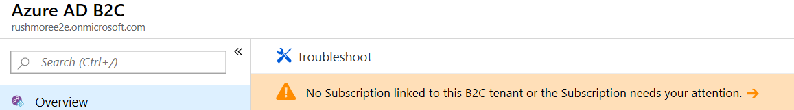
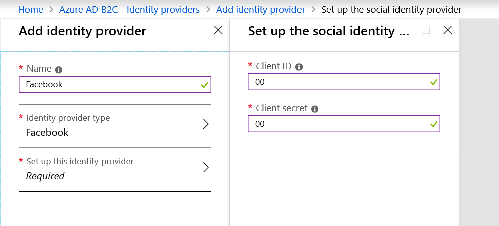
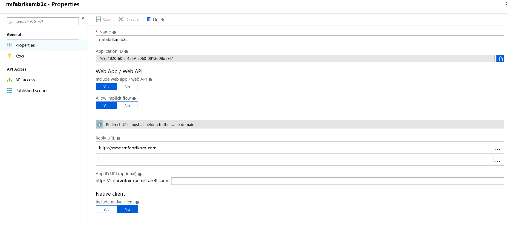

---
# required metadata

title: Set Up an AAD B2C tenant in Commerce
description: This topic describes how to set up your Azure Active Directory (AAD) business-to-consumer (B2C) tenants for user site authentication in Dynamics 365 Commerce.
author: BrianShook
manager: annbe
ms.date: 02/13/2020
ms.topic: article
ms.prod: 
ms.service: dynamics-365-commerce
ms.technology: 

# optional metadata

ms.search.form:  
audience: Application User
# ms.devlang: 
ms.reviewer: v-chgri
ms.search.scope: 
# ms.tgt_pltfrm: 
# ms.custom: 
ms.search.region: Global
ms.search.industry: retail
ms.author: BriShoo
ms.search.validFrom: 2020-02-13
ms.dyn365.ops.version: 

---

# Set up an AAD B2C tenant in Commerce

[!include [banner](includes/banner.md)]

This topic describes how to set up your Azure Active Directory (AAD) business-to-consumer (B2C) tenants for user site authentication in Dynamics 365 Commerce.

This topic covers the setup and configuration of your Azure Active Directory B2C tenant and utilizing it in your Dynamics 365 Commerce solution. You will learn how to create your Azure AD (AAD) B2C tenant in the Azure Portal as well as configure the tenant to for your Commerce environment.

## Overview

Dynamics 365 Commerce uses Azure Active Directory (AAD) B2C to support user credential and authentication flows. A user can sign up, sign in, and reset their password through these flows. AAD B2C stores sensitive user authentication information, such as username and password. The user record in the B2C tenant will store either a B2C local account record or a B2C social identity provider record. These B2C records will link back to the customer record in the Commerce environment.

## Create or link to an existing AAD B2C tenant in the Azure portal

1. Sign in to the [Azure portal](https://portal.azure.com/).
1. From the Azure portal menu, select **Create a resource**. Be sure to use the subscription and directory that will be connected with your Commerce environment.

    

1. In the **Search the Marketplace** toolbar, search for "B2C." Or, navigate to **Identity \> Azure Active Directory B2C**.
1. Once on the **Create New B2C Tenant or Link to existing Tenant** page, use one of the options below that best suits your company's needs:

    - **Create a new Azure AD B2C Tenant**: Use this option to create a new AAD B2C tenant.
	1. Select **Create a new Azure AD B2C Tenant**.
	1. Under **Organization name**, enter the organization name.
	1. Under **Initial domain name**, enter the initial domain name.
	1. In the **Country or region** drop down menu, select the country or region.

     

     - **Link an existing Azure AD B2C Tenant to my Azure subscription**: Use this option if you already have an AAD B2C tenant you want to link to.
	 1. Select **Link an existing Azure AD B2C Tenant to my Azure subscription**.
         1. In the **Azure AD B2C Tenant** drop down menu, select the appropriate B2C tenant. If the message "No eligible B2C Tenants found" appears in the selection box, you do not have an existing eligible B2C tenant and will need to create a new one.

    

1. Once the new AAD B2C directory is created (this may take a few moments), a link to the new directory will appear on the dashboard.

    

This link will direct you to the “Welcome to Azure Active Directory B2C” page.

    > [!NOTE]
    > If you have multiple subscriptions within your Azure account or have set up the B2C tenant without linking to an Active subscription, a Troubleshoot banner will direct you to link the tenant to a Subscription.

The link will provide the following options:

For example, to switch directories to the location of your target Azure subscription, click on your Account Icon and within the menu, select ‘Switch directory’

1. Navigate back to your main Azure directory.
1. Search “b2c” and select “Azure Active Directory B2C” under the ‘Marketplace’ results offered
1. This navigates back to the “Create New B2C Tenant or Link to existing Tenant” page. From here, select the ‘Link an existing Azure AD B2C Tenant to my Azure subscription’.
The newly created B2C Tenant instance should now show as an option in the ‘Azure AD B2C Tenant’ selection bar
1. Finalize the remaining required fields, selecting the ‘Subscription’, ‘Resource group’ (select or create new), and ‘Resource group location’ items.
1. Click ‘Create’ to create the link between the new B2C tenant and the existing Azure Subscription
1. Navigate back to your B2C tenant (Switch Directory and return to your B2C Directory)

## Create the B2C application

Now that the B2C Tenant is created, you will create a B2C Application within the tenant to interact with the Commerce actions.

1. Select “applications” and “Add”

2. Enter the following:

- ‘Name’ of the desired Azure AD B2C Application

- Set ‘Web App/Web API’ to “yes”

- Set ‘Allow implicit flow’ to “yes” (default)

- Add your dedicated ‘Reply URL’ (example: https://www.fabrikam.com)

- The ‘Reply URL’s are important as they allow a whitelist of the return domains when your site calls AAD B2C to authenticate a user- allowing the return of the authenticated user back to the domain from which they are logging in (your site domain). For the Reply URL field, you will add lines for both your site domain (example value only: ‘https://www.(yoursitedomain).com’) and, once your environment is provisioned, the Dynamics generated URL, each as a separate line. Use the same pattern and format for both URLs (for example, 'https://www.(domain).com' and 'https://www.(DynamicsGenerateddomain).com' … no additional “/” layers should be added at the end, nor additional folders. **Additionally**, add a trailing "/_msdyn365/authresp" to these URLs. These lines must always be supplied in a valid URL format.

	Example Reply URL Lines in B2C App Properties:
	- https://fabrikam.com/_msdyn365/authresp
	- https://fabrikam-prod.commerce.dynamics.com/_msdyn365/authresp

- Set ‘Native Client’ to “no” (default)

 

3. Click “Create”

## Create the user flows

User flows are the policies AAD B2C uses to provide secure Sign in, Sign up, Edit Profile, and Forget Password end user experiences. Dynamics 365 Commerce uses these flows to perform the policy actions to interact with the AAD B2C tenant. When an end user interacts with these policies, they are redirected to the AAD B2C tenant to perform the actions.

You may use the default user flows provided by AAD, which will display a templated page hosted by AAD B2C. Or, you may create an HTML page that you may provide in the policy to reference to control the look and feel of these user flow experiences. 

To customize the user policy pages for Dynamics 365 Commerce, refer to the [Custom Page User Logins Documentation](https://docs.microsoft.com/en-us/dynamics365/commerce/custom-pages-user-logins). Also be sure to check out the [Customize the interface of user experiences in AAD B2C](https://docs.microsoft.com/en-us/azure/active-directory-b2c/tutorial-customize-ui) tutorial for additional information.

 

To create default user policies:

1. Go to the ‘User flows (policies)’ menu-item in the Azure AD B2C – User flows (policies) page 
   

2. Select ‘New User Flow’

3.  There are three basic flows offered:
    1.  Sign up and sign in
    2.  Profile editing
    3.  Password reset
        

**The following steps will walk through setting each up for the Dynamics 365 Commerce project:**

**Sign up and sign in**

1. Select ‘Sign up and sign in’

2. Enter a policy ‘Name’. This will show later with the prefix the portal assigns (ex: ‘B2C_1_’…)

3. Enable Identity Providers (checkbox)

4. Choose if your company will enforce Multifactor Authentication. If so, enable ‘Multifactor Authentication’ in the menu

5. Select ‘User attributes and claims’

**Important**: e-Commerce requires the following default options:

| **Collect  attribute** | **Return  claim** |
| ---------------------- | ----------------- |
|                        | Email Addresses   |
| Given Name             | Given Name        |
|                        | Identity Provider |
| Surname                | Surname           |
|                        | User’s Object ID  |

 

 

6. Click “Create”

7. Click the newly selected to verify

8. Select “Run user flow” to view the login ‘domain’ for the policy, under the **select domain** header. (ex: fabrikam.b2clogin.com’. 

9. Close tab
   

**Profile Editing**

1. In ‘Create a user flow’, select ‘profile editing’

1. Enter a “Name” for your ‘Profile editing’ profile

2.  Ensure the “Local Account SignIn” is selected

3. For ‘User attributes’, select:
   1.  Email Addresses (‘Return claim’ only)
   2.  Given Name (‘Collect attribute’ and ‘Return claim’)
   3.  Identity Provider (‘Return claim’ only)
   4. Surname (‘Collect attribute’ and ‘Return claim’)
   5. User’s Object ID (‘Return claim’ only)

4. Click “Create”

 

**Password Reset**

1.   In ‘Create a user flow’, select the ‘Password Reset’

 

2.  Enter a “Name” for your ‘Password reset’ profile

3.  Select ‘Reset password using email address’

4.  Click “Create”

5.  Navigate to “Application claims”. Select:
	1. Email 
	2. Addresses
	3. Given Name
	4. Surname
	5. User’s Object ID

6.  Click “Save”

 

## Add Social Identity Providers (Optional)

 Identity Providers allow for users to utilize their own social accounts as the authentication protocol. Adding multiple identity provider logins are optional for Dynamics 365 Commerce. 

If not added, the default Azure AD B2C profiles will be the main profiles for your userbase. Users will select their own username (email address of their preference) and set a password. Azure AD B2C will perform the direct authentication of the user. 

If a user utilizes one of the Identity Providers you choose to offer below; an entity is still created in the Azure AD B2C tenant- but Azure AD B2C will authenticate the user’s login against the Identity Provider.

**NOTE**: The Identity Provider login creates a record in the B2C Tenant; but in a different format (as it will call the external Social Identity Provider reference for authentication). The end user can use the same email address across Social Identity Providers, meaning the email username for logins may not be unique to the tenant (AAD B2C will enforce unique email only on the B2C Local accounts).

To set up a Social Identity Provider:  

1. Go to Identity Providers

2. Add (directs to ‘Add identity provider’ screen):

   - Name (this name will be displayed to end users in your sign-in sign-up screen)

   - Select the ‘Identity provider type’ from the Social Identity Providers menu provided

   - Click “Ok”

	-  Go to the Identity Provider’s portal and set up an Identity Provider application as instructed in the Azure AD B2C Documentation for the Identity Provider you are adding. Links on Azure AD B2C Documentation for each supported are found here:

		- [Amazon](https://docs.microsoft.com/en-us/azure/active-directory-b2c/active-directory-b2c-setup-amzn-app)
		- [Azure AD (Single Tenant)](https://docs.microsoft.com/en-us/azure/active-directory-b2c/active-directory-b2c-setup-oidc-azure-active-directory)
		- [Microsoft Account](https://docs.microsoft.com/en-us/azure/active-directory-b2c/active-directory-b2c-setup-msa-app)
		- [Facebook](https://docs.microsoft.com/en-us/azure/active-directory-b2c/active-directory-b2c-setup-fb-app)
		- [GitHub](https://docs.microsoft.com/en-us/azure/active-directory-b2c/active-directory-b2c-setup-github-app)
		- [Google](https://docs.microsoft.com/en-us/azure/active-directory-b2c/active-directory-b2c-setup-goog-app)
		- [LinkedIn](https://docs.microsoft.com/en-us/azure/active-directory-b2c/active-directory-b2c-setup-li-app)
		- [OpenID Connect](https://docs.microsoft.com/en-us/azure/active-directory-b2c/active-directory-b2c-setup-oidc-idp)
		- [Twitter](https://docs.microsoft.com/en-us/azure/active-directory-b2c/active-directory-b2c-setup-twitter-app)
  -  Now select the Identity provider’s portal and “Set up the social identity provider”

 

*Be sure to use the ‘Client ID’ and ‘Client secret’ as obtained in the above setup steps per identity provider chosen

 

3. Attach User Flow for sign in sign up policies

 

-  Navigate to **Azure AD B2C – User flows (policies) > {your sign-in sign-up policy} > Identity providers**

- Select each “Identity Provider” that you have set up for your account

- You may choose to test by clicking “Run user flow”. A new tab will display the login page with the new Identity Provider selection box shown:

## Update headquarters with the new AAD B2C information

Once the above AAD B2C provisioning steps are completed, the AAD B2C application must be registered in your Dynamics environment.

In Dynamics, navigate to **Retail>Shared Parameters**

**Under <u>Identity Provider</u>:**

- **Issuer: <***get Issuer from the directions below***>**

**Step 1:** Create meta data address with B2C tenant and policy: https://<<B2CTENANTNAME>>.b2clogin.com/<<B2CTENANTNAME>>.onmicrosoft.com/v2.0/.well-known/openid-configuration?p=<<B2CSIGN-INPOLICY>>

 

**Step 2**: Access metadata address in the browser like [https://d365plc.b2clogin.com/d365plc.onmicrosoft.com/v2.0/.well-known/openid-configuration?p=B2C_1_signinup](https://nam06.safelinks.protection.outlook.com/?url=https%3A%2F%2Fd365plc.b2clogin.com%2Fd365plc.onmicrosoft.com%2Fv2.0%2F.well-known%2Fopenid-configuration%3Fp%3DB2C_1_signinup&data=02|01|brshoo%40microsoft.com|ce8f344e4b574c6f228708d7413d9c24|72f988bf86f141af91ab2d7cd011db47|1|0|637049605174233576&sdata=nqmbbPG3UUeLhCeCZ%2B5Ec6z%2BNi2H9bIJBXouPVZj5ww%3D&reserved=0)

**Step 3**: Copy issuer url

- **Name:** Enter a name value for your issuer record for the Identity Providers table

- **Type:** Azure AD B2C (id_token)

Example Identity provider: https://login.fabrikam.com/073405c3-0113-4f43-b5e2-df01266e24ae/v2.0/

 

**Under <u>Relying Parties</u>**

·    **ClientID**: Set the Client ID as the B2C Application Id (Navigate to your Azure AD B2C – Applications page in the Azure Portal, select ‘Applications’ in the menu, and use the shown Application ID for the B2C application shown). 

Example B2C Application Id: 5f63f50d-d7e7-4a4e-8534-e87599fc0fd9

·    **Type**: Public

·    **User Type**: Customer

 

Additionally, users must **Disable Manual Number Sequence generation**.

## Additional B2C Information

#### Customer Migration

If considering migrating customer records from a previous Identity Provider platform, please work with the Dynamics 365 Commerce team to review your customer migration needs.

Additional AAD B2C documentation on customer migration can be found here: [Customer Migration](https://docs.microsoft.com/en-us/azure/active-directory-b2c/active-directory-b2c-user-migration)

#### Custom Policies

For additional information regarding Customizing AAD B2C interactions and policy flows beyond what is offered by B2C standard policies, explore **Custom Policies** and related articles in the AAD B2C Documentation: [Custom policies](https://docs.microsoft.com/en-us/azure/active-directory-b2c/active-directory-b2c-overview-custom). 

#### Secondary Admin

In the Users section of your B2C tenant; a secondary admin account can be established (optional). This can be a direct account or a general account as needed. If needing to share an account across team resources, a common account can also be created- due to sensitivity of the data stored in AAD B2C- a common account should be monitored closely per your company's security practices.

#### b2clogin.com

Utilize the default ‘b2clogin.com’ domain (default). This part of the URL will be shown for login or reply URLs; viewable in the browser by users.

## Providing Commerce with the B2C Application Information

Once Setup of the Azure AD B2C Tenant is complete, provide the Commerce Team with the below details. These data points collected will be used in LCS when provisioning your environment.

Navigate to the “Properties” section of your B2C Application. If needed, use the top search bar in the portal to search Azure AD B2C, select the result for your domain, and go to “Applications”.

Select the Application and then go to the “Properties” tab for the Application details.

 

B2C Application ID is the Application ID of the B2C application created in your B2C tenant per the above steps. (Note: In HQ, 

Collect the set Reply URL also:

 

In your B2C Tenant, collect the names of each policy created for User flows to provide to the Commerce Team:

 

<u>Example Data Only</u>: Provide the following data points to Commerce (in the future, this information will be entered via LCS):

- **b2cLoginCustomDomain**: "d365ecom.b2clogin.com"
- **b2cTenantName**: "d365ecom"
- **b2c Application ID**: "22290eb2-c52e-42e9-8b35-a2b0a3bcb9e6"
- **b2cReplyUrl**: "https://prod.fabrikam.com"
- **b2cEditProfilePolicyId**: "B2C_1A_ProfileEdit"
- **b2cSignUpSignInPolicyId**: "B2C_1A_signup_signin"
- **b2cResetPasswordPolicyId**: "B2C_1A_PasswordReset"

## Additional resources

[Configure your domain name](configure-your-domain-name.md)

[Deploy a new e-Commerce site](deploy-ecommerce-site.md)

[Create an e-Commerce site](create-ecommerce-site.md)

[Associate an online site with a channel](associate-site-online-store.md)

[Manage robots.txt files](manage-robots-txt-files.md)

[Set up custom pages for user logins](custom-pages-user-logins.md)

[Add support for a content delivery network (CDN)](add-cdn-support.md)

[Enable location-based store detection](enable-store-detection.md)
