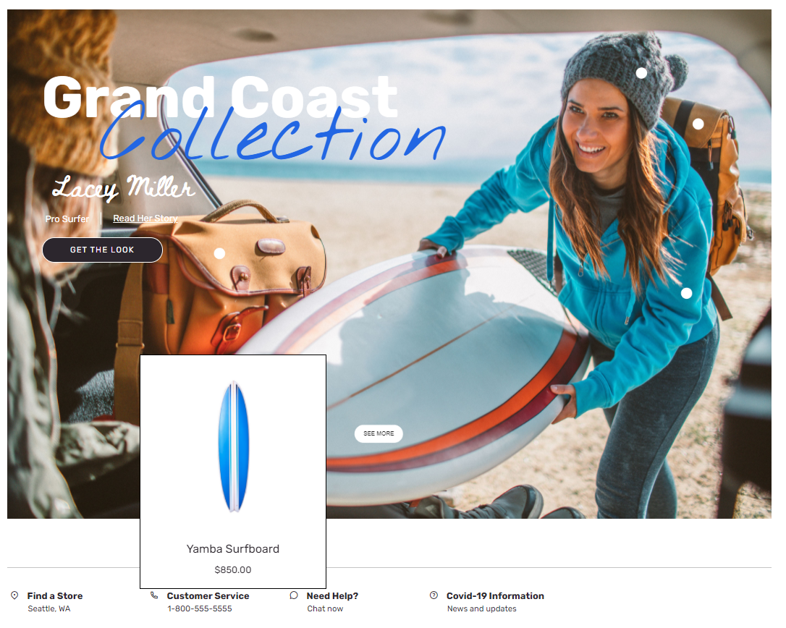

---
# required metadata

title: Active image module
description: This topic covers active image modules and describes how to add them to site pages in Microsoft Dynamics 365 Commerce.
author: anupamar-ms
ms.date: 07/08/2021
ms.topic: article
ms.prod: 
ms.technology: 

# optional metadata

ms.search.form: 
audience: Application User
# ms.devlang: 
ms.reviewer: v-chgri
# ms.tgt_pltfrm: 
# ms.custom: 
ms.search.region: Global
ms.search.industry: 
ms.author: anupamar
ms.search.validFrom: 2019-10-31
ms.dyn365.ops.version: Release 10.0.8

---
# Active image module

[!include [banner](includes/banner.md)]

This topic covers active image modules and describes how to add them to site pages in Microsoft Dynamics 365 Commerce.

An active image module can be used to embed product tags in an image. E-commerce site users can then hover over the tags to preview products that are shown in the image. The previews are shown in pop-up windows. By selecting a preview pop-up window, users can go directly to the product details page (PDP) for the corresponding product.

The tags are defined by using X and Y coordinates on the image. Each tagged point should be configured with the product ID of the product that is shown in the image.

The following illustration shows an example of a preview pop-up window on a hero image on the Adventure Works home page.

> [!IMPORTANT]
> - The active image module is available as of the Dynamics 365 Commerce version 10.0.20 release.
> - The active image module is showcased in the Adventure Works theme.

## Active image module properties

| Property name      | Values | Description |
|--------------------|--------|-------------|
| Image              | Image file | An image can be used to showcase one or more products. The image can be uploaded to the Media Library in Commerce site builder, or an existing image can be used. |
| Width              | Number of pixels | This property defines the width of the image. The active coordinates are calculated based on the width of the image.|
| Active coordinates | X and Y coordinates, and a product ID number | Each active image array consists of X and Y coordinates, and a product ID number.|
| Heading            | Heading text and heading tag (**H1**, **H2**, **H3**, **H4**, **H5**, or **H6**) | By default, the **H2** heading tag is used for the heading, but the tag can be changed to meet accessibility requirements. |
| Paragraph          | Paragraph text | The module supports paragraph text in rich text format. Some basic rich text capabilities are supported, such as hyperlinks, and bold, underlined, and italic text. Some of these capabilities can be overridden by the page theme that is applied to the module. |
| Link               | Link text, link URL, Accessible Rich Internet Applications (ARIA) label, and **Open link in new tab** selector | The module supports one or more "call to action" links. If a link is added, link text, a URL, and an ARIA label are required. ARIA labels should be descriptive, to meet accessibility requirements. Links can be configured so that they are opened on a new tab. |
| Sub text           | Heading, text, and links | Additional context for the image can be added, such as an author or designer name, or links to personal blogs.|
| Text theme         | **Light** or **Dark** | This property lets a user set the text to light or dark, based on the background image. It's available as a theme extension in the Adventure Works theme. |

## Add an active image module to a new page

To add an active image module to a new page and set the required properties, follow these steps.

1. Go to **Templates**, and open the marketing template for your site's home page (or create a new marketing template).
1. In the **Main** slot of the default page, select the ellipsis (**...**), and then select **Add Module**.
1. In the **Add Module** dialog box, select the **Active image** module, and then select **OK**.
1. Select **Save**, select **Finish editing** to check in the template, and then select **Publish** to publish it.
1. Go to **Pages**, and open the site's home page (or create a new home page by using the marketing template).
1. In the **Main** slot of the default page, select the ellipsis button (**...**), and then select **Add Module**.
1. In the **Add Module** dialog box, select the **Active image** module, and then select **OK**.
1. In the property pane of the active image module, add an image, and set the canvas width to the size of the image.
1. Set the X and Y coordinates, and add the appropriate product ID number.
1. Add and configure additional active image modules as you require.
1. Select **Save**, and then select **Preview** to preview the page.
1. Select **Finish editing** to check in the template, and then select **Publish** to publish it.

## Additional resources

[Module library overview](starter-kit-overview.md)

[Adventure Works theme](adventure-works-theme.md)

[!INCLUDE[footer-include](../includes/footer-banner.md)]
