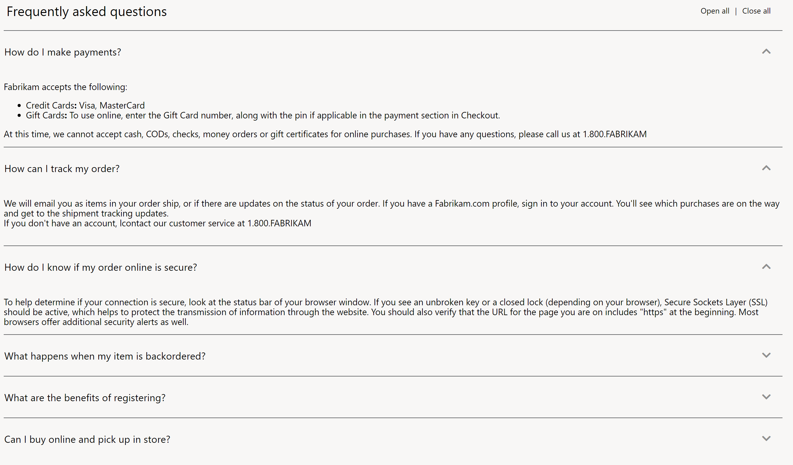

---
# required metadata

title: Accordion module 
description: This topic covers accordion modules and describes how to add them to site pages in Microsoft Dynamics 365 Commerce.
author:  anupamar-ms
ms.date: 09/15/2020
ms.topic: article
ms.prod: 
ms.technology: 

# optional metadata

# ms.search.form: 
# ROBOTS: 
audience: Application User
# ms.devlang: 
ms.reviewer: v-chgri
# ms.tgt_pltfrm: 
ms.custom: 
ms.assetid: 
ms.search.region: Global
ms.search.industry: 
ms.author: anupamar
ms.search.validFrom: 2019-10-31
ms.dyn365.ops.version: 
---

# Accordion module

[!include [banner](includes/banner.md)]

This topic covers accordion modules and describes how to add them to site pages in Microsoft Dynamics 365 Commerce.

Accordion modules are container-like modules that are used to organize the information or modules on a page by providing a collapsible drawer-like capability. An accordion module can be used on any page.

Inside every accordion module, one or more accordion item modules can be added. Each accordion item module represents a collapsible drawer. Inside every accordion item module, one or more modules can be added. There are no restrictions on the types of modules that can be added to an accordion item module.

The following image shows an example of an accordion module that is used to organize information on a store's frequently asked questions (FAQ) page.

## Accordion module properties

| Property name | Values | Description |
|---------------|--------|-------------|
| Heading | Text | This property specifies an optional text heading for the accordion module. |
| Expand All | **True** or **False** | If the value is set to **True**, expand/collapse functionality is turned on, so that all items in the accordion module can be expanded and collapsed. |
| Interaction Style | **Independent** or **Expand one item only** | This property defines the style of interaction for accordion items. If the value is set to **Independent**, each accordion item can be expanded or collapsed independently. If the value is set to **Expand one item only**, only one item can be expanded at a time. As items are expanded, previously expanded items are collapsed. |

## Accordion item module properties

| Property name | Values | Description |
|----------------|--------|-------------|
| Title | Text | This property specifies the title text for the accordion item module. By selecting the title region, users can expand or collapse the section. |
| Expand by default | **True** or **False** | If the value is set to **True**, the accordion item is expanded by default when the page is loaded. |

## Add an accordion module to a FAQ page

To add an accordion module to a FAQ page and set its properties in site builder, follow these steps.

1. Go to **Pages**, and use the Fabrikam marketing template (or any template that has no restrictions) to create a new page that is named **Store FAQ**.
1. In the **Main** slot of the **Default page**, select the ellipsis (**...**), and then select **Add Module**.
1. In the **Add Module** dialog box, select the **Container** module, and then select **OK**.
1. In the **Container** slot, select the ellipsis (**...**), and then select **Add Module**.
1. In the **Add Module** dialog box, select the **Accordion** module, and then select **OK**.
1. In the property pane of the accordion module, select **Heading** next to the pencil symbol.
1. In the **Heading** dialog box, under **Heading Text**, enter **Frequently asked questions**. Then select **OK**.
1. In the property pane of the accordion module, select the **Show expand all** check box, and then, in the **Interaction style** field, select **Independent**.
1. In the **Accordion** slot, select the ellipsis (**...**), and then select **Add Module**.
1. In the **Add Module** dialog box, select the **Accordion item** module, and then select **OK**.
1. In the property pane of the accordion item module, under **Title**, enter title text (for example, **How do returns work?**).
1. In the **Accordion item** slot, select the ellipsis (**...**), and then select **Add Module**.
1. In the **Add Module** dialog box, select the **Text block** module, and then select **OK**.
1. In the property pane of the text block module, enter a paragraph of text (for example, **Returns must be processed via the call center. Contact 1-800-FABRIKAM for returns. Products have a 30-day return policy. Returns must be initiated within this time frame.**).
1. In the **Accordion** slot, add a few more accordion item modules. In each accordion item module, add a text block module that has content.
1. Select **Save**, and then select **Preview** to preview the page. The page will show an accordion module that has the content that you added.
1. Select **Finish editing** to check in the page, and then select **Publish** to publish it.

## Additional resources

[Module library overview](starter-kit-overview.md)

[Container module](add-container-module.md)

[Tab module](add-tab.md)

[Text block module](add-content-rich-block.md)

[!INCLUDE[footer-include](../includes/footer-banner.md)]