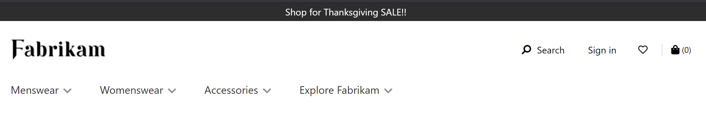

# Promo banner module

[!include [banner](includes/banner.md)]

This article covers promo banner modules and describes how to add them to site pages in Microsoft Dynamics 365 Commerce.

Promo banner modules are used to show inline informational messages on a page. They can be used to show site-wide promotions that appear on all pages of an e-Commerce site. 

Promo banner modules support a text message and a link. If multiple messages are added to a promo banner module, it becomes a rotating carousel banner that lets customers cycle through all the messages. 

Promo banner modules are driven by data from the content management system (CMS) and can be put on any page.

## Usage examples of promo banners in e-commerce

Promo banners can be used in the site header to show site-wide promotions or messages, as in the following examples.

"Annual sale ends in 10 days"

"Save big with back to school sale. Shop Now."

"Shop for Thanksgiving SALE!" 

The following image shows an example of a promo banner.

## Promo banner module properties

| Property name             | Value                              | Description |
|---------------------------|------------------------------------|-------------|
| Banner messages           | Text and links                     | An array of text and links. |
| Autoplay                  | **True** or **False**              | A value that indicates whether messages are automatically cycled through, if multiple messages are configured. |
| Slide transition interval | A number of milliseconds (ms)      | The interval that is used to cycle through messages. |
| Allow dismiss             | **True** or **False**              | If the value is set to **True**, customers can dismiss the alert. |
| Show carousel flipper     | **True** or **False**              | A value that indicates whether the carousel flippers should be shown, so that customers can manually cycle through multiple banner items. |
| Text alignment            | **Right**, **Left**, or **Center** | The text alignment in the promo banner module. |
| Link                      | A URL                              | The URL for an optional link. |
|Text alignment             | **Right**, **Left**, or **Center** | This property is available as a theme extension in the Adventure Works theme. It lets a user set the text alignment in the promo banner. |

> [!IMPORTANT]
> The Adventure Works theme is available as of the Dynamics 365 Commerce version 10.0.20 release.

## Add a promo banner module to a page 

To add a promo banner module to a page and set the required properties, follow these steps.

1. Go to **Templates**, and select **New** to create a new template.
1. In the **New template** dialog box, under **Template Name**, enter **Promo banner template**, and then select **OK**.
1. Under **Page Outline**, add a **Default page** module to the **Body** slot. 
1. Select **Finish editing** to check in the template, and then select **Publish** to publish it. 
1. Use the template that you just created to create a page that is named **Promo banner page**. 
1. In the **Main** slot of the new page, add a container module. 
1. In the pane on the right, set the **Width** value to **Fill Container**.
1. Under **Page Outline**, add a promo banner module to the container module.
1. In the settings for the banner module, add one or more banner messages. Each message can have text together with a link. You can edit the other properties to customize the module further.
1. Select **Save**, and then select **Preview** to preview the page. At the top of the page, you should see an alert that shows the text that you added.
1. Select **Finish editing** to check in the page, and then select **Publish** to publish it.

> [!NOTE]
> A promo banner is typically used in the page header slot or a subheader slot.

## Additional resources

[Module library overview](starter-kit-overview.md)

[Carousel module](add-carousel.md)

[Text block module](add-content-rich-block.md)

[Content block module](add-hero-module.md)

[Video player module](add-video-player.md)

[!INCLUDE[footer-include](../includes/footer-banner.md)]
