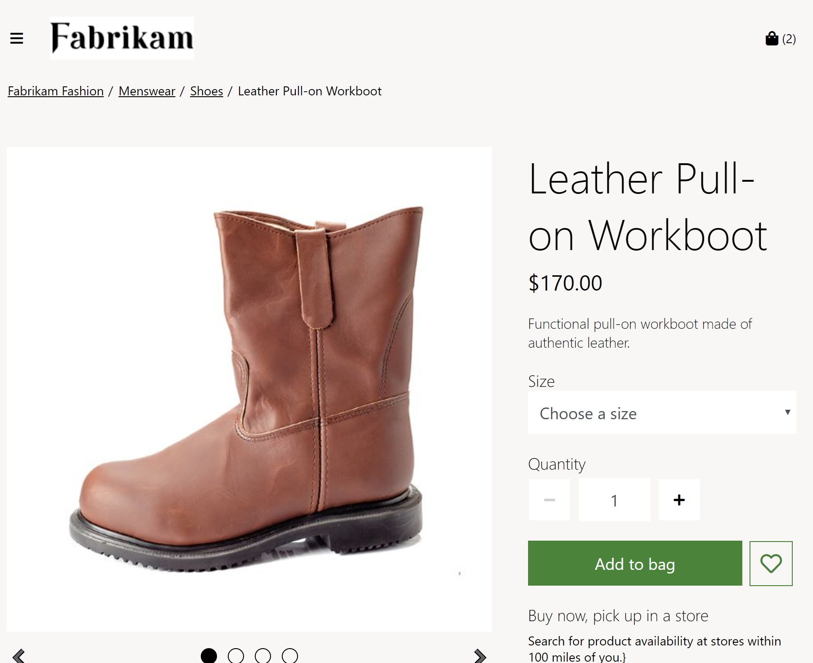

---
# required metadata

title: Breadcrumb module 
description: This topic covers breadcrumb modules and describes how to add them to site pages in Microsoft Dynamics 365 Commerce.
author:  anupamar-ms
ms.date: 10/20/2020
ms.topic: article
ms.prod: 
ms.technology: 

# optional metadata

# ms.search.form: 
# ROBOTS: 
audience: Application User
# ms.devlang: 
ms.reviewer: v-chgri
# ms.tgt_pltfrm: 
ms.custom: 
ms.assetid: 
ms.search.region: Global
ms.search.industry: 
ms.author: anupamar
ms.search.validFrom: 2019-10-31
ms.dyn365.ops.version: 
---

# Breadcrumb module

[!include [banner](includes/banner.md)]

This topic covers breadcrumb modules and describes how to add them to site pages in Microsoft Dynamics 365 Commerce.

Breadcrumb modules are used to provide secondary navigation on site pages. They are typically shown at the top of a page, below the header. Although breadcrumb modules can be added to any page, they are most often used on product details pages (PDPs), to show the product category hierarchy and provide a quick way to move around a site. A breadcrumb module can also be used to show a "Back to results" link when users open a PDP from a search or list page. In this way, users can quickly return to their filtered list page to continue shopping.

On pages that have product category context, such as PDPs and category pages, breadcrumb modules show the category hierarchy. On pages that don't have category context, breadcrumb modules show **&lt;Site root&gt; / &lt;Current page&gt;** by default. Breadcrumb modules can also be manually configured on other types of site pages to show links to specific pages on the site.

> [!NOTE]
> The breadcrumb module is available in the Dynamics 365 Commerce 10.0.12 release.

The following image shows an example of a breadcrumb module that shows the category hierarchy on a PDP.

## Breadcrumb module settings

The breadcrumb module relies on the **Breadcrumb display type on PDP** setting, which is defined at **Site Settings \> Extensions** in site builder. This setting has three possible values:

- **Show category hierarchy** – When this value is selected, the breadcrumb module will show the full category hierarchy of the product that is viewed on the PDP.
- **Show back to results** – When this value is selected, the breadcrumb module will show a "Back to results" link on a PDP if the user opened the PDP from a module that allows for a "Back to results" link. This functionality is available when users navigate from category, search, list, and recommendation lists pages. To support this functionality, product collection and search results modules have a property that is named **Allow back to results on PDP**. This property gives you the flexibility to define which modules should support the "Back to results" link functionality on the PDP. For example, when **Show back to results** is selected for the **Breadcrumb display type on PDP** setting of the breadcrumb module, and **Allow back to results on PDP** is selected for the search page search results module, a "Back to results" link will be shown when users navigate from the search page to a PDP.
- **Show category hierarchy and back to results** – This value is a combination of the previous two. When this value is selected, the breadcrumb module will show both the full category hierarchy and a "Back to results" link (if it's configured) on a PDP.

> [!IMPORTANT]
> These settings are available in the Dynamics 365 Commerce 10.0.12 release. If you are updating from an older version of Dynamics 365 Commerce, you must manually update the appsettings.json file. For instructions on updating the appsettings.json file, see [SDK and module library updates](e-commerce-extensibility/sdk-updates.md#update-the-appsettingsjson-file).

## Breadcrumb module properties

| Property name | Values | Description |
|---------------|--------|-------------|
| Root | Text or link| This optional property specifies link text and a link target for the breadcrumb site root. If this property isn't configured, no root will be defined. |
| Breadcrumb link | Link | This optional property specifies links for a manually configured breadcrumb, if these links are required. Links appear in the order that they are listed in. |

## Add a breadcrumb module to a new page

To add a breadcrumb module to a PDP and set the required properties, follow these steps.

1. Go to **Site Settings \> Extensions**, and then, for the **Breadcrumb display type on PDP** setting, select **Show category hierarchy**.
1. Go to **Templates**, and select the PDP template.
1. In the **Container** slot that contains the buy box module, select the ellipsis (**...**), and then select **Add Module**.
1. In the **Add Module** dialog box, select the **Breadcrumb** module, and then select **OK**.
1. Select **Save**, select **Finish editing** to check in the template, and then select **Publish** to publish it.
1. Go to **Pages**, and open a PDP that uses the PDP template. If a PDP doesn't yet exist, create one.
1. In the **Container** slot that contains the buy box module, select the ellipsis (**...**), and then select **Add Module**.
1. In the **Add Module** dialog box, select the **Breadcrumb** module, and then select **OK**.
1. In the properties pane of the **Breadcrumb** slot, under **Root**, select **Link text**.
1. In the **Link text** dialog box, enter **Home**, and then, under **Link target**, select **Add a link**.
1. In the **Add a link** dialog box, select a link for the breadcrumb root, and then select **OK**.
1. Select **Save**, and then select **Preview** to preview the page.
1. Select **Finish editing** to check in the template, and then select **Publish** to publish it.

## Additional resources

[Module library overview](starter-kit-overview.md)

[Navigation menu module](nav-menu-module.md)

[Site picker module](site-selector.md)

[Overview of default category landing page and search results page](category-search-page-overview.md)

[Product collection modules](product-collection-module-overview.md)

[Buy box module](add-buy-box.md)

[SDK and module library updates](e-commerce-extensibility/sdk-updates.md)

[!INCLUDE[footer-include](../includes/footer-banner.md)]
