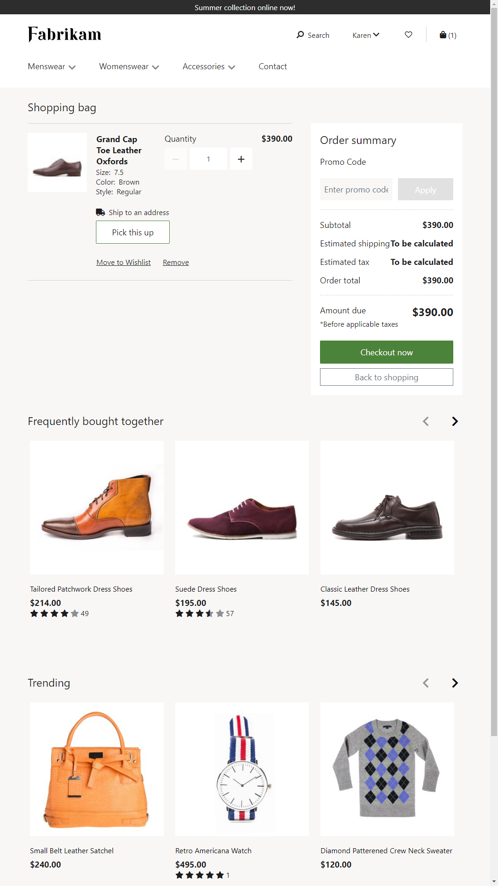
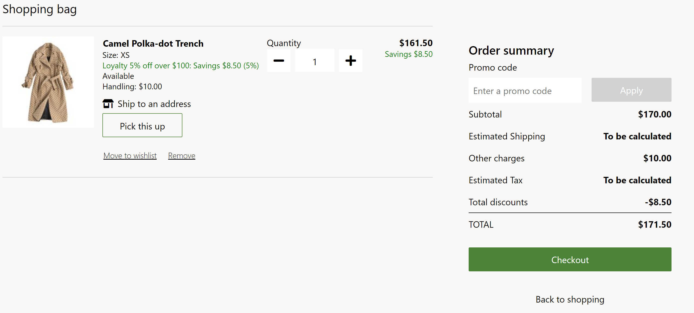

---
# required metadata

title: Cart module
description: This topic covers cart modules and describes how to add them to site pages in Microsoft Dynamics 365 Commerce.
author: anupamar-ms
ms.date: 12/15/2020
ms.topic: article
ms.prod: 
ms.technology: 

# optional metadata

ms.search.form:  
audience: Application User
# ms.devlang: 
ms.reviewer: v-chgri
# ms.tgt_pltfrm: 
# ms.custom: 
ms.search.region: Global
ms.search.industry: 
ms.author: anupamar
ms.search.validFrom: 2019-10-31
ms.dyn365.ops.version: Release 10.0.5

---

# Cart module

[!include [banner](includes/banner.md)]

This topic covers cart modules and describes how to add them to site pages in Microsoft Dynamics 365 Commerce.

A cart module shows the items that have been added to the cart before the customer proceeds to checkout. The module also shows an order summary and lets the customer apply or remove promotional codes.

The cart module supports signed-in checkout and guest checkout. It also supports a **Back to shopping** link. You can configure the route for this link at **Site Settings \> Extensions \> Routes**.

The cart module renders data based on the cart ID, which is a browser cookie available throughout the site. 

The following image shows an example of a cart page on the Fabrikam site.

The following image shows an example of a cart page on the Fabrikam site. In this example, there is a handling fee for a line item.

## Cart module properties and slots

| Property | Values | Description |
|----------------|--------|-------------|
| Heading | Heading text and a heading tag (**H1**, **H2**, **H3**, **H4**, **H5**, or **H6**) | A heading for the cart, such as "Shopping bag" or "Items in your cart." |
| Show out of stock errors | **True** or **False** | If this property is set to **True**, the cart page will show stock-related errors. We recommend that you set this property to **True** if inventory checks are applied on the site. |
| Show shipping charges for line items | **True** or **False** | If this property is set to **True**, cart line items will show the shipping charges, if this information is available. This feature isn't supported in the Fabrikam theme, because users select shipping only in the checkout flow. However, this feature can be turned on in other workflows if it's applicable. |
| Show available promotions| **True** or **False** | If this property is set to **True**, the cart shows available promotions, based on items in the cart. This capability is available in the Dynamics 365 Commerce 10.0.16 release. |

## Modules that can be used in a cart module

- **Text block** – This module supports custom messaging in the cart module. The messages are driven by the content management system (CMS). Any message can be added, such as "For issues with your order, contact 1-800-Fabrikam."
- **Store selector** – This module shows a list of nearby stores where an item is available for pickup. It lets users enter a location to find stores that are nearby. For more information on this module, see [Store selector module](store-selector.md).

## Module properties

The following cart module settings can be configured at **Site Settings \> Extensions**:

- **Maximum quantity** – This property is used to specify the maximum number of each item that can be added to the cart. For example, a retailer might decide that only 10 of each product can be sold in a single transaction.
- **Inventory** – For information about how to apply inventory settings, see [Apply inventory settings](inventory-settings.md).
- **Back to shopping** – This property is used to specify the route for the **Back to shopping** link. The route can be configured at the site level, allowing retailers to take the customer back to the home page or any other page on the site.

> [!IMPORTANT]
> In the Dynamics 365 Commerce 10.0.14 release and later, items in the cart are aggregated based on the settings that are defined in the online functionality profile for the online store in Commerce headquarters. For more information about how to create an online functionality profile and set the properties that are required for aggregation, see [Create an online functionality profile](online-functionality-profile.md).

## Commerce Scale Unit interaction

The cart module retrieves product information by using Commerce Scale Unit APIs. The cart ID from the browser cookie is used to retrieve all the product information from Commerce Scale Unit.

## Add a cart module to a page

To add a cart module to a new page and set the required properties, follow these steps.

1. Go to **Fragments**, and select **New** to create a new fragment.
1. In the **New fragment** dialog box, select the **Cart** module.
1. Under **Fragment name**, enter the name **Cart fragment**, and then select **OK**.
1. Select the **Cart** slot.
1. In the properties pane on the right, select the pencil symbol, enter heading text in the field, and then select the check mark symbol.
1. In the **Cart** slot, select the ellipsis (**...**), and then select **Add Module**.
1. In the **Add Module** dialog box, select the **Store selector** module, and then select **OK**.
1. Select **Save**, select **Finish editing** to check in the fragment, and then select **Publish** to publish it.
1. Go to **Templates**, and select **New** to create a new template.
1. In the **New Template** dialog box, under **Template name**, enter a name for the template.
1. In the outline tree, select the **Body** slot, select the ellipsis (**...**), and then select **Add fragment**.
1. In the **Select fragment** dialog box, select the **Cart fragment** fragment, and then select **OK**.
1. Select **Save**, select **Finish editing** to check in the template, and then select **Publish** to publish it.
1. Go to **Pages**, and select **New** to create a new page.
1. In the **Choose a template** dialog box, select the template that you created, enter a page name, and then select **OK**.
1. Select **Save**, and then select **Preview** to preview the page.
1. Select **Finish editing** to check in the page, and then select **Publish** to publish it.

## Additional resources

[Cart icon module](cart-icon-module.md)

[Checkout module](add-checkout-module.md)

[Payment module](payment-module.md)

[Shipping address module](ship-address-module.md)

[Delivery options module](delivery-options-module.md)

[Pickup information module](pickup-info-module.md)

[Order details module](order-confirmation-module.md)

[Gift card module](add-giftcard.md)

[Calculate inventory availability for retail channels](calculated-inventory-retail-channels.md)

[Create an online functionality profile](online-functionality-profile.md)

[!INCLUDE[footer-include](../includes/footer-banner.md)]