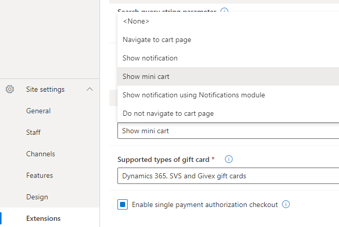
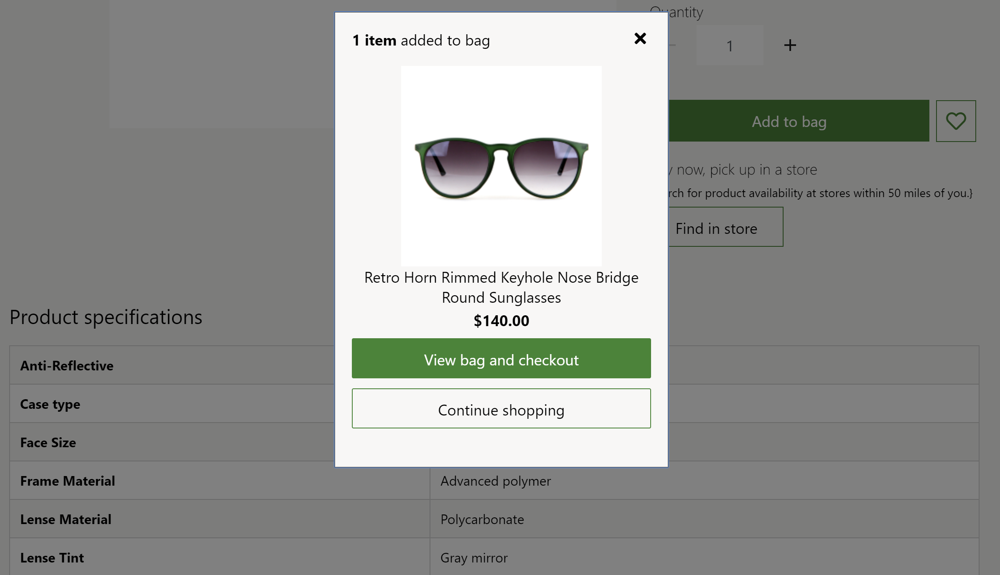
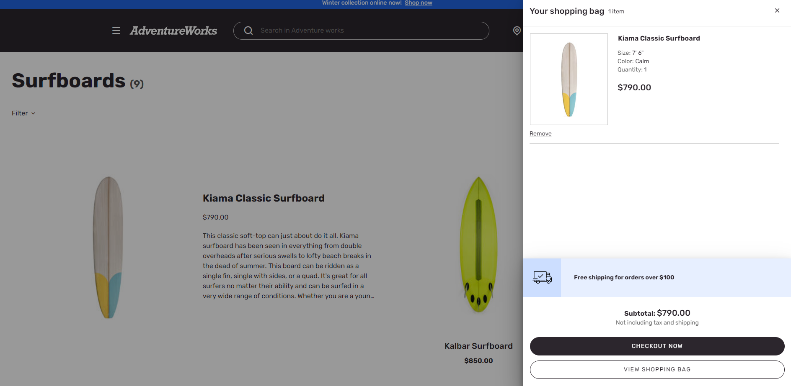

---
# required metadata

title: Apply add product to cart settings
description: This topic covers "Add product to cart" settings and describes how to apply them in Microsoft Dynamics 365 Commerce.
author: anupamar-ms
ms.date: 07/08/2021
ms.topic: article
ms.prod: 
ms.technology: 

# optional metadata

# ms.search.form: 
audience: Application User
# ms.devlang: 
ms.reviewer: v-chgri
# ms.tgt_pltfrm: 
ms.custom: 
ms.assetid: 
ms.search.region: Global
# ms.search.industry: 
ms.author: anupamar
ms.search.validFrom: 2019-10-31
ms.dyn365.ops.version: Release 10.0.5

---

# Apply add product to cart settings

[!include [banner](includes/banner.md)]

This topic covers **Add product to cart** settings and describes how to apply them in Microsoft Dynamics 365 Commerce.

Different workflows are supported when a product is added to the cart on a Dynamics 365 Commerce e-commerce site. For example, the site user might be taken to the cart page. Alternatively, the user might remain on the current page but receive a notification that confirms that the product was added to the cart.

To support the different workflows, an **Add product to cart** field is available at **Settings \> Extensions** in Commerce site builder. Select one of the following setting options to implement the corresponding workflow:

- **Navigate to cart page** – When users add an item to the cart, they are taken to the cart page.
- **Show notification** – When users add an item to the cart, they receive a confirmation notification and can continue to browse on the product details page (PDP).
- **Show mini cart** – When users add an item to the cart, the mini cart contents are shown. Users can review all the items in the cart, and they can proceed to checkout if they are ready.
- **Show notification using Notifications module** – When users add an item to the cart, the notifications module is used to show a confirmation notification. For this setting option to work, the notifications module must be added to the page header.
- **Do not navigate to cart page** – When users add an item to the cart, they remain on the current page.

The following illustration shows an example of the **Add product to cart** setting options in site builder.

> [!IMPORTANT]
> - The **Add product to cart** site settings are available as of the Dynamics 365 Commerce version 10.0.11 release. If you're updating from an older version of Dynamics 365 Commerce, you must manually update the appsettings.json file. For information about how to update the appsettings.json file, see [SDK and module library updates](e-commerce-extensibility/sdk-updates.md#update-the-appsettingsjson-file).
> - The **Show mini cart** setting option is available as of the Dynamics 365 Commerce version 10.0.20 release. If you're updating from an older version of Dynamics 365 Commerce, you must manually update the appsettings.json file. For information about how to update the appsettings.json file, see [SDK and module library updates](e-commerce-extensibility/sdk-updates.md#update-the-appsettingsjson-file).

The following illustration shows an example of an "added to cart" confirmation notification on the Fabrikam site.

The following illustration shows an example of an "added to cart" confirmation notification on the Adventure Works site.

## Additional resources

[Module library overview](starter-kit-overview.md)

[Buy box module](add-buy-box.md)

[Store selector module](store-selector.md)
