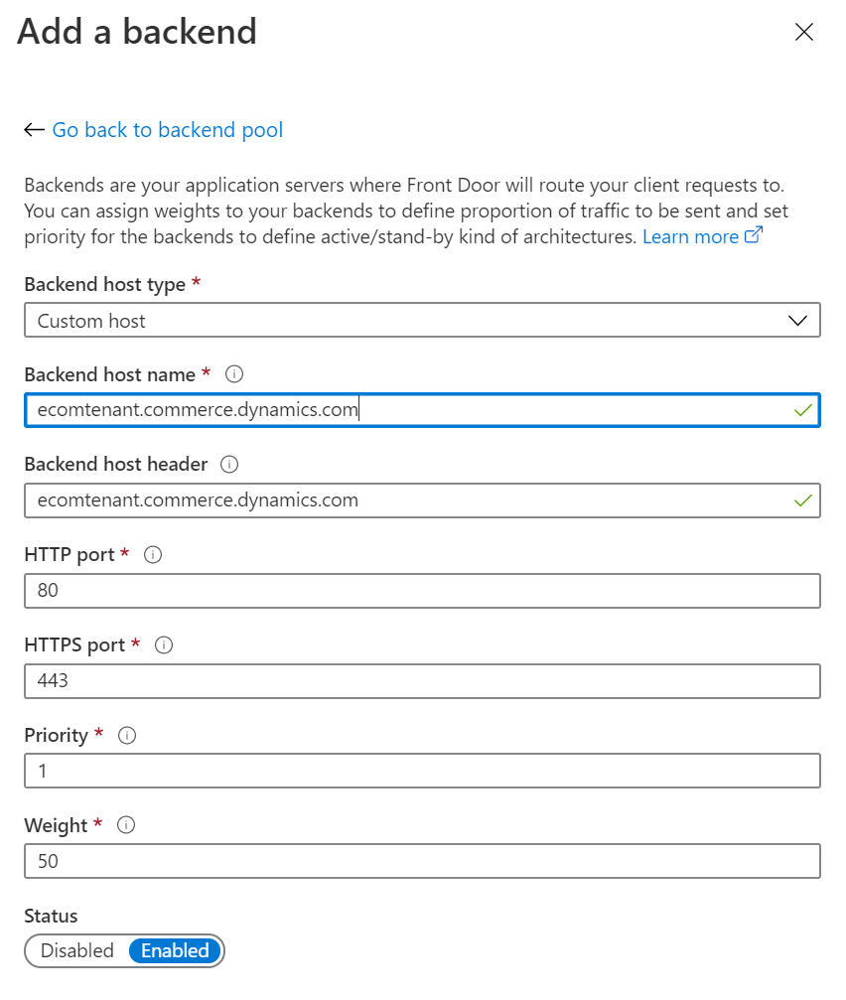

---
# required metadata

title: Add support for a content delivery network (CDN)
description: This topic describes how to add a content delivery network (CDN) to your Microsoft Dynamics 365 Commerce environment.
author: brianshook
manager: annbe
ms.date: 03/02/2020
ms.topic: article
ms.prod: 
ms.service: dynamics-365-commerce
ms.technology: 

# optional metadata

# ms.search.form: 
audience: Application user
# ms.devlang: 
ms.reviewer: v-chgri
ms.search.scope: Operations, Retail, Core
# ms.tgt_pltfrm: 
ms.custom: 
ms.assetid: 
ms.search.region: Global
# ms.search.industry: 
ms.author: brshoo
ms.search.validFrom: 2019-10-31
ms.dyn365.ops.version: Release 10.0.5

---

# Add support for a content delivery network (CDN)

[!include [banner](includes/banner.md)]

This topic describes how to add a content delivery network (CDN) to your Microsoft Dynamics 365 Commerce environment.

## Overview

When you set up an e-Commerce environment in Dynamics 365 Commerce, you can configure it to work with your CDN service. 

Your custom domain can be enabled during the provisioning process for your e-Commerce environment. Alternatively, you can use a service request to set it up after the provisioning process is completed. The provisioning process for the e-Commerce environment generates a host name that is associated with the environment. This host name has the following format, where *e-commerce-tenant-name* is the name of your environment:

&lt;e-commerce-tenant-name&gt;.commerce.dynamics.com

The host name or endpoint that is generated during the provisioning process supports a Secure Sockets Layer (SSL) certificate only for \*.commerce.dynamics.com. It doesn't support SSL for custom domains. Therefore, you must terminate SSL for custom domains in your CDN and forward traffic from the CDN to the host name or endpoint that Commerce generated. 

Additionally, the *statics* (JavaScript or Cascading Style Sheets \[CSS\] files) from Commerce are served from the endpoint that Commerce generated (\*.commerce.dynamics.com). The statics can be cached only if the host name or endpoint that Commerce generated is put behind the CDN.

## Set up SSL

To help guarantee that SSL is set up, and that statics are cached, you must configure your CDN so that it is associated with the host name that Commerce generated for your environment. You must also cache the following pattern for statics only: 

/\_msdyn365/\_scnr/\*

After you provision your Commerce environment with the custom domain that is provided, or after you provide the custom domain for your environment by using a service request, point your custom domain to the host name or endpoint that Commerce generated.

As was previously mentioned, the generated host name or endpoint supports an SSL certificate only for \*.commerce.dynamics.com. It doesn't support SSL for custom domains.

## CDN services

Any CDN service can be used with a Commerce environment. Here are two examples:

- **Microsoft Azure Front Door Service** – The Azure CDN solution. For more information about Azure Front Door Service, see [Azure Front Door Service Documentation](https://docs.microsoft.com/azure/frontdoor/).
- **Akamai Dynamic Site Accelerator** – For more information, see [Dynamic Site Accelerator](https://www.akamai.com/us/en/products/performance/dynamic-site-accelerator.jsp).

## CDN setup

The CDN setup process consists of these general steps:

1. Add a front-end host.
1. Configure a back-end pool.
1. Set up rules for routing and caching.

### Add a front-end host

Any CDN service can be used, but for the example in this topic, Azure Front Door Service is used. 

For information about how to set up Azure Front Door Service, see [Quickstart: Create a Front Door for a highly available global web application](https://docs.microsoft.com/azure/frontdoor/quickstart-create-front-door).

### Configure a back-end pool in Azure Front Door Service

To configure a back-end pool in Azure Front Door Service, follow these steps.

1. Add **&lt;ecom-tenant-name&gt;.commerce.dynamics.com** to a back-end pool as a custom host that has an empty back-end host header.
1. Under **Health probes**, in the **Path** field, enter **/keepalive**.
1. In the **Intervals (seconds)** field, enter **255**.
1. Under **Load balancing**, leave the default values.

The following illustration shows the **Add a backend pool** dialog box in Azure Front Door Service.

### Set up rules in Azure Front Door Service

To set up a routing rule in Azure Front Door Service, follow these steps.

1. Add a routing rule.
1. In the **Name** field, enter **default**.
1. In the **Accepted protocol** field, select **HTTP and HTTPS**.
1. In the **Frontend hosts** field, enter **dynamics-ecom-tenant-name.azurefd.net**.
1. Under **Patterns to match**, in the upper field, enter **/\***.
1. Under **Route Details**, set the **Route type** option to **Forward**.
1. In the **Backend pool** field, select **ecom-backend**.
1. In the **Forwarding protocol** field group, select the **Match request** option. 
1. Set the **URL rewrite** option to **Disabled**.
1. Set the **Caching** option to **Disabled**.

To set up a caching rule in Azure Front Door Service, follow these steps.

1. Add a caching rule.
1. In the **Name** field, enter **statics**.
1. In the **Accepted protocol** field, select **HTTP and HTTPS**.
1. In the **Frontend hosts** field, enter **dynamics-ecom-tenant-name.azurefd.net**.
1. Under **Patterns to match**, in the upper field, **/\_msdyn365/\_scnr/\***.
1. Under **Route Details**, set the **Route type** option to **Forward**.
1. In the **Backend pool** field, select **ecom-backend**.
1. In the **Forwarding protocol** field group, select the **Match request** option.
1. Set the **URL rewrite** option to **Disabled**.
1. Set the **Caching** option to **Disabled**.
1. In the **Query string caching behavior** field, select **Cache every unique URL**.
1. In the **Dynamic compression** field group, select the **Enabled** option.

The following illustration shows the **Add a rule** dialog box in Azure Front Door Service.

After this initial configuration is deployed, you must add your custom domain to the configuration for Azure Front Door Service. To add the custom domain (for example, `www.fabrikam.com`), you must configure a Canonical Name (CNAME) for the domain.

The following illustration shows the **CNAME configuration** dialog box in Azure Front Door Service.

> [!NOTE]
> If the domain that you will use is already active and live, contact support to enable this domain with Azure Front Door Service to set up a test.

You can use Azure Front Door Service to manage the certificate, or you can use your own certificate for the custom domain.

The following illustration shows the **Custom Domain HTTPS** dialog box in Azure Front Door Service.

Your CDN should now be correctly configured so that it can be used with your Commerce site.

## Additional resources

[Configure your domain name](configure-your-domain-name.md)

[Deploy a new e-Commerce site](deploy-ecommerce-site.md)

[Set up an online store channel](online-stores.md)

[Create an e-Commerce site](create-ecommerce-site.md)

[Associate an online site with a channel](associate-site-online-store.md)

[Manage robots.txt files](manage-robots-txt-files.md)

[Upload URL redirects in bulk](upload-bulk-redirects.md)

[Set up a B2C tenant in Commerce](set-up-B2C-tenant.md)

[Set up custom pages for user logins](custom-pages-user-logins.md)

[Configure multiple B2C tenants in a Commerce environment](configure-multi-B2C-tenants.md)

[Enable location-based store detection](enable-store-detection.md)
