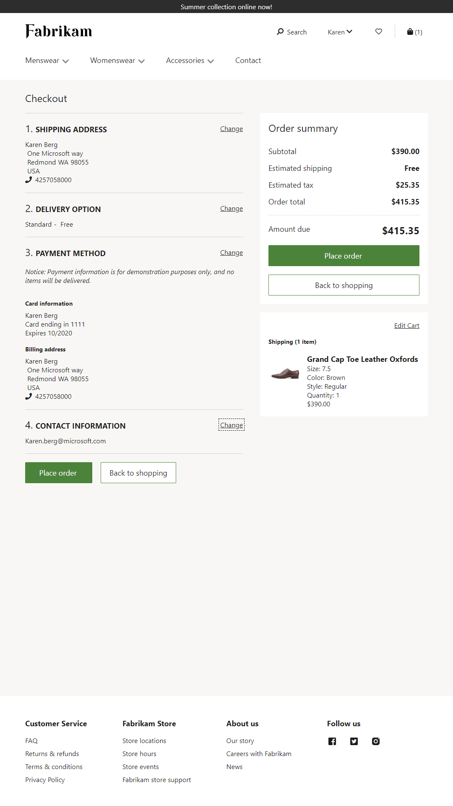
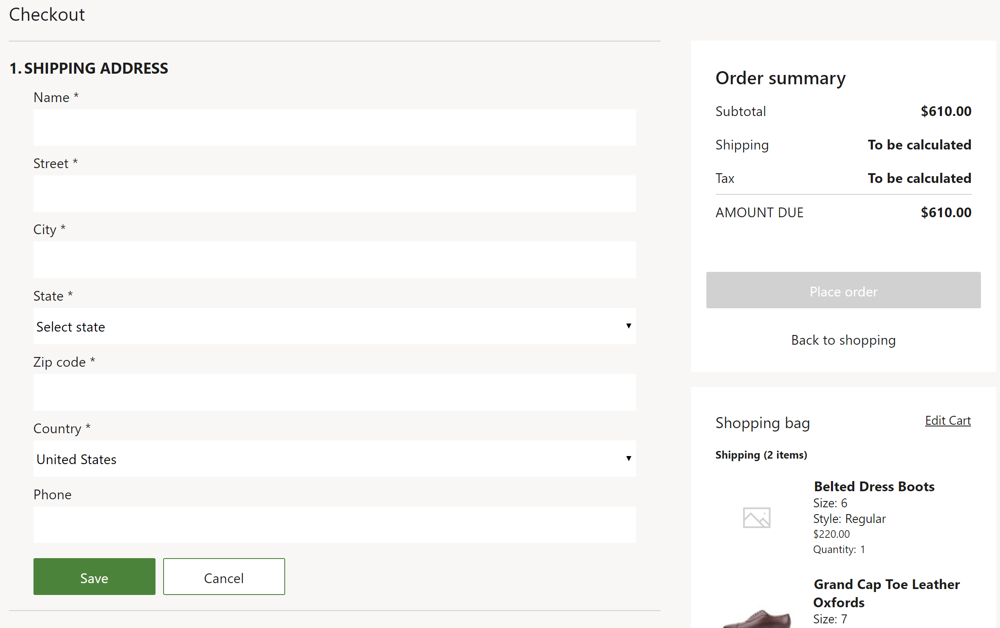
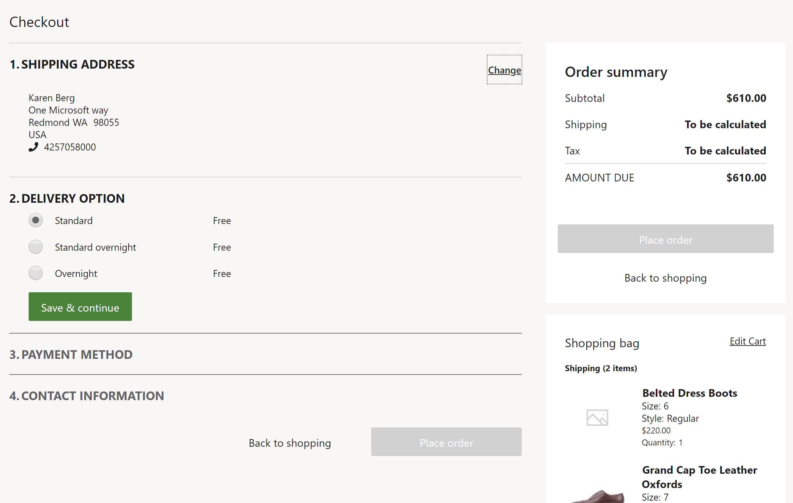
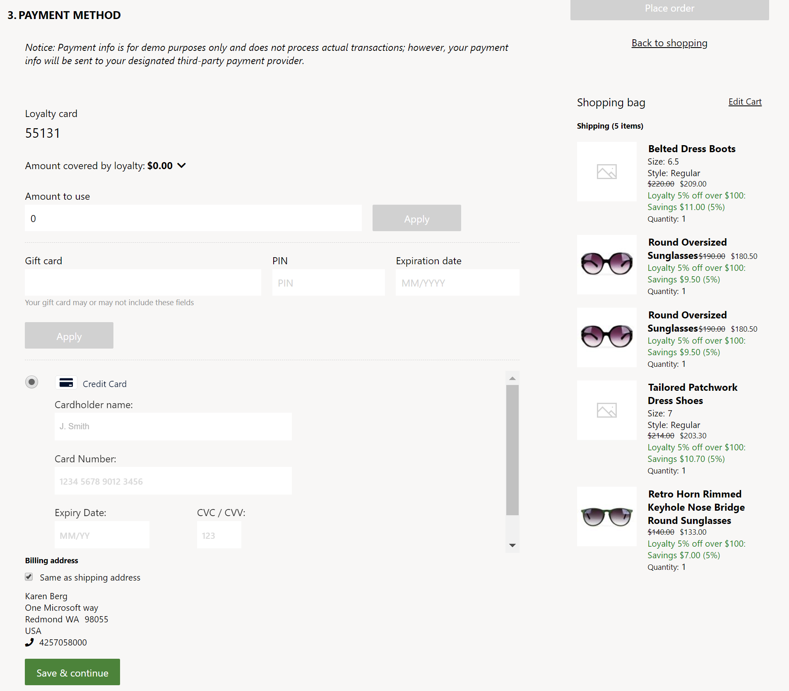
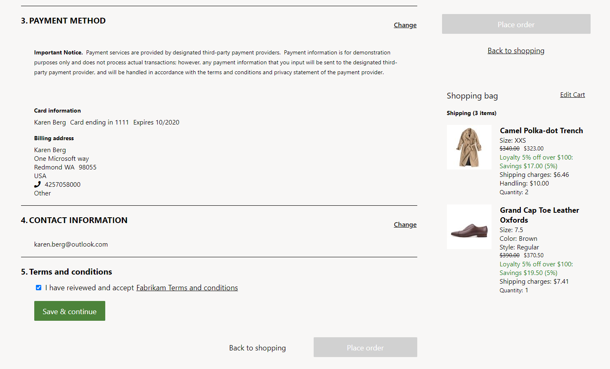

# Checkout module

[!include [banner](includes/banner.md)]

This article describes how to add a checkout module to a page and set the required properties.

A checkout module is a special container that hosts all modules that are required to create an order. It presents a step-by-step flow that a customer uses to enter all the relevant information to make a purchase. It captures the shipping address, shipping method, and billing information. It also provides an order summary and other information that is related to a customer order.

A checkout module renders data based on the cart ID. This cart ID is saved as a browser cookie. A cart ID is required to render information in the checkout module, such as the items in the order, the total amount, and discounts. 

The following image shows an example of a Fabrikam checkout module on a checkout page.

## Checkout module properties

A checkout module shows an order summary and provides the functionality for placing an order. To gather all the customer information that is required before an order can be placed, additional modules must be added to the checkout module. Therefore, retailers have the flexibility to add custom modules to the checkout flow, or to exclude modules, based on their requirements.

| Property name | Values | Description |
|----------------|--------|-------------|
| Checkout heading | Heading text and a heading tag (**H1**, **H2**, **H3**, **H4**, **H5**, or **H6**) | A heading for the checkout module. |
| Order summary heading | Heading text | A heading for the order summary section of the module. |
| Cart line items heading | Heading text | A heading for cart line items that are shown in the checkout module. |
| Show shipping charges on line item | **True** or **False** | If this property is set to **True**, the shipping charges that are applicable for line items will be shown on cart lines. If the **Header charge with no proration** feature is turned on in Commerce headquarters, the shipping charge will be applied at the header level, not the line level. This feature was added in Commerce version 10.0.13. |

## Modules that can be used in the checkout module

- **Shipping address** – This module lets a customer add or select the shipping address for an order. For more information about this module, see [Shipping address module](ship-address-module.md).

    The following image shows an example of a shipping address module on a checkout page.

    

- **Delivery options** – This module lets a customer select a mode of delivery for an order. For more information about this module, see [Delivery options module](delivery-options-module.md).

    The following image shows an example of a delivery options module on a checkout page.
 
    

- **Checkout section container** – This module is a container that you can put multiple modules inside to create a section within the checkout flow. For example, you can put all payment-related modules inside this container to make them appear as one section. This module affects only the layout of the flow.

- **Gift card** – This module lets a customer pay for an order by using a gift card. For more information about this module, see [Gift card module](add-giftcard.md).

- **Loyalty points** – This module lets a customer pay for an order by using loyalty points. It provides a summary of available points and expiring points, and lets the customer select the number of points to redeem. If the customer isn't signed in or isn't a loyalty member, or if the total amount in the cart is 0 (zero), this module is automatically hidden.

- **Payment** – This module lets a customer pay for an order by using a credit or debit card. Customers can also provide a billing address for the payment option that they select. For more information about this module, see [Payment module](payment-module.md).

    The following image shows an example of gift card, loyalty points, and payment modules on a checkout page.

    

- **Contact information** – This module lets a customer add or change the contact information (email address) for an order.

- **Text block** – This module contains any messaging that is driven by the content management system (CMS). For example, it might contain a message that states, "For issues with your order, contact 1-800-Fabrikam." 

- **Checkout terms and conditions** – This module shows rich text that contains the terms and conditions and a check box for the customer input. The check box is optional and configurable. The input is captured by the module and can be used as a check before order placement is triggered, but it isn't included in the order summary information. This module can be added to the checkout container, checkout section container, or terms and conditions slot, according to business needs. If it's added to the checkout container or checkout section container slot, it will appear as a step in the checkout process. If it's added to the terms and conditions slot, it will appear near the order placement button.

    The following image shows an example of terms and conditions on a checkout page.

    
    
> [!NOTE]
> If you're planning to accept multiple payment methods for online orders in your online channel (for example, loyalty points and credit card payments), the **Omni-channel Commerce order payments** feature (in headquarters at **System administration \> Workspace \> Feature management**), and the call center **Enable order completion** setting (on the **General** FastTab of your channel at **Retail and Commerce \> Channels \> Call Centers**) must both be enabled. If the **Omni-channel Commerce order payments** feature is enabled, the **Enable order completion** setting is enabled by default and hidden.

## Commerce Scale Unit interaction

Most of the checkout information, such as the shipping address and shipping method, is stored in the cart and processed as part of the order. The only exception is the credit card information. This information is processed directly by using the Adyen payment connector. The payment is authorized, but it isn't charged until the order is fulfilled.

## Add a checkout module to a page and set the required properties

To add a checkout module to a new page and set the required properties, follow these steps.

1. Go to **Fragments**, and select **New** to create a new fragment.
1. In the **Select fragment** dialog box, select the **Checkout** module.
1. Under **Fragment name**, enter the name **Checkout fragment**, and then select **OK**.
1. Select the **Checkout module** slot.
1. In the properties pane on the right, select the pencil symbol, enter heading text in the field, and then select the check mark symbol.
1. In the **Checkout Information** slot, select the ellipsis (**...**), and then select **Add module**.
1. In the **Select modules** dialog box, select the **Shipping address**, **Delivery options**, **Checkout section container**, and **Contact information** modules, and then select **OK**.
1. In the **Checkout section container** module, select the ellipsis (**...**), and then select **Add module**.
1. In the **Select modules** dialog box, select the **Gift card**, **Loyalty**, and **Payment** modules, and then select **OK**. In this way, you make sure that all the payment methods appear together in a section.
1. In the **Terms and conditions** slot, add a **Checkout terms and conditions** module if it's required. In the module's properties pane, configure the terms and condition text as appropriate.
1. Select **Save**, and then select **Preview** to preview the fragment. Some modules that don't have a cart context might not be rendered in the preview.
1. Select **Finish editing** to check in the fragment, and then select **Publish** to publish it.
1. Create a template that uses the new checkout fragment.
1. Create a checkout page that uses the new template.

> [NOTE]
> When using single payment authorization as described in [Enhanced payments in storefront checkout](./dev-itpro/enhanced-sca.md), in the **Checkout information** section of the checkout page, confirm that the checkout section container is positioned last. This ensures that all required information is gathered by the checkout page prior to the final payment checkout and order completion actions. 

## Additional resources

[Cart module](add-cart-module.md)

[Cart icon module](cart-icon-module.md)

[Payment module](payment-module.md)

[Shipping address module](ship-address-module.md)

[Delivery options module](delivery-options-module.md)

[Pickup information module](pickup-info-module.md)

[Order details module](order-confirmation-module.md)

[Gift card module](add-giftcard.md)

[!INCLUDE[footer-include](../includes/footer-banner.md)]
