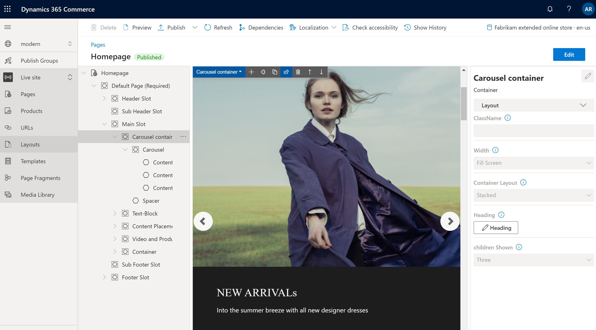

# Container module

[!include [banner](includes/banner.md)]

This article covers container modules and describes how to add them to site pages in Microsoft Dynamics 365 Commerce.

A container module is a module that hosts other modules inside it. The primary purpose of a container module is to define, through the properties that are set for it, the layout of the modules that it contains. For example, those modules can appear side by side in a two-column, three-column, four-column, or six-column layout. They can also be limited to the width of the container, or they can fill the screen. A heading can also be added to every container module.

Three container modules are supported: container, container with 2-slots, and container with 3-slots. Modules of any type can be put inside these containers. 

> [!NOTE] 
> We recommend that you always put modules inside a container module, so that they can be limited to the width of the container.

## Examples of container modules in e-Commerce

- A site author wants a three-column layout, where three modules appear side by side. Therefore, the site author uses a container module of the container with 3-slots type.
- A site author wants a six-column layout, where six modules appear side by side. Therefore, the site author uses a container of the contain type that has six columns inside it.
- A site author wants to put a module on a page but doesn't want it to fill the screen. Therefore, the site author adds the module to a container module and sets the container's **Width** property to **Fit container**.

The following image shows an example of a container module that contains a carousel module in Commerce site builder. In this example, the **Width** property of the container module is set to **Fill Screen**.

## Container module properties

| Property name     | Values | Description |
|-------------------|--------|-------------|
| Heading           | Heading text and heading tag (**H1**, **H2**, **H3**, **H4**, **H5**, or **H6**) | An optional heading can be provided for the container. By default, the **H2** heading tag is used for the heading. However, the tag can be changed to meet accessibility requirements. |
| Width             | **Fit container** or **Fill screen** | If the value is set to **Fit container** (the default value), the modules inside the container are limited to the width of the container. If the value is set to **Fill screen**, the modules aren't limited to the container width but can fill the screen. |
| Number of columns | **1**, **2**, **3**, **4**, **6**, or **12** | This property defines the number of columns in the container. A container can have up to 12 columns. |

## Container with 2-slots

The container with 2-slots type is optimized for a two-column layout. This type of container has two slots to allow for a side-by-side view of the modules that are inside.

Additional properties can be used to optimize the layout for different view ports (mobile devices, tablets, computers, and so on). For every view port, the width of each column can be defined. The following column width settings are available:

- **75%/25%** – The first module has a column width of 75 percent, and the second module has a column width of 25 percent. A **25%/75%** option is also available.
- **50%/50%** – Both modules have equal column width.
- **67%/33%** – The first module has a column width of 67 percent, and the second module has a column width of 33 percent. A **33%/67%** option is also available.
- **100%** – Both modules have a full-column width. Therefore, the modules are vertically stacked in a single column. Although this single-column layout goes against intent of the container with 2-slots type, it might be preferable for some view ports (for example, extra-small view ports such as mobile devices).

### Container with 2-slots properties

| Property name                   | Values | Description |
|---------------------------------|--------|-------------|
| Heading                         | Heading text and heading tag | An optional can be provided for the container. |
| X-Small view port configuration | **25%/75%**, **75%/25%**, **50%/50%**, **67%/33%**, **33%/67%**, or **100%** | This property defines the layout for extra-small view ports. |
| Small view port configuration   | **25%/75%**, **75%/25%**, **50%/50%**, **67%/33%**, **33%/67%**, or **100%** | This property defines the layout for small view ports, such as mobile devices. |
| Medium view port configuration  | **25%/75%**, **75%/25%**, **50%/50%**, **67%/33%**, **33%/67%**, or **100%** | This property defines the layout for medium view ports, such as tablets. |
| Large view port configuration   | **25%/75%**, **75%/25%**, **50%/50%**, **67%/33%**, **33%/67%**, or **100%** | This property defines the layout for large view ports, such as computers. |

## Container with 3-slots

The container with 3-slots modules type is optimized for a three-column layout.

Additional properties can be used to optimize the layout for different view ports. For every view port, the width of each column can be defined. The following column width settings are available:

- **33%/33%/33%** – All three modules have equal column width.
- **50%/25%/25%** – The first module has a column width of 50 percent, and each of the remaining two modules has a column width of 25 percent. **25%/50%/25%** and **25%/25%/50%** options are also available.
- **16%/16%/67%** – Each of the first two modules has a column width of 16 percent, and the third module has a column width of 67 percent. **16%/67%/16%** and **67%/16%/16%** options are also available.

### Container with 3-slots properties

| Property name                   | Values | Description |
|---------------------------------|--------|-------------|
| Heading                         | Heading text and heading tag | An optional heading can be added to the container. |
| X-Small view port configuration | **33%/33%/33%**, **50%/25%/25%**, **25%/50%/25%**, **25%/25%/50%**, **16%/16%/67%**, **16%/67%/16%**, or **67%/16%/16%** | This property defines the layout for extra-small view ports. |
| Small view port configuration   | **33%/33%/33%**, **50%/25%/25%**, **25%/50%/25%**, **25%/25%/50%**, **16%/16%/67%**, **16%/67%/16%**, or **67%/16%/16%** | This property defines the layout for small view ports, such as mobile devices. |
| Medium view port configuration  | **33%/33%/33%**, **50%/25%/25%**, **25%/50%/25%**, **25%/25%/50%**, **16%/16%/67%**, **16%/67%/16%**, or **67%/16%/16%** | This property defines the layout for medium view ports, such as tablets. |
| Large view port configuration   | **33%/33%/33%**, **50%/25%/25%**, **25%/50%/25%**, **25%/25%/50%**, **16%/16%/67%**, **16%/67%/16%**, or **67%/16%/16%** | This property defines the layout for large view ports, such as computers. |

## Add a container module to a page

To add a container player module to a new page and set the required properties, follow these steps.

1. Go to **Templates**, and select **New** to create a new template.
1. In the **New template** dialog box, under **Template name**, enter **Container template**, and then select **OK**.
1. In the **Body** slot, select the ellipsis (**...**), and then select **Add module**.
1. In the **Select modules** dialog box, select the **Default Page** module, and then select **OK**.
1. Select **Save**, select **Finish editing** to check in the template, and then select **Publish** to publish it. 
1. Go to **Pages**, and select **New** to create a new page.
1. In the **Create a new page** dialog box, under **Page name**, enter **Container page**, and then select **Next**.
1. Under **Choose a template**, select the **Container template** that you created, and then select **Next**.
1. Under **Choose a layout**, select a page layout (for example, **Flexible layout**), and then select **Next**.
1. Under **Review and finish**, review the page configuration. If you need to edit the page information, select **Back**. If the page information is correct, select **Create page**. 
1. In the **Main** slot of the new page, select the ellipsis (**...**), and then select **Add module**.
1. In the **Select modules** dialog box, select the **Container** module, and then select **OK**.
1. In the property pane for the container module, set the **Number of columns** property to **1** and the **Width** property to **Fill container**.
1. In the **Container** slot, select the ellipsis (**...**), and then select **Add module**.
1. In the **Select modules** dialog box, select the **Content block** module, and then select **OK**.
1. In the property pane for the content block module, configure the heading, image, and layout.
1. Select **Save**, and then select **Preview** to preview the page. You should see one feature module that fits within the width of the container module.
1. In the property pane for the container module, change the value of the **Number of columns** property to **3**.
1. Add two more content block modules to the container module, and configure them.
1. Select **Save**, and then select **Preview** to preview the page. You should now see three content block modules that appear side by side.
1. After you've achieved the layout that you want, select **Finish editing** to check in the page, and then select **Publish** to publish it.

## Additional resources

[Module library overview](starter-kit-overview.md)

[Accordion module](add-accordion.md)

[Tab module](add-tab.md)

[Carousel module](add-carousel.md)

[Text block module](add-content-rich-block.md)

[Buy box module](add-buy-box.md)

[Cart module](add-cart-module.md)

[Checkout module](add-checkout-module.md)

[Header module](author-header-module.md)

[Footer module](author-footer-module.md)

[!INCLUDE[footer-include](../includes/footer-banner.md)]
