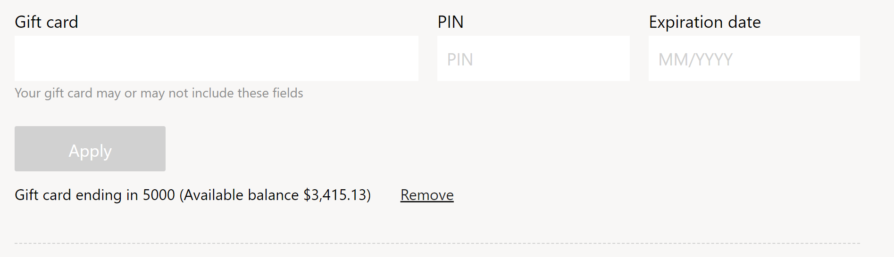

# Gift card module

[!include [banner](includes/banner.md)]

This article covers gift card modules and describes how to add them to site pages in Microsoft Dynamics 365 Commerce.

Gift card modules can be used in checkout modules to accept gift cards, a common form of payment used for e-Commerce transactions. The gift card module supports Dynamics 365, SVS, and Givex gift cards. SVS and Givex gift cards are redeemed via the Adyen payment provider. For more information about support for external gift cards such as SVS and Givex, see [Support for external gift cards](./dev-itpro/gift-card.md).

> [!NOTE]
> Support for redeeming SVS and Givex gift cards during checkout flow is available in the Dynamics 365 Commerce 10.0.11 release. 

There are two gift card modules available:

- **Gift card** – This module can be used on a checkout page to redeem a gift card as tender. 
- **Gift card balance check** – This module can be used on any page to check the balance on a gift card. This module is available in Commerce release 10.0.14 and later.

> [!NOTE]
> Support for the gift card balance check module is available in the Dynamics 365 Commerce 10.0.14 release.

The following image shows an example of a gift card module on a checkout page.

## Module properties

- **Show additional fields** – This property defines what fields should be displayed for gift cards in addition to the gift card number, which is always displayed by default. For example, some gift cards support displaying a personal identification number (PIN), and others support displaying a PIN and expiration date. Alternatively, this property could be set to "None", which would only display the gift card number and no additional fields.

    The following values are supported:

    - PIN
    - Expiration date
    - PIN and expiration date 
    - None

- **Enable for guest users** – When this property is enabled, guest users can redeem or check balances on external gift cards. This property requires that anonymous (guest) access for external gift cards be enabled in Commerce headquarters. For more information, see [Enable gift card payments for guest checkout](#enable-gift-card-payments-for-guest-checkout). Note that the **Enable for guest users** setting applies to external gift cards only.

> [!IMPORTANT]
> The **Enable for guest users** property is available as of the Commerce version 10.0.21 release. It requires that Commerce module library package version 9.31 be installed.

## Site settings for gift card modules

In Commerce site builder under **Site Settings \> Extensions**, there is a gift card module setting called **Supported gift card type**. This setting supports three values:
- **Dynamics 365 gift card** – When this setting is applied, the gift card module only allows the redemption of Dynamics 365 gift cards. This setting is only supported for signed-in users on the e-Commerce site. The gift card check balance functionality is also only supported for signed-in users. 
- **SVS and Givex gift cards** – When this setting is applied, the gift card module only allows the redemption of Givex and SVS gift cards. This setting is supported for signed-in and anonymous users on the e-Commerce site.
- **Dynamics 365, SVS, and Givex gift cards** – When this setting is applied, the gift card module allows the redemption of Dynamics 365, Givex, and SVS gift cards. This setting is only supported for signed-in users on the e-Commerce site. The gift card check balance functionality is also only supported for signed-in users (due to inclusion of internal gift cards.)

> [!IMPORTANT]
> These settings are available in the Dynamics 365 Commerce 10.0.11 release and are required only if you need support for SVS or Givex gift cards. If you are updating from an older version of Dynamics 365 Commerce, you must manually update the appsettings.json file. For instructions on updating the appsettings.json file, see [SDK and module library updates](e-commerce-extensibility/sdk-updates.md#update-the-appsettingsjson-file). 

## Extend internal gift cards for use in e-commerce storefronts

By default, internal gift cards aren't optimized for use in e-commerce storefronts. Therefore, before you allow internal gift cards to be used for payment, you should configure them with extensions that help make them more secure. Here are the gift card areas that you should extend before you allow internal gift cards to be used in production:

- **Gift card number** – Number sequences are used to generate gift card numbers for internal gift cards. Because number sequences can easily be predicted, you should extend the generation of gift card numbers so that random, cryptographically secure strings are used for the gift card numbers that are issued.
- **GetBalance** – The **GetBalance** API is used to look up gift card balances. By default, this API public. If a PIN isn't required to look up gift card balances, there is a risk that brute force attacks could use the **GetBalance** API to try to look up gift card numbers that have balances. By implementing both PIN requirements for internal gift cards and API throttling, you can help mitigate the risk.
- **PIN** – By default, internal gift cards don't support PINs. You should extend internal gift cards so that a PIN is required to look up balances. This functionality can also be used to lock gift cards after consecutive incorrect attempts to enter the PIN.

## Enable gift card payments for guest checkout

By default, gift card payments aren't enabled for guest (anonymous) checkout. To enable them, follow these steps.

1. In Commerce headquarters, go to **Retail and Commerce \> Channel setup \> POS setup \> POS \> POS Operations**.
1. Select and hold (or right-click) the header of the grid, and then select **Insert columns**.
1. In the **Insert columns** dialog box, select the **AllowAnonymousAccess** check box.
1. Select **Update**.
1. For operations **520** (Gift card balance) and **214**, set the **AllowAnonymousAccess** value to **1**.
1. Select **Save**.
1. Run the **1090** scheduler job to sync changes to the channel database. 

## Add a gift card module to a page

For instructions on how to add a gift card module to a checkout page and set the required properties, see [Checkout module](add-checkout-module.md).

## Additional resources

[Cart module](add-cart-module.md)

[Cart icon module](cart-icon-module.md)

[Checkout module](add-checkout-module.md)

[Payment module](payment-module.md)

[Shipping address module](ship-address-module.md)

[Delivery options module](delivery-options-module.md)

[Pickup information module](pickup-info-module.md)

[Order details module](order-confirmation-module.md)

[Support for external gift cards](./dev-itpro/gift-card.md)

[SDK and module library updates](e-commerce-extensibility/sdk-updates.md)

[!INCLUDE[footer-include](../includes/footer-banner.md)]
