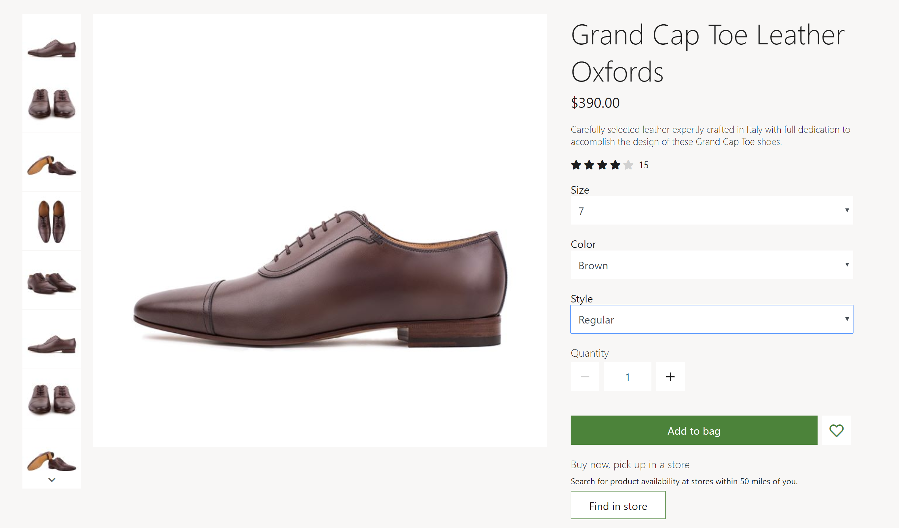
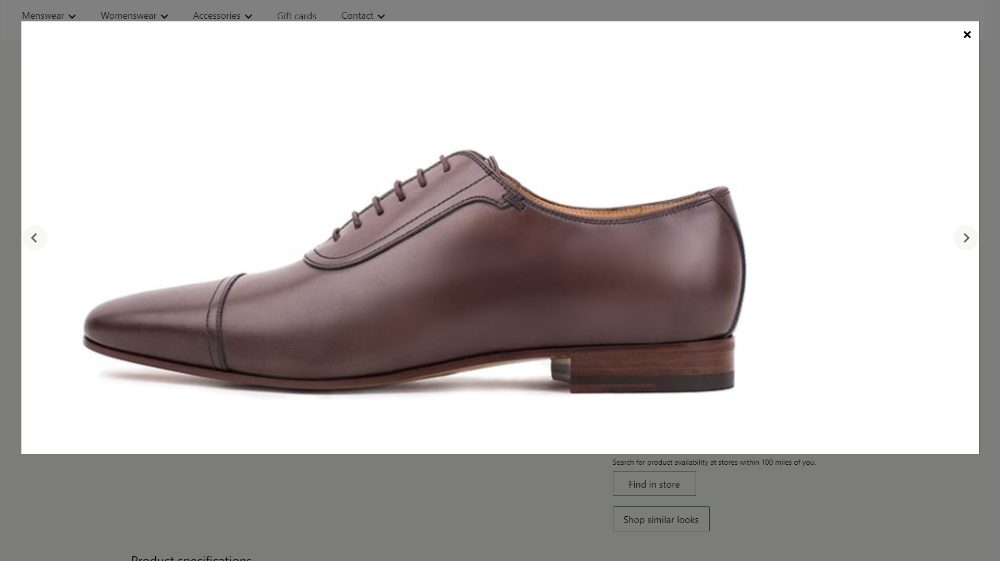

---
# required metadata

title: Media gallery module
description: This topic covers media gallery modules and describes how to add them to site pages in Microsoft Dynamics 365 Commerce.
author: anupamar-ms
manager: annbe
ms.date: 07/07/2020
ms.topic: article
ms.prod: 
ms.service: dynamics-365-commerce
ms.technology: 

# optional metadata

# ms.search.form: 
audience: Application User
# ms.devlang: 
ms.reviewer: v-chgri
ms.search.scope: Retail, Core, Operations
# ms.tgt_pltfrm: 
ms.custom: 
ms.assetid: 
ms.search.region: Global
# ms.search.industry: 
ms.author: anupamar
ms.search.validFrom: 2019-10-31
ms.dyn365.ops.version: Release 10.0.5

---

# Media gallery module

[!include [banner](includes/banner.md)]
[!include [banner](includes/preview-banner.md)]

This topic covers media gallery modules and describes how to add them to site pages in Microsoft Dynamics 365 Commerce.

## Overview

Media gallery modules display one or more images in a gallery view. Media gallery modules support thumbnail images, which can be arranged either horizontally (as a row below the image) or vertically (as a column next to the image). Media gallery modules also provide capabilities that allow images to be zoomed on or viewed in full screen. To be rendered in a media gallery module, an image must be be available in the site builder Media Gallery. Currently media gallery modules only supports images.
 
In the default mode, a media gallery module uses the product ID available from the page context (product details page) to render the corresponding product images. In Commerce headquarters, a media file path must be defined for all products. Images should then be uploaded to the Commerce site builder Media Library according to the file path that was defined for the products in headquarters. This includes images for products and product variants, if applicable. For more information on uploading images, see [Upload images](dam-upload-images.md).

In addition, a media gallery module can host a fully curated set of images on an image gallery page with no dependencies on a product. Images would need to be uploaded to site builder Media Gallery. 

Usage examples of media gallery modules:
- A media gallery module can be used on a product details page (PDP) to render product images.
- A media gallery module can be used on a product marketing page render product images.
- A media gallery module can be used on a marketing page such as a gallery page to showcase a curated set of images.

The following image shows an example of a buy box on a product details page that hosts product images using a media gallery module.

## Media gallery properties
| Property name  | Values | Description |
|----------------|--------|-------------|
| Image source   | Page context, Product ID| Default value is "Page context." If page context is selected, it expects the page to provide the product ID information. If "Product ID" is selected, the product ID for an image must be provided as the value for the "Product ID" property. This capability is available in Commerce version 10.0.12. |
| Product ID    | ID  | Applicable only if the Image Source property value is Product ID. |
| Image zoom    | Inline, Container | Allows the user to zoom on images in the media gallery. An image can be zoomed on inline, or in a separate container next to the image. This capability is available in 10.0.12 |
| Zoom scale| Decimal number| This property specifies the scale factor for magnifying the images. For example, a value of "2.5" would mean that images would be magnified 2.5 times.|
| Full screen   | True, False| This property specifies whether or not images can be viewed in full screen. In full screen mode, images can be also be further zoomed on if zoom is turned on. This capability is available in Commerce version 10.0.13. |
| Images | Images | In addition to images rendered from a product, images can be also curated for this module. These images will be appended to the product images if available. This capability is available in Commerce version 10.0.12. |
|Thumbnail orientation| Vertical, Horizontal| This property specifies whether thumbnail images should displayed in either a vertical or horizontal strip. |

The following image shows an example of a media gallery module with full screen and zoom options enabled.

The following image shows an example of a media gallery module on a page with curated images (not product images). 

## Commerce Scale Unit interaction

When the image source is derived from the page context, the product ID from the product details page is used to retrieve the images. The media gallery module retrieves the image file path for products by using Commerce Scale Unit application programming interfaces (APIs). The images are then pulled from the Media Library to render on the module.

## Add an Image gallery to a page

To add a Image gallery module to a Buy Box, see [Buy Box module](add-buy-box.md)

To add an Image gallery module to a Marketing page,

1. Go to **Templates**, and create a new template **Marketing template**
1. In the Default page, add **Container**
1. Finish editing and Publish
1. Create a new page from the Marketing template call it **Image gallery page**
1. To the Container, add **Media Gallery** module
1. In the Module property panel, set Image Source as Product id
1. In the Product id input box, provide a valid product id
1. **Save** and **Preview**
1. In Preview mode, you should be able to see the images for the product id in a gallery like view
1. In the Media gallery,  Module property panel, using Images property add an additional image
1. **Save** and **Preview**
1. In Preview mode, you should be able to see the images for the product id and the additional curated image. If you want to use only curated images, set Image source as None.
1. Set additional properties such as Zoom or Full screen etc as desired.
1. Select **Save**, select **Finish editing** to check in the template, and then select **Publish** to publish it.

## Additional resources

[Starter kit overview](starter-kit-overview.md)

[Buy box module](add-buy-box.md)

[Container module](add-container-module.md)

[Digital Asset Management](dam-upload-images.md)

