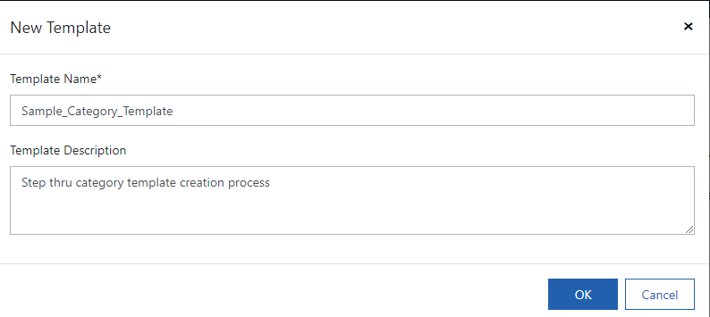
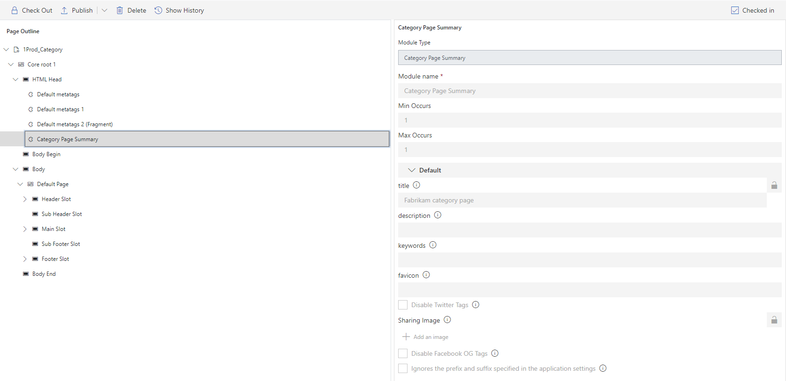
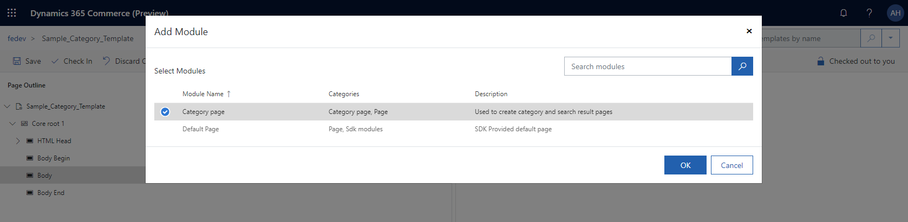
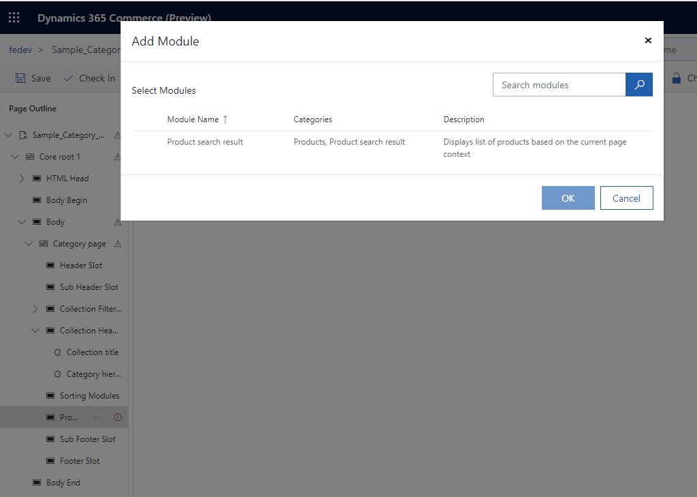
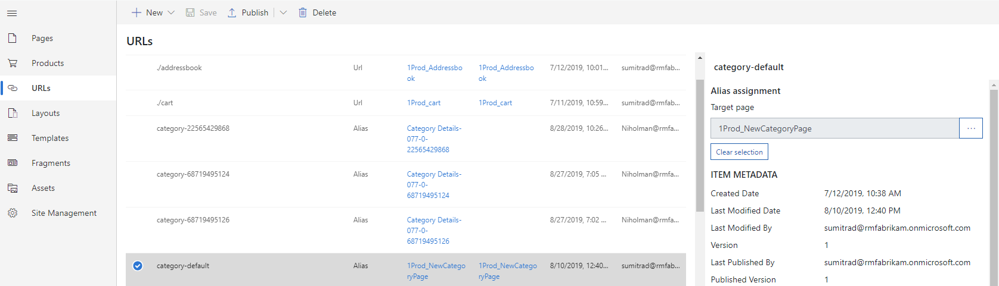

---
# required metadata

title: Add product collection modules to a category page
description: This topic describes how to add product collection modules to a category page in Dynamics 365 Commerce.
author: asharchw
manager: annbe
ms.date: 10/01/2019
ms.topic: article
ms.prod: 
ms.service: dynamics-ax-retail
ms.technology: 

# optional metadata

# ms.search.form: 
audience: Application user
# ms.devlang: 
ms.reviewer: v-chgri
ms.search.scope: Operations, Retail, Core
# ms.tgt_pltfrm: 
ms.custom: 
ms.assetid: 
ms.search.region: Global
# ms.search.industry: 
ms.author: asharchw
ms.search.validFrom: 2019-10-31
ms.dyn365.ops.version: Release 10.0.5
---

# Add product collection modules to a category page  

[!include [banner](../includes/preview-banner.md)]
[!include [banner](../includes/banner.md)]

This topic describes how to add product collection modules to a category page in Dynamics 365 Commerce.

## Overview

Product collection modules provide retailers with a quick and intuitive visual interface for authoring product collections and enable them to build compelling shopping experiences. For more information, see [Product collection module overview](product-collection-module-overview.md).

## Add a product collection module to a category page

To add a product collection module to a category page, do the following.

1. In your site in Commerce, create a new page using the same template as your default category page.
1. From the page outline, select **Sub footer slot**, click the ellipsis button (**...**), then select **Add Module**.
1. In the **Add Module** dialog box, select **Container**, then click **OK**.
1. In the **Container** module, click the ellipsis button (**...**), then select **Add Module**.
1. In the **Add Module** dialog box, select **Product collection**, then click **OK**.
1. Configure settings to choose appropriate data source and inputs for product collection
1. In the right-side properties pane of the product collection module, click **+Add a product list**. The **Select product list configuration** dialog box appears.
1. Select the type of list, enter the number of items, and select any other options available for the type of list. See the table below for more information on list types. 
1. Click **OK**.
1. Save and check in the page.

The following table shows the list types available to pick from in the **Select product list configuration** dialog box.
   
| Type                       | Description                                                                                                                                                                                                                                     | General practice                                                 | Context derivable from page context | Context author can override over page context |
|----------------------------|-------------------------------------------------------------------------------------------------------------------------------------------------------------------------------------------------------------------------------------------------|------------------------------------------------------------------|-------------------------------------|-----------------------------------------------|
| Products by Category       | Lists products categorized into a given category determined either from the page context or author-provided context                   | Enrich category, Home-page, Check out & Cart, Product pages      | Category                            | Exclusively chosen category                   |
| Related Products           | Lists products configured as related products in Retail by a merchandising manager for the relation type chosen by the author                                                                                               | Product pages, Check-out & cart, Wishlist, Customer Account page | Product, Relation type [Mandatory]  | Product, Relation type                        |
| Curated                    | Displays custom lists created in Retail by merchandizers and editors                                                                                                                                                              | Enrich category, Home-page, Check out & Cart, Product pages      | NA                                  | List picker                                   |
| Algorithmic                | **New** - Lists the newest products assorted to channels and catalogs **Best-selling** - Lists products ranked by the highest number of sales **Trending** - Lists the highest-performing products for a given time period | Home-page, Enrich category page, Check out & Cart                | Category                            | Exclusively chosen category                   |
| Frequently bought together | Uses machine learning to analyze consumer purchase patterns to recommend related items that are commonly purchased with a given product                                                                                           | Product pages, Check out & Cart                                  | Product, Cart                       | Include cart                                  |
| People also like           | Uses machine learning to analyze consumer purchase patterns to recommend items related to a given product                                                                                                                         | Product pages, Check out & Cart                                  | Product, Cart                       | NA                                            |

## Add category browse and search results modules to a category page

> [!NOTE]
> This is a generic setup for a list page, which currently encompasses both Category and Search pages. They can be created using the same template, or using different templates both based on the "Category Page" module, depending on desired enrichment experience. 

To add category browse and search results modules to a category page, do the following.

1. Go to your site and create a new template 

1. Go to the Template Editor for your template 

1. Add a new **Category Page Summary** module to the **HTML Head slot** of the template. 
  
1. Add a new **Category page** module to the body slot of the template. 
  
For all the slots within the Category Page fill out the modules you’d like your template to have as appropriate. Some general guidance: 
> **Note**: For each module added to each slot below that's expected to be readily available with your template-based configuration on during actual page configuration, make sure to mark 'Min Occurs = 1' 
   1. *Header/Footer slot* will likely contain already created header/footer fragments as used across rest of site 
   1. *Sub Head/Sub Footer slots* are designated enrichment slots, so they should be configured as appropriate for desired enrichment experience 
   1. *Collection Filters Slot* is where "Refine Menu module (refine by collection)" will exist, and is required and the following configurations can be made for the refiners
      1. Style of glyph for selection of the refiner values
      1. Style of glyph to show on expansion & collapsing of the refiner values
      1. Control expansion of the refiner values
   1. *Collection Header* contains the following modules, which are not required, but are recommended 
      1. *Category Hierarchy* provides breadcrumbs for category pages. Provides a hierarchy of the current page with relation to its parent categories.
      1. *Collection Choice Summary* provides easy UI for managing active refiners. Choice summary by collection shows choices in a summary format for a product collection and refined by choices in a refine menu.
      1. *Collection Title* allows author to provide a contextual title for list page.
   1. *Sorting Modules Slot* contains the sorting dropdown (sort-by-collection module)  
   1. *Products Slot* contains the product list module (product-search-result). And user can control following properties for look and feel of the product tiles 
      1. Size of the heading 
      1. View products as cards or plain using 'Card layout of the module' settings
      1. Number of items to be displayed per page
      1. Show/hide product description, product price, product ratings
      1. Image quality 
    
   
> [!NOTE]
> All of the aforementioned modules should be authorable by following supporting self-explanatory tooltips for every configuration in the tools.  

Once you are happy with the template, Check-in and publish the template. Then we have to create both a Search Page and a Category Page based on these templates. 

> [!NOTE]
> These pages will work in a contextual manner, as for category page there will be no default category to use, and for search page there will be no search query. 
 
1. Go to your site and create a new page  - choose the template you may have created in the above steps. 

2. Go to the Page editor for your page & observe the Page Outline on the left
>*Notice only modules (with MinOccurs =1) that were associated with slots as part of template definition, found under the category page, are readily available with template-based configurations.* 

3. Once the pages have been authored and checked in/published, you should create the appropriate URLs for the pages: 
  +.*Search Page: should have a URL path of '/search'*
       +. Go to URLs > Create a new URL and associate your search page
       
  +.*Category Page: should have an alias of 'category-default'. By using the category-default alias, you should now be able to select a category to populate the page for WYSIWYG page editing.* 
       +. Go to URLs > Create a new Alias and associate your category page
       
 

> Related Articles:
>  -	Learn here more about [Omni-channel Product Recommendations Overview](product-recommendations-overview.md)
>  -	Learn here how to [Create curated product lists]( create-editorial-recommendation-lists.md)
>  -	If you're having issues with Algorithmic lists or AI/ML based lists use this link [Product recommendations FAQ]( faq-recommendations.md) 
