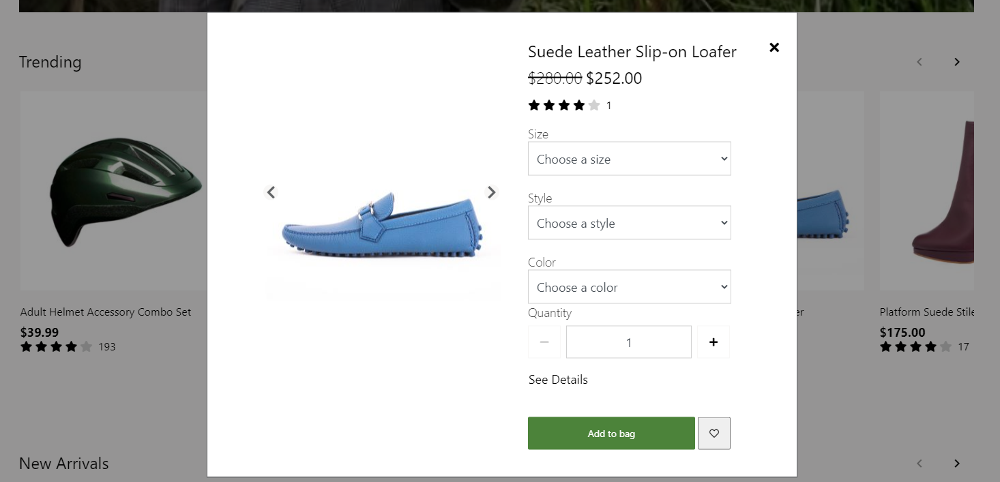

---
# required metadata

title: Quick view module
description: This topic covers Quick view module and describes how to add them to site pages in Microsoft Dynamics 365 Commerce.
author: anupamar-ms
manager: annbe
ms.date: 01/08/2021
ms.topic: article
ms.prod: 
ms.service: dynamics-365-commerce
ms.technology: 

# optional metadata

# ms.search.form: 
audience: Application User
# ms.devlang: 
ms.reviewer: v-chgri
#ms.search.scope: Retail, Core, Operations
# ms.tgt_pltfrm: 
ms.custom: 
ms.assetid: 
ms.search.region: Global
# ms.search.industry: 
ms.author: anupamar
ms.search.validFrom: 2020-01-08
ms.dyn365.ops.version: Release 10.0.17

---

# Quick view module

[!include [banner](includes/banner.md)]

This topic covers Product quick view module and describes how to add them to site pages in Microsoft Dynamics 365 Commerce.

## Overview

When browsing products in a list or a list page, the product quick view module allows a user to quickly view the product information and add it to bag without navigating to a product details page. The goal of the module is to allow a way for the user to add many items to cart while browsing a list. It provides a quick snippet of the product information that is necessary to make an add to cart decision. For more details and options to buy, it also provides a link to the product details page.

Its supported on the [Product collection](add-product-collection.md) and [Search results](search-result-module.md) module.

> [!IMPORTANT]
> The **Quick View** module is available in the Dynamics 365 Commerce 10.0.17 release.

The following image shows an example of a quick view module on a list.

## Module properties
The module properties are similar to a buy box module as it supports some of the same functions supported within a buy box.

| Property | Values | Description |
|----------------|--------|-------------|
| Heading tag | **H1**, **H2**, **H3**, **H4**, **H5**, or **H6** | This property defines the heading tag for the product title. If the buy box is at the top of the page, this property should be set to **h1** to meet accessibility standards.  |
| Allow custom price | **True** or **False** | If this property is set to **True**, the buy box allows a Custom price to be keyed-in by the user|
| Minimum price| Integer| This property is applicable only if Allow custom price is true. It sets the minimum price a user can input, e.g. $1|
| Maximum price| Integer| This property is applicable only if Allow custom price is true. It sets the maximum price a user can input, e.g. $1000|

## Site settings

The module also respects the Site Settings->Extensions for **Add to cart** similar to Buy box.  However the setting  **Navigate to cart page**  is ignored as it does not align with the intent of the Quick View module i.e. to allow the user to browse multiple products in a list and add to cart wihtout navigating away.

## Add a quick view module to a page

A quick view module can be added to the Product collection or a Search results module. To add it to product collection module, follow these steps.

1. Go to **Pages**, and select **HomePage** for Fabrikam.
1. Go to any **Product Collection** module on the homepage, select the ellipsis (**...**), and then select **Add Module**.
1. In the **Add Module** dialog box, select the **Quick View** module, and then select **OK**.
1. Set Heading tag= H2 for the Quick view module in the property panel.
1. Select **Save**, select **Finish editing** to check in the fragment, and then select **Publish** to publish it.
1
## Additional resources

[Module library overview](starter-kit-overview.md)

[Buy box](add-buy-box.md)

[Product collection](add-product-collection.md)

[Search results](search-result-module.md)
