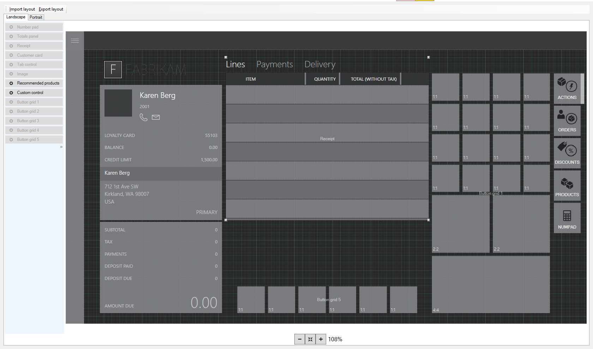
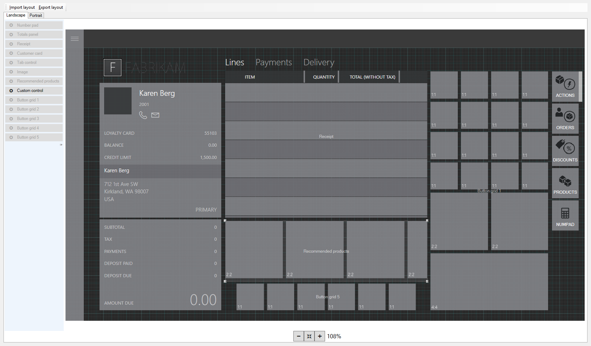
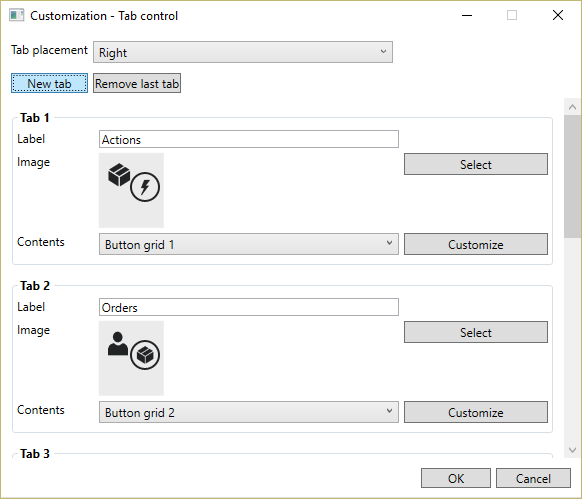
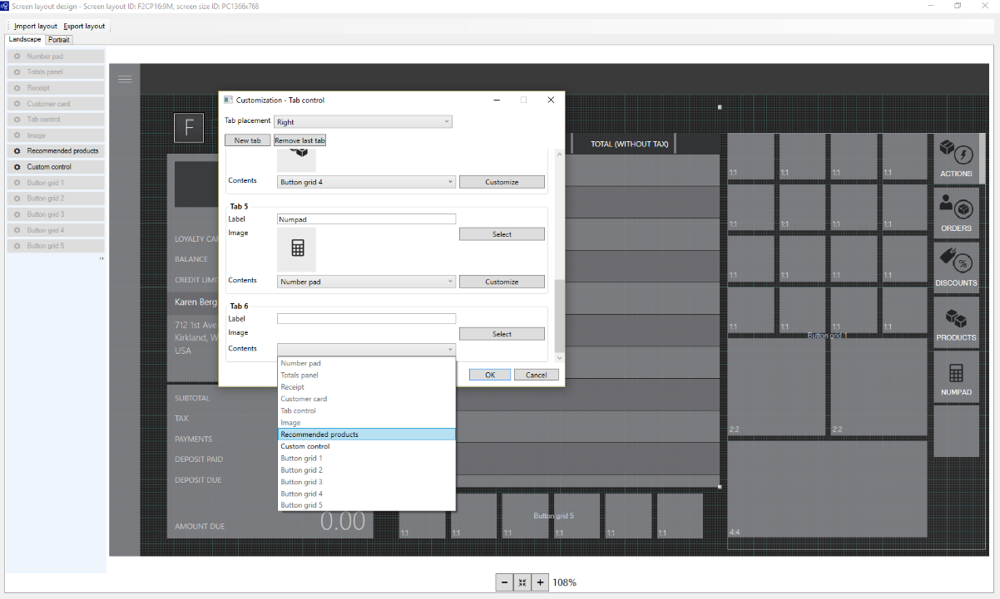

---
# required metadata

title: Add recommendations to the transaction screen
description: This article describes how to add a recommendations control to the transaction screen on a point of sale (POS) device using the screen layout designer in Microsoft Dynamics 365 Commerce.
author: bebeale
ms.date: 04/21/2023
ms.topic: article
ms.prod: 
ms.technology: 

# optional metadata

ms.search.form: RetailStoreTable, RetailTillLayout
# ROBOTS: 
audience: Application User
# ms.devlang: 
ms.reviewer: josaw
# ms.tgt_pltfrm: 
ms.custom: 260624
ms.assetid: a4f9d315-9951-451c-8ee6-37f9b3b15ef0
ms.search.region: global
ms.search.industry: Retail
ms.author: asharchw
ms.search.validFrom: 2016-11-30
ms.dyn365.ops.version: Version 1611

---

# Add recommendations to the transaction screen

[!include [banner](includes/banner.md)]

This article describes how to add a recommendations control to the transaction screen on a point of sale (POS) device using the screen layout designer in Microsoft Dynamics 365 Commerce. For more information about product recommendations, read the  [product recommendations on POS documentation](product.md).

You can display product recommendations on your POS device when you use Commerce. To display product recommendations, you need to add a control to the transaction screen using the screen layout designer. 

## Open Layout designer

1. Go to **Retail and Commerce** &gt; **Channel setup** &gt; **POS setup** &gt; **POS** &gt; **Screen layouts**.
2. Use the Quick Filter to find the screen that you want to add the control to. For example, filter on the **Screen layout ID** field using a value of **F2CP16:9M**.
3. In the list, find and select the desired record. For example, select **Name: F2CP16:9M Screen Layout ID: F2CP16:9M**.
4. Click **Layout designer**.
5. Follow the prompts to launch the layout designer. When prompted for credentials, enter the same credentials that were in use when the Layout designer was launched from **Screen layouts** page.
6. When you log in, a page similar to the one below appears. The layout will be different depending on the customizations that were made for your store.

    

## Choose a display option

There are two configurations options available. Choose the option that works best for your store, and follow the remaining instructions to finish setting up the control. The two options are:

- Recommendations are always visible.
- A **Recommendations** tab appears in the grid on the right side of the screen.

### Make recommendations always visible

1. Reduce the height of the transaction lines details area so that it is the same height as the customer panel to its left.

    

2. From the menu on the left, drag and drop the recommendations control to between the transaction line details area and the button grid in the center bottom of the transaction screen. Resize the control so it fits in that space.

    

3. Click the **X** to save and exit Layout designer.
4. In Commerce, go to **Retail and Commerce** &gt; **Retail and Commerce IT** &gt; **Distribution schedules**.
5. In the list, select **1090 Registers**.
6. Click **Run now**.

### Add a Recommendations tab to the button grid on the right side of the screen

1. Right-click in the empty space below the last tab on the button grid located on the right side of the page.

2. Click **Customize**.

    

3. Click **New tab**.
4. Find the new tab that you just added. You may need to scroll down.
5. In the **Contents** drop-down, select **Recommended products**.

    

6. In the **Label** field, type a name for the recommendations tab. For example, type 'Recommended products'.
7. In the **Image** field, select the image to appear on the tab.
8. Click **OK**. The new tab appears in the button grid.
9. Click the **X** to save and exit Layout designer.
10. In Commerce, go to **Retail and Commerce** &gt; **Retail and Commerce IT** &gt; **Distribution schedules**.
11. In the list, select **1090 Registers**.
12. Click **Run now**.

## Additional resources

[Product recommendations overview](product-recommendations.md)

[Enable Azure Data Lake Storage in a Dynamics 365 Commerce environment](enable-adls-environment.md)

[Enable product recommendations](enable-product-recommendations.md)

[Enable personalized recommendations](personalized-recommendations.md)

[Opt out of personalized recommendations](opt-out-personalization.md)

[Enable "shop similar looks" recommendations](shop-similar-looks.md)

[Add product recommendations on POS](product.md)

[Adjust AI-ML recommendations results](modify-product-recommendation-results.md)

[Manually create curated recommendations](create-editorial-recommendation-lists.md)

[Create recommendations with demo data](product-recommendations-demo-data.md)

[Product recommendations FAQ](faq-recommendations.md)

[!INCLUDE[footer-include](../includes/footer-banner.md)]
