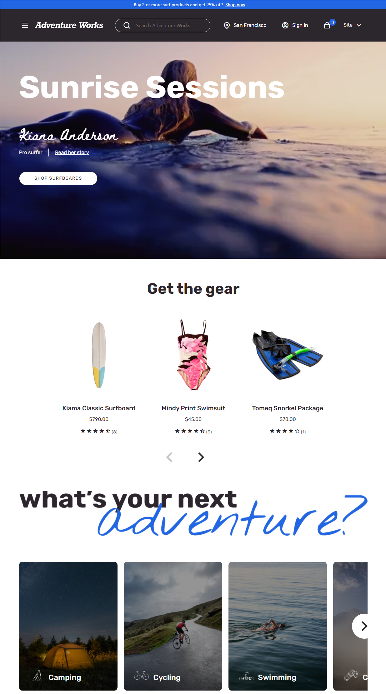

# Adventure Works theme overview

[!include [banner](includes/banner.md)]

This article gives an overview of the Adventure Works theme and describes how to apply it to site pages in Microsoft Dynamics 365 Commerce.

Dynamics 365 Commerce has a theme for e-commerce that is named Adventure Works. The Adventure Works theme showcases sports and recreational products, and is optimized for a rich and enhanced storytelling experience. It provides a modern appearance, new layouts, and animation effects to create an immersive, engaging online shopping experience for e-commerce customers.

## Trial environments in Commerce

To see what the Adventure Works theme looks like when it's deployed for business-to-consumer (B2C) and business-to-business (B2B) sites, visit the following trial sites:

- [Adventure Works B2C site](https://www.adventure-works.com/)
- [Adventure Works B2B site](https://www.adventure-works.com/business)

## Theme capabilities

The Adventure Works theme provides the following new capabilities:

- The video player module now supports heading, paragraph, and link functionality for additional storytelling.
- There are better transitions of content through animation.
- The "add to cart" action invokes the mini cart instead of providing a notification.
- The quick view module is a pane that slides in on both desktop and mobile viewports.
- There are new layouts for the site pages. 
- Marketing content can be configured for the cart and mini cart when they are empty.
- The mini cart can show promotional messages, such as "Free shipping on orders over $50."
- Description cards are rendered on search and category pages.

The Adventure Works theme now includes the following storytelling modules in the Commerce module library:

- [Tile list module](tile-list-module.md)
- [Interactive feature module](interactive-feature-module.md)
- [Active image module](active-image-module.md)
- [Subscribe module](subscribe-module.md)
- [Image list module](image-list-module.md)

The Adventure Works theme is fully responsive and provides an optimized experience for desktop, mobile, and tablet viewports.

> [!IMPORTANT]
> The Adventure Works theme and the new modules are available as of the Dynamics 365 Commerce version 10.0.20 release.

The following illustration shows an example of a home page that uses the Adventure Works theme.

The following illustration shows an example of a list page that uses the Adventure Works theme.

The following illustration shows an example of a product details page (PDP) that uses the Adventure Works theme.

## Use the Adventure Works theme for B2B sites

The Adventure Works theme is also a reference theme for business-to-business (B2B) sites. All B2B modules and workflows are showcased in the Adventure Works theme. For information about how to set up a B2B site, see [B2B site setup](./b2b/set-up-b2b-site.md).

The following illustration shows an example of a B2B home page that uses the Adventure Works theme.

## Theme extensions

The Adventure Works theme includes several theme extensions, such as the **View extensions** and **Module definition** extensions. The Adventure Works theme can be used as a reference theme to build similar extensions. For example, the list page in the Adventure Works theme is implemented as a view extension that has a horizontal refiner. (By contrast, a left pane refiner is used in the Fabrikam theme.)

Likewise, other modules include module definition extensions. For example, the [cart icon module](cart-icon-module.md) includes two additional **Empty Cart** and **Promotional Content** slots that are implemented by using module definition extensions. Additionally, a new **Mobile Logo** property has been added to the header module to support a logo on mobile viewports. This property is implemented as a header module definition extension.

For more information about theme extensions, see [Theme extensions](e-commerce-extensibility/theme-module-extensions.md).

## Install the Adventure Works theme

For information about how to install the Adventure Works theme, see [Install the Adventure Works theme](install-adventure-works.md).

## Additional resources

[Module library overview](starter-kit-overview.md)

[Tile list module](tile-list-module.md)

[Interactive feature module](interactive-feature-module.md)

[Active image module](active-image-module.md)

[Subscribe module](subscribe-module.md)

[Image list module](image-list-module.md)

[Theme extensions](e-commerce-extensibility/theme-module-extensions.md)

[Cart icon module](cart-icon-module.md)

[Set up a B2B e-commerce site](./b2b/set-up-b2b-site.md)

[!INCLUDE[footer-include](../includes/footer-banner.md)]
