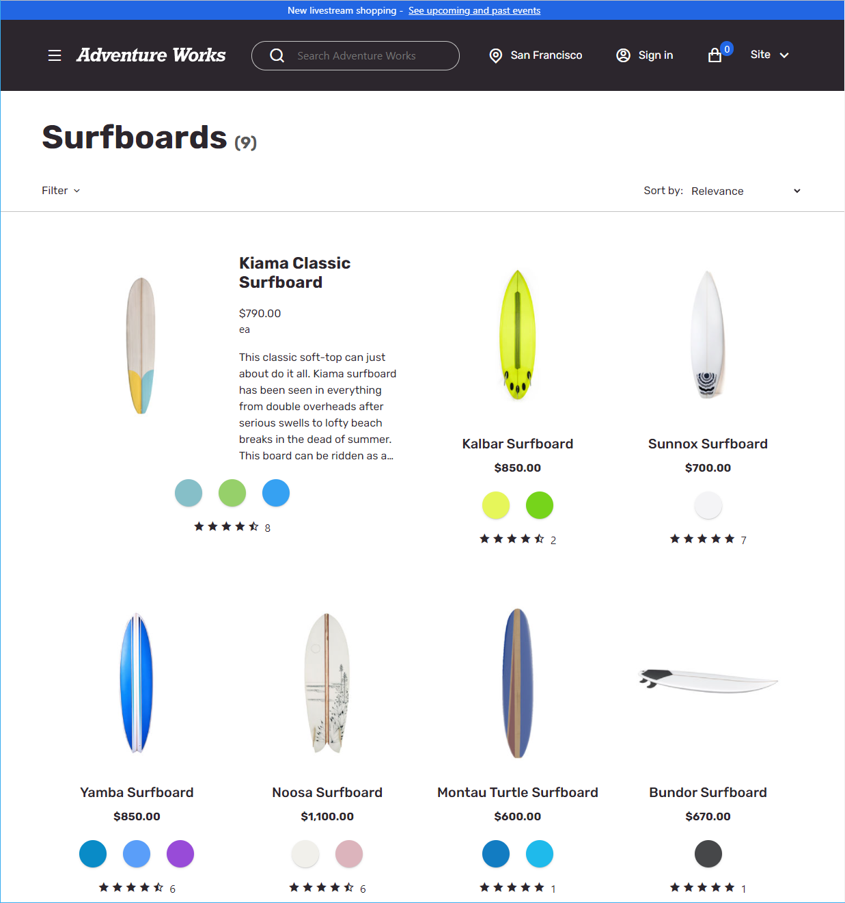
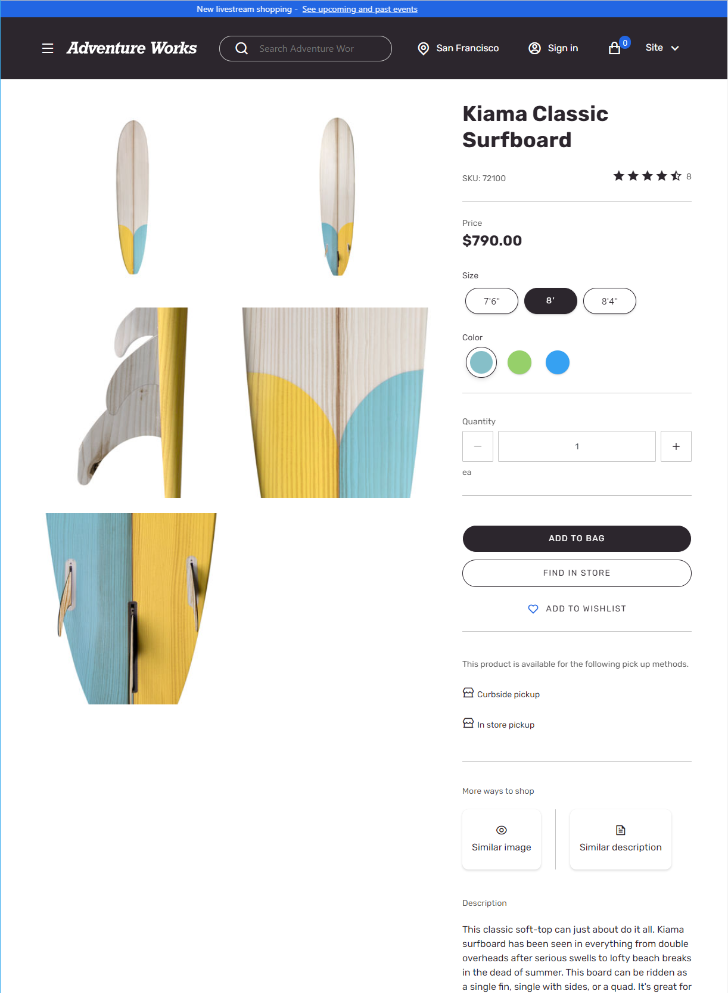

---
# required metadata

title: Adventure Works theme
description: This topic covers the Adventure Works theme and describes how to apply the theme to site pages in Microsoft Dynamics 365 Commerce.
author: anupamar-ms
ms.date: 06/24/2021
ms.topic: article
ms.prod: 
ms.technology: 

# optional metadata

ms.search.form: 
audience: Application User
# ms.devlang: 
ms.reviewer: v-chgri
# ms.tgt_pltfrm: 
# ms.custom: 
ms.search.region: Global
ms.search.industry: 
ms.author: anupamar
ms.search.validFrom: 2019-10-31
ms.dyn365.ops.version: Release 10.0.8

---

# Adventure Works theme

[!include [banner](includes/banner.md)]
[!include [banner](includes/preview-banner.md)]

This topic covers Adventure Works theme and describes how to apply the theme to site pages in Microsoft Dynamics 365 Commerce.

Dynamics 365 Commerce has a theme for e-commerce called Adventure Works that showcases sports and recreational products. The Adventure Works theme is optimized for a rich and enhanced storytelling experience and provides a modern appearance, new layouts, and animation effects to create an immersive, engaging online shopping experience for e-commerce customers. 

The Adventure Works theme provides the following new workflows:

1. The video player module now supports heading, paragraph, and links functionality for additional storytelling.
1. The add to cart action invokes the mini cart instead of providing a notification.
1. The quick view module is a pane that slides in on both desktop and mobile viewports.
1. An empty cart can now showcase promotions.

The Adventure Works theme includes the following storytelling modules in the Commerce module library: 

1. Tile list module
1. Interactive feature module
1. Subscribe module
1. Active image module
1. Image list module

The Adventure Works theme is fully responsive and provides an optimized experience for desktop, mobile, and tablet viewports. 

>[!IMPORTANT]
> The Adventure Works theme and the new modules are available as of the Dynamics 365 Commerce version 10.0.20 release.

The following example image shows a home page using the Adventure Works theme.

<kbd></kbd>

The following example image shows a list page using the Adventure works theme.

<kbd></kbd>

The following example image shows a product details page (PDP) using the Adventure Works theme.

<kbd></kbd>

## Business-to-business (B2B)

The Adventure Works theme is also a reference theme for business-to-business (B2B) sites. All B2B modules and workflows are showcased in Adventure Works theme. For information on how to setup a B2B site, see [B2B site setup](./b2b/set-up-b2b-site.md).

The following example image shows a B2B home page using the Adventure Works.

<kbd></kbd>

## Theme extensions

The Adventure Works theme includes several theme extensions, including the **View extensions** and **Module definition** extensions. The Adventure Works theme can be used as a reference theme to build similar extensions. For example, the list page on the Adventure Works theme is implemented as a view extension that has a horizontal refiner compared to the left pane refiner used in the Fabrikam theme.

Similarly, there are other modules that include module definition extensions. For example, the [Cart icon module](add-cart-icon.md) allows two new slots for **Empty Cart** and **Promotional Content** that are implementedodule definition extension. Another example would be the Header module, where a new property is added **Mobile Logo** for supporting a logo on Mobile view port. This Mobile Logo is implemented as a Header module definition extension.

For more details on extensions refer [Theme extensions](theme-module-extensions.md)

## Additional resources

[Module library overview](starter-kit-overview.md)

[Tile List module](tile-list.md)

[Interactive feature module](interactive-feature-module.md)

[Active image module](active-image-module.md)

[Subscribe module](subscribe-module.md)

[Image List module](image-list-module.md)

[Theme Extensions](theme-module-extensions.md)

[Cart icon module](add-cart-icon.md)

[!INCLUDE[footer-include](../includes/footer-banner.md)]

[B2B site setup](./b2b/set-up-b2b-site.md)
