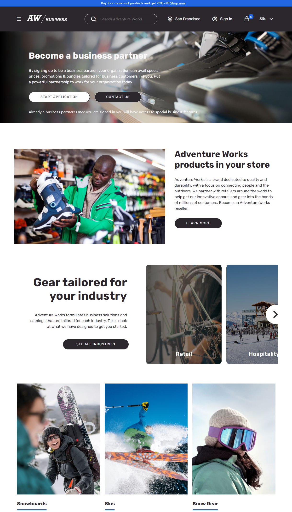

---
# required metadata

title: Adventure works theme
description: This topic covers Adventure works theme and describes how to apply the theme to site pages in Microsoft Dynamics 365 Commerce.
author: anupamar-ms
ms.date: 01/28/2021
ms.topic: article
ms.prod: 
ms.technology: 

# optional metadata

ms.search.form: 
audience: Application User
# ms.devlang: 
ms.reviewer: v-chgri
# ms.tgt_pltfrm: 
# ms.custom: 
ms.search.region: Global
ms.search.industry: 
ms.author: anupamar
ms.search.validFrom: 2019-10-31
ms.dyn365.ops.version: Release 10.0.8

---

# Adventure works theme

This topic covers Adventure works theme and describes how to apply the theme to site pages in Microsoft Dynamics 365 Commerce.

Dynamics 365 Commerce has a theme for e-commerce called Adventure works which showcases Sports and Recreational products. The theme provides a more modern appearance, new layouts, animation effects etc to create an immersive, engaging experience for a shopper. The theme is optimized for a rich and enhanced storytelling experience. 

Adventure works theme showcases  new storytelling modules and workflows.   on Video Player, Empty cart etc. The theme provide new workflows such as
1. Video player now supports Heading, Paragraph, Links for additional storytelling
2. Add to bag invokes Mini-cart instead of notifications
3. Quick view is a pane that slides-in on both Desktop and Mobile
4. Empty cart showcases promotions

The theme showcases the following modules which are included in the Module Library for storytelling
1. Tile List
1. Interactive Feature
1. Subscribe
1. Active imag
1. Image List module

The theme is fully responsive and provides an optimized experience for Desktop, Mobile and Tablet view ports. 

>[!IMPORTANT]
>Adventure works theme and the new modules shown in the theme are available in Dynamics 365 Commerce 10.0.20 release.

Below is an example of Home page on Adventure works theme

Below is an example of List page on Adventure works theme page

Below is an example of Product details page on Adventure works theme

## B2B
Adventure works theme is also a reference theme for B2B. All B2B modules have a visual representation in Adventure Works theme. 

Below is an example of B2B Home Page on Adventure works theme

## Additional resources
[Module library overview](starter-kit-overview.md)

[Tile List module](tile-list.md)

[Interactive feature module](interactive-feature-module.md)

[Active image module](active-image-module.md)

[Subscribe module](subscribe-module.md)

[Image List module](image-list-module.md)

[!INCLUDE[footer-include](../includes/footer-banner.md)]

