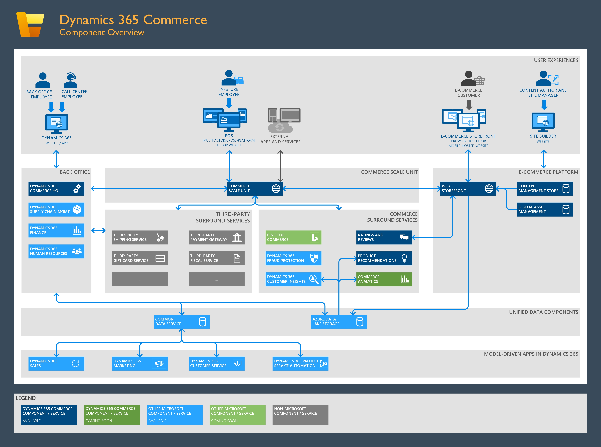

---
# required metadata

title: Dynamics 365 Commerce authenticaion flow
description: This topic provides an overview of the various authentication flows for the Dynamics 365 Commerce solution.
author: samjarawan
manager: AnnBe
ms.date: 04/09/2020
ms.topic: article
ms.prod: 
ms.service: dynamics-365-commerce
ms.technology: 

# optional metadata

ms.search.form: RetailITWorkspace
# ROBOTS: 
audience: Developer, IT Pro
# ms.devlang: 
ms.reviewer: v-chgri
ms.search.scope: Core, Operations, Retail
# ms.tgt_pltfrm: 
ms.custom: 
ms.assetid: 
ms.search.region: Global
ms.search.industry: Retail
ms.author: samjar
ms.search.validFrom: 2020-03-01
ms.dyn365.ops.version: Release 10.0.11

---

# Dynamics 365 Commerce authentication flow

[!include [banner](includes/banner.md)]

This topic provides an overview of the various authentication flows for the Dynamics 365 Commerce solution. While there are a number of different authentication scenarios and flows currently supported on the Dynamics 365 Commerce solution as described below, it is worth noting that the core authentication infrastructure of the headless commerce engine is fully based on <a href="https://openid.net/connect/" target="_blank">![OpenID Connect].

The following illustration shows an overview of Dynamics 365 Commerce components.

