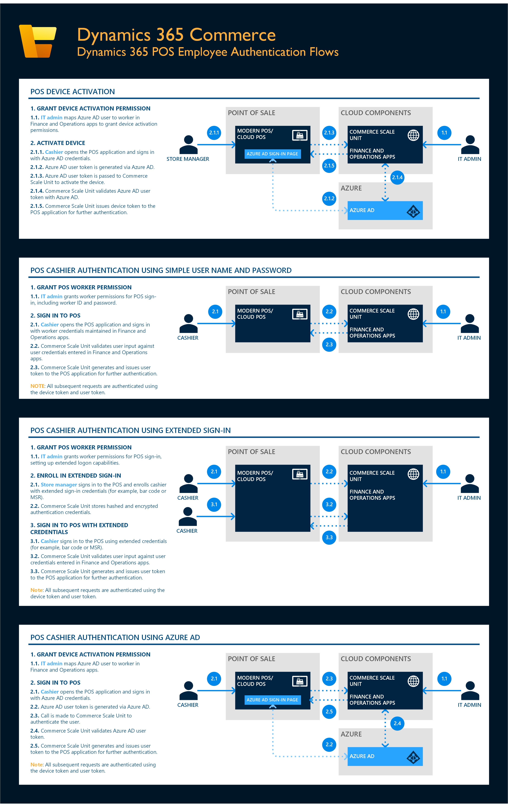

---
# required metadata

title: Dynamics 365 Commerce authentication flows
description: This topic provides an overview of the various authentication flows in Dynamics 365 Commerce.
author: samjarawan
manager: AnnBe
ms.date: 06/09/2020
ms.topic: article
ms.prod: 
ms.service: dynamics-365-commerce
ms.technology: 

# optional metadata

ms.search.form: RetailITWorkspace
# ROBOTS: 
audience: Developer, IT Pro
# ms.devlang: 
ms.reviewer: v-chgri
ms.search.scope: Core, Operations, Retail
# ms.tgt_pltfrm: 
ms.custom: 
ms.assetid: 
ms.search.region: Global
ms.search.industry: Retail
ms.author: samjar
ms.search.validFrom: 2020-03-01
ms.dyn365.ops.version: Release 10.0.11

---

# Dynamics 365 Commerce authentication flows

[!include [banner](includes/banner.md)]
[!include [banner](includes/preview-banner.md)]

This topic provides an overview of the various authentication flows in Dynamics 365 Commerce. While there are a number of different authentication scenarios and flows currently supported for the Dynamics 365 Commerce solution, the core authentication infrastructure of the Commerce Scale Unit (also known as the headless commerce engine) is fully based on [OpenID Connect](https://openid.net/connect/).

### Authentication methods

Access to each of the application programming interfaces (APIs) on the Commerce Scale Unit is natively restricted by one or more of the following roles.

- **Employee**: Access to these APIs requires a point of sale (POS) device activation (device token) and an authenticated employee.
- **Customer**: Access to these APIs requires an authenticated customer and are generally used by e-Commerce sites for such operations as retrieving order history and changing customer details.
- **Application**: Access to these APIs requires application-level authentication, for example Azure Active Directory (Azure AD) service-to-service authentication.
- **Anonymous**: These APIs are primarily used by e-Commerce sites without user authentication.
- **Customized APIs**: Access to these APIs can be restricted using any of the methods described above.

For the full list of Commerce Scale Unit APIs and their access restrictions, see [Commerce Scale Unit customer and consumer APIs](/dev-itpro/retail-server-customer-consumer-api.md).

### Supported authentication methods

The following table describes the set of supported authentication methods for APIs that require either POS device activation that genetrates a device token or user authentication that generates a user token.

|API category|Scenario|Supported authentication method|Required setup|Additional details|
|----------|-----------|------------|------------|------------|
|**Employee**|**Dynamics 365 POS authentication flows \*** |Simple cashier username and password |Configure worker in Dynamics 365 Commerce headquarters with username and password. |[Create a worker](retail-modern-pos-device-activation.md#create-a-worker) |
|**Employee**|**Dynamics 365 POS authentication flows \***|Azure AD credentials  |Configure worker in Dynamics 365 Commerce headquarters  to map to Azure AD credentials. |[Enable Azure Active Directory authentication for POS sign-in](aad-pos-logon.md) |
|**Employee**|**Dynamics 365 POS authentication flows \***|Extended sign-in credentials, for example using a barcode or magnetic stripe reader (MSR)  |Configure worker in Dynamics 365 Commerce headquarters configured for extended logon. |[Set up extended logon functionality for MPOS and Cloud POS](extended-logon.md) |
|**Customer**|**Dynamics 365 Commerce authentication flows**|Site user authentication using Azure AD B2C |Create an Azure AD business-to-consumer (B2C) application.   Add the Azure AD B2C application to the accepted list of identity providers in Dynamics 365 Commerce headquarters.   Configure the Azure AD B2C application in Commerce site builder.|[Set up a B2C tenant in Commerce](set-up-b2c-tenant.md)     [Set up custom pages for user sign-ins](custom-pages-user-logins.md)|
|**Customer**|**Dynamics 365 Commerce authentication flows**|Site user authentication using external identity provider that supports Open ID Connect |Create an Azure AD B2C application and configure it to support external identity providers.  Add the Azure AD B2C application to the accepted list of identity providers in Dynamics 365 Commerce headquarters.  Configure the Azure AD B2C application in Commerce site builder. |[Set up a B2C tenant in Commerce](set-up-b2c-tenant.md)    [Set up custom pages for user sign-ins](custom-pages-user-logins.md)|
|**Customer**|**Third-party e-Commerce authentication flows** |Site user authentication using external identity provider that supports Open ID Connect |Add external identity provider to the accepted list of identity providers in Dynamics 365 Commerce headquarters. |[Configure authentication providers](/dev-itpro/configure-authentication-providers.md)|
|**Application**|**Third-party app or service authentication flows**|Azure AD service to service / Application authentication |Add external identity provider to the accepted list of identity providers in Dynamics 365 Commerce headquarters. | |

\* Signing in to POS requires device activation for each terminal, for more information see [Point of Sale (POS) device activation](/dev-itpro/retail-device-activation.md).

### Unsupported authentication flows

|Scenario|Unsupported scenario|Details|
|----------|-----------|------------|
|**Dynamics 365 POS authentication flows**|Authentication without device activation (device token). |All POS-related Commerce Scale Unit APIs require a device activation token for authentication. |

## Dynamics 365 POS employee authentication flows

The following illustration shows POS employee authentication flows in Dynamics 365 Commerce.

<a href="https://docs.microsoft.com/dynamics365/commerce/media/arch-auth-flow-1.jpg" target="_blank">

## Dynamics 365 e-Commerce customer authentication flows

The following illustration shows e-Commerce customer authentication flows in Dynamics 365 Commerce.

<a href="https://docs.microsoft.com/dynamics365/commerce/media/arch-auth-flow-2.jpg" target="_blank">

## Third party e-Commerce customer authentication flows

The following illustration shows e-Commerce customer authentication flows in Dynamics 365 Commerce.

<a href="https://docs.microsoft.com/dynamics365/commerce/media/arch-auth-flow-3.jpg" target="_blank">

## Third party application authentication flows

The following illustration shows third-party application flows in Dynamics 365 Commerce.

<a href="https://docs.microsoft.com/dynamics365/commerce/media/arch-auth-flow-4.jpg" target="_blank">
  
## Additional resources

[Dynamics 365 Commerce architecture overview](commerce-architecture.md)

[Commerce Scale Unit customer and consumer APIs](/dev-itpro/retail-server-customer-consumer-api.md)

[POS worker logon](retail-modern-pos-device-activation.md#create-a-worker)

[Enable Azure Active Directory authentication for POS sign-in](aad-pos-logon.md)

[Set up extended logon functionality for MPOS and Cloud POS](extended-logon.md)

[Set up a B2C tenant in Commerce](set-up-b2c-tenant.md)

[Set up custom pages for user sign-ins](custom-pages-user-logins.md)

[Configure authentication providers](/dev-itpro/configure-authentication-providers.md)

[Point of Sale (POS) device activation](/dev-itpro/retail-device-activation.md)
