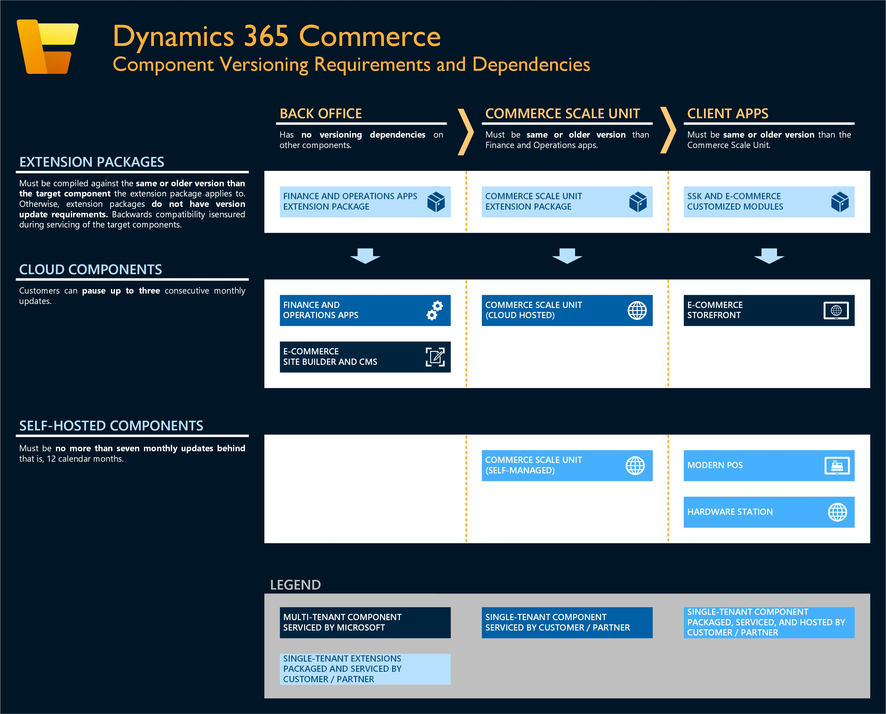

# Dynamics 365 Commerce component versioning requirements

[!include [banner](includes/banner.md)]

This article provides an overview of the component versioning requirements and dependencies for all components in the Microsoft Dynamics 365 Commerce ecosystem.

The following illustration shows an overview of Dynamics 365 Commerce components and corresponding versioning requirements and dependencies.

## Component dependencies

### Service updates

To ensure compatibility between all Commerce components that are serviced and deployed by customers and partners, you must follow several versioning dependencies during servicing updates. The following list describes all these dependencies.

- **Commerce headquarters and finance and operations apps must be on the same version as, or a later version than, Commerce Scale Unit (both cloud and self-hosted).**

    For example, if Commerce headquarters and finance and operations apps are on version 10.0.30, Commerce Scale Unit must be on version 10.0.30 or earlier (for example, 10.0.29 or 10.0.28).

- **Commerce Scale Unit must be on the same version as, or an later version than, Store Commerce app, Hardware Station, and the Commerce software development kit (SDK) and associated local site configurations (such as modules, data actions, and themes).**

    For example, if Commerce Scale Unit is on version 10.0.30, Store Commerce app, Hardware Station, and the Commerce storefront must be on version 10.0.30 or earlier (for example, 10.0.29 or 10.0.28).

- **Extension packages must be compiled against the same version as, or an earlier version than, the target component that the extension applies to.**

    For example, if the deployed Commerce Scale Unit is on version 10.0.30, the corresponding extension packages must be compiled against version 10.0.30 or earlier (for example, 10.0.29 or 10.0.28).

### Quality updates

During quality updates, no specific versioning requirements must be followed for each Commerce component, besides what is required for service updates.

## Current supported versions

The following table describes the current supported versions of various Commerce components as of **July 14, 2023**.

| Component | Latest available release / component version (first release available in Sandbox) | Earliest supported release / component version |
|---|---|---|
| Finance and operations apps | 10.0.35 | 10.0.31 |
| Commerce Scale Unit (cloud-hosted) | 10.0.35 / 9.45 | 10.0.31 / 9.41 |
| Commerce module library | 10.0.35 / 9.45 | 10.0.31 / 9.41 |
| Commerce Scale Unit (self-hosted) | 10.0.35 / 9.45 | 10.0.27 / 9.37 |
| Modern POS | 10.0.35 / 9.45 | 10.0.27 / 9.37 |
| Hardware Station | 10.0.35 / 9.45 | 10.0.27 / 9.37 |

## One Version requirements

Commerce components follow the One Version service updates. For more information, see [One Version service updates FAQ](../fin-ops-core/fin-ops/get-started/one-version.md).

### Cloud components

Customers can pause up to three consecutive updates across the following components. (Three updates correspond to approximately six calendar months.)

- Commerce headquarters and finance and operations apps
- Commerce Scale Unit (cloud-hosted)
- Commerce SDK and associated local site configurations (such as modules, data actions, and themes)

For example, customers who are currently on version 10.0.30 can pause updates to versions 10.0.31, 10.0.32, and 10.0.33. However, they must then update to version 10.0.34. In this scenario, after version 10.0.35 becomes available, version 10.0.30 is no longer supported.

### In-store components

Customers can pause up to seven consecutive updates across the following components:
- Commerce Scale Unit (self-hosted)
- Store Commerce app
- Hardware station

For example, customers who are currently on version 10.0.30 can pause updates for the released versions 10.0.31, 10.0.32, 10.0.33, 10.0.34, 10.0.35, 10.0.36 and 10.0.37. However, they must then update to version 10.0.38. In this scenario, after version 10.0.38 becomes available, version 10.0.30 is no longer supported.

## Additional resources

### Component selection

For more information about how to select the correct components to meet your needs, see the following articles:

- [Select an in-store topology](./dev-itpro/retail-in-store-topology.md)
- [Choose between Store Commerce app and Store Commerce for web](mpos-or-cpos.md)

### Servicing instructions

For more information about how to service individual components that are described in this article, see the following articles:

- [Configure and install Commerce Scale Unit](./dev-itpro/retail-store-scale-unit-configuration-installation.md)
- [Apply updates and extensions to Retail Cloud Scale Unit](../fin-ops-core/dev-itpro/deployment/update-retail-channel.md)
- [Configure and install Retail hardware station](retail-hardware-station-configuration-installation.md)
- [Package configurations and deploy them to an online channel](./e-commerce-extensibility/package-deploy.md)
<!-- [Configure, install, and activate the Store Commerce app](retail-modern-pos-device-activation.md)-->

### Extensibility and packing

For more information about serviceability for extensions, see [Create deployable packages](./dev-itpro/retail-sdk/retail-sdk-packaging.md).

[!INCLUDE[footer-include](../includes/footer-banner.md)]

