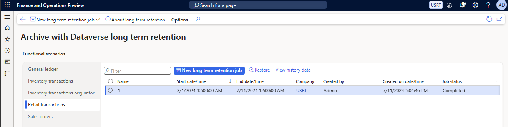

# Archive Commerce transactions

[!include [banner](includes/banner.md)]

This article describes how to archive Microsoft Dynamics 365 Commerce transactions.

## Prerequisites

To archive Microsoft Dynamics 365 Commerce transactions, you must first enable the archival framework in Dynamics 365 Commerce headquarters. Learn how to enable the archival framework in [Set up and manage archive data](../fin-ops-core/dev-itpro/sysadmin/archive-setup-manage.md).

## Enable the feature using the Feature management workspace

The **Archive with Dataverse long term retention** feature should be enabled.

To enable the feature in Commerce headquarters, go to the **Feature management** workspace (**Systems administration** \> **Workspaces** \> **Feature management**), and turn on the **Archive with Dataverse long term retention** feature flag.

## Set up an archival job

To set up an archival job, follow these steps.

1. In headquarters, go to **System administration** \> **Archive with Dataverse long term retention workspace**.
1. Select **Retail transactions**.
1. Select **New long term retention job** to open a wizard where you can schedule a new retail transaction archival job with Dataverse long-term retention.
1. Enter a name for the job, and then select **Next**.
1. Specify the date of the oldest retail transactions to archive (the **From** date).
1. Specify the date of the newest retail transactions to archive (the **To** date).
1. Select the legal entity (company) to archive the sales orders for.
1. Select **Next**.
1. Select one of the following supported scheduling types:

    - **Single run** – Long-term retention and the save to history tables run continuously until both processes are completed. Data is always archived first in Dataverse long-term retention. Then the save to history occurs.
    - **Daily during allotted time** – Long-term retention runs continuously until it's completed. The save to history tables runs only during the specified start and stop archiving time.

1. On the last page of the wizard, confirm the details, and then select **Finish** to schedule the **Retail transactions archive** job for the selected interval and company.

The archive jobs appear on the dashboard.

## View the status of the long-term retention job

To view the status of the long-term retention job, select **View progress** on the archival job dashboard to view job status details.

## View historical data

The **Archive with Dataverse long term retention** workspace shows the full archiving history. Each row in the grid shows information such as the date when the archive was created, the user who created it, and its status.

To view details about a selected archive, select the job, and then select **View history data**. The **Archived retail transactions** page shows every retail transaction that is included in the archive job. 

The following illustration shows an example of the **Archive with Dataverse long-term retention** workspace that includes a completed archive job for retail.

## Tables archived by the retail long-term retention job

The retail long-term retention job archives the following tables:

- RetailTransactionTable
- RetailTransactionCashManagementTrans
- RetailTransactionFiscalCustomer
- RetailTransactionSupplementaryInvoice
- RetailTransactionTable_RU
- RetailTransactionBankedTenderTrans
- RetailTransactionValidationError
- RetailTransactionTenderDeclarationTrans
- RetailTransactionTaxMeasure
- RetailTransactionSalesTrans
- RetailTransactionPaymentTrans
- RetailTransactionPaymentTrans_BR
- RetailTransactionSafeTenderTrans
- RetailTransactionPaymentRefundableAmounts
- RetailTransactionAdditionalAddressTrans
- RetailTransactionAddressTrans
- RetailTransactionAffiliationTrans
- RetailTransactionAttributeTrans
- RetailTransactionChargeTaxMeasure
- RetailTransactionChargeTaxTrans
- RetailTransactionChargeTaxTransGTE
- RetailTransactionCustomerAccountDepositTrans
- RetailTransactionDiscountTrans
- RetailTransactionFiscalTrans
- RetailTransactionFiscalTransExtendedData
- RetailTransactionIncomeExpenseTrans
- RetailTransactionInfocodeTrans
- RetailTransactionKitsDisassemblyTrans
- RetailTransactionLoyaltyRewardPointTrans
- RetailTransactionMarkupTrans
- RetailTransactionNoteTrans
- RetailTransactionOrderInvoiceTrans
- RetailTransactionTaxTrans_IN
- RetailTransactionTaxTrans
- RetailTransactionTaxTransGTE
- RetailEodStatementControllerLog
- RetailEodStatementEventLog
- RetailEodTransactionAggregationHeader
- RetailEodTransactionAggregationTrans
- RetailEodTransactionError
- RetailEodTransactionBankedTenderTrans
- RetailEodTransactionIncomeExpenseTrans
- RetailEodTransactionInfocodeTrans
- RetailEodTransactionOrderInvoiceTrans
- RetailEodTransactionPaymentTrans
- RetailEodTransactionSafeTenderTrans
- RetailEodTransactionSalesTrans
- RetailEodTransactionTable
- RetailEodTransactionTenderDeclarationTrans
- RetailStatementJour
- RetailStatementTrans
- RetailStatementVoucher

[!INCLUDE[footer-include](../includes/footer-banner.md)]
