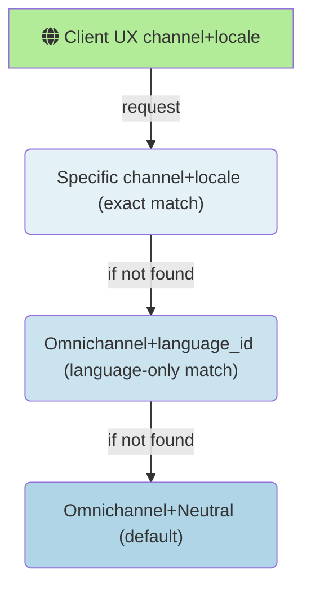
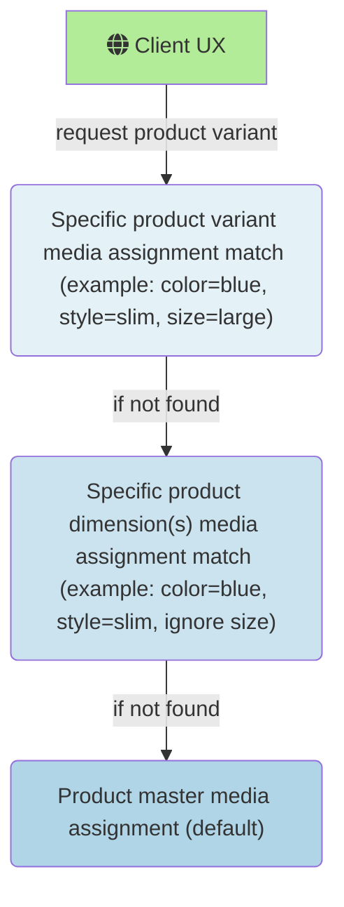

# Assign media to products and categories

[!include[banner](../includes/banner.md)]
[!include[banner](../includes/preview-banner.md)]
[!include[banner](../includes/production-ready-preview-banner.md)]

This article describes how to assign media to products and categories using omnichannel media management in Microsoft Dynamics 365 Commerce.

<!--The following procedures cover the steps to author and assign media to products.-->

> [!NOTE]
> The following procedures assume that the you have already configure omnichannel media management features in your Commerce environments by following the steps in [Omnichannel media management prerequisites and configuration](omnichannel-media-management-overview.md#omnichannel-media-management-prerequisites-and-configuration).

## Assign media to simple products

For simple products, there are two media assignment scopes available: **Primary media** and **Additional media**.

### Primary media

The **Primary media** assignment scope is used for media assignments that should always display in a product's media gallery UX, for example, a POS media gallery or an e-commerce product details page (PDP) media gallery. Media items in **Primary media** have a specific display order, and can be rearranged using the **Up** or **Down** arrows on each media item, or by dragging and dropping them to the correct position. The highest ordered image in the **Primary media** assignments is treated as the product's default image for scenarios where the entire media gallery experience isn't needed.

> [!NOTE]
> The default image returned by core data action APIs (for example, get-simple-products) for UX scenarios like category pages, search results, or any other list view, will be the highest ordered media item in the **Primary media** assignments that is an image. For example, any media item that isn't an image will be skipped, and the first image found in the **Primary media** ordered assignments will be returned as the default image for the product.

To assign media to a product's **Primary media** assignment scope, follow these steps.

1. Go to the **Product media** assignments view in the Commerce site builder **Omnichannel content** workspace, or to the same view in Commerce headquarters via the **Product media assignments** button in the **Modules \> Retail and Commerce \> Products and categories \> Released products by category** view.
2. In the search view on the left, search for a product using its name or product ID, and then select it.
3. On the upper right, select **Edit product media**.
4. In the **Master \> Primary media** section, select **Add media**.  
5. Select one or more media items from the media library picker, then select **Apply**. Alternatively, you can also upload new media by selecting **Upload** on the upper left of the media picker.
6. Use the up and down arrows, or drag and drop, to reorder the media in the **Primary media** assignments.
7. Select **Finish editing** on the upper right to check in your changes. This won't publish your edits, but allows others within your organization to see staged changes and make additional edits prior to publishing. 

### Additional media

**Additional media** is used for media assignments that have a purpose outside of a standard product media gallery.  **Additional media** items have a string property named **Purpose** that indicates its intended use. Typical **Additional media** purposes include product manuals, spec sheets, media kits, or any other custom media assignment purpose needed outside of the primary media gallery.  Any alphanumeric string can be set as an **Additional media** item's **Purpose** property, and then leveraged through Commerce SDKs, APIs, and data actions for extensibility scenarios.

To assign media to a product's **Additional media**, follow these steps.

1. Navigate to the **Product media** assignments view in either the site builder **Omnichannel content** workspace, or to the same view in headquarters via the **Product media assignments** button in the **Modules \> Retail and Commerce \> Products and categories \> Released products by category** view.
2. In the search view on the left, search for a product using its name or product ID, and then select it.
3. Select **Edit product media** on the upper right.
4. In the **Master \> Additional media** section, select **Add media**.  
5. Set the **Media purpose** property to the desired value.
6. Select a media item from the media library picker, and then select **Apply**. Alternatively, you can also upload new media selecting **Upload** on the upper left of the media picker.
7. Select **Add media** at the bottom of the pane.
8. Select **Finish editing** on the upper right to check in your changes. This won't publish your edits, but allows others within your organization to see staged changes and make additional edits prior to publishing.

## Omnichannel, channel-specific, and locale-specific media assignments

You can assign media in a hierarchical fallback structure across channels and locales. The default assignment for any product should use **Omnichannel** (for channels) and **Neutral** (for locales). These assignments are returned by default anywhere a more specific channel+local combination isn't available. For channel+locale combinations that require different product media assignments than the default Omnichannel+Neutral assignments, specific channel+locale media assignments can be configured to override the default. After a specific channel+locale media assignment for a product is created and published, the inheritance to the omnichannel combination is severed and all media assignments are controlled by the specific channel+locale media assignments.

The following illustration shows the fallback order for channel and locale media assignments.

> [!NOTE]
> The channel and locale/language context picker is located in the upper right of the **Product media** assignment workspace. Select **Omnichannel** (for channel) and **Neutral** (for locale) to configure default fallback media assignments across all channels.

## Product master, product dimension, and product variant media assignments

Product masters typically have one or more product dimensions (color, size, style, configuration) that determine the complete set of possible variants for the product. Media assigned directly to the product master will serve as the default media for any product variants or dimensions that don't have their own explicit media assignments. When media assignments are created for product dimension(s) or specific product variants, the inheritance to the product master assignments is severed and all media assignments are controlled by the dimension(s) or specific product variant media assignments.

The following illustration shows the fallback order for product master, product dimension(s), and product variant media assignments.

> [!NOTE]
> The fallback diagrams above for both product master and channel+locale media assignments illustrate the effective fallback logic, but not the actual runtime behavior. All fallback logic is processed and flattened when media assignments are published so that no unnecessary fallback processing occurs at the time of request that could impact performance. Assigning media at any level of this hierarchy will have no impact on performance between one level to the next.

### Assign media to product master

Default media for a product master is assigned using the **Master** tab in the product media view using the same steps described in [**Assign media to simple products**](#assign-media-to-simple-products). The only difference in assignment workflows between simple products and product masters is that product masters can have one or more dimensions (color, style, size, configuration) that define possible product variants for a master product. 

#### Product-specific swatches

Prior to Commerce version 10.0.35, swatches were centrally managed in headquarters by assigning a color hexidecimal value or image to dimension values (for example, color|blue = #0000ff). This central management of swatch assignments doesn't change with the introduction of the media management features included in Commerce version 10.0.35 and later. However, version 10.0.35 introduced a capability to optionally assign product-specific swatches to override within product page experiences. Swatches used for filtering products in category page, search results, and list views still use the centrally managed swatch values configured for product dimension values. These centrally managed dimension-specific swatch assignments allow search refiners and filters to behave correctly across multiple products. However, for scenarios where more detailed swatches are wanted within a single product page, product-specific swatch overrides are available. Swatch overrides can be used to show things like product-specific fabric textures, multi-colored patterns, iconography, or anything else that might go beyond the generic swatch values needed for product list refiners spanning multiple products.

> [!NOTE]
> If you plan to assign product-specific swatch assignements, it's important to ensure that swatch values are also assigned to the centrally managed list of dimension values in headquarters. This ensures that product list refiners and filters will display correctly for experiences that return results spanning multiple products (for example, category pages, search results, and product lists). To configure these centrally-managed swatch dimension assignments, follow the steps in [Configure dimension values in Commerce headquarters](dev-itpro/dimensions-swatch.md#configure-dimension-values-in-commerce-headquarters).

To assign product-specific swatches, follow these steps.

1. Go to the **Product media** assignments view in the site builder **Omnichannel content** workspace, or to the same view in headquarters via the **Product media assignments** button in the **Modules \> Retail and Commerce \> Products and categories \> Released products by category** view.
2. In the search box on the left, search for a product using its name or product ID, and then select it.
3. Select **Edit product media** on the upper right.
4. On the product's **Master** tab, under **Additional Media**, in the **Swatches** section, select **Add swatch**.
5. On the **Dimension group** drop-down menu, select the dimension group (for example, **Color**) that you want to assign.
6. On the **Dimension** drop-down menu, select the dimension values (for example, **Blue**) that you want to assign. 
7. On the **Swatch type** drop-down menu, select the swatch type that you want to assign. If using a hexidecimal code color value, select the the desired value on the color picker control, and then skip ahead to step 10. 
8. If using an image, select **Add media** to upload an image, or select an image from the omnichannel media library.
9. To select a cropped sample from a product image, toggle the **Use cropped sample of image** option to **On**. Then drag and resize the blue rectangle on the image preview to select the portion of the image to use for the swatch.
10. When finished, at the bottom of the pane, select **Add swatch**.  
11. Repeat steps 4-10 for any additional dimension values.
12. Select **Finish editing** on the upper right to check in your changes. This won't publish your edits, but allows others within your organization to see staged changes and make additional edits prior to publishing.

### Assign media to product dimensions

For product masters with multiple dimensions, it's common that media assignments are only needed for a subset of dimensions. For example, in the apparel industry it's common to take photos of different colors and styles of the same master product shirt, but not different photos for every size.  

To assign media to certain product dimensions, follow these steps.

1. Go to the **Product media** assignments view in the site builder **Omnichannel content** workspace, or to the same view in headquarters via the **Product media assignments** button in the **Modules \> Retail and Commerce \> Products and categories \> Released products by category** view.
2. In the search box on the left, search for a product master using its name or product ID, and then select it. The product master must be configured in headquarters with more than one dimension.
3. Select **Edit product media** on the upper right.
4. Select the **Dimensions** tab at the top of the workspace.
5. Select **Create assignment matrix** in the middle of the workspace. If someone has already created an assignment matrix for this product master, then skip ahead to step 7.
6. Select the dimension(s) that you want to use for media assignments, and then select **Create assignment matrix** at the bottom of the pane. A grid matrix with your chosen dimensions appears.
7. Select a cell in the grid to navigate to the assignment view for that dimension value.
8. Edit your primary and additional media assignments for the chosen dimension combination using the **Add media** button and the trash can symbol that appears on each media item when selected. 
9. Use the up and down arrows to reorder the media in the **Primary media** assignments. Alternatively, you can also drag and drop items to reorder media.
10. When your changes are complete, select **Finish editing** on the upper right to check in the new set of media assignments. This won't publish your edits, but allows others within your organization to see staged changes and make additional edits prior to publishing.

### Assign media to product variants

Assigning media to individual product variants disables the fallback logic for both dimension or master media assignments, and media assignments for the selected variant are entirely controlled at the variant level.

To assign media to a specific product variant, follow these steps.

1. Go to the **Product media** assignments view in the site builder **Omnichannel content** workspace, or to the same view in headquarters via the **Product media assignments** button in the **Modules \> Retail and Commerce \> Products and categories \> Released products by category** view.
2. In the search box on the left, search for a product master using its name or product ID, and then select it. The product master must be configured in headquarters with more than one dimension.
3. Select **Edit product media** on the upper right.
4. Select the **Variant** tab at the top of the workspace.
5. Find the variant you wish to edit, and in the **Assign media** column, select the plus (**+**) symbol (or the preview image, if media is already assigned). This action navigates you to the media assignment editing workspace for the chosen product variant.
6. Edit your primary and additional media assignments for the chosen product variant using the **Add media** button and the trash can symbol that appears on each media item when selected. 
9. Use the up and down arrows to reorder the media in the **Primary media** assignments. Alternatively, you can also drag and drop items to reorder media.
10. When your changes are complete, select **Finish editing** on the upper right to check in the new set of media assignments. This won't publish your edits, but allows others within your organization to see staged changes and make additional edits prior to publishing.

## Preview product media assignments

Omnichannel media assignments, by definition, can apply across a range of channels and user experiences (or example, POS devices or e-commerce PDPs). To preview media assignments that span multiple channels, the omnichannel product media workspace has a generic media gallery preview experience to validate how media should display for a product's primary media assignments.

To preview primary product media assignments, follow these steps.

1. Go to the **Product media** assignments view in the site builder **Omnichannel content** workspace, or to the same view in headquarters via the **Product media assignments** button in the **Modules \> Retail and Commerce \> Products and categories \> Released products by category** view.
2. In the search box on the left, search for a product using its name or product ID, and then select it.
3. Select **Preview** on the command bar to show the primary media preview interface. The default view shows any product master primary media in the media gallery preview.
5. If the product is configured with dimensions, select different dimension values in the drop-down menus to preview the media gallery experience for different product variants.
6. Select **Close** to exit the preview experience.

## Category media assignments

Commerce currently supports a single default image to be assigned to each channel-specific product category. Category media assignments are generally used for category navigation user experiences. Category media assignments are always channel-specific, which means that default media assignments aren't made at the omnichannel level, like they can be for individual products.  

To assign a default image for a channel-specific category, follow these steps.

1. Go to the **Product media** assignments view in the site builder **Omnichannel content** workspace, or to the same view in headquarters via the **Product media assignments** button in the **Modules \> Retail and Commerce \> Products and categories \> Released products by category** view.
2. On the upper right of the command bar, set the channel context picker to any channel other than **Omnichannel**.
3. In the search box on the left, search for a known category name. Category records have the word **Category** underneath the name in the results list. Find the desired category and select it.
4. In the media assignment workspace, on the upper right, select **Edit category media**.
5. In the **Primary media** section, select **Add media**.
6. Select (or upload) the category image to assign from the media picker, and then select **Apply**. 
7. Select **Finish editing** on the upper right to check in the category media assignment. This won't publish your edits, but allows others within your organization to see staged changes and make additional edits prior to publishing.

## Additional resources

[Omnichannel media management overview](omnichannel-media-management-overview.md)

[Publish media assignments](publish-media-omnichannel.md)

[Copy omnichannel content between tenants](copy-content-between-tenants.md)

[!INCLUDE[footer-include](../includes/footer-banner.md)]
