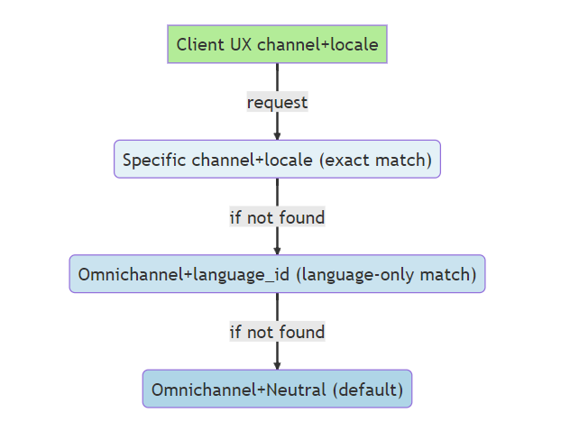
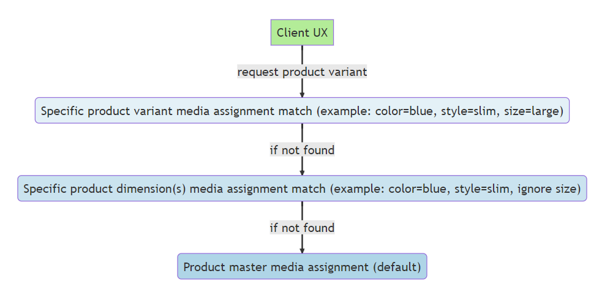

# Assign media to products and categories

[!include[banner](../includes/banner.md)]

This article describes how to assign media to products and categories by using omnichannel media management in Microsoft Dynamics 365 Commerce.

> [!NOTE]
> The following procedures assume that you've already configured omnichannel media management features in your Commerce environments by following the steps in [Omnichannel media management prerequisites and configuration](omnichannel-media-management-overview.md#omnichannel-media-management-prerequisites-and-configuration).

## Assign media to simple products

For simple products, two media assignment scopes are available: **Primary media** and **Additional media**.

### Primary media

The **Primary media** assignment scope is used for media assignments that should always appear in the user experience for a product's media gallery. Examples include a POS media gallery or an e-commerce product details page (PDP) media gallery. Media items in the **Primary media** assignment scope have a specific display order. They can be rearranged by using the up or down arrow button on each media item, or by dragging media items to their correct position. In scenarios where the whole media gallery experience isn't required, the image that has the highest order in the **Primary media** assignment scope is treated as the product's default image.

> [!NOTE]
> For user experience scenarios such as category pages, search results, or any other list view, the default image that core data action APIs (for example, get-simple-products) return is the media item that has the highest order in the **Primary media** assignment scope and that's an image. For example, any media item that isn't an image is skipped, and the first image that's found in the **Primary media** ordered assignments is returned as the default image for the product.

To assign media to a product's **Primary media** assignment scope, follow these steps.

1. In the Commerce site builder **Omnichannel content** workspace, open the **Product media** assignment view. Alternatively, you can open the same view in Commerce headquarters by selecting **Product media assignments** in the **Released products by category** view (**Modules \> Retail and Commerce \> Products and categories \> Released products by category**).
1. In the search field on the left, search for a product by its name or product ID. Then select it.
1. In the upper right, select **Edit product media**.
1. On the product's **Master** tab, in the **Primary media** section, select **Add media**.
1. In the media library picker, select one or more media items. Then select **Apply**. Alternatively, you can upload new media by selecting **Upload** in the upper left of the media picker.
1. To reorder the media in the **Primary media** assignments, use the up and down arrow buttons, or drag the media items to their correct position.
1. In the upper right, select **Finish editing** to check in your changes. Although this action doesn't publish your edits, it does enable other users in your organization to view staged changes and make additional edits before publication.

### Additional media

The **Additional media** assignment scope is used for media assignments that have a purpose outside a standard product media gallery. **Additional media** items have a **Media purpose** string property that indicates its intended use. Typical **Additional media** purposes include product manuals, spec sheets, media kits, and any other custom media assignment purpose that's outside the primary media gallery. Any alphanumeric string can be set as the value of an **Additional media** item's **Media purpose** property. That string can then be accessed via Commerce software development kits (SDKs), APIs, and data actions for extensibility scenarios.

To assign media to a product's **Additional media** assignment scope, follow these steps.

1. In the site builder **Omnichannel content** workspace, open the **Product media** assignment view. Alternatively, you can open the same view in headquarters by selecting **Product media assignments** in the **Released products by category** view.
1. In the search field on the left, search for a product by its name or product ID. Then select it.
1. In the upper right, select **Edit product media**.
1. On the product's **Master** tab, in the **Additional media** section, select **Add media**.
1. Set the **Media purpose** property to the desired value.
1. In the media library picker, select a media item. Then select **Apply**. Alternatively, you can upload new media by selecting **Upload** in the upper left of the media picker.
1. At the bottom of the pane, select **Add media**.
1. In the upper right, select **Finish editing** to check in your changes. Although this action doesn't publish your edits, it does enable other users in your organization to view staged changes and make additional edits before publication.

## Omnichannel, channel-specific, and locale-specific media assignments

You can assign media in a hierarchical fallback structure across channels and locales. The default assignments for any product should be **Omnichannel** (for channels) and **Neutral** (for locales). These assignments are returned by default whenever a more specific combination of a channel and a locale isn't available. For channel and locale combinations that require different product media assignments than the default **Omnichannel** and **Neutral** assignments, specific channel and locale media assignments can be configured to override the default assignments. After a specific channel and locale media assignment is created and published for a product, the inheritance to the omnichannel combination is severed, and all media assignments are controlled by the specific channel and locale media assignments.

The following illustration shows the fallback order for channel and locale media assignments.

> [!NOTE]
> The channel and locale/language context picker is in the upper right of the **Product media** assignment view. To configure default fallback media assignments across all channels, select **Omnichannel** (for channel) and **Neutral** (for locale).

## Product master, product dimension, and product variant media assignments

Product masters typically have one or more product dimensions (color, size, style, or configuration) that determine the complete set of possible variants for the product. Media that are assigned directly to the product master serve as the default media for any product variants or dimensions that don't have their own explicit media assignments. When media assignments are created for product dimensions or specific product variants, the inheritance to the product master assignments is severed, and all media assignments are controlled by the dimensions or the specific product variant media assignments.

The following illustration shows the fallback order for product master, product dimensions, and product variant media assignments.

> [!NOTE]
> Although the preceding fallback diagrams for channel and locale media assignments and product master media assignments show the effective fallback logic, they don't show the actual runtime behavior. All fallback logic is processed and flattened when media assignments are published, so that no unnecessary fallback processing that might affect performance occurs at the time of the request. Media can be assigned at any level of this hierarchy without affecting the performance between one level and the next.

### Assign media to a product master

Default media for a product master are assigned on the **Master** tab in the product media view. The steps are the same as the steps for [assigning media to simple products](#assign-media-to-simple-products). The only difference is that product masters can have one or more dimensions (color, style, size, or configuration) that define possible product variants for a master product.

#### Product-specific swatches

Before Commerce version 10.0.35, swatches were centrally managed in headquarters by assigning a hexadecimal color value or image to dimension values (for example, **color|blue = #0000ff**). The introduction of the media management features in Commerce version 10.0.35 doesn't change this centralized management of swatch assignments. However, version 10.0.35 introduced a capability to optionally assign product-specific swatches as overrides in product page experiences.

Swatches that are used to filter products in category page, search result, and list views still use the centrally managed swatch values that are configured for product dimension values. These centrally managed dimension-specific swatch assignments enable search refiners and filters to behave correctly across multiple products. However, for scenarios where more detailed swatches are desired on a single product page, product-specific swatch overrides are available. Swatch overrides can be used to show product-specific fabric textures, multi-colored patterns, iconography, or anything else that goes beyond the generic swatch values that are required for product list refiners that span multiple products.

> [!NOTE]
> If you plan to assign product-specific swatch overrides, make sure that swatch values are also assigned to the centrally managed list of dimension values in headquarters. In this way, you ensure that product list refiners and filters are shown correctly for experiences that return results that span multiple products (for example, category pages, search results, and product lists). To configure centrally managed swatch dimension assignments, follow the steps in [Configure dimension values in Commerce headquarters](dev-itpro/dimensions-swatch.md#configure-dimension-values-in-commerce-headquarters).

To assign product-specific swatches, follow these steps.

1. In the site builder **Omnichannel content** workspace, open the **Product media** assignment view. Alternatively, you can open the same view in headquarters by selecting **Product media assignments** in the **Released products by category** view.
1. In the search field on the left, search for a product by its name or product ID. Then select it.
1. In the upper right, select **Edit product media**.
1. On the product's **Master** tab, under **Additional media**, in the **Swatches** section, select **Add swatch**.
1. On the **Dimension group** menu, select the dimension group to assign (for example, **Color**).
1. On the **Dimension** menu, select the dimension values to assign (for example, **Blue**).
1. On the **Swatch type** menu, select the swatch type to assign.
1. If you're using a hexadecimal color value, select the desired value in the color picker control. Then skip ahead to step 11.
1. If you're using an image, select **Add media** to upload an image, or select an image in the omnichannel media library.
1. To select a cropped sample from a product image, set the **Use cropped sample of image** option to **On**. Then drag and resize the blue rectangle on the image preview to select the portion of the image to use for the swatch.
1. When you've finished, at the bottom of the pane, select **Add swatch**.
1. Repeat steps 4 through 11 for each additional dimension value.
1. In the upper right, select **Finish editing** to check in your changes. Although this action doesn't publish your edits, it does enable other users in your organization to view staged changes and make additional edits before publication.

### Assign media to product dimensions

For product masters that have multiple dimensions, media assignments are typically required only for a subset of dimensions. For example, in the apparel industry, photos are usually taken for each color and style of the same master product shirt, but not for each size.

To assign media to product dimensions, follow these steps.

1. In the site builder **Omnichannel content** workspace, open the **Product media** assignment view. Alternatively, you can open the same view in headquarters by selecting **Product media assignments** in the **Released products by category** view.
1. In the search field on the left, search for a product master by its name or product ID. Then select it. The product master that you select must be configured with more than one dimension in headquarters.
1. In the upper right, select **Edit product media**.
1. At the top of the workspace, select the **Dimensions** tab.
1. In the center of the workspace, select **Create assignment matrix**. If someone has already created an assignment matrix for this product master, skip ahead to step 7.
1. Select the dimensions to use for media assignments, and then, at the bottom of the pane, select **Create assignment matrix**. A grid matrix that has your selected dimensions appears.
1. Select a cell in the grid to go to the assignment view for that dimension value.
1. Edit the primary and additional media assignments for the selected dimension combination by using the **Add media** button and the trash can symbol that appears on each media item when it's selected.
1. To reorder the media in the **Primary media** assignments, use the up and down arrow buttons, or drag the media items to their correct position.
1. When you've completed your changes, in the upper right, select **Finish editing** to check in the new set of media assignments. Although this action doesn't publish your edits, it does enable other users in your organization to view staged changes and make additional edits before publication.

### Assign media to product variants

If you assign media to individual product variants, you disable the fallback logic for both dimension media assignments and master media assignments. In this case, media assignments for the selected variant are controlled entirely at the variant level.

To assign media to a specific product variant, follow these steps.

1. In the site builder **Omnichannel content** workspace, open the **Product media** assignment view. Alternatively, you can open the same view in headquarters by selecting **Product media assignments** in the **Released products by category** view.
1. In the search field on the left, search for a product master by its name or product ID. Then select it. The product master that you select must be configured with more than one dimension in headquarters.
1. In the upper right, select **Edit product media**.
1. At the top of the workspace, select the **Variant** tab.
1. Find the variant that you want to edit, and then, in the **Assign media** column, select the plus sign (**+**). Alternatively, if media are already assigned, select the preview image. You're taken to the media assignment editing workspace for the selected product variant.
1. Edit the primary and additional media assignments for the selected product variant by using the **Add media** button and the trash can symbol that appears on each media item when it's selected.
1. To reorder the media in the **Primary media** assignments, use the up and down arrow buttons, or drag the media items to their correct position.
1. When you've completed your changes, in the upper right, select **Finish editing** to check in the new set of media assignments. Although this action doesn't publish your edits, it does enable other users in your organization to view staged changes and make additional edits before publication.

## Preview product media assignments

By definition, omnichannel media assignments can apply across a range of channels and user experiences (for example, POS devices or e-commerce PDPs). The omnichannel product media workspace has a generic media gallery preview experience that lets you preview media assignments that span multiple channels. In this way, you can validate how media should be shown for a product's primary media assignments.

To preview primary product media assignments, follow these steps.

1. In the site builder **Omnichannel content** workspace, open the **Product media** assignment view. Alternatively, you can open the same view in headquarters by selecting **Product media assignments** in the **Released products by category** view.
1. In the search field on the left, search for a product by its name or product ID. Then select it.
1. On the command bar, select **Preview** to show the primary media preview interface. The default view shows any product master primary media in the media gallery preview.
1. If the product is configured with dimensions, select different dimension values on the dropdown menus to preview the media gallery experience for different product variants.
1. Select **Close** to exit the preview experience.

## Category media assignments

Commerce currently supports the assignment of a single default image to each channel-specific product category. Category media assignments are generally used for category navigation user experiences. Category media assignments are always channel-specific. Therefore, default media assignments aren't made at the omnichannel level as they can be for individual products.

To assign a default image for a channel-specific category, follow these steps.

1. In the site builder **Omnichannel content** workspace, open the **Product media** assignment view. Alternatively, you can open the same view in headquarters by selecting **Product media assignments** in the **Released products by category** view.
1. In the upper right of the command bar, set the channel context picker to any channel other than **Omnichannel**.
1. In the search field on the left, search for a known category name. Category records have the word "Category" beneath the name in the list of search results. Find the desired category, and select it.
1. In the media assignment workspace, in the upper right, select **Edit category media**.
1. In the **Primary media** section, select **Add media**.
1. Select (or upload) the category image to assign from the media picker, and then select **Apply**.
1. In the upper right, select **Finish editing** to check in the category media assignment. Although this action doesn't publish your edits, it does enable other users in your organization to view staged changes and make additional edits before publication.

## Additional resources

[Omnichannel media management overview](omnichannel-media-management-overview.md)

[Publish media assignments](publish-media-omnichannel.md)

[Copy omnichannel content between tenants](copy-content-between-tenants.md)

[Bulk import and export digital assets using manifests](import-export-manifest.md)

[Configure dimension values in Commerce headquarters](dev-itpro/dimensions-swatch.md#configure-dimension-values-in-commerce-headquarters)

[!INCLUDE[footer-include](../includes/footer-banner.md)]
