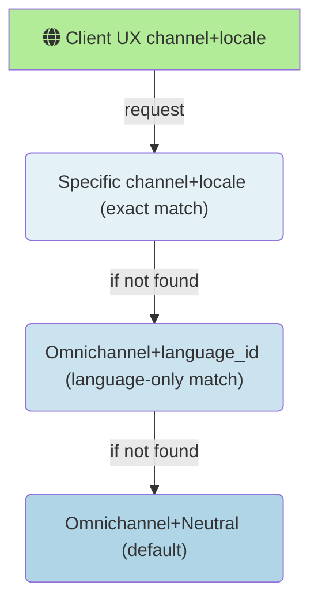
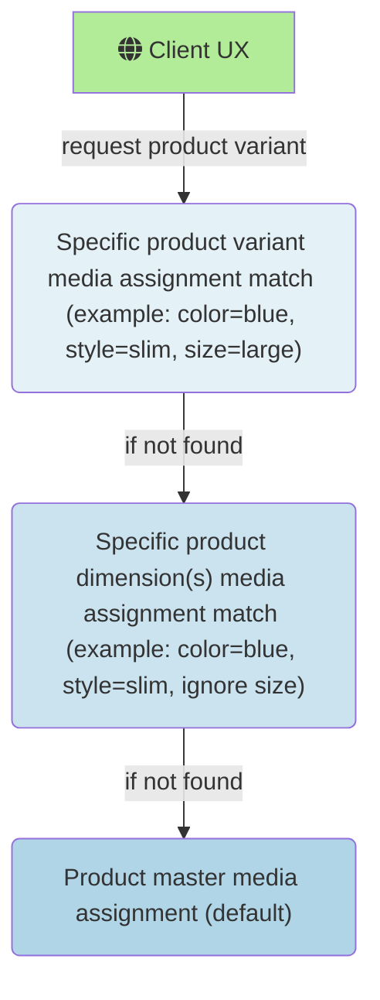

# Assign media to products and categories

[!include[banner](../includes/banner.md)]

This article describes how to assign media to products and categories using omnichannel media management in Microsoft Dynamics 365 Commerce.

The following topics cover the steps to author and assign media to products.  

> [!NOTE]
> The following procedures assume that the you have already enabled this feature for your environment by following the steps in [**Omnichannel media management prerequisites and configuration**](omnichannel-media-management-overview.md#omnichannel-media-management-prerequisites-and-configuration).

### Assign media to simple products

For simple products, there are two media assignment scopes available: **Primary media** and **Additional media**.

### Primary media

**Primary media** is used for media assignments that should always display in a product's media gallery UX (examples: Point of Sale media gallery, e-Commerce PDP media gallery, etc.).  Media items in **Primary media** have a specific display order, and can be re-arranged using the **Up** or **Down** arrow buttons on each media item or by dragging and dropping them to the correct position.  The highest ordered image in the **Primary media** assignments is treated as the product's default image for scenarios where the entire media gallery experience isn't needed.
> [!NOTE]
> The default image returned by core data-action APIs (example: get-simple-products) for UX scenarios like category pages, search results, or any other list view, will be the highest ordered media item in the **Primary media** assignments that is an image (example: any media item that isn't an image will be skipped over, and the first image found in the **Primary media** ordered assignments will be returned as the default image for the product).

To assign media to a product's **Primary media**, follow these steps:
1. Navigate to the **Product media** assignments view in either **site builder's** **Omnichannel content** workspace, or to the same view in headquarters via the **Product media assignments** button in the released products by category view.
2. Search for a product using its name or product ID in the search view on the left, and select it.
3. Click the **Edit product media** button in the upper right.
4. Click the **Add media** button in the Master > **Primary media** section.  
5. Select one or more media items from the media library picker (you can also upload new media here with the **Upload** button in the upper left of the media picker), then click **Apply**.
6. Use the up and down arrows, or drag and drop, to reorder the media in the **Primary media** assignments.
7. Click **Finish editing** in the upper right to check in your changes (this won't publish your edits, but will allow others within your organization to see staged changes and make additional edits prior to publish). 

### Additional media

**Additional media** is used for media assignments that have a purpose outside of a standard product media gallery.  **Additional media** items have a string property named **Purpose** that indicates its intended use.  Typical **Additional media** purposes include product manuals, spec sheets, media kits, or any other custom media assignment purpose needed outside of the primary media gallery.  Any alphanumeric string can be set as an **Additional media** item's **Purpose** property, and then leveraged through Commerce SDKs, APIs, and data actions for extensibility scenarios.

To assign media to a product's **Additional media**, follow these steps:
1. Navigate to the **Product media** assignments view in either **site builder's** **Omnichannel content** workspace, or to the same view in headquarters via the **Product media assignments** button in the released products by category view.
2. Search for a product using its name or product ID in the search view on the left, and select it.
3. Click the **Edit product media** button in the upper right.
4. Click the **Add media** button in the Master > **Additional media** section.  
5. Set the **Media purpose** property to the desired value.
6. Select a media item from the media library picker (you can also upload new media here with the **Upload** button in the upper left of the media picker), then click **Apply**.
7. Click the **Add media** button at the bottom of the panel.
8. Click **Finish editing** in the upper right to check in your changes (this won't publish your edits, but will allow others within your organization to see staged changes and make additional edits prior to publish). 

### Omnichannel, channel-specific, and locale-specific media assignments

Media can be assigned in a hierarchical fallback manner across channels and locales.  The default assignment for any product should use Omnichannel (channel) and Neutral (locale).  These assignments will be returned by default anywhere a more specific channel+local combination isn't available.  For channel+locale combinations that require different product media assignments than the default Omnichannel+Neutral assignments, specific channel+locale media assignments can be configured to override the default.  After a specific channel+locale media assignment for a product is created and published, the inheritance to the omnichannel combination is severed and all media assignments are controlled by the specific channel+locale media assignments.

Here's the fallback order for channel and locale media assignments:

> [!NOTE]
> The channel and locale/language context picker is located in the upper right of the **Product media** assignment workspace.  Select **Omnichannel** (for channel) and **Neutral** (for locale) to configure default fallback media assignments across all channels.

### Product master, product dimension(s), and product variant media assignments

Product masters typically have one or more product dimensions (color, size, style, configuration) which determine complete set of possible variants for the product.  Media assigned directly to the product master will serve as the default media for any product variants or dimensions that don't have their own explicit media assignments.  When media assignments are created for product dimension(s) or specific product variants, the inheritance to the product master assignments is severed and all media assignments are controlled by the dimension(s) or specific product variant media assignments.

Here's the fallback order for product master, product dimension(s), and product variant media assignments:

>[!NOTE]
>The fallback diagrams above for both product master and channel+locale media assignments illustrate the effective fallback logic, but _not_ the actual runtime behavior.  All the fallback logic is processed and flattened when the media assignments are published so that no unecessary fallback processing occurs at the time of request that could impact performance.  Assigning media at any level of this hierarchy will have _no_ impact on performance between one level to the next.

### Assign media to product master

Default media for a product master is assigned using the **Master** tab in the product media view using the same steps described in the [**Assign media to simple products**](#assign-media-to-simple-products) section. The only difference in assignment workflow between simple products and product masters is that product masters can have one or more dimensions (color, style, size, configuration), which in turn define possible product variants for a master product. 

#### Product-specific swatches

Prior to Commerce version 10.0.35, swatches were centrally managed in headquarters by assigning a color hex value or image to dimension values (_example_: color|blue = #0000ff).  This central management of swatch assignments does _not_ change with the introduction of the media management features included in 10.0.35+ versions of Commerce; but there's a new capability to optionally assign product-specific swatches to override within product page experiences.  Swatches used for filtering products in category page, list view, and search results still use the centrally managed swatch values configured for product dimension values.  These centrally managed dimension-specific swatch assignments allow search refiners and filters to behave correctly across multiple products. But for scenarios where more detailed swatches are wanted within a single product page, product-specific swatch overrides are available.  These swatch overrides can be used to show things like product-specific fabric textures, multi-colored patterns, iconography, or anything else that might go beyond the generic swatch values needed for product list refiners spanning multiple products.

> [!NOTE]
> If you plan to assign product-specific swatch assignements, it's important to ensure that swatch values are also assigned to the centrally managed list of dimension values in headquarters.  This ensures that product list refiners and filters will display correctly for experiences that return results spanning multiple products (examples: category pages, search results, and product lists).  To configure these centrally-managed swatch dimension assignments, follow the steps described in [Configure dimension values in Commerce headquarters](dev-itpro/dimensions-swatch.md#configure-dimension-values-in-commerce-headquarters).

To assign product-specific swatches, follow these steps:

1. Navigate to the **Product media** assignments view in either **site builder's** **Omnichannel content** workspace, or to the same view in headquarters via the **Product media assignments** button in the released products by category view.
2. Search for a product using its name or product ID in the search view on the left, and select it.
3. Click the **Edit product media** button in the upper right.
4. In the product's Master tab, find the **Swatches** section underneath Additional Media and click the **Add swatch** button.
5. Select the **Dimension group** (eg. Color) and **Dimension** (eg. Blue) values that you wish to assign from the drop-down selection controls. 
6. Select the **Swatch type** from the drop-down selection control. If using a hex code color value, click on the color picker control and choose the desired hex value; then skip ahead to step 9. 
7. If using an image, click the **Add media** button and upload or choose an image from the Omnichannel media library.
8. To choose a cropped sample from a product image, toggle the **Use cropped sample of image** to **On**.  Then drag and resize the blue rectangle on the image preview to select the portion of the image to use for the swatch.
9. When finished, click the **Add swatch** button at the bottom of the panel.  
10. Repeat steps 4-9 for any additional dimension values.
11. Click **Finish editing** in the upper right to check in your changes (this won't publish your edits, but will allow others within your organization to see staged changes and make additional edits prior to publish). 

#### Assign media to product dimensions

For product masters with multiple dimensions, it's common that media assignments are only needed for a subset of dimensions.  For example, in the apparel industry it's common to take photos of different colors and styles of the same master product shirt, but not different photos for every size.  

To assign media to certain product dimensions, follow these steps:
1. Navigate to the **Product media** assignments view in either **site builder's** **Omnichannel content** workspace, or to the same view in **Commerce Headquarters (HQ)** via the **Product media assignments** button in the released products by category view.
2. Search for a product master (that is configured in headquarters with more than one dimension) using its name or product ID in the search view on the left, and select it.
3. Click the **Edit product media** button in the upper right.
4. Click on the **Dimensions** tab in-between the Master tab and the Variants tab at the top of the workspace.
5. Click on the **Create assignment matrix** button in the middle of the workspace (if someone has already created an assignment matrix for this product master, then skip ahead to step 7).
6. Choose the dimension(s) that you want to use for media assignments and then click the **Create assignment matrix** button at the bottom of the panel.
7. There will now be a grid matrix with the chosen dimensions.  Click on a cell in the grid to navigate to the assignment view for that dimension value.
8. Edit your primary and additional media assignments for the chosen dimension combination using the **Add media** and **Remove** (trash can icon on each media item when selected) buttons. 
9. Use the up and down arrows, or drag and drop, to reorder the media in the **Primary media** assignments.
10. When  your changes are complete, click **Finish editing** in the upper right to check in the new set of media assignments (this won't publish your edits, but will allow others within your organization to see staged changes and make additional edits prior to publish). 

#### Assign media to product variants

As explained in the [master > dimensions > variant fallback section](#product-master-product-dimensions-and-product-variant-media-assignments) above, media can be assigned to individual product variants whenever needed.  This disconnects the fallback to both dimension or master media assignments, and media assignments for the selected variant are entirely controlled at the variant level.

To assign media to a specific product variant, follow these steps:
1. Navigate to the **Product media** assignments view in either **site builder's** **Omnichannel content** workspace, or to the same view in headquarters via the **Product media assignments** button in the released products by category view.
2. Search for a product master (that is configured in headquarters with more than one dimension) using its name or product ID in the search view on the left, and select it.
3. Click the **Edit product media** button in the upper right.
4. Click on the **Variant** tab next to the Master and Dimensions tab at the top of the workspace.
5. Find the variant you wish to edit, and click the **+** button (or the preview image, if media is already assigned) in the **Assign media** column.  This will navigate to the media assignment editing workspace for the chosen product variant.
6. Edit your primary and additional media assignments for the chosen product variant using the **Add media** and **Remove** (trash can icon on each media item when selected) buttons. 
9. Use the up and down arrows, or drag and drop, to reorder the media in the **Primary media** assignments.
10. When  your changes are complete, click **Finish editing** in the upper right to check in the new set of media assignments (this won't publish your edits, but will allow others within your organization to see staged changes and make additional edits prior to publish). 

### Preview product media assignments

Omnichannel media assignments, by definition, can apply across a range of channels and user experiences (examples: Point of Sale (POS) devices, e-Commerce product pages (PDPs), etc.).  To preview media assignments that can span multiple channels, the Omnichannel product media workspace has a generic media gallery preview experience to quickly validate how media should display for a product's primary media assignments.

To preview primary product media assignments, follow these steps:
1. Navigate to the **Product media** assignments view in either **site builder's** **Omnichannel content** workspace, or to the same view in headquarters via the **Product media assignments** button in the released products by category view.
2. Search for a product using its name or product ID in the search view on the left, and select it.
3. Click the **Preview** button in the top action bar to show the primary media preview interface.
4. The default view will show any product **Master** primary media in the media gallery preview.
5. If the product is configured with dimensions, select different dimension values in the dropdown controls to preview the media gallery experience for different product variants.
6. Click **Close** to exit the preview experience.

### Category media assignments

Commerce currently supports a single default image to be assigned to each channel-specific product category. Category media assignments are generally used for category navigation end-user experiences. Category media assignments are always channel-specific, which means that default media assignments are not made at the Omnichannel-level (like they can be for individual products).  

To assign a default image for a channel-specific category, follow these steps:
1. Navigate to the **Product media** assignments view in either **site builder's** **Omnichannel content** workspace, or to the same view in headquarters via the **Product media assignments** button in the released products by category view.
2. Set the channel context picker in the upper right portion of the action bar to any channel other than Omnichannel.
3. Search for a known category name in the search view on the left.  Category records will have the word **Category** underneath the name in the results list.  Find the desired category and select it.
4. In the media assignment workspace, click the **Edit category media** button in the upper right.
5. In the **Primary media** section, click the **Add media** button.
6. Select (or upload) the category image to assign from the media picker, and click **Apply**. 
7. Click **Finish editing** in the upper right to check in the category media assignment (this won't publish your edits, but will allow others within your organization to see staged changes and make additional edits prior to publish). 

## Additional resources

