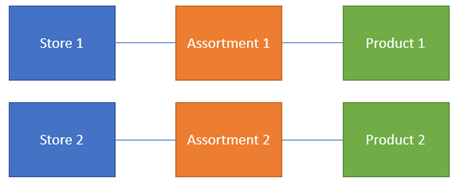
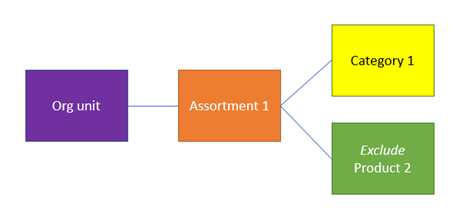

# Assortment management

[!include [banner](../includes/banner.md)]

## Overview

Dynamics 365 Commerce provides *assortments* that let you manage product availability across channels. Assortments determine which products are available at specific stores and during a specific period.

In Commerce, an assortment is a mapping of one or more channels (or groups of channels, when organization hierarchies are used) to one or more products (or groups of products, when category hierarchies are used).

The overall product mix of a channel is determined by the published assortments that are assigned to the channel. Therefore, you can configure multiple active assortments per channel.

### Basic assortment setup

In the following example, a unique assortment is configured for each store. In this case, only product 1 is available at store 1, and only product 2 is available at store 2.

To make product 2 available at store 1, you can add the product to assortment 1.

Alternatively, you can add store 1 to assortment 2.

### Organization hierarchies

In situations where multiple channels share the same product assortments, you can configure the assortments by using the Commerce assortment organization hierarchy. When nodes from this hierarchy are added, all channels in that node and its child nodes will be included.

### Product categories

Similarly, on the product side, you can include groups of products by using product category hierarchies. You can configure assortments by including one or more category hierarchy nodes. In this case, the assortment will include all products in that category node and its child nodes.

### Excluded products or categories

In addition to including products and categories in assortments, you can use the Exclude option to define specific products or categories that should be excluded from assortments. In the following example, you want to include all the products in a specific category, except product 2. In this case, you don't have to define the assortment product by product or create additional category nodes. Instead, you can just include the category but exclude the product.

> [!NOTE]
> If a product is both included and excluded in one or more assortments by definition, the product will always be considered excluded.

### Global and released products

Assortments are defined at a global level and can contain channels from multiple legal entities. The products and categories that are included in assortments are also shared across legal entities. However, a product must be released before it can actually be sold, ordered, counted, or received in the channel (for example, in the point of sale \[POS\]). Therefore, although two stores in different legal entities can share an assortment that contains the same products, the products are available only if they have been released to those legal entities.

### Dynamic and static assortments

Assortments can be defined with specific channels and products or by including organization units and categories. Assortments including references to these groups are considered dynamic assortments. If the definition or contents of those groups change while the assortment is active, the definition of the assortment will also change.

For example, an assortment is originally defined and published so that it references a category of products. If additional products are later added to the category, those products are automatically included in the definition of the existing assortment. You don't have to manually add the products to the assortment. Similarly, if an organization unit is added to a different node, the organization unit's assortment is automatically adjusted based on that definition.

### Stopped products

You can "stop" released products for the sales process by turning on a setting in the **Default order** settings. This setting is most often used when a product is at the end of its life and should not be sold at any channel. Assortments respect this setting, and stopped products won't be assorted, regardless of the assortment configuration.

### Blocked products

In addition to stopping sales of a product, you can temporarily block sales of a product. You can configure this setting on the **Commerce** tab of a released product. Blocked products are still assorted, but you will receive a message in the POS that states that the product can't be sold.

### Date effectivity

Assortments are date-effective. Therefore, retailers can configure when products should or should not be available per channel. You can define and publish assortments ahead of time, and specify the start and end dates. The products will automatically become available or unavailable on the specified dates.

### Process assortments batch job

Assortments that are defined in Commerce must be processed before they take effect. This processing is done for the following reasons:

- Assortment definitions must be de-normalized so that channels can more easily consume them. A product mix for a channel can be defined through multiple assortments that span various date ranges. When some of this information is calculated ahead of time on the server, performance at the channel is improved.
- The products and channels in the assortment can change outside the assortment itself. Dynamic assortments that contain references to categories or organization units must be processed periodically so that they include or exclude records, based on their current assignment.

## Implementation considerations

Consider the following implementation requirements as you plan and manage assortments for your Commerce implementation:

- **Data replication and database size** – Although assortments help serve the business need to manage product availability, they are also an important tool for managing the size of channel and offline databases. Well-managed assortments help reduce the amount of data that must be processed and replicated to channel and offline databases. They also help reduce the number of records that must be persisted. Fewer records in these databases will increase performance when you add items to a transaction, search, and browse for products.
- **Date-effective/expiring assortments** – One of the most effective tools for managing the number of products in channel and offline databases is the date effectivity of assortments. If you leave open-ended (non-expiring) assortments for seasonal products or products that are at the end of their life, these databases will grow indefinitely. You can use various approaches to help manage this situation. For example, you can maintain separate assortments for seasonal products and products that are always available.
- **Sales and returns outside assortments** – This capability helps retailers effectively manage their assortments by letting them limit the number of available products to products that belong to the core product mix for the store. This capability also helps retailers handle situations where a product was mistakenly omitted from an assortment, or where a product was returned outside the effective dates for the assortment.

If product data doesn't exist in the channel database, the POS makes real-time calls to headquarters to retrieve the required information, so that the product can be sold, returned, or put on a customer order. Product information that is retrieved in this manner is available only during the scope of that transaction. The product isn't added to the assortment definition. Therefore, subsequent real-time calls will be made as required.

> [!NOTE]
> When POS makes real-time calls to headquarters to retrieve product information and download it in the channel database, depending on the data size of product information such as the number of product variants, product attributes, and inventory dimensions, there might be performance issues on the real-time calls or saving the data to channel database. The performance issue will lead to Commerce Scale Unit API failures. In this case, you should add those products to the channel's assortment to avoid real-time calls.

[!INCLUDE[footer-include](../includes/footer-banner.md)]
