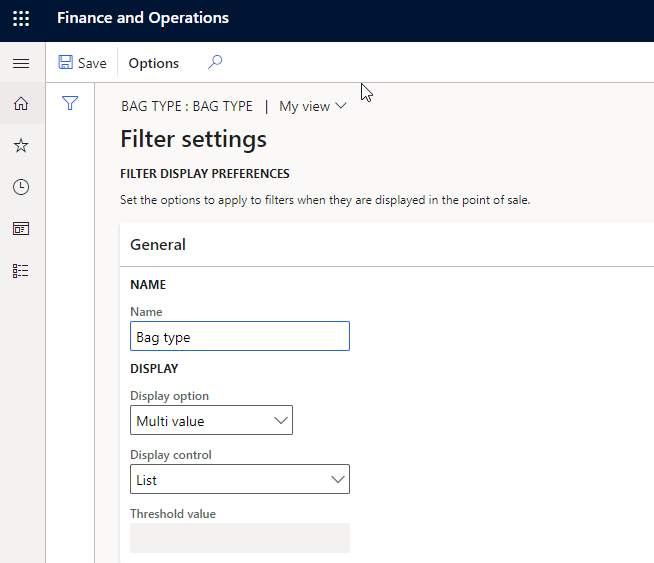
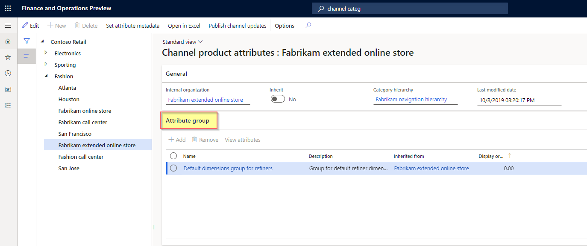
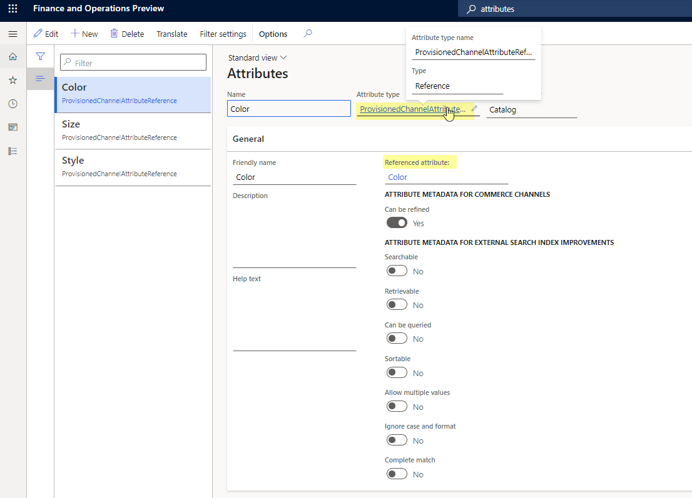
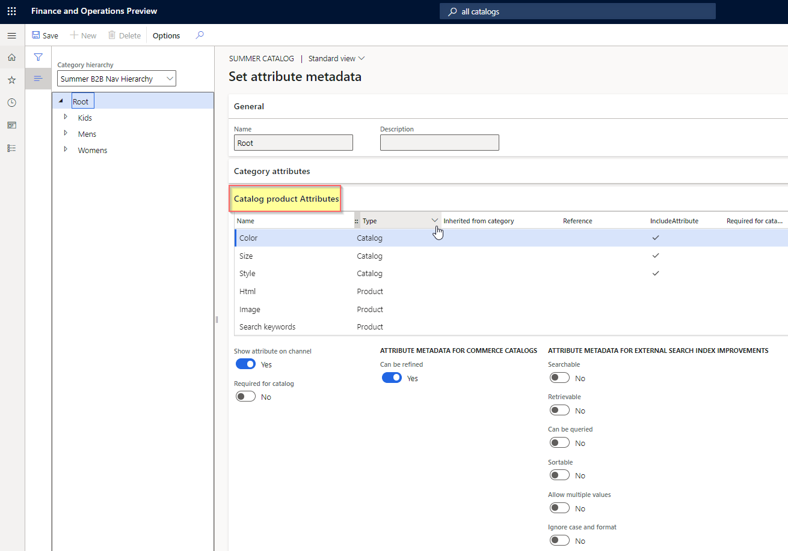

---
# required metadata

title: Manage attributes and attribute groups
description: This article describes how to manage attributes and attribute groups to describe products and their characteristics in Microsoft Dynamics 365 Commerce. 
author: ashishmsft
ms.date: 08/26/2022
ms.topic: article
audience: Application User, Developer, IT Pro
ms.reviewer: josaw
ms.search.region: Global
ms.search.industry: Retail
ms.author: asharchw
ms.search.validFrom: 2018-03-30

---

# Manage attributes and attribute groups

[!include [banner](includes/banner.md)]

This article describes how to manage attributes and attribute groups to describe products and their characteristics in Microsoft Dynamics 365 Commerce.

*Attributes* provide a way to describe products and their characteristics through user-defined fields (for example, memory size, hard disk capacity, or energy star compliance). Attributes can be associated with various Commerce entities such as product categories and channels, and default values can be set for attributes. When attributes are associated with product categories or channels, products inherit those attributes and their default values. Attribute default values can be overridden at the individual product level, at the channel level, or in a catalog.

For example, a typical television product might have the following attributes.

| Category   | Attribute                | Permissible values          | Default value |
|------------|--------------------------|-----------------------------|---------------|
| TV & Video | Brand                    | Any valid brand value       | None          |
| TV         | Screen Size              | 20–85 inches                | 55 inches     |
|            | Vertical Resolution      | 4K (2160p), Full HD (1080p), HD (720p) | 4K (2160p)|
|            | Screen Refresh Rate      | 60hz, 120hz, or 240hz       | 60hz          |
|            | HDMI Inputs              | 0–10                        | 3             |

## Attributes and attribute types

Attributes are based on *attribute types*. An attribute type identifies the type of data that can be entered for a specific attribute. The following attribute types are supported in Commerce:

- **Currency** – This type supports a currency value. It can be bounded (that is, it can support a range of values), or it can be left open.
- **DateTime** – This type supports a date and time value. It can be bounded or left open.
- **Decimal** – This type supports a numerical value that includes decimal places. It also supports a unit of measure. It can be bounded or left open.
- **Integer** – This type supports a numerical value. It also supports a unit of measure. It can be bounded or left open.
- **Text** – This type supports a text value. It also supports a predefined set of possible values when the **Fixed list** setting is enabled.
- **Boolean** – This type supports a binary value (**true** or **false**).
- **Reference** – This type references other attributes.

### Set up attribute types

To set up attribute types, follow the steps in this example procedure.

1. Sign in to Commerce headquarters as a merchandising manager.
1. Go to **Product information management \> Setup \> Categories and attributes \> Attribute types**.
1. On the action pane, select **+New**.
1. On the **Attribute types** form, under **Attribute type name**, enter "Bag type".
1. For **Type**, select **Text** from the drop-down list.
1. Set the **Fixed list** option to **Yes**.
1. Under **Values**, select **+Add**.
1. In the new row under **Value**, enter **Satchel**.
1. Add five more rows with **Clutch**, **Purse**, **Backpack**, **Messenger**, and **Wallet** values.
1. On the action pane, select **Save**.
1. On the action pane, select **+New**.
1. On the **Attribute types** form, under **Attribute type name**, enter "Sunglass brand".
1. For **Type**, select **Text** from the drop-down list.
1. Set the **Fixed list** option to **Yes**.
1. Under **Values**, select **+Add**.
1. In the new row under **Value**, enter **Ray ban**.
1. Add two more rows with **Aviator** and **Oakley** values.
1. On the action pane, select **Save**.

### Set up an attribute

To set up an attribute, follow the steps in this example procedure.

1. Sign in to Commerce headquarters as a merchandising manager.
2. Go to **Product information management \> Setup \> Categories and attributes \> Attributes**.
1. On the action pane, select **+New**.
1. On the **Attributes** form, under **Name**, enter "Bag type".
1. For **Attribute type**, select **Bag type** from the drop-down list.
1. On the action pane, select **Save**.

## Attribute metadata

*Attribute metadata* allows you to select options to specify how the attributes for each product should behave. For example, you can specify whether attributes are required, whether they can be used for searches, and whether they can be used as a filter.

For products, the attribute metadata settings can be overridden at the channel level.

An attribute's **Attributes** form includes several options that are related to attribute metadata. For example, under **ATTRIBUTE METADATA FOR COMMERCE CHANNELS**, if you set the **Can be refined** option to **Yes**, the attribute will be displayed for refinement or filtering of products on search results and category browsing pages. The system doesn't allow you to configure an attribute as refinable until you select **Filter settings** on the action pane and confirm the filter settings for the attribute. 

## Filter settings for attributes

Filter settings for attributes allow you to define how the attribute filters are shown in point of sale (POS). To access the filter settings for an attribute, go to the attribute's **Attributes** form, and then on the action pane select **Filter settings**.

The **Filter settings** form includes the following fields:

- **Name** – By default, this field is set to the name of the attribute. However, you can change the value.
- **Display option** – The following options are available:
    - **Single value** - This option is available for the following attribute types: **Boolean**, **Currency**, **Decimal**, **Integer**, and **Text**. It only allows single value selection for refiners on product list pages such as category browsing and product search results.    
    - **Multi value** - This option is available for the following attribute types: **Currency**, **Decimal**, **Integer**, and **Text**. It enables multi-value selection for this attribute in the client for refinement.      
- **Display control** – The following options are available:
    - **List** – This option is available for the all attribute types.
    - **Range** – This option is available for the following attribute types: **Currency**, **Decimal**, and **Integer**.
    - **Slider** – This option is available for the following attribute types: **Currency**, **Decimal**, and **Integer**.
    - **Slider with bars** – This option is available for the following attribute types: **Currency**, **Decimal**, and **Integer**.
- **Threshold value** – This setting is required if you selected **Range** as the display control type. You can define values by using a semicolon (;) as a delimiter.

    For example, for an attribute like **Bag Volume** with an attribute type of **Integer**, the threshold value could be **10; 20; 50; 100; 200; 500; 1000; 5000**. In this case, the POS will show the following ranges. Any ranges that don't have any products in the result set will appear dimmed.

    - **Less than 10**
    - **10 – 20**
    - **20 – 50**
    - **50 – 100**
    - **100 – 200**
    - **200 – 500**
    - **500 or more**

<!---->

Filter settings for attributes are only applicable for product attributes and can be used for refining product search and category browsing results. These filter settings don't apply to customer search or order search, although the same attributes can be used for enriching customer or order information. 

Among default Commerce modules, there's no out-of-the-box support available for **Display control** filter settings such as **Range**, **Slider**, or **Slider with bars**. **Range** and **Slider** settings continue to be supported for point-of-sale solutions, whereas the **Slider with bars** setting is applicable for legacy Microsoft SharePoint online storefronts and continues to be available for third-party integration and custom scenarios. 

It's recommended that refinable attributes have an attribute of type **Text** with the **Fixed-list** option enabled, and that you keep the list manageable with up to 100-200 unique values. If a refiner is going to have 1000 or more unique values, the most appropriate attribute type would be **Text** with **Fixed-list** disabled.

Translations are critical for attribute names and their values. For attributes of type **Text** with the **Fixed-list** option enabled, you can define translations for the attribute values under **Attribute type**. For every other attribute type, you're able to define translations on the forms where you define the attribute values. For example, for an attribute of type **Text** you can define translations for the default value on the attribute's **Attribute** form, but if you override the default value at the product level you can define translations for the attribute on the product's **Product attributes** form. 

Once an attribute has been marked as refinable for a channel, you shouldn't update the attribute type because that would impact the publishing of product data to the search index. It's recommended to create a new attribute for a new type of refiner and retire the previous attribute by removing it from other attribute groups. 

Search by attributes is supported, but it only fetches results for exact matches of search words. For example, for a **'Fabric** attribute with a value of "Cashmere cotton", if a customer searches for "Cash" then no products with "cashmere cotton" as the fabric will be retrieved, whereas if a site user searches for "Cashmere", "Cotton", or "Cashmere Cotton", then products with "cashmere cotton" as the fabric will be retrieved. 

### Additional options for attribute *(applicable for legacy SharePoint online storefront and external integrations)*

The following are the remaining attribute metadata options on the **Attributes** form:

- **Searchable**
- **Retrievable**
- **Can be queried**
- **Sortable**
- **Ignore case and format**
- **Complete match**

These options were originally intended to improve the search functionality for legacy SharePoint-based online storefronts and don't necessarily apply to Commerce e-commerce websites or point-of-sale (POS) terminals. Headless integration continues to be supported, so these options are available to export attribute metadata using the Commerce software development kit (SDK). You can use the Commerce SDK to put products into a custom, optimized external search index that ensures only attributes that should be indexed are indexed.

> [!NOTE]
> For more information about these remaining options, see [Overview of the search schema in SharePoint Server 2013](/SharePoint/search/search-schema-overview).

## Attribute groups

An *attribute group* is used to group the individual attributes for a component or subcomponent in a product configuration model. An attribute can be included in more than one attribute group. Attribute groups can help users configure products because the various selections are arranged in a specific context. Attribute groups can be assigned to categories or channels. You can also set default values for attributes in an attribute group. 

### Create an attribute group

To create an attribute group, follow the steps in this example procedure.

1. Sign in to Commerce headquarters as a merchandising manager.
2. Go to **Product information management \> Setup \> Categories and attributes \> Attribute groups**.
3. Create an attribute group that is named **Fashion Sunglasses**.
4. Add the following attributes: **Lens shape** and **Sunglass brand**.

### Assign attribute groups to categories

One or more attribute groups can be associated with category nodes in the following types of category hierarchies: 

- Commerce product hierarchy
- Channel navigation category hierarchy
- Supplemental product category hierarchy 
 
When products are categorized to categories associated with attribute groups, they inherit the attributes included in the attribute groups.

To assign attribute groups to categories in the Commerce product hierarchy, follow the steps in this example procedure.

1. Sign in to Commerce headquarters as a merchandising manager.
2. Go to **Retail and Commerce \> Products and categories \> Commerce product hierarchy**.
3. Select **Fashion navigation hierarchy**.
4. Under **Menswear**, select the **Pants** category, and then on the **Product attribute groups** FastTab, add an attribute group that is named **Men's belt**. 
5. Select the **Fashion sunglasses** category, and verify the new attributes in the **Fashion Sunglasses** attribute group by selecting **View attributes**. The attribute group should show the new **Lens shape** and **Sunglass brand** attributes.
6. Under **Menswear**, select the **Pants** category, and verify the attributes for the **Men's belt** attribute group by selecting **View attributes**. The attribute group should show the **Men's belt brand**, **Belt fabric**, and **Belt size** attributes.

This procedure can also be used to assign attribute groups to categories in the channel navigation category hierarchy and the supplemental product category hierarchy. To do this, for step 2 above substitute the following navigation paths, respectively:

- **Retail and Commerce \> Category and product management \> Channel navigation categories**
- **Retail and Commerce \> Category and product management \> Supplemental product categories**

Ensure that you're only associating attribute groups in a category hierarchy to the **Product attribute groups** FastTab and not the **Category attribute values** FastTab. If you see attributes appearing on the **Category attribute values** FastTab, select **Edit category hierarchy** on the action pane, and then on the **Category attribute groups** FastTab, select the category nodes and then select **Remove**. There's no support available to fetch attributes by category through Commerce Scale Unit.  

## Identify viewable and refinable attributes for Commerce channels for default product collection

As you have associated various attribute groups to categories in various hierarchies (Commerce product hierarchy or channel navigation categories) and defined those attribute values for each product based on the category association, for those attributes to be viewable in a specific channel, you'll have to enable the **Show attribute on Channel** flag. 

This flag can be located at **Retail and Commerce \> Channel setup \> Channel categories and product attributes**. Select **Set attribute metadata**, and then select an attribute from the left navigation pane. Under **Channel Product attributes** (not **Category attributes**), set the **Show attribute on channel** option to **Yes** to make the attribute viewable. If you want the attribute to be refinable, you must also set the **'Can be refined'** option to **Yes**.     

### Control visibility of dimension-based refiners such as size, style, and color

Product dimensions like size, style, and color are the most commonly used refiners. To make these product dimensions available as refiners, you should associate an attribute group at the channel level that contains reference attribute type inheriting values automatically from product dimension values. 

Next, you should identify intended product dimensions to be viewable and refinable by updating flags located at **Channel categories and product attributes**. Select  the root node from the navigation pane> Set attribute metadata > Channel **Product** attributes (not **Category attributes**) and mark the flag for 'Show attribute on channel' as 'Yes'* for the associated attributes to *Size, Style, Color* dimensions if you intend to make them viewable only. And if you intend to have this attribute be 'refinable' as well then you must also check **'Can be refined'**. 

To enable the attributes so that they're available in the demo-data based Houston channel, follow the steps in this example procedure.

1. Go to **Retail and Commerce \> Channel setup \> Channel categories and product attributes**.
2. Select **Houston**
3. On the action pane, select **Set attribute metadata**.
4. Select the **Fashion** category node, and then, on the **Channel product attributes** FastTab, select **Include attribute** for each attribute.
5. Select the **Fashion Accessories** category node, select the **Fashion Sunglasses** category, and then, on the **Channel product attributes** FastTab, select **Include attribute** for each attribute.
6. Select the **Menswear** category node, select the **Pants** category, and then, on the **Channel product attributes** FastTab, select **Include attribute** for each attribute.
7. Ensure upon updating the attribute metadata for your intended attributes and refiners, ensure that you save and 'Publish channel updates' and following to publishing you must run following jobs - 1070 (Channel configuration), 1040 (Products), and 1150 (Catalog). 

> [!NOTE]
> - If your business requires to frequently add or remove products in the navigation hierarchy (including updating display orders or adding new categories or adding new attribute groups to categories in navigation hierarchy) or refiner setup. It's recommended to have 'Publish channel updates' configured as a batch job to run frequently or manually trigger 'Publish channel updates' followed by CDX jobs - 1070 (Channel configuration), 1040 (Products), and 1150 (Catalog). 
> - An inherit option lets you specify that this channel should inherit the attribute groups from its parent channel in the hierarchy. If you set the **Inherit** option to **Yes**, the child channel node inherits all the attribute groups and all the attributes in those attribute groups.
> - If **Set attribute metadata** is grayed out, then you must ensure that 'Navigation hierarchy' is associated with your channel under the **General** FastTab. 
> - You must not associate any other attribute groups at a channel level ('Attribute groups' on 'Channel categories and product attributes' form) other than dimension based attribute group. (e.g. with Demo Data, you would see there's an attribute group named 'Default dimensions group for refiners' is only valid attribute group to associate in this place). 
> - Starting 10.0.27, with introduction of support for 'Customer specific catalogs' (aka B2B catalogs), you are expected to identify the 'refiner' and 'attribute' setup for each B2B catalog in the same manner as described here. 

## Override attribute values

The default values of attributes can be overridden for individual products at the product level. Default values can also be overridden for individual products in specific catalogs that are targeted at specific channels.

### Override the attribute values of an individual product

To override the attribute values of an individual product, follow the steps in this example procedure.

1. Sign in to Commerce headquarters as a merchandising manager.
2. Go to **Retail and Commerce \> Category and product management \> Released products by category**.
3. Select the **Fashion \> Fashion Accessories \> Fashion Sunglasses** category node.
4. Select the required product in the grid. Then, on the Action Pane, on the **Product** tab, in the **Set up** group, select **Product attributes**.
5. Select an attribute in the left pane, and then update its value in the right pane.

### Override the attribute values of all products in a catalog

To override the attribute values of all products in a catalog, follow the steps in this example procedure.

1. Sign in to Commerce headquarters as a merchandising manager.
2. Go to **Retail and Commerce \> Catalog management \> All catalogs**.
3. Select the **Fabrikam Base Catalog** catalog.
4. Select the **Fashion \> Fashion Accessories \> Fashion Sunglasses** category node.
5. On the **Products** FastTab, select the required product, and then select **Attributes** above the product grid.
6. On the following FastTabs, update the values of the required attributes

### Override the attribute values of all products in a channel

To override the attribute values of all products in a channel, follow the steps in this example procedure.

1. Sign in to Commerce headquarters as a merchandising manager.
2. Go to **Retail and Commerce \> Channel setup \> Channel categories and product attributes**.
3. Select the **Houston** channel.
4. On the **Products** FastTab, select the required product, and then select **Attributes** above the product grid.
5. If no products are available, add products by selecting **Add** on the **Products** FastTab and then selecting the required products in the **Add products** dialog box.
6. On the following FastTabs, update the values of the required attributes:
    - Shared product media
    - Shared product attributes
    - Channel media
    - Channel product attributes

### Define variant-specific attribute values and define multiple values for product attributes

To define variant-specific attribute values and define multiple values for product attributes, follow the steps in this example procedure.

1. Sign in to Commerce headquarters as a merchandising manager.
2. Go to **Retail and Commerce \> Channel setup \> Channel categories and product attributes**.
3. Select the **Houston** channel.
4. On the **Products** FastTab, select the required product variant, and then select **Attributes** above the product grid.
5. If no products are available, add products by selecting **Add** on the **Products** FastTab and then selecting the required product variants in the **Add products** dialog box.
6. On the following FastTabs, update the values of the required attributes:
    - **Shared product media**
    - **Shared product attributes**
    - **Channel media**
    - **Channel product attributes**
    
#### Example 
		
In this example, the **P001-Master** product is a multiple activity shoe that has three variants: **Running**, **Walking**, and **Trekking**. For each variant, you want to uniquely define the **Activity** attribute value, which can be done on the **Products** FastTab of the **Channel categories and product attributes** form for your channel. We can define the **Activity** attribute values for each variant as follows:

- **P001-Master** - Activity: Sports 
- **P001-1** - Activity: Running
- **P001-2** - Activity: Walking 
- **P001-3** - Activity: Trekking

If a user searches for "shoe", the **P001-Master** product would appear in the search results. If you configured the **Activity** attribute to be refinable as well, then the **Activity** refiner would only list **Sports** as a refinable value because that's what was defined for the **Activity** attribute at the **P001-Master** product level.

By default, variant-level attributes are only intended for use on product details pages (PDPs). When you select a specific variant on a PDP, the product specifications on the PDP are updated for that specific product variant. 

For refiners to pick up attribute values defined at the product variant level, you must define an attribute at the product master level with **Allow multiple values’** checked, with an attribute definition of type **Text**. 

Next, you would need to determine all possible values for your product variants. Continuing with the example of the **Activity** attribute, possible values for the attribute could include **Running**, **Walking**, **Hiking**, **Trekking**, **Camping**, **Watersports**, and **Snowsports** 
 
Once you've determined what the variant attribute values should be, you can define them at the product master level with pipe-separated-values. For the **Activity** attribute example, on the product master you would define the attribute value as **Running|Walking|Hiking|Trekking|Camping|Watersports|Snowsports**.

Then, on each variant you can define attribute values by entering either pipe-separated or single values. Using the **Activity** attribute example, an individual product variant could be configured as **Running|Walking|Hiking**, **Running**, **Running|Hiking|Watersports**, etc. 

Once you've defined the variant attribut valuesx, go to **Channel categories and product attributes**, on the action pane select **Publish channel updates**, and then run the **1150**, **1040**, and **1070** jobs. 

After successful completion of the jobs and updates to the search index, all expected values should appear in search results and category browsing results. 

[!INCLUDE[footer-include](../includes/footer-banner.md)]
