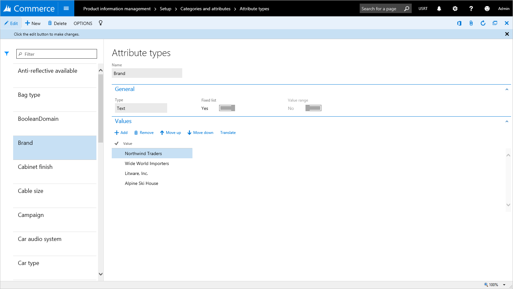
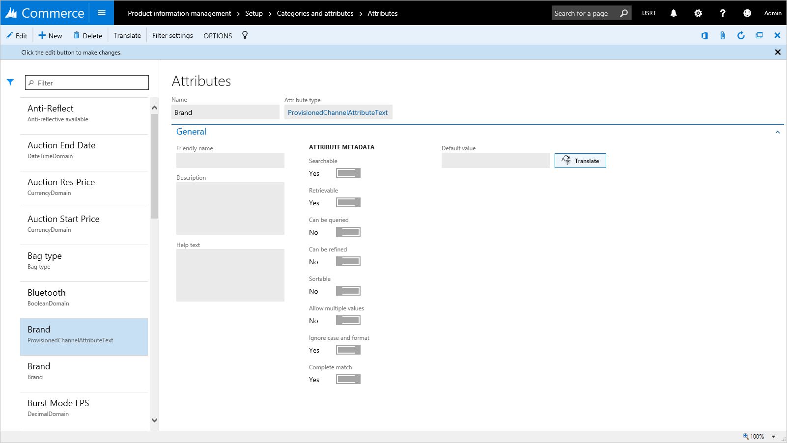
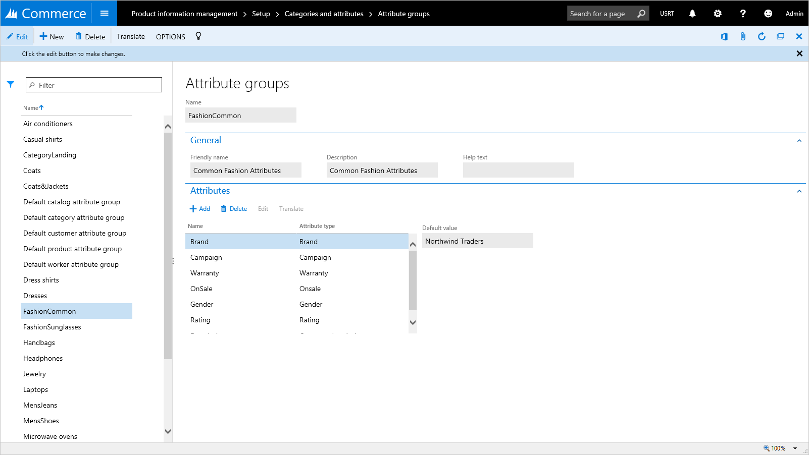
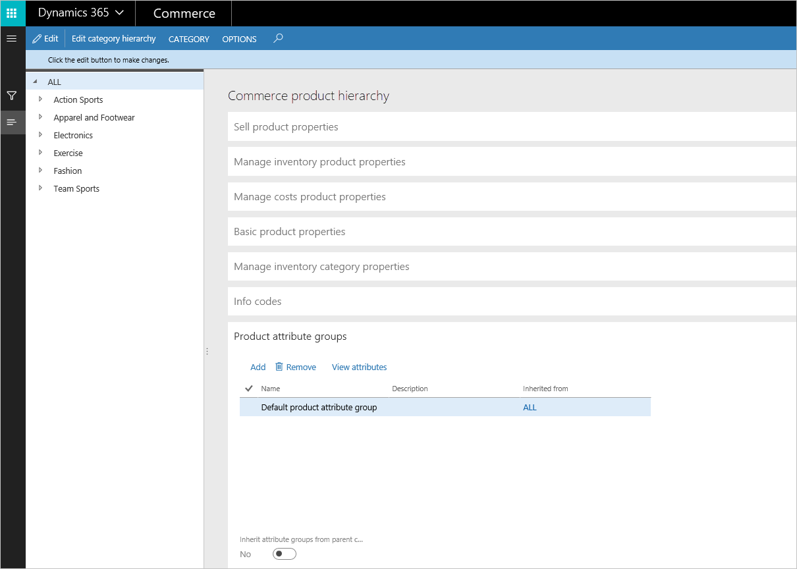
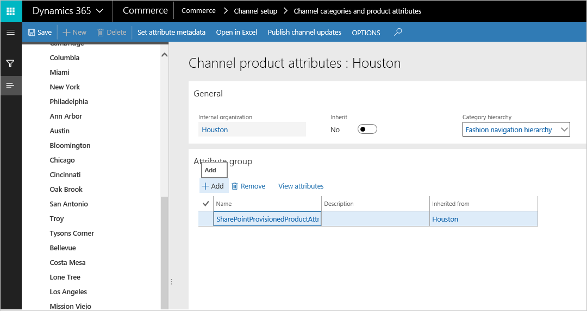
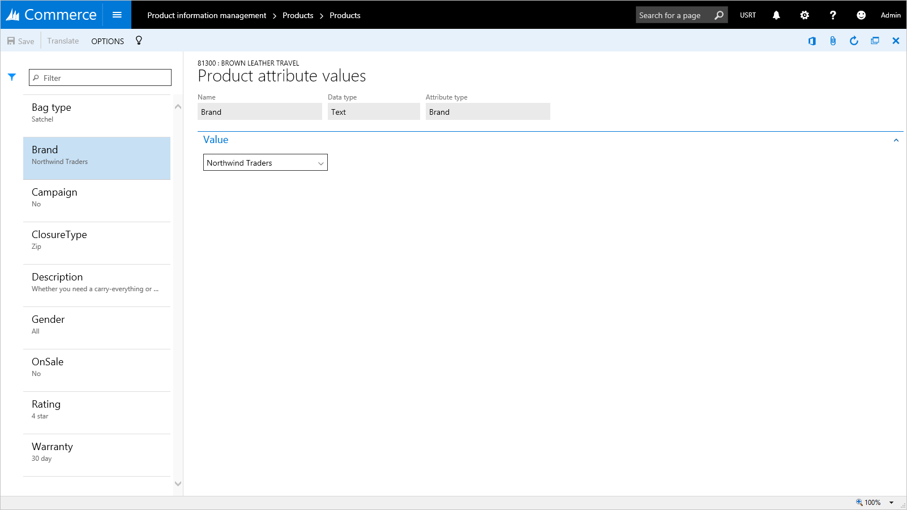
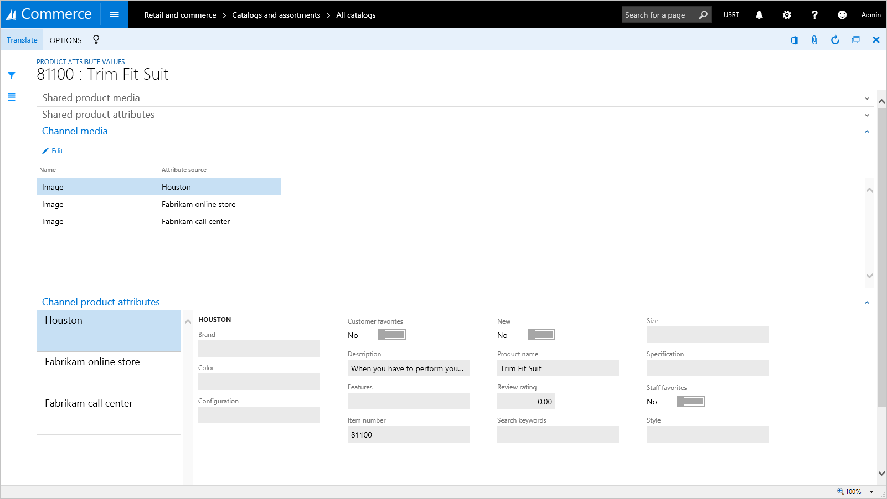

---
# required metadata

title: Manage attributes and attribute groups
description: This topic describes how to use attributes to provide a way to describe a product and its characteristics through user-defined fields. 
author: ashishmsft
ms.date: 04/28/2018
ms.topic: article
ms.prod: 
ms.technology: 

# optional metadata

ms.search.form: EcoResCategoryAttribute, EcoResProductEntityAttributeTableFieldAssociation, EcoResCategorySearchList, EcoResAttribute, COODualUseCategories, EcoResAttributeType, EcoResAttributeValue, EcoResCategoryAttributeGroup, EcoResCategoryFriendlyName
# ROBOTS: 
audience: Application User
# ms.devlang: 
ms.reviewer: josaw
# ms.tgt_pltfrm: 
ms.custom: 
ms.assetid: 
ms.search.region: global
ms.search.industry: Retail
ms.author: asharchw
ms.search.validFrom: 2018-03-30
ms.dyn365.ops.version: Application pdate 5, AX 8.0

---

# Manage attributes and attribute groups

[!include [banner](includes/banner.md)]

*Attributes* provide a way to further describe a product and its characteristics through user-defined fields (such as **Memory size**, **Hard disk capacity**, **Is Energy star compliant**, and so on). Attributes can be associated with various Commerce entities, such as product categories and channels, and default values can be set for them. Products then inherit the attributes and the default values when they are associated with the product categories or channels. The default values can be overridden at the individual product level, at the channel level, or in a catalog.

For example, a typical television product might have the following attributes.

| Category   | Attribute                | Permissible values          | Default value |
|------------|--------------------------|-----------------------------|---------------|
| TV & Video | Brand                    | Any valid brand value       | None          |
| TV         | Screen Size              | 20–80 inches                | None          |
|            | Vertical Resolution      | 480i, 720p, 1080i, or 1080p | 1080p         |
|            | Screen Refresh Rate      | 60hz, 120hz, or 240hz       | 60hz          |
|            | HDMI Inputs              | 0–10                        | 3             |
|            | DVI Inputs               | 0–10                        | 1             |
|            | Composite Inputs         | 0–10                        | 2             |
|            | Component Inputs         | 0–10                        | 1             |
| LCD        | 3D Ready                 | Yes or No                   | Yes           |
|            | 3D Enabled               | Yes or No                   | No            |
| Plasma     | Operating Temp From      | 32–110 degrees              | 32            |
|            | Operating Temp To        | 32–110 degrees              | 100           |
| Projection | Projection Tube Warranty | 6, 12, or 18 months         | 12            |
|            | \# of Projection Tubes   | 1–5                         | 3             |

## Attributes and attribute types

Attributes are based on *attribute types*. The attribute type identifies the type of data that can be entered for a specific attribute. The following attribute types are supported:

- **Currency** – This type supports a currency value. It can be bounded (that is, it can support a range of values), or it can be left open.
- **DateTime** – This type supports a date and time value. It can be bounded or left open.
- **Decimal** – This type supports a numerical value that includes decimal places. It also supports a unit of measure. It can be bounded or left open.
- **Integer** – This type supports a numerical value. It also supports a unit of measure. It can be bounded or left open.
- **Text** – This type supports a text value. It also supports a predefined set of possible values (that is, an *enumeration*).
- **Boolean** – This type supports a binary value (**true** or **false**).
- **Reference** – This type references other attributes.

### Set up attribute types

1. Sign in to the back-office client as a merchandising manager.
2. Go to **Product information management** &gt; **Setup** &gt; **Categories and attributes** &gt; **Attribute types**.
3. Create two attribute types of the **Text** type, set the **Fixed list** option to **Yes**, and then add a list of values:

    - Name one attribute type **Lens shape**, and add the following values: **Oval**, **Square**, and **Rectangle**.
    - Name the other attribute type **Sunglass brand**, and add the following values: **Ray ban**, **Aviator**, and **Oakley**.

### Set up an attribute

1. Sign in to the back-office client as a merchandising manager.
2. Go to **Product information management** &gt; **Setup** &gt; **Categories and attributes** &gt; **Attributes**.
3. Create an attribute that is named **Lens**.
4. Set the **Attribute type** field to **Lens shape**.

## Attribute metadata

*Attribute metadata* lets you select options to specify how the attributes for each product should behave. For example, you can specify whether attributes are required, whether they can be used for searches, and whether they can be used as a filter.

For products, the attribute metadata settings can be overridden at the channel level. This capability will be discussed later in this topic.

As you might notice, the **Attributes** page includes options that are related to attribute metadata. Under **Attribute metadata for POS**, one option that is named **Can be refined** affects the behavior of the attribute values in the point of sale (POS) or the way that the system handles those attribute values. Only attributes for which you may set the **Can be refined** option to **Yes**, will show up for refinement or filtering of products in the POS.

Here are the remaining attribute metadata options on the **Attributes** page:

- Searchable
- Retrievable
- Can be queried
- Sortable
- Allow multiple values
- Ignore case and format
- Complete match

These options were originally intended to improve the search functionality for the online storefront. Although Commerce doesn't include the online storefront out of the box, it does include the eCommerce Publishing Software Development Kit (SDK). Customers can use this SDK to put products into a search index of their choice. Although the product data is imported, customers should still be able to distinguish searchable data, data that can be queried, and so on. In that way, they can build an optimal index to make sure that they index only attributes that, *in their opinion*, should be indexed.

For information about the purpose of these remaining options, see [Overview of the search schema in SharePoint Server 2013](/SharePoint/search/search-schema-overview).

## Filter settings for attributes

Filter settings for attributes let you define how the filters for attributes are shown in the POS. To access the filter settings for an attribute, on the **Attributes** page, select the attribute, and then, on the Action Pane, select **Filter settings**.

The **Filter display preferences** page includes the following fields:

- **Name** – By default, this field is set to the name of the attribute. However, you can change the value.
- **Display option** – The following options are available:

    - **Single value** – This option is available for the following attribute types: **Boolean**, **Currency**, **Decimal**, **Integer**, and **Text**. This option enables single value selection for these attributes in the client for refinement.
    - **Multi value** – This option is available for the following attribute types: **Currency**, **Decimal**, **Integer**, and **Text**. This option enables multi-value selection for this attribute in the client for refinement.

- **Display control** – The following options are available:

    - **List** – This option is available for the all attribute types.
    - **Range** – This option is available for the following attribute types: **Currency**, **Decimal**, and **Integer**.
    - **Slider** – This option is available for the following attribute types: **Currency**, **Decimal**, and **Integer**.
    - **Slider with bars** – This option is available for the following attribute types: **Currency**, **Decimal**, and **Integer**.

- **Threshold value** – This setting is required if you selected **Range** as the display control type. You can define values by using a semicolon (;) as a delimiter.

    For example, for the filter like **Bag Volume**, a threshold value can be **10; 20; 50; 100; 200; 500; 1000; 5000**. In this case, the POS will show the following ranges. Any ranges that don't have any products in the result set will appear dimmed.

    - Less than 10
    - 10 – 20
    - 20 – 50
    - 50 – 100
    - 100 – 200
    - 200 – 500
    - 500 or more

## Attribute groups

After attributes have been defined, they can be assigned to attribute groups. An *attribute group* is used to group the individual attributes for a component or subcomponent in a product configuration model. An attribute can be included in more than one attribute group. Attribute groups can help users configure products, because the various selections are arranged in a specific context. Attribute groups can be assigned to categories or channels.

You can also set default values for attributes that are included in an attribute group. For example, you add an attribute for color to an attribute group and select **Blue** as the default attribute value. In this case, when the attribute group is added to a product that includes color as one of its attributes, **Blue** appears as the default color for that product.

### Create an attribute group

1. Sign in to the back-office client as a merchandising manager.
2. Go to **Product information management** &gt; **Setup** &gt; **Categories and attributes** &gt; **Attribute groups**.
3. Create an attribute group that is named **Fashion Sunglasses**.
4. Add the following attributes: **Lens shape** and **Sunglass brand**.

### Assign attribute groups to categories

One or more attribute groups can be associated with category nodes in the following types of category hierarchies: Commerce product hierarchy, Channel navigation category hierarchy, and Supplemental product category hierarchy. Then, when products are categorized, they inherit the attributes that are included in the attribute groups.

Follow these steps to assign attribute groups to categories in the Commerce product hierarchy.

1. Sign in to the back-office client as a merchandising manager.
2. Go to **Retail and Commerce** &gt; **Category and product management** &gt; **Commerce product hierarchy**.
3. Select **Fashion navigation hierarchy**.
4. Under **Menswear**, select the **Pants** category, and then, on the **Product attribute groups** FastTab, add an attribute group that is named **Men's belt**.
5. Select the **Fashion sunglasses** category, and verify the new attributes in the **Fashion Sunglasses** attribute group by selecting **View attributes**.

    The attribute group should show the new **Lens shape** and **Sunglass brand** attributes.

6. Under **Menswear**, select the **Pants** category, and verify the attributes for the **Men's belt** attribute group by selecting **View attributes**.

    The attribute group should show the **Men's belt brand**, **Belt fabric**, and **Belt size** attributes.

> [!NOTE]
> This procedure can also be used to assign attribute groups to categories in the Channel navigation category hierarchy and the Supplemental product category hierarchy. In step 2, use the following navigation paths:
>
> - Retail and Commerce &gt; Category and product management &gt; Channel navigation categories
> - Retail and Commerce &gt; Category and product management &gt; Supplemental product categories

### Assign attribute groups to stores

One or more attribute groups can be associated with one or more stores in the store hierarchy. Then, when products are enriched for specific stores, they inherit the attributes that are included in the attribute groups.

1. Sign in to the back-office client as a merchandising manager.
2. Go to **Retail and Commerce** &gt; **Channel setup** &gt; **Channel categories and product attributes**.
3. Assign attribute groups to the Houston channel:

    1. Select the **Houston** channel.
    2. On the **Attribute group** FastTab, select **Add**, and then, in the **Name** field, select **SharePointProvisionedProductAttributeGroup**.
    3. Select **Add** again, and then, in the **Name** field, select **Men's belt**.
    4. Select **Add** again, and then, in the **Name** field, select **Fashion Sunglasses**.

        > [!NOTE]
        > An option lets you specify that this channel should inherit the attribute groups from its parent channel in the hierarchy. If you set the **Inherit** option to **Yes**, the child channel node inherits all the attribute groups and all the attributes in those attribute groups.

4. Enable the attributes so that they are available in the Houston channel:

    1. On the Action Pane, select **Set attribute metadata**.
    2. Select the **Fashion** category node, and then, on the **Channel product attributes** FastTab, select **Include attribute** for each attribute.
    3. Select the **Fashion Accessories** category node, select the **Fashion Sunglasses** category, and then, on the **Channel product attributes** FastTab, select **Include attribute** for each attribute.
    4. Select the **Menswear** category node, select the **Pants** category, and then, on the **Channel product attributes** FastTab, select **Include attribute** for each attribute.

## Overriding attribute values

The default values of attributes can be overridden for individual products at the product level. Default values can also be overridden for individual products in specific catalogs that are targeted at specific channels.

### Override the attribute values of an individual product

1. Sign in to the back-office client as a merchandising manager.
2. Go to **Retail and Commerce** &gt; **Category and product management** &gt; **Released products by category**.
3. Select the **Fashion** &gt; **Fashion Accessories** &gt; **Fashion Sunglasses** category node.
4. Select the required product in the grid. Then, on the Action Pane, on the **Product** tab, in the **Set up** group, select **Product attributes**.
5. Select an attribute in the left pane, and then update its value in the right pane.

### Override the attribute values of products in a catalog

1. Sign in to the back-office client as a merchandising manager.
2. Go to **Retail and Commerce** &gt; **Catalog management** &gt; **All catalogs**.
3. Select the **Fabrikam Base Catalog** catalog.
4. Select the **Fashion** &gt; **Fashion Accessories** &gt; **Fashion Sunglasses** category node.
5. On the **Products** FastTab, select the required product, and then select **Attributes** above the product grid.
6. On the following FastTabs, update the values of the required attributes:

    - Shared product media
    - Shared product attributes
    - Channel media
    - Channel product attributes

    > [!NOTE]
    > If shared product media and shared product attributes are created, they apply to all the products.

### Override the attribute values of products in a channel

1. Sign in to the back-office client as a merchandising manager.
2. Go to **Retail and Commerce** &gt; **Channel setup** &gt; **Channel categories and product attributes**.
3. Select the **Houston** channel.
4. On the **Products** FastTab, select the required product, and then select **Attributes** above the product grid.

    > [!NOTE]
    > If no products are available, add products by selecting **Add** on the **Products** FastTab and then selecting the required products in the **Add products** dialog box.

5. On the following FastTabs, update the values of the required attributes:

    - Shared product media
    - Shared product attributes
    - Channel media
    - Channel product attributes

    > [!NOTE]
    > If shared product media and shared product attributes are created, they apply to all the products.

[!INCLUDE[footer-include](../includes/footer-banner.md)]