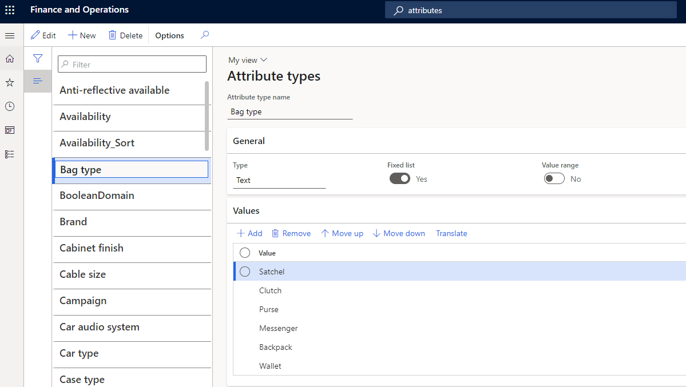

---
# required metadata

title: Manage attributes and attribute groups
description: This article describes how to manage attributes and attribute groups to describe products and their characteristics in Microsoft Dynamics 365 Commerce.
author: ashishmsft
ms.date: 10/19/2023
ms.topic: article
audience: Application User
ms.reviewer: josaw
ms.search.region: Global
ms.search.industry: Retail
ms.author: asharchw
ms.search.validFrom: 2018-03-30

---

# Manage attributes and attribute groups

[!include [banner](includes/banner.md)]

This article describes how to manage attributes and attribute groups to describe products and their characteristics in Microsoft Dynamics 365 Commerce.

*Attributes* provide a way to describe products and their characteristics through user-defined fields. Examples include memory size, hard disk capacity, and Energy Star compliance.

Attributes can be associated with various Commerce entities, such as product categories and channels, and default values can be set for them. When attributes are associated with product categories or channels, products inherit those attributes and their default values. Default attribute values can be overridden at the individual product level, at the channel level, or in a catalog.

For example, a typical television product might have the following attributes.

| Category   | Attribute           | Permissible values                        | Default value |
|------------|---------------------|-------------------------------------------|---------------|
| TV & Video | Brand               | Any valid brand value                     | None          |
| TV         | Screen Size         | 20–85 inches                              | 55 inches     |
|            | Vertical Resolution | 4K (2160p), Full HD (1080p), or HD (720p) | 4K (2160p)    |
|            | Screen Refresh Rate | 60 hz, 12 0hz, or 240 hz                  | 60 hz         |
|            | HDMI Inputs         | 0–10                                      | 3             |

## Attributes and attribute types

Attributes are based on *attribute types*. An attribute type identifies the type of data that can be entered for a specific attribute. The following attribute types are supported in Commerce:

- **Currency** – This type supports a currency value. It can be bounded (that is, it can support a range of values), or it can be left open.
- **DateTime** – This type supports a date and time value. It can be bounded or left open.
- **Decimal** – This type supports a numerical value that includes decimal places. It also supports a unit of measure. It can be bounded or left open.
- **Integer** – This type supports a numerical value. It also supports a unit of measure. It can be bounded or left open.
- **Text** – This type supports a text value. It also supports a predefined set of possible values when the **Fixed list** setting is enabled.
- **Boolean** – This type supports a binary value (**true** or **false**).
- **Reference** – This type references other attributes.

> [!NOTE]
> Because of [limitations of the Azure search index](/rest/api/searchservice/data-type-map-for-indexers-in-azure-search), the **Decimal** attribute type isn't supported for cloud-powered search experiences. Azure Cognitive Search doesn't support converting **Decimal** attribute types to **Edm.Double** target index field types, because this conversion would decrease precision.

### Set up attribute types

To set up attribute types, follow the steps in this example procedure.

1. Sign in to Commerce headquarters as a merchandising manager.
1. Go to **Product information management \> Setup \> Categories and attributes \> Attribute types**.
1. On the Action Pane, select **New**.
1. In the **Attribute type name** field, enter **Bag type**.
1. In the **Type** field, select **Text**.
1. Set the **Fixed list** option to **Yes**.
1. On the **Values** FastTab, select **Add**.
1. On the new row, in the **Value** field, enter **Satchel**.
1. Add five more rows. In the **Value** field of each, enter a different value: **Clutch**, **Purse**, **Backpack**, **Messenger**, or **Wallet**.
1. On the Action Pane, select **Save**.
1. On the Action Pane, select **New**.
1. In the **Attribute type name** field, enter **Sunglass brand**.
1. In the **Type** field, select **Text**.
1. Set the **Fixed list** option to **Yes**.
1. On the **Values** FastTab, select **Add**.
1. On the new row, in the **Value** field, enter **Ray ban**.
1. Add two more rows. In the **Value** field of each, enter a different value: **Aviator** or **Oakley**.
1. On the Action Pane, select **Save**.

### Set up an attribute

To set up an attribute, follow the steps in this example procedure.

1. Sign in to Commerce headquarters as a merchandising manager.
1. Go to **Product information management \> Setup \> Categories and attributes \> Attributes**.
1. On the Action Pane, select **New**.
1. In the **Name** field, enter **Bag type**.
1. In the **Attribute type** field, select **Bag type**.
1. On the Action Pane, select **Save**.

## Attribute metadata

*Attribute metadata* lets you select options to specify how the attributes for each product should behave. For example, you can specify whether attributes are required, whether they can be used for searches, and whether they can be used as a filter.

For products, the attribute metadata settings can be overridden at the channel level.

An attribute's **Attributes** page includes several options that are related to attribute metadata. For example, if you set the **Can be refined** option to **Yes** under **Attribute metadata for Commerce channels**, the attribute is shown for refinement or filtering of products on search results and category browsing pages. To configure an attribute as refinable, you must first select **Filter settings** on the Action Pane and confirm the filter settings for the attribute.

## Filter settings for attributes

Filter settings for attributes let you define how the attribute filters are shown in point of sale (POS). To access the filter settings for an attribute, on the attribute's **Attributes** page, on the Action Pane, select **Filter settings**.

The **Filter settings** page includes the following fields:

- **Name** – By default, this field is set to the name of the attribute. However, you can change the value.
- **Display option** – The following options are available:

    - **Single value** – This option is available for the following attribute types: **Boolean**, **Currency**, **Decimal**, **Integer**, and **Text**. It allows only a single value to be selected for refiners on product list pages, such as category browsing and product search results pages.
    - **Multi value** – This option is available for the following attribute types: **Currency**, **Decimal**, **Integer**, and **Text**. It enables multiple values to be selected for the attribute in the client, for refinement.

- **Display control** – The following options are available:

    - **List** – This option is available for all attribute types.
    - **Range** – This option is available for the following attribute types: **Currency**, **Decimal**, and **Integer**.
    - **Slider** – This option is available for the following attribute types: **Currency**, **Decimal**, and **Integer**.
    - **Slider with bars** – This option is available for the following attribute types: **Currency**, **Decimal**, and **Integer**.

- **Threshold value** – This setting is required if you selected **Range** as the display control type. You can define values by using a semicolon (;) as a delimiter.

    For example, for a **Bag Volume** attribute that has an attribute type of **Integer**, the threshold value might be **10; 20; 50; 100; 200; 500; 1000; 5000**. In this case, the POS shows the following ranges. Ranges that don't have any products in the result set appears dimmed.

    - Less than 10
    - 10 – 20
    - 20 – 50
    - 50 – 100
    - 100 – 200
    - 200 – 500
    - 500 or more

Filter settings for attributes are applicable only to product attributes and can be used to refine product search and category browsing results. They don't apply to customer search or order search, although the same attributes can be used to enrich customer or order information.

In the default Commerce modules, no out-of-box support is available for **Display control** filter settings such as **Range**, **Slider**, and **Slider with bars**. The **Range** and **Slider** settings continue to be supported for POS solutions, whereas the **Slider with bars** setting is applicable to legacy SharePoint online storefronts and continues to be available for third-party integration and custom scenarios.

We recommend that refinable attributes have an attribute of the **Text** type where the **Fixed-list** option is enabled, and that you keep the list manageable (up to 100–200 unique values). If a refiner has 1,000 or more unique values, it's more appropriate to use an attribute of the **Text** type where the **Fixed-list** option is disabled.

Translations are critical for attribute names and their values. For attributes of the **Text** type where the **Fixed-list** option is enabled, you can define translations for the attribute values under **Attribute type**. For every other attribute type, you can define translations on the page where you define the attribute values. For example, for an attribute of the **Text** type, you can define translations for the default value on the attribute's **Attributes** page. However, if you override the default value at the product level, you can define translations for the attribute on the product's **Product attributes** page.

After an attribute has been marked as refinable for a channel, you shouldn't update the attribute type. Otherwise, you affect the publication of product data to the search index. Instead, we recommend that you create a new attribute for a new type of refiner and retire the previous attribute by removing it from other attribute groups.

Search by attributes is supported but fetches results only for exact matches of search words. For example, a **Fabric** attribute has a value of **Cashmere cotton**. If a customer searches for "Cash," no products that have **Cashmere cotton** as the fabric is retrieved. However, if a customer searches for "Cashmere," "Cotton," or "Cashmere Cotton," products that have **Cashmere cotton** as the fabric is retrieved.

### Additional attribute metadata options

> [!NOTE]
> These attribute metadata options are applicable only to legacy SharePoint online storefront and external integrations. For more information about these attribute metadata options, see [Overview of the search schema in SharePoint Server 2013](/SharePoint/search/search-schema-overview).

The following additional attribute metadata options are also available on the **Attributes** page:

- Searchable
- Retrievable
- Can be queried
- Sortable
- Ignore case and format
- Complete match
- Mandatory
- Hidden

These options were originally intended to improve the search functionality for legacy SharePoint-based online storefronts. They don't necessarily apply to Commerce e-commerce websites or POS terminals. Because headless integration continues to be supported, these options are available for exporting attribute metadata by using the Commerce software development kit (SDK). You can use the Commerce SDK to put products into a custom, optimized external search index. In this way, you can ensure that only attributes that should be indexed are indexed.

## Attribute groups

An *attribute group* is used to group the individual attributes of a component or subcomponent in a product configuration model. An attribute can be included in more than one attribute group. Attribute groups can help users configure products, because the various selections are arranged in a specific context. Attribute groups can be assigned to categories or channels. You can also set default values for attributes in an attribute group.

### Create an attribute group

To create an attribute group, follow the steps in this example procedure.

1. Sign in to Commerce headquarters as a merchandising manager.
1. Go to **Product information management \> Setup \> Categories and attributes \> Attribute groups**.
1. Create an attribute group that is named **Dress Shirts**.
1. Add the following attributes: **CleaningMethod**, **CollarType**, **Collection**, and **Design**.

> [!NOTE]
> The display order values of attributes in the attribute group don't influence or apply to the order of the refiners in the search and category browse results. They're applicable only to the "order attributes" scenario.

### Assign attribute groups to categories

One or more attribute groups can be associated with category nodes in the following types of category hierarchies:

- Commerce product hierarchy
- Channel navigation category hierarchy
- Supplemental product category hierarchy

When products are categorized in categories that are associated with attribute groups, they inherit the attributes that are included in those attribute groups.

To assign attribute groups to categories in the Commerce product hierarchy, follow the steps in this example procedure.

1. Sign in to Commerce headquarters as a merchandising manager.
1. Go to **Retail and Commerce \> Products and categories \> Commerce product hierarchy**.
1. Select the **Fashion** navigation hierarchy.
1. Under **Menswear**, select the **Pants** category, and then on the **Product attribute groups** FastTab, add an attribute group that is named **Men's belt**.
1. Select the **Fashion sunglasses** category, and verify the new attributes in the **Fashion Sunglasses** attribute group by selecting **View attributes**. The attribute group should show the new **Lens shape** and **Sunglass brand** attributes.
1. Select the **Pants** category, and verify the attributes for the **Men's belt** attribute group by selecting **View attributes**. The attribute group should show the **Men's belt brand**, **Belt fabric**, and **Belt size** attributes.

The same basic procedure can also be used to assign attribute groups to categories in the channel navigation category hierarchy and the supplemental product category hierarchy. However, in step 2, use one of the following paths, depending on the hierarchy that you want to assign attribute groups to:

- **Channel navigation category hierarchy:** Go to **Retail and Commerce \> Category and product management \> Channel navigation categories**.
- **Supplemental product category hierarchy:** Go to **Retail and Commerce \> Category and product management \> Supplemental product categories**.

> [!NOTE]
> Ensure that you only associate attribute groups in a category hierarchy on the **Product attribute groups** FastTab, not on the **Category attribute values** FastTab. If attributes appear on the **Category attribute values** FastTab, select **Edit category hierarchy** on the Action Pane. Then, on the **Category attribute groups** FastTab, select the category nodes, and select **Remove**. There is no support for fetching attributes by category through Commerce Scale Unit.

## Identify viewable and refinable attributes for Commerce channels for the default product collection

After you've associated various attribute groups with categories in various hierarchies (Commerce product hierarchy or channel navigation categories) and defined attribute values for each product, based on the category association, you must enable the **Show attribute on Channel** flag to make those attributes viewable in a specific channel.

1. Go to **Retail and Commerce \> Channel setup \> Channel categories and product attributes**.
1. Select **Set attribute metadata**, and then select an attribute in the left navigation pane.
1. On the **Channel product attributes** FastTab (not the **Category attributes** FastTab), set the **Show attribute on channel** option to **Yes** to make the attribute viewable.
1. If you want the attribute to be refinable too, set the **Can be refined** option to **Yes**.

### Control visibility of dimension-based refiners such as size, style, and color

Product dimensions such as size, style, and color are the most commonly used refiners. To make these product dimensions available as refiners, you should associate an attribute group at the channel level that contains a reference to an attribute type that automatically inherits values from product dimension values.

You can specify that product dimensions are viewable and refinable by updating flags on the **Channel categories and product attributes** page. Select the root node in the navigation pane, and then, on **Channel product attributes** FastTab, set the **Show attribute on channel** option to **Yes** for the **Size**, **Style**, and **Color** attributes. If you want these attributes to be refinable too, set the **Can be refined** option to **Yes** for each.

To enable the attributes so that they are available in the demo-data-based Houston channel, follow the steps in this example procedure.

1. Go to **Retail and Commerce \> Channel setup \> Channel categories and product attributes**.
1. Select the **Houston** channel.
1. On the Action Pane, select **Set attribute metadata**.
1. Select the **Fashion** category node, and then, on the **Channel product attributes** FastTab, select **Include attribute** for each attribute.
1. Select the **Fashion Accessories** category node, select the **Fashion Sunglasses** category, and then, on the **Channel product attributes** FastTab, select **Include attribute** for each attribute.
1. Select the **Menswear** category node, select the **Pants** category, and then, on the **Channel product attributes** FastTab, select **Include attribute** for each attribute.
1. After you update the attribute metadata for your intended attributes and refiners, ensure that you save your changes and run the **Publish channel updates** job. Then, after the updates are published, you must run the following jobs: **1070** (**Channel configuration**), **1040** (**Products**), and **1150** (**Catalog**).

> [!NOTE]
> - If your business requires that you frequently add or remove products in the navigation hierarchy, or that you make changes such as updating display order values, adding new categories, and adding new attribute groups to categories, we recommend that you configure the **Publish channel updates** job to run as a frequent batch job. Alternatively, manually trigger the **Publish channel updates** job, and then the following Commerce Data Exchange (CDX) jobs: **1070** (**Channel configuration**), **1040** (**Products**), and **1150** (**Catalog**).
> - An **Inherit** option lets you specify that a channel should inherit the attribute groups from its parent channel in the hierarchy. If you set the **Inherit** option to **Yes**, the child channel node inherits all the attribute groups and all the attributes in those attribute groups.
> - If the **Set attribute metadata** button on the Action Pane is unavailable, ensure that **Navigation hierarchy** is associated with your channel on the **General** FastTab.
> - You must not associate any attribute groups except dimension-based attribute groups at a channel level (for example, under **Attribute groups** on the **Channel categories and product attributes** page).
> - After the introduction of support for customer-specific business-to-business (B2B) catalogs in Commerce version 10.0.27, you're expected to identify the refiner and attribute setups for each B2B catalog in the same way that is described in this article.

## Override attribute values

The default values of attributes can be overridden for individual products at the product level. They can also be overridden for individual products in specific catalogs that are targeted at specific channels.

### Override the attribute values of an individual product

To override the attribute values of an individual product, follow the steps in this example procedure.

1. Sign in to Commerce headquarters as a merchandising manager.
1. Go to **Retail and Commerce \> Category and product management \> Released products by category**.
1. Select **Fashion \> Fashion Accessories \> Fashion Sunglasses**.
1. Select the required product in the grid. Then, on the Action Pane, on the **Product** tab, in the **Set up** group, select **Product attributes**.
1. Select an attribute in the left pane, and then update its value in the right pane.

### Override the attribute values of all products in a catalog

To override the attribute values of all products in a catalog, follow the steps in this example procedure.

1. Sign in to Commerce headquarters as a merchandising manager.
1. Go to **Retail and Commerce \> Catalog management \> All catalogs**.
1. Select the **Fabrikam Base Catalog** catalog.
1. Select **Fashion \> Fashion Accessories \> Fashion Sunglasses**.
1. On the **Products** FastTab, select the required product, and then select **Attributes** above the product grid.
1. On the following FastTabs, update the values of the required attributes:

    - Shared product media
    - Shared product attributes
    - Channel media
    - Channel product attributes

### Override the attribute values of all products in a channel

To override the attribute values of all products in a channel, follow the steps in this example procedure.

1. Sign in to Commerce headquarters as a merchandising manager.
1. Go to **Retail and Commerce \> Channel setup \> Channel categories and product attributes**.
1. Select the **Houston** channel.
1. On the **Products** FastTab, select the required product, and then select **Attributes** above the product grid.
1. If no products are available, select **Add** on the **Products** FastTab, and then select the required products in the **Add products** dialog box.
1. On the following FastTabs, update the values of the required attributes:

    - Shared product media
    - Shared product attributes
    - Channel media
    - Channel product attributes

### Define variant-specific attribute values and define multiple values for product attributes

To define variant-specific attribute values, and to define multiple values for product attributes, follow the steps in this example procedure.

1. Sign in to Commerce headquarters as a merchandising manager.
1. Go to **Retail and Commerce \> Channel setup \> Channel categories and product attributes**.
1. Select the **Houston** channel.
1. On the **Products** FastTab, select the required product variant, and then select **Attributes** above the product grid.
1. If no products are available, select **Add** on the **Products** FastTab, and then select the required product variants in the **Add products** dialog box.
1. On the following FastTabs, update the values of the required attributes:

    - Shared product media
    - Shared product attributes
    - Channel media
    - Channel product attributes

#### Example of variant-specific attribute configuration

In this example, the **P001-Master** product is a multiple-activity shoe that has three variants: **Running**, **Walking**, and **Trekking**. For each variant, you want to uniquely define the value of the **Activity** attribute. On the **Products** FastTab of the **Channel categories and product attributes** page for your channel, you define the **Activity** attribute value for the variants as shown in the following table.

| Variant     | Activity attribute value |
|-------------|--------------------------|
| P001-Master | Sports                   |
| P001-1      | Running                  |
| P001-2      | Walking                  |
| P001-3      | Trekking                 |

If a user searches for "shoe," the **P001-Master** product appears in the search results. If you configured the **Activity** attribute as refinable, the **Activity** refiner lists only **Sports** as a refinable value, because that value was defined for the **Activity** attribute at the **P001-Master** product level.

By default, variant-level attributes are intended to be used only on product details pages (PDPs). When you select a specific product variant on a PDP, the product specifications on the PDP are updated for that specific variant.

For refiners to pick up attribute values that are defined at the product variant level, you must define an attribute at the product master level, select the **Allow multiple values** checkbox, and set the attribute type to **Text**.

Next, you must determine all possible values for your product variants. For the **Activity** attribute that is used in this example, possible values might include **Running**, **Walking**, **Hiking**, **Trekking**, **Camping**, **Watersports**, and **Snowsports**.

After you've determined what the variant attribute values should be, you can define them at the product master level by using pipe-separated values. For the **Activity** attribute, you might define the attribute value on the product master as **Running|Walking|Hiking|Trekking|Camping|Watersports|Snowsports**.

Then, for each variant, you can define attribute values by entering either pipe-separated values or single values. For the **Activity** attribute, you might configure an individual product variant as **Running|Walking|Hiking**, **Running**, **Running|Hiking|Watersports**, and so on.

After you've defined the variant attribute values, on the **Channel categories and product attributes** page, on the Action Pane, select **Publish channel updates**, and then run the **1150**, **1040**, and **1070** jobs.

After the jobs are completed and the search index is updated, all expected values should appear in search results and category browsing results.

[!INCLUDE[footer-include](../includes/footer-banner.md)]
