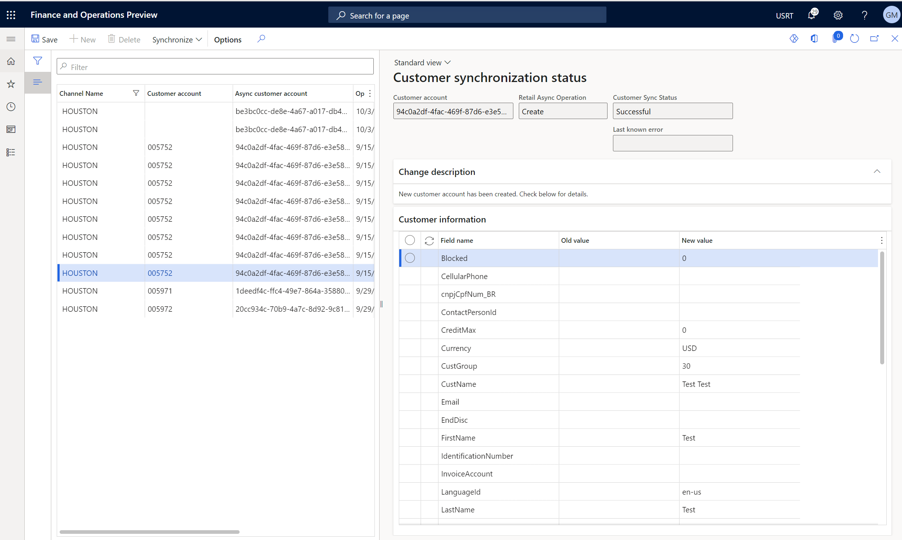

---
# required metadata

title: Audit synchronization of customer operations in headquarters
description: This article explains how to audit synchronization of customer operations in Microsoft Dynamics 365 Commerce headquarters to help fix any site user issues.
author: gvrmohanreddy
ms.date: 10/18/2022
ms.topic: article
audience: Application User, Developer, IT Pro
ms.reviewer: v-chgriffin
ms.search.region: Global
ms.author: josaw
ms.search.validFrom: 2022-09-28

---
# Audit synchronization of customer operations in headquarters

[!include [banner](includes/banner.md)]

This article explains how to audit synchronization of customer operations in Microsoft Dynamics 365 Commerce headquarters to help fix any site user issues.

As organizations start to adopt the ability to create and edit customers asynchronously, site administrators need a way to view and troubleshoot operations, based on site user requests or process failures. In those scenarios, site administrators should be able audit customer creation and edit operations, and fix any failures by using a self-service model.

## Customer synchronization status

When you opt in for the asynchronous mode of customer management and its corresponding features, Commerce headquarters administrators must create and schedule a recurring batch job for the **P-job**, the **Synchronize customers and business partners from async mode** job, and the **1010** job, so that any async customers are converted to sync customers in Commerce headquarters. Synchronization of customer management operations occurs whenever these jobs are run. For more information, see [Asynchronous customer creation mode](async-customer-mode.md).

As a business owner, you can perform the following operations:

- View all create/edit operations of site users. Details include the status and a time stamp.
- Filter operations by using any of the customer table fields and values to narrow down the audit log.
- View brief descriptions of changes together with the status details to understand operations at a high level.
- For failures, edit and fix problematic fields, and then save and sync specific customer operations.

### Elements on the Customer synchronization status page

To view a list of all synchronization operations, in Commerce headquarters go to **Commerce and Retail \> Customers \> Customer synchronization status**. The following illustration shows an example of the **Customer synchronization status** page.

By default, the list of customer synchronization operations on the left side of the **Customer synchronization status** page includes the following columns:

- Channel name
- Customer account
- Async customer account
- Operations timestamp
- Customer sync status

The upper right of the page shows customer account details, such as **Customer account**, **Retail async operation**, **Customer sync status**, and **Last known error** values.

The **Change description** section contains a description of the type of customer management operation that ran (for example, customer creation, account update, or synchronization failure with detail).

The **Customer attributes** section contains a grid that shows all customer attributes, together with old and new values. You can edit this section if you want to change your customer attribute values to fix bugs, and then sync again.
