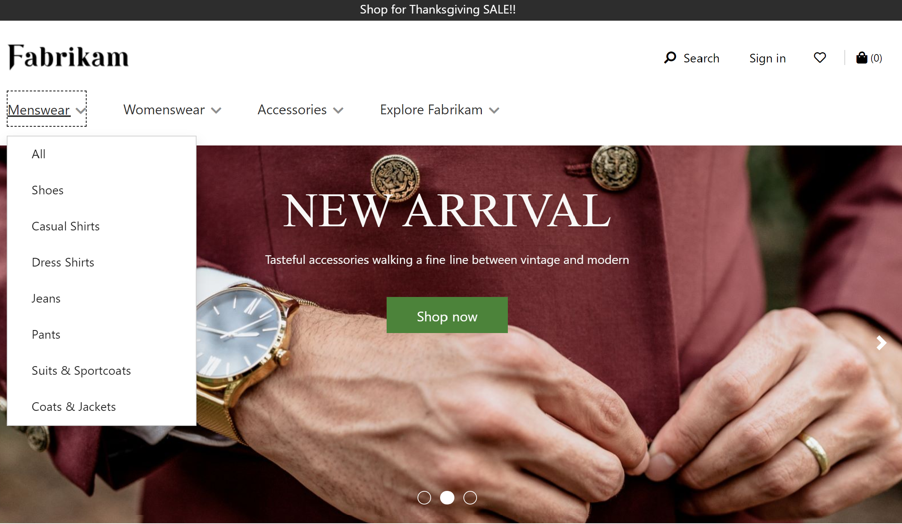

---
# required metadata

title: Header module
description: This topic covers header modules and describes how to create page headers in Microsoft Dynamics 365 Commerce.
author: anupamar-ms
ms.date: 07/08/2021
ms.topic: article
ms.prod: 
ms.technology: 

# optional metadata

# ms.search.form: 
audience: Application user
# ms.devlang: 
ms.reviewer: v-chgri
# ms.tgt_pltfrm: 
ms.custom: 
ms.assetid: 
ms.search.region: Global
# ms.search.industry: 
ms.author: anupamar
ms.search.validFrom: 2019-10-31
ms.dyn365.ops.version: 

---

# Header module

[!include [banner](includes/banner.md)]

This topic covers header modules and describes how to create page headers in Microsoft Dynamics 365 Commerce.

In Dynamics 365 Commerce, a page header is configured as a page fragment that includes the header, promo banner, and cookie consent modules. 

The header module includes a site logo, links to the navigation hierarchy, links to other pages on the site, a cart icon module, a wishlist symbol, sign-in options, and the search bar. A header module is automatically optimized for the device that the site is being viewed on (in other words, for a desktop device or a mobile device). For example, on a mobile device, the navigation bar is collapsed into a **Menu** button (which is sometimes referred to as a *hamburger menu*).

The following image shows an example of a header module on a home page.

## Properties of a header module

A header module supports **Logo image**, **Logo link**, and **My account links** properties. 

The **Logo image** and **Logo link** properties are used to define a logo on the page. For more information, see [Add a logo](add-logo.md). 

The **My account links** property can be used to define account pages that the site owner wants to show quick links for in the header.

## Modules that are available within a header module

The following modules can be used in a header module:

- **Navigation menu** – The navigation menu represents the channel navigation hierarchy and other static navigation links. For more information, see [Navigation menu module](nav-menu-module.md).

- **Search** – The search module lets users enter search terms to search for products. The URL of the default search page and the search query parameters must be provided at **Site Settings \> Extensions**. The search module has properties that let you suppress the search button or label as you require. The search module also supports auto-suggest options, such as product, keyword, and category search results.

- **Cart icon** - The cart icon module represents the cart icon, which shows the number of items in the cart at any given time. For more information, see [Cart icon module](cart-icon-module.md).

- **Site selector** - The site selector module lets users browse across different predefined sites, based on market, regions, and locales. For more information, see [Site selector module](site-selector.md).

- **Store selector** - The store selector module can be included in a header module's store selector slot. It lets users browse and find nearby stores. Users can also specify a preferred store. That store will then be shown in the header. When the store selector module is included in the header module, its **Mode** property must be set to **Find stores**. For more information, see [Store selector module](store-selector.md).

> [!NOTE]
> - Support for using the cart icon module in header modules is available as of the Dynamics 365 Commerce version 10.0.11 release.
> - Support for using the site selector module in header modules is available as of the Dynamics 365 Commerce version 10.0.14 release.
> - Support for using the store selector module in header modules is available as of the Dynamics 365 Commerce version 10.0.15 release.

## Header module in the Adventure Works theme

In the Adventure Works theme, the header module supports the **Mobile Logo** property. This property enables a logo to be specified for mobile viewports. The **Mobile Logo** property is available as a module definition extension.

> [!IMPORTANT]
> The Adventure Works theme is available as of the Dynamics 365 Commerce version 10.0.20 release.

## Create a header fragment for a page

To create a header fragment, follow these steps.

1. Go to **Fragments**, and select **New** to create a new fragment.
1. In the **New fragment** dialog box, select the **Container** module, enter a name for the fragment, and then select **OK**.
1. Select the **Default container** slot, and then, in the properties pane on the right, set the **Width** property to **Fill Screen**.
1. In the **Default container** slot, select the ellipsis (**...**), and then select **Add Module**.
1. In the **Add Module** dialog box, select the **Cookie consent**, **Header**, and **Promo banner** modules, and then select **OK**.
1. In the properties pane of the **Promo banner** module, select **Add Message**, and then select **Message**.
1. In the **Message** dialog box, add text and links for the promotional content, and then select **OK**.
1. In the properties pane of the **Cookie consent** module, add and configure text and a link to the site privacy page.
1. In the **Navigation menu** slot of the header module, select the ellipsis (**...**), and then select **Add Module**.
1. In the **Add Module** dialog box, select the **Navigation menu** module, and then select **OK**.
1. In the property pane for the navigation menu module, under **Source for navigation menu**, select **Retail Server**.
1. In the property pane for the navigation menu module, under **Static menu items**, select **Add Menu item**, and then select **Menu item**. 
1. In the **Menu item** dialog box, under **Menu Item Text** enter "Contact."
1. In the **Menu item** dialog box, under **Menu Item Link target** select **Add a link**.
1. In the **Add a link** dialog box, select the URL for the site's "Contact" page, and then select **OK**.  
1. In the **Menu item** dialog box, select **OK**.
1. In the **Search** slot of the header module, select the ellipsis (**...**), and then select **Add Module**.
1. In the **Add Module** dialog box, select the **Search** module, and then select **OK**.
1. In the property pane for the search module, configure the properties as needed.
1. In the **Cart icon** slot of the header module, select the ellipsis (**...**), and then select **Add Module**.
1. In the **Add Module** dialog box, select the **Cart icon** module, and then select **OK**.
1. In the property pane for the cart icon module, configure the properties as needed. If you want the cart icon to display a cart summary (also known as a mini cart) when users hover over it, select **Show mini cart**.
1. Select **Save**, select **Finish editing** to check in the fragment, and then select **Publish** to publish it.

To help ensure that a header appears on every page, follow these steps on every page template that is created for the site.

1. In the **Header** slot of the **Default page** module, add the footer fragment that you created.
1. Select **Save**, select **Finish editing** to check in the template, and then select **Publish** to publish it.

## Additional resources

[Module library overview](starter-kit-overview.md)

[Container module](add-container-module.md)

[Cart icon module](cart-icon-module.md)

[Promo banner module](add-alert.md)

[Navigation Menu module](nav-menu-module.md) 

[Cookie consent](cookie-consent-module.md)

[Footer module](author-footer-module.md)

[Site selector module](site-selector.md)

[Store selector module](store-selector.md)

[!INCLUDE[footer-include](../includes/footer-banner.md)]
