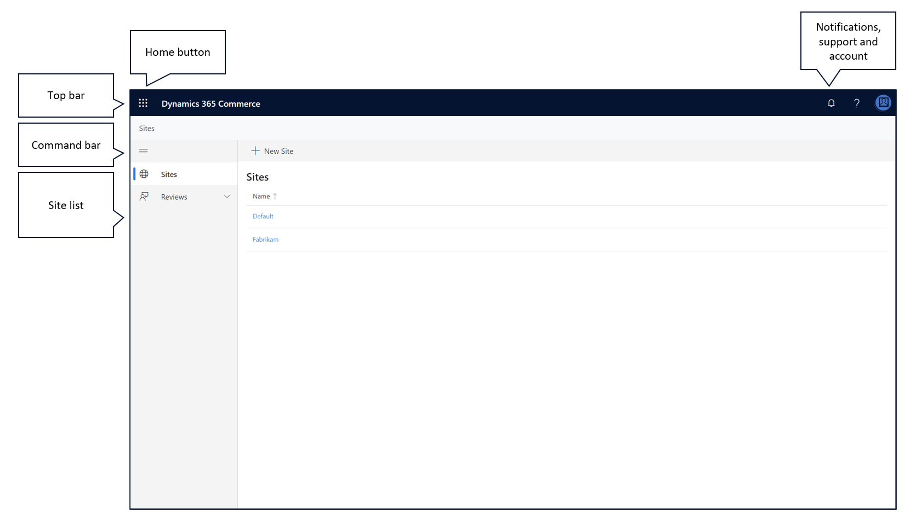

# Site builder authoring page overview

[!include [banner](includes/banner.md)]

This article provides an overview of the Microsoft Dynamics 365 Commerce site builder authoring page.

Websites can be created to support various business needs. They can represent a whole business, offer a single channel of the business, or target a specific audience or segment of an audience. For example, a clothing manufacturer might have a website that showcases all the brands that it owns. The same clothing manufacturer might then have a separate website for each of those brands, and also a set of websites that feature luxury fashion, outdoor fashion, and children's fashion.

Dynamics 365 Commerce supports the creation and management of multiple websites, and each website can have its own appearance and content. The site builder authoring page serves as a common access point for these websites. You can use it to sign in to and out of the system, and to create new websites.

Currently, the site builder authoring page consists of the following sections.

- **Top bar** – The top bar appears at the top of the authoring page. It provides easy access to Commerce tools, notifications, support links, and user sign-in.
- **Command bar** – The command bar appears below the top bar. It can be used to create new websites.
- **Site list** – The site list fills all the space below the command bar. It provides a comprehensive list of websites and the domains that are associated with them.

The following illustration shows the authoring page.

## Use the Home button to select a tool

The **Home** button is in the upper-left corner of the authoring page. It provides easy access to other Commerce tools. When you select this button, a menu of the tools that you can use is opened. When you select a tool, the menu is closed, and the selected tool is loaded in the browser.

## View and clear notifications

The **Notifications** button is one of the buttons in the upper-right corner of the authoring page. It looks like a bell. By selecting this button, you can view all the notifications sent to you.

Notifications are used throughout site builder to inform you when actions are completed. For example, a notification might state, "Your page has been published" to inform you that a publish action was successful.

Notifications can also inform you about errors that were encountered while an action was being performed. The information in the message can help you resolve the error. To view an error notification message, select the notification. 

You can clear notifications from the notification menu by selecting **Remove** at the bottom of the notification message. To clear notifications in bulk, select **Remove all** at the bottom of the notification menu.

## Get help with site builder

The **Help** button is another button in the upper-right corner of the authoring page. It looks like a question mark. When you select this button, a menu of the following predefined options is opened:

- **Documentation** – If you select this option, the documentation for creating a new website is opened on a new browser tab.
- **Community** – Select this option to open the Commerce forum where you get help from experts and peers, leave feedback about site builder, or request support.
- **Privacy Statement** – If you select this option, the Microsoft Privacy Statement is opened on a new browser tab.
- **About** – Select this option to open a message box that contains information about site builder and the version that you're currently using.

## Sign in to and out of site builder

The **My account** button is another button in the upper-right corner of the authoring page. It looks like a colored circle. By selecting this button, you can see which account you used to sign in, and you can also sign out of that account as you require.

To sign in to or out of site builder, follow one of these steps.

- If you aren't already signed in to site builder, select **My account** \> **Sign in** to sign in.
- If you're already signed in and want to sign out, select **My account** \> **Sign out**.

## Change the display language

You can also use the **My account** button to change the language of the text strings that appear in site builder.

To change the display language, follow these steps.

1. Select **My account** \> **Change language**. A dialog box appears.
1. Select one of the user languages, and then select **Save**.

## Create a new website

Dynamics 365 Commerce supports the creation and management of multiple websites, and each website can have its own appearance and content.

To create a new website, follow these steps.

1. On the command bar, select **New site**. The **Create site** dialog appears.
1. On the **Site details** page, enter the following required information.
    - **Site name** – Enter the name of the website. This name is used in the site list and other places in site builder, and isn't shown to website users.
    - **Site administers security group** – Enter the full name of the Microsoft Azure Active Directory (Azure AD) security group that contains the users who should have administrative access to the website. The admin group name, together with the other permissions for the website, can be changed after the website is created.
    - **Theme pack** - Select a them pack for your site, for example **Adventure works**.
    - **Site type** - Select **Business to consumer** or **Business to business** .
1. Select **Next**.
1. On the **Channel selection** page, select **Add a single channel** or **Add multiple channels**, and then select **Next**.
1. On the **Channel details** page, select the domain and authentication profile to associate with each channel.
1. For your default channel, under **Channel defaults**, select **Set as default channel**. 
1. Optionally, to enable geo redirection by default, set the **Automatic geo redirection** option to **On**. You can override this setting at the channel level later, as needed.
1. Select **Next**.
1. On the **Locales** page, a list shows all the locales that are associated with each channel by default. If you previously enabled geo redirection, a list of countries or regions is assigned to each locale. Optionally select **Edit** to add or remove locales, countries, or regions from each channel as needed. Then select **Add locales**.
1. Select **Next**.
1. On the **URL paths** page, you can view the default URLs for each channel. You can override the URL paths, domain, or authentication profile for each channel as needed. To select which channel is the default application channel when site pages are authored in site builder, select the channel in the **Set default application channel** field.
1. Select **Next**.
1. On the **Locale defaults** page, select the default locale for each channel, and then select **Next**.
1. On the **Review and finish** page, review the configuration, and make any changes that are required.
1. Select **Save and publish**. The new website is created.  

> [!NOTE]
> Creation of a new website can take up to 60 seconds. After the process is completed, a notification appears in the notification area. Additionally, the website appears in the site list and has the site name that you entered.

## Select a website to author

The site list provides a comprehensive list of the websites that are associated with the Commerce system. Websites appear in alphabetical order. The domain that is associated with each website is also shown. To view the contents of a website and start to author pages, select the name of the website. Site builder and the content for the website are loaded.

After site builder is loaded, you can select **Home** to return to the authoring page.

## Additional resources

[Manage e-commerce users and roles](manage-ecommerce-users-roles.md)

[Search engine optimization (SEO) considerations for your site](search-engine-optimization-considerations.md)

[Manage Content Security Policy (CSP)](dev-itpro/manage-csp.md)

[!INCLUDE[footer-include](../includes/footer-banner.md)]