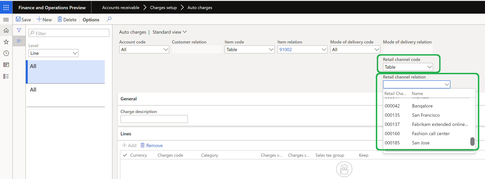
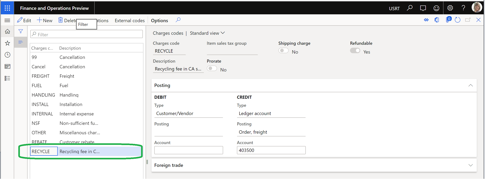
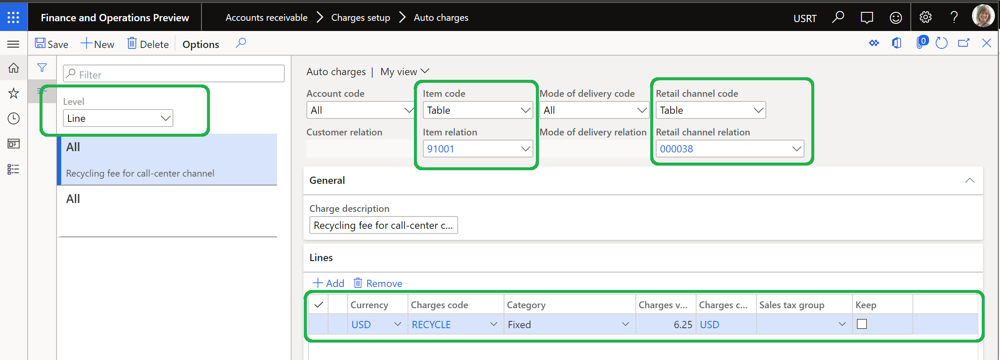
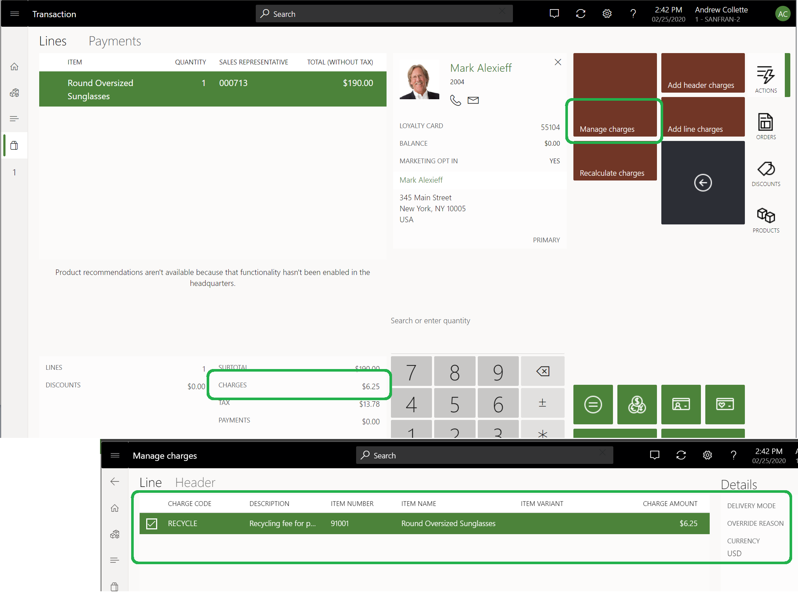

# Enable and configure auto charges by channel

This article explains how to enable and configure automatic charges (auto charges) by channel in Microsoft Dynamics 365 Commerce.

## Overview

You might have scenarios where recycling fees or other fees must be applied to a group of products that are sold in all or some stores in a specific state (for example, California). The **Enable filter auto charges by channel** feature in Commerce lets you specify auto charges by channel (for example, a specific brick-and-mortar channel). This feature is available in Dynamics 365 Commerce version 10.0.10 and later.

To enable and configure auto charges by channel, you must complete the following tasks:

- Turn on the **Enable filter auto charges by channel** feature.
- Configure the organization hierarchy purpose.
- Define auto charges by channel.

> [!NOTE]
> The **Enable filter auto charges by channel** feature works only if the advanced auto charges feature is also turned on. For information about how to turn on the advanced auto charges feature, see [Omni-channel advanced auto charges](omni-auto-charges.md).

## Turn on the Enable filter auto charges by channel feature

To enable auto charges by channel in Commerce, follow these steps.

1. Go to **System administrator \> Workspaces \> Feature management**.
1. On the **Not enabled** tab, in the **Feature name** list, find and select **Enable filter auto charges by channel**.
1. In the lower-right corner, select **Enable now**. After the feature has been turned on, it will appear in the list on the **All** tab.
1. Go to **Retail and Commerce \> Retail and Commerce IT \> Distribution schedule**.
1. In the left pane, find and select the **1110** (**Global configuration**) job.
1. On the Action Pane, select **Run now** to propagate the configuration changes.

> [!WARNING]
> If you turn off the **Enable filter auto charges by channel** feature after you've already used it, the **Retail channel relation** field under **Auto charges** will no longer appear, and you will lose all existing configurations. If removal of the **Retail channel relation** configurations will cause auto charges rules to be duplicated, an attempt to turn off the feature will fail. Before you turn off the feature, be sure to review all auto charges rules and make any required changes.

## Configure the organization hierarchy purpose

A new organization hierarchy purpose that is named **Retail auto charge** has been created to manage the hierarchy for auto charges by channel.

To assign a default hierarchy to an organization hierarchy purpose in Commerce, follow these steps.
		
1. Go to **Organization administration \> Organizations \> Organization hierarchy purposes**.
1. In the left pane, select **Retail auto charge**.
1. Under **Assigned hierarchies**, select **Add**.
1. In the **Organization hierarchies** dialog box, select an organization hierarchy (for example, **Retail Stores by Region**), and then select **OK**.
1. Under **Assigned hierarchies**, select **Set as default**.
1. Go to **Retail and Commerce \> Retail and Commerce IT \> Distribution schedule**.
1. In the left pane, find and select the **1040** (**Products**) job.
1. On the Action Pane, select **Run now**.
1. Repeat the previous two steps to run the **1070** (**Channel configuration**) and **1110** (**Global configuration**) jobs.

## Define auto charges by channel

After you've turned on the **Enable filter auto charges by channel** feature and configured the **Retail auto charge** organization hierarchy purpose, auto charges by channel can be defined at either the order header level or the order line level.

To define auto charges by channel in Commerce, follow these steps.

1. Go to **Accounts receivable \> Charges setup \> Auto charges**.
1. In the left pane, in the **Level** field, select either **Header** or **Line**, depending on your business requirements.
1. In the **Retail channel code** field, select the appropriate channel code (for example, **Table** or **Group**). If the default setting, **All**, is used, charge rules are applied to all channels.

    - If you select **Group**, make sure that a retail channel charges group is created at **Retail and Commerce \> Channel setup \> Charges \> Retail channel charge groups**.
    - If you select **Table**, you can select a specific channel (for example, **San Francisco**) in the **Retail channel relation** field.

1. Go to **Retail and Commerce \> Retail and Commerce IT \> Distribution schedule**.
1. In the left pane, find and select the **1040** (**Products**) job.
1. On the Action Pane, select **Run now**.
1. Repeat the previous two steps to run the **1070** (**Channel configuration**) and **1110** (**Global configuration**) jobs.
	

## Example scenario

The following example outlines the steps that are required to configure a product so that recycling fees are charged when the product is sold through a San Francisco brick-and-mortar channel. The example also shows how the auto charges appear in the Commerce point of sale (POS) application.

The organization defines a charges code that is named **RECYCLE**, as shown in the following illustration.

An auto charge is created at the line level. It has the following configuration:

- The **Account code** field is set to **All**.
- The **Item code** field is set to **Table**.
- The **Item relation** field is set to product ID **91001**.
- The **Mode of delivery code** field is set to **All**.
- The **Retail channel code** field is set to **Table**.
- The **Retail channel relation** field is set to the **San Francisco** store.

An auto charges line is created. It has the following configuration:

- The **Currency** field is set to **USD**.
- The **Charges code** field is set to **RECYCLE**.
- The **Category** field is set to **Fixed**.
- The **Charges** field is set to **$6.25**.

In the POS application, a sales order is created in the **San Francisco** store channel. The **Charges** line shows the recycling fee of **$6.25**.

By selecting **Transaction options \> Charges \> Manage charges** in the POS application, you can view the charges code and description for the recycling fee.

## Additional resources

[Omni-channel advanced auto charges](omni-auto-charges.md)

[Prorate header charges to matching sales lines](pro-rate-charges-matching-lines.md)

[!INCLUDE[footer-include](../includes/footer-banner.md)]
