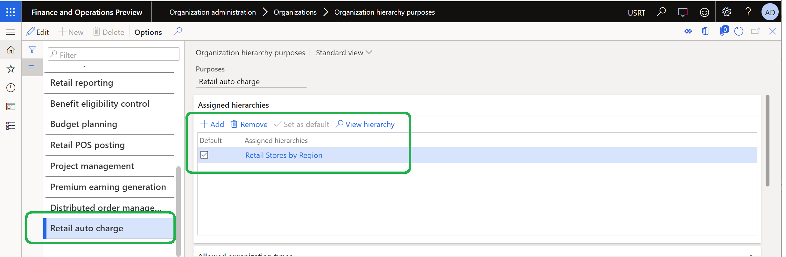

---
# required metadata
title: Enable and configure auto charges by the channel of order creation
description: This topic describes how to enable and configure auto-charges by the channel of the order creation in Microsoft Dynamics 365 Commerce.
author: gvrmohanreddy
manager: annbe
ms.date: 03/06/2020
ms.topic: article
ms.prod: 
ms.service: dynamics-365-commerce
ms.technology: 
# optional metadata
# ms.search.form:  
#ROBOTS: 
audience: Application User
# ms.devlang: 
ms.reviewer: v-chgri
ms.search.scope: Retail, Core, Operations
# ms.tgt_pltfrm: 
# ms.custom: 
ms.search.region: Global
# ms.search.industry: 
ms.author: gmohanv
ms.search.validFrom: 2020-03-01
ms.dyn365.ops.version: 10.0.10
---

# Enable and configure auto charges by the channel of order creation

This topic describes how to enable and configure auto-charges by the channel of order creation in Microsoft Dynamics 365 Commerce.

## Overview

You may have scenarios like applying recycling fees for group of products that are sold in all or some of the stores in California state, USA. The "Enable filter auto charges by channel" feature switch allows you to enable auto charges by channel. This feature is available in Dynamics 365 Commerce in version 10.0.10 or later. 

> [!NOTE]
> The auto charges by channel feature only works when the advanced auto charges feature is enabled. For information on how to enable advanced auto charges, see [Omni-channel advanced auto charges](omni-auto-charges.md). 

## Enable filter auto charges by channel

To enable filter auto charges by channel in Commerce, follow these steps.

1. Go to **System administrator \> Workspaces \> Feature management**.
1. Select the **Not enabled** tab. Under the **Feature name** list, find and select **Enable filter auto charges by channel**.
1. In the right bottom corner, select **Enable now**. After this feature is enabled, it will be located in the **All** tab list.
1. Go to **Retail and Commerce \> Retail and Commerce IT \> Distribution schedule**.
1. In the left pane, find select the **1110 Global configuration** job.
1. On the action pane, select **Run now** to propagate the configuration changes. 

> [!WARNING]
> If you decide to deactivate the **Enable filter auto charges by channel** switch after using the feature, the **Retail channel relation** drop down menu under **Auto charges** will disappear and you will lose all existing configurations. If removing **Retail channel relation** configurations would result in duplicate auto charges rules, then deactivation will fail. Please review all auto-charges rules and make any necessary changes prior to deactivating.

## Configure organization hierarchy purpose

A new organization hierarchy purpose called **Retail auto charges** has been created for managing hierarchy for auto charges by channel. 

To configure an organization hierarchy purpose with a default hierarchy in Commerce, follow these steps. 
		
1. Go to **Organization administration \> Organizations \> Organization hierarchy purposes**. 
1. In the left pane, select **Retail auto charge**.
1. Under **Assigned hierarchies**, select **+ Add**. 
1. In the **Organization hierarchies** pane, select an organization hierarchy (for example, **Retail Stores by Region**) and then select **OK**.
1. Under **Assigned hierarchies**, select **Set as default**.
1. Go to **Retail and Commerce \> Retail and Commerce IT \> Distribution schedule**.
1. Run **1040 Products** , **1070 Channel configuration** , and **1110 Global configuration** CDX jobs. 

## Define auto charges by channel

After enabling **auto charges by channel feature** switch and configuring **Retail auto charges** organization hierarchy purpose, auto charges by channel can be defined at order header level or line level.

To define auto charges by channel in Commerce, follow these steps.

1. Go to **Accounts receivable \> Charges setup \> Auto charges** . 
1. Define auto charges at either the **header** level or **line** level, based on business requirements. 
1. In the charges header, select **Retail channel code**  e.g. Table or Group.  By default this is set to **All**, which means charge rules are applied for all channels. 
1. For group, make sure a **Retail channel charges group** is created that you can find under **Retail and Commerce \> Channel setup \> Charges \> Retail channel charge groups**.
1. For Table, you can select a specific channel, e.g. **San Francisco** store under **Retail channel relation** dropdown.  
1. Go to **Retail and Commerce \> Retail and Commerce IT \> Distribution schedule**.
1. Run **1040 Products** , **1070 Channel configuration** , and **1110 Global configuration** CDX jobs. 
	

## Example scenarios

The following two example scenarios outline the steps to configure a product with recycling fees when it is sold through San Francisco brick and mortar channel and behavior of the auto-charges in the POS application.

In this scenario, the organization has defined charges code called **RECYCLE** with the following details: 

An auto charge is crated at line level where account code is set to **All**, Item code is set to **Table** and Item relation is set to product id 91001 , Mode of delivery code is set to **All**,  Retail channel code is set to **Table**, and Retail channel relation is set to **San Francisco** store. 

Auto-charges line is created where current is set to **USD**, Charges code is set to **RECYCLE**, Category is set to **Fixed** and Charges are set to **$6.25**.

A sales order is created in **San Francisco** store channel using Dynamics 365 Commerce's POS application. Product id **91001** is added to the sales orders. Notice **CHARGES** in the lines are with **$6.25**.  Selecting **Transaction options** > **Charges** and then **Manage charges** will show **Recycling fee** charges code and it's description. 

## Additional resources

[Omni-channel advanced auto charges](omni-auto-charges.md)

[Prorate header charges to matching sales lines](pro-rate-charges-matching-lines.md)

